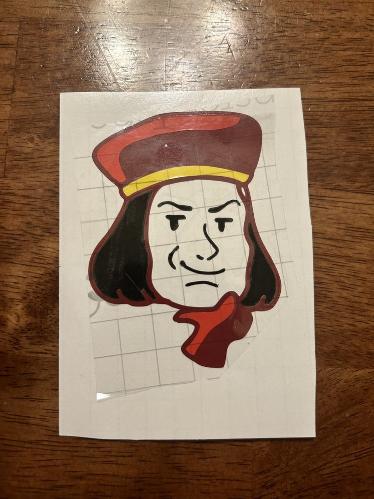

# Lord Farquaad, Shrek the Musical

My sophomore year, I played **Lord Farquaad** in *Shrek the Musical* at Charlotte Latin School. I was a [*Blumey Awards Best Actor Finalist*](https://www.blumenthalarts.org/assets/doc/2023-Blumey-Nominees-and-Finalists-dc56d4a6fb.pdf#page=3) for my performance.

When I embraced the character of Lord Farquaad, an extremely insecure villain whose distain for uniqueness and diversity drives him to terrorize his kingdom in the name of conformity, every laugh at his expense and applause at his failures showed me that the audience understood that intolerance was detrimental and ridiculous. As an advocate for people with disabilities, I clearly understand the dangers of limiting acceptance to only those who fit a certain norm. I was thrilled to be able to share the message of inclusion in an entertaining way that resonated with audience members of all ages in the Charlotte community. 

I was also the *Dance Captain* for *Shrek the Musical*. (ballet?) (dance ensamble?)

Here is a video of the number *"What's Up Duloc?"* (I'm the short king that comes down the elevator!)

<iframe width="560" height="315" src="https://www.youtube.com/embed/dV7Y7Av7lR0?si=AIf-I3UGVPnoOXSs&hd=1" title="YouTube video player" frameborder="0" allow="accelerometer; autoplay; clipboard-write; encrypted-media; gyroscope; picture-in-picture; web-share" allowfullscreen></iframe>

I enjoyed this role so much that, during [Fab Academy](../projects/fab-academy/disability-forewarning-system.md), I made a Farquaad sticker on the vinyl cutter! [Here](https://fabacademy.org/2023/labs/charlotte/students/adam-stone/lessons/week3/vinyl-cutting/#lord-farquaad){:target="_blank"} is a link to my documentation of the process.

{: width=300px;}
{: width=300px;}