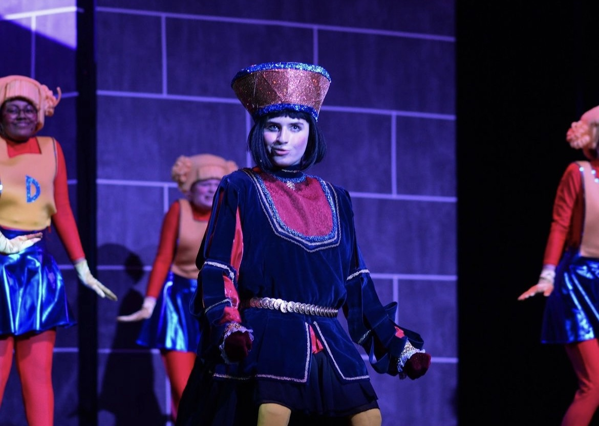
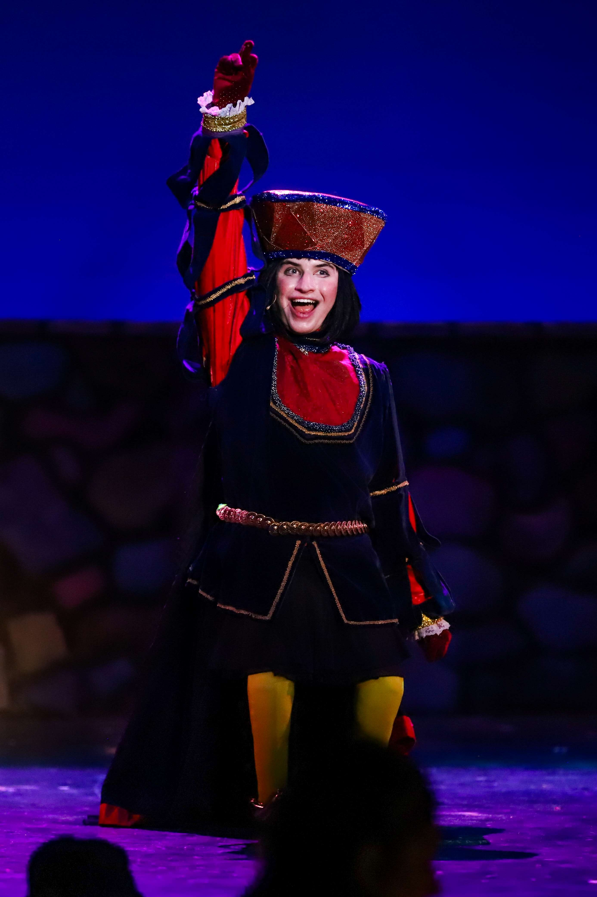
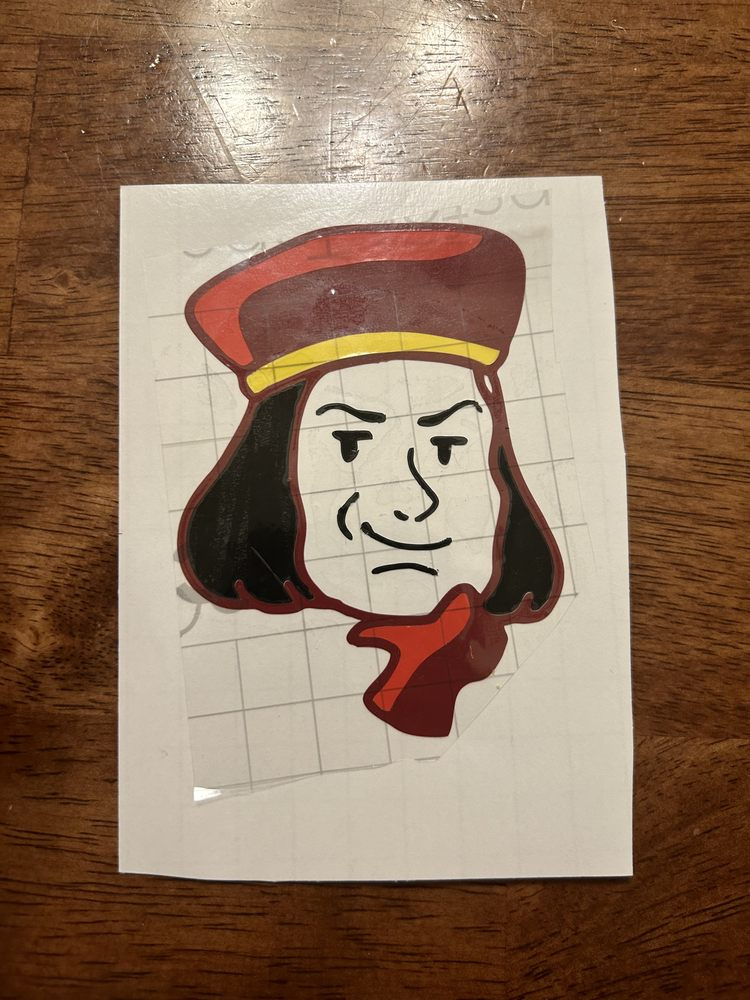
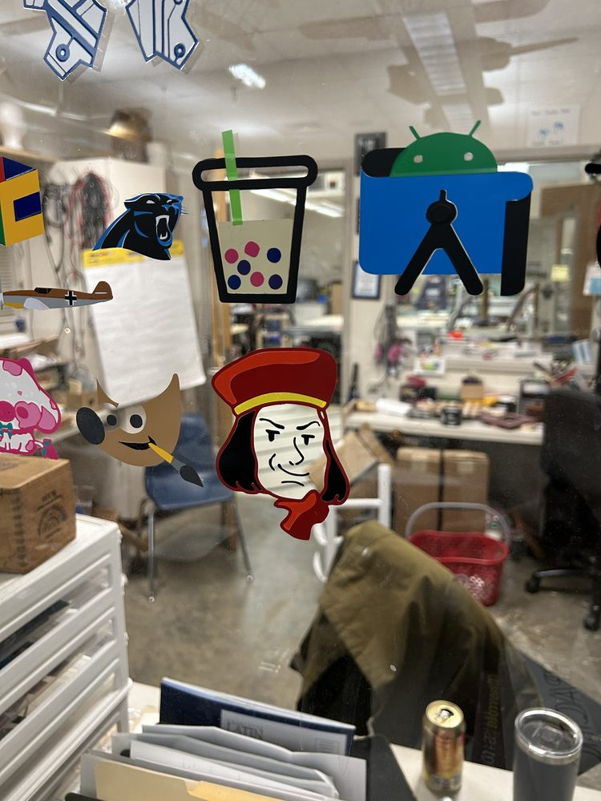
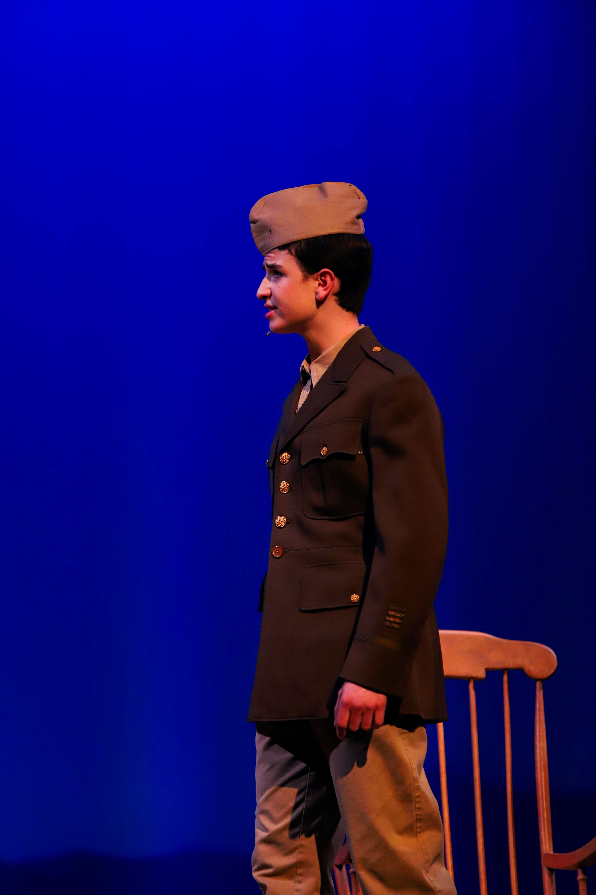
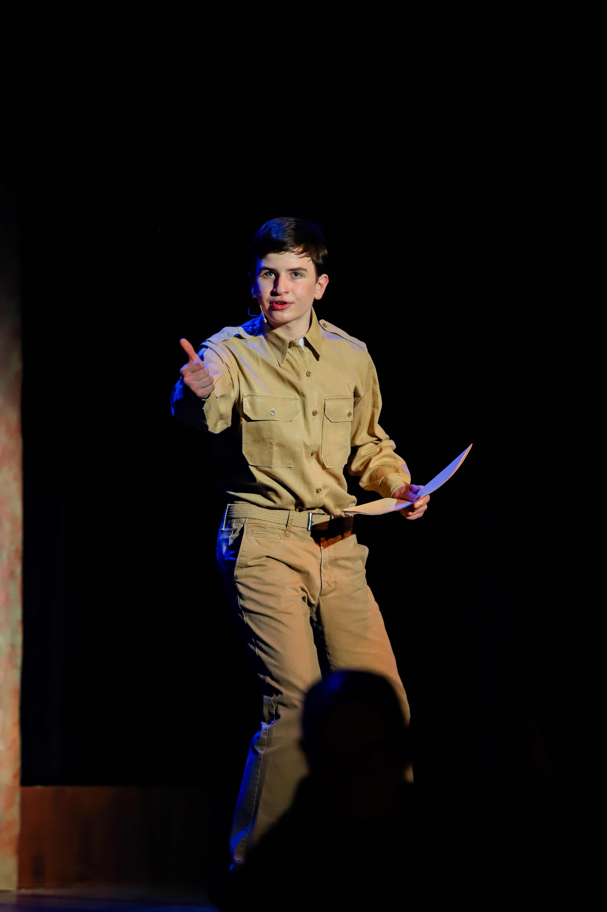
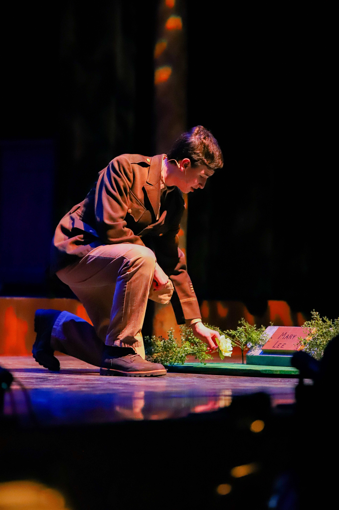

# Arts

From the moment I first stepped on stage, I felt the exhilaration of persuading an audience to believe in my story. Motivated to capture the audience’s imagination, I’ve invested a great deal of time honing my dancing, acting, and singing skills. 

Being a third-degree black belt in Taekwondo has helped my physicality on stage, but several years ago I wanted to get more formal training. I auditioned for the [Charlotte Ballet’s Summer Workshop](https://charlotteballet.org/) and had the opportunity to spend six weeks learning from esteemed faculty in multiple genres of dance. I’ve also been fortunate to have studied acting and singing with incredible coaches. 

I’ve performed in 11 productions in the past six years and was extremely honored to be a Best Actor Nominee at the [Blumey Awards](https://www.blumenthalarts.org/blumey-awards) two years in a row for my roles as [Billy Cane in *Bright Star*](#billy-cane-bright-star) and [Lord Farquaad in *Shrek the Musical.*](#lord-farquaad-shrek-the-musical) The Blumey Awards recognizes exceptional achievements in high school musical theater and is a regional qualifier to the [Jimmy Awards](https://www.jimmyawards.com/), a Broadway program for top talent in musical theater.

## Lord Farquaad, *Shrek the Musical*

In 2023, I played **Lord Farquaad** in *Shrek the Musical* at Charlotte Latin School. I was a [*Blumey Awards Best Actor Nominee*](https://www.blumenthalarts.org/assets/doc/2023-Blumey-Nominees-and-Finalists-dc56d4a6fb.pdf#page=3) for my performance.

When I embraced the character of Lord Farquaad, an extremely insecure villain whose distain for uniqueness and diversity drives him to terrorize his kingdom in the name of conformity, every laugh at his expense and applause at his failures showed me that the audience understood that intolerance was detrimental and ridiculous. As an advocate for people with disabilities, I clearly understand the dangers of limiting acceptance to only those who fit a certain norm. I was thrilled to be able to share the message of inclusion in an entertaining way that resonated with audience members of all ages in the Charlotte community.

In addition to playing Lord Farquaad, I was the Dance Captain for the production.

Here's a video of the musical number *"What's Up Duloc?"* (I'm the short king who comes down the elevator!)

<iframe width="560" height="315" src="https://www.youtube.com/embed/dV7Y7Av7lR0?si=AIf-I3UGVPnoOXSs&hd=1" title="YouTube video player" frameborder="0" allow="accelerometer; autoplay; clipboard-write; encrypted-media; gyroscope; picture-in-picture; web-share" allowfullscreen></iframe>

Here's a video of the musical number *"The Ballad of Farquaad"*

<iframe width="560" height="315" src="https://www.youtube.com/embed/lRGHWJbHD0k?si=i8uLEoHSsgQpNkBx&hd=1" title="YouTube video player" frameborder="0" allow="accelerometer; autoplay; clipboard-write; encrypted-media; gyroscope; picture-in-picture; web-share" allowfullscreen></iframe>

    

        
    

    

        
    

I enjoyed this role so much that during [Fab Academy](../stem/disability-forewarning-system/index.md), I made a Farquaad sticker on the vinyl cutter! [Here](https://fabacademy.org/2023/labs/charlotte/students/adam-stone/lessons/week3/vinyl-cutting/#lord-farquaad){:target="_blank"} is a link to my documentation of the process.

    

        
    

    

        
    

## Billy Cane, *Bright Star*

In 2022, I played **Billy Cane** in *Bright Star* at Charlotte Latin School. I was a [*Blumey Awards Best Actor Nominee*](https://www.blumenthalarts.org/assets/doc/2022-Blumey-Awards-Finalists-2242ca9e68.pdf#page=3) for my performance.

*Bright Star*, a musical written by Steve Martin and Edie Brickell, is set in Blue Ridge Mountains of North Carolina during the 1940s with flashbacks to 1923. It is a powerful story of love, loss, and redemption. Billy Cane is an aspiring young writer who embodies the themes of hope, new beginnings, and the power of dreams. 

    

        
    

    

        
    

    

        
    

## Adam Stone Theatre Résumé

<object data="../assets/other/resume.pdf" type="application/pdf" width="700px" height="700px">
    <embed src="../assets/other/resume.pdf">
        
This browser does not support PDFs. Please download the PDF to view it: <a href="../assets/other/resume.pdf">Download PDF</a>.

    </embed>
</object>