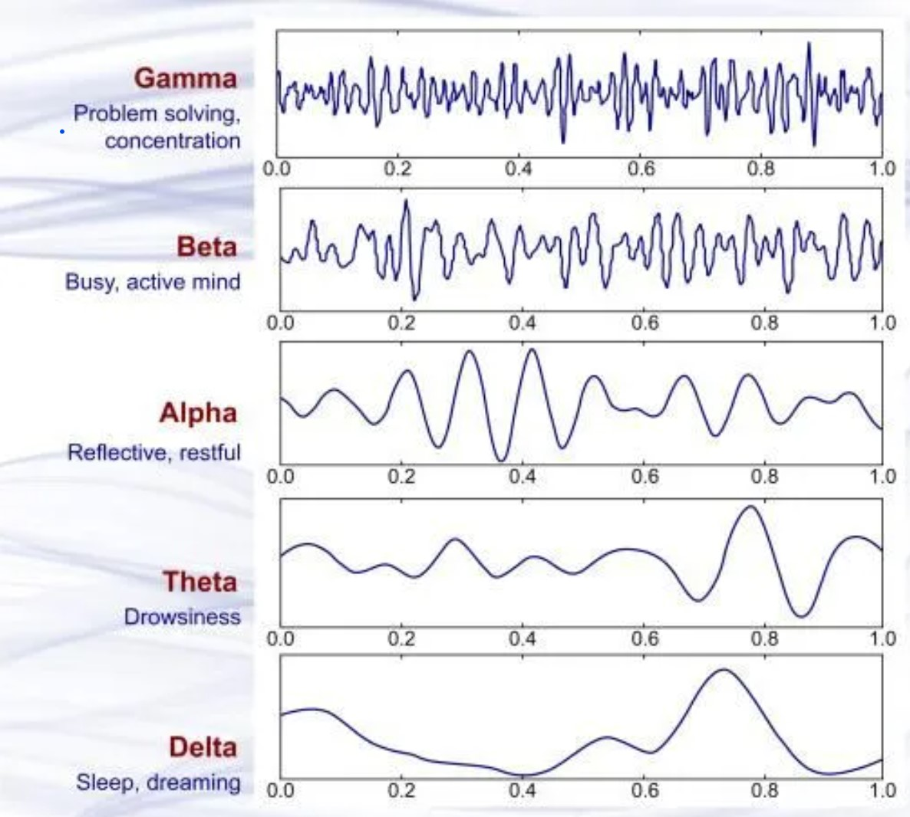
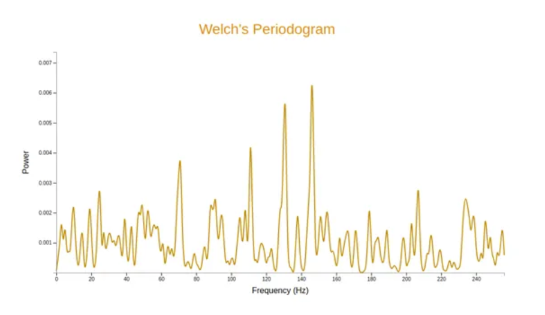
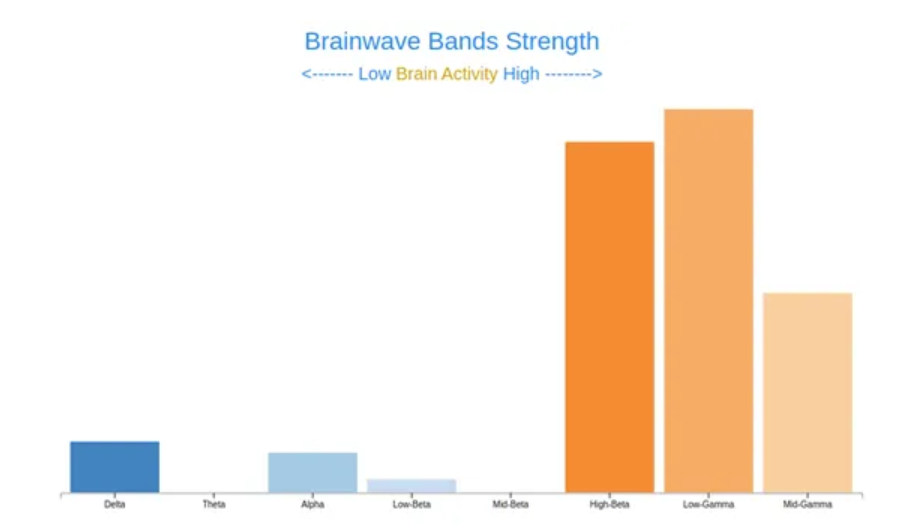
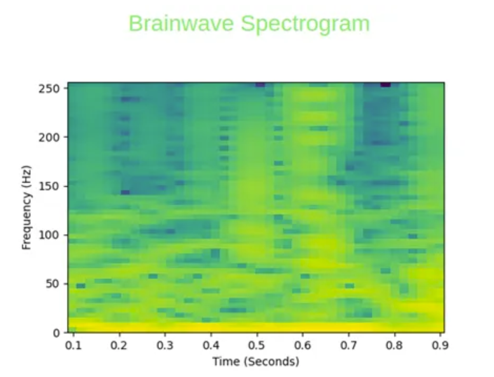
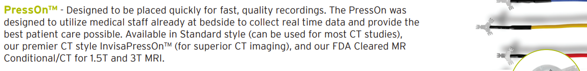
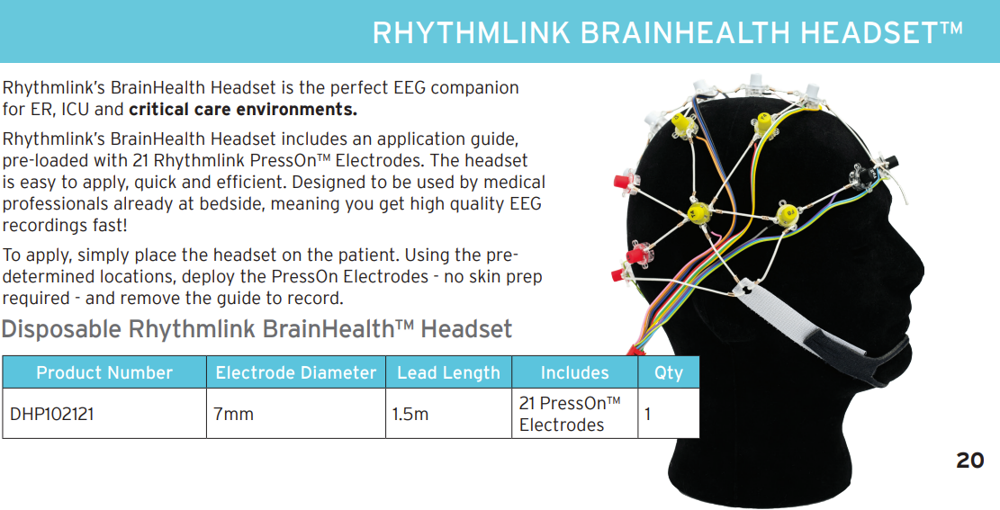

# EEGs

According to [Johns Hopkins Medicine](https://www.hopkinsmedicine.org/health/treatment-tests-and-therapies/electroencephalogram-eeg), an EEG, or *electroencephalogram*, is a test that detects abnormalities in your brain waves, or in the electrical activity of your brain. During the procedure, electrodes consisting of small metal discs with thin wires are pasted onto your scalp. The electrodes detect tiny electrical charges that result from the activity of your brain cells.

To see a video of the application of RhythmLink®'s PressOn™ EEG Electrodes, [click here](https://rhythmlink.com/videos/presson-eeg-electrode/).

## Research

### BrainWaves

I read [this article](https://www.datatobiz.com/blog/brain-waves-data-using-python/) to better understand how softward can interface with brain activity. In this article I learned about different kinds of brain waves:

- **Delta Waves**
    - As the slowest of all, these high-amplitude brain waves have a frequency of 1 to 3 Hz and are experienced by humans when they are asleep.
- **Theta Waves**
    - The Theta waves have a frequency range of 4 to 7 Hz and are found when a person is in a dreamy state. When the waves are close to the lower end, they represent the state when a person hovers between sleep and consciousness. It’s also known as the twilight state. Theta waves, in general, signify that mental inefficiency or that the person is either too relaxed or blanked out (zoned out) at that moment. 
- **Alpha Waves**
    - The alpha brain waves have a frequency range of 8 to 12 Hz. These are larger and slower, representing a relaxed or calm state of mind for a person ready to get into action if the need arises. The alpha brain waves are generated when someone feels peaceful after closing their eyes and picturing something they like. 
- **Beta Waves**
    - Beta brain waves are faster and smaller, with a frequency range of 13 to 38 Hz. These waves imply that the person is focused on something. They signify alertness, where the person is in their senses and displays all signs of concentration and mental activity. 
- **Gamma Waves**
    - Gamma brain waves are the fastest ones, with a frequency range of 38 to 42 Hz. These are subtle compared to the other brain waves and work on the consciousness and perception of the person. The waves occur when a person is highly alert and can feel every minute change in their surroundings. 

Here's a diagram of the waveforms of different types of brain waves.

### Visualizing Waves

[This article](https://medium.com/@mohitjain72/detection-and-visualization-of-brainwaves-using-python-d3-and-bootstrap-742129f9ed97) also discusses how to visualize brainwave input from an EEG in Python.

### EEG Pros & Cons

I watched [this two-minute summary](https://www.youtube.com/watch?v=tZcKT4l_JZk) of an EEG and the pros and cons of the technology.

- **Advantages**
    - Low cost
    - Can measure brain activity on the order of milliseconds
- **Disadvantages**
    - Cannot pinpoint activity to specific brain regions
    - Cannot record activity deeper than the cortex

I also skimmed [this article](https://www.betterhealth.vic.gov.au/health/conditionsandtreatments/eeg-test#:~:text=EEG%20is%20a,help%20in%20diagnosis.) which revealed that an EEG has no side-effects or complications for the vast majority of patients.

### RhythmLink® Products

[Here](https://rhythmlink.com/wp-content/uploads/2023/10/Digital-Catalog-2023_October.pdf) is a link to the RhythmLink® October 2023 Digital Catalog. It includes information about their different electrode products. I was especially interested by their [PressOn™ electrode](https://rhythmlink.com/wp-content/uploads/2023/10/Digital-Catalog-2023_October.pdf#page=5) design. To see these in action, watch [this video](https://rhythmlink.com/videos/brainhealth-headset-application-training/) explaning how to apply the [BrainHealth Headset™](https://rhythmlink.com/wp-content/uploads/2023/10/Digital-Catalog-2023_October.pdf#page=21).

