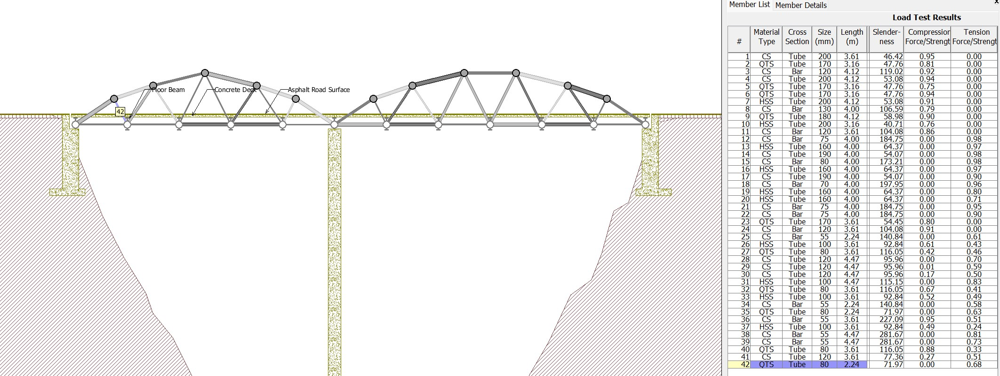
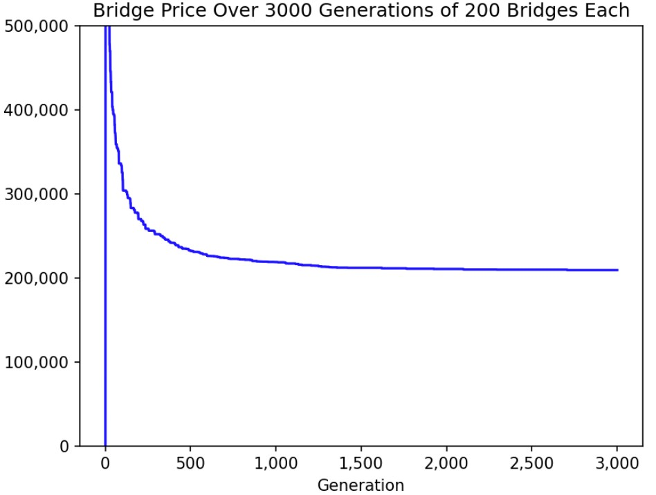

# Bridge Builder

This year in my Civil Engineering clsas, students were tasked with determining the optimal length, shape, and material for each beam of a bridge to yield the most cost-effective design capable of sustaining `225kN`` of force. The class was instructed to input specifications for each beam into the West Point Bridge Designer software which calculated the cost and strength of each design. 

Through trial and error, I arrived at a bridge that sustained the required weight at a relatively low cost. However, I wanted to see whether I could automate the process to test hundreds of thousands of permutations of the three inputs for each beam to come up with a more optimal design. I wrote a Python script to mimic a user entering the three parameters for each beam. Unfortunately, the input process for [West Point Bridge Designer](https://bridgedesigner.org/download/) software involved multiple drop down menus and animations which significantly slowed the simulation time, making this approach impractical. In order to come up with a more efficient approach, I examined [West Point Bridge Designer’s open-source code](https://sourceforge.net/p/wpbdc/wpbd/ci/master/tree/), written in Java, to understand how it was calculating the forces for the simulation. 

To circumvent the cumbersome user interface, I coded a more focused bridge simulator without a user interface or animations. I also implemented a genetic algorithm to test many different designs and find the lowest-cost bridge that held the required weight. As the simulator ran, it drove continuous improvements in bridge design and reductions in price.

Here's a sample bridge generated by the program after trying 600,000 designs:





[Download the Bridge File here!](../../assets/zips/bridge-designer/bridge-designer-result.zip)

## Documentation

There are two steps in running the simulation: [configuring the shape](#configuring-the-shape) and [running the genetic algorithm](#running-the-genetic-algorithm).

### Running the Genetic Algorithm

`main.py` is responsible for running the genetic algorithm. The `NUM_GENS` variable defines for how many generations the simulation will run, and the `POP_SIZE` variable defines how many bridges will exist in the population of each generation. The script uses [`Matplotlib`](https://matplotlib.org/) to graph the price of bridges versus the generation number.

The main loop exists in the `run_evo_sim` function. It initializes the population, then for each generation, evaluates the fitness of each bridge, removes the bottom 50%, creates offspring from the remaining bridges, mutates bridges randomly, and repeats. I found that looping through the number of bridge members mutated for each bridge in a popuation (i.e. the first bridge mutates one member, the second bridge mutates two members), helped avoid local maximums and continually improve performance even many generations into the simulation. 

*main.py*

```py
import random, time, pickle
from bridge_utilities import calculate_score, MATERIALS, SIZES, TYPES, get_price, enact_bridge
import matplotlib.pyplot as plt
import matplotlib as matplt
from bridge_settings import CURRENT_SETTING, INITIALIZED_BRIDGE
import pandas as pd

# Function to initialize a population
def initialize_population(population_size):
    population = []
    for _ in range(population_size):
        if INITIALIZED_BRIDGE is None:
            bridge = [(random.choice(MATERIALS), random.choice(TYPES), random.choice(SIZES[14:])) for _ in range(CURRENT_SETTING['num_members'])]
        else:
            
            df = pd.read_csv(INITIALIZED_BRIDGE)
            bridge=[(r['Member ID'], r['Material Type'], [x for x in SIZES if r['Type']== x[0]][0]) for r in [df.iloc[_] for _ in range(CURRENT_SETTING['num_members'])]] 
        population.append(bridge)
    return population

bridge_mutation_counter = 0

# Function to mutate a bridge
def mutate(bridge):
    global bridge_mutation_counter
    mutated_bridge = bridge[:]
    first = True
    r = random.random()
    i = 0
    while i < bridge_mutation_counter % 30:
        i += 1
        first = False
        member_to_mutate = random.randint(0, CURRENT_SETTING['num_members']-1)
        attribute_to_mutate = random.choice(["material", "type", "size"])
        if attribute_to_mutate == "material":
            mutated_bridge[member_to_mutate] = (random.choice(MATERIALS), bridge[member_to_mutate][1], bridge[member_to_mutate][2])
        elif attribute_to_mutate == "type":
            mutated_bridge[member_to_mutate] = (bridge[member_to_mutate][0], random.choice(TYPES), bridge[member_to_mutate][2])
        else:
            mutated_bridge[member_to_mutate] = (bridge[member_to_mutate][0], bridge[member_to_mutate][1], random.choice(SIZES))
    bridge_mutation_counter += 1
    return mutated_bridge

# Function to run the evolutionary simulation
def run_evo_sim(population_size, fig,line1, NUM_GENS):
    population = initialize_population(population_size)
    generation = 1
    highest_fitness_score_over_gen = [0]*(NUM_GENS)
    while True:
        # Evaluate the population
        fitness_scores = [calculate_score(bridge) for bridge in population]

        # Select the top 50% of the bridges
        top_bridges = [bridge for _, bridge in sorted(zip(fitness_scores, population), key=lambda x: -x[0])][:population_size // 2]
        highest_fitness_score_over_gen[generation] = get_price(top_bridges[0]) 
        
        # Crossover and mutation
        new_population = top_bridges[:]
        while len(new_population) < population_size:
            parent1, parent2 = random.sample(top_bridges, 2)
            crossover_point = random.randint(1, CURRENT_SETTING['num_members']-1)
            child = parent1[:crossover_point] + parent2[crossover_point:]
            mutated_child = mutate(child)
            new_population.append(mutated_child)

        population = new_population 
        global bridge_mutation_counter
        bridge_mutation_counter += 1
        generation += 1
        if generation % 100 == 0:
            print("Generation:", generation, "| Best Score:", max(fitness_scores), " | Price:",[get_price(_) for _ in top_bridges[0:5]])
            line1.set_ydata(highest_fitness_score_over_gen)
            fig.canvas.draw() 
            fig.canvas.flush_events() 
        if generation == NUM_GENS:
            print("FINAL BRIDGE")
            print(top_bridges[0])
            sc = calculate_score(top_bridges[0],log=True)
            print("SCORE:",sc)
            with open(f"bridge_saves/BEST_BRIDGE_fitness_{str(round(get_price(top_bridges[0]),3)).replace('.','-')}.obj", "wb") as file:
                pickle.dump(top_bridges[0],file)
            input("Press enter to enact the bridge:")
            time.sleep(3)
            enact_bridge(top_bridges[0])
            break

if __name__ == "__main__":
    NUM_GENS = 3000
    POP_SIZE = 200
    plt.ion() 
    fig = plt.figure() 
    ax = fig.add_subplot(1,1,1) 
    line1, = ax.plot(list(range(1,NUM_GENS+1)), [0]*NUM_GENS, 'b-')
    ax.set_xlabel("Generation")
    ax.set_ylabel("Price ($)")
    ax.set_title(f"Bridge Price Over {NUM_GENS} Generations of {POP_SIZE} Bridges Each")
    ax.get_xaxis().set_major_formatter(
        matplt.ticker.FuncFormatter(lambda x, p: format(int(x), ',')))
    ax.get_yaxis().set_major_formatter(
        matplt.ticker.FuncFormatter(lambda x, p: format(int(x), ',')))
    plt.ylim(0, 500000)

    # Running the algorithm
    run_evo_sim(POP_SIZE, fig,line1, NUM_GENS)
```

### Configuring the Shape

The simulation is designed to find the optimal combination of member materials, sizes, and shapes, but not create the design of the bridge itself. I have already configured one bridge shape (you can download a bridge of this shape [here](../../assets/zips/bridge-designer/bridge-designer-result.zip)). 

To add a new shape to the simulation, you must generate the `maximums_csv` file and `strength_data` files, as well as add the bridge to `bridge_settings.py`. Click [here](#storing-maximum-member-loads) to find the detailed instructions of collecting strength data, and click [here](#bridge-settings) to find the detailed instructions of how to modify the settings file.

#### Storing Maximum Member Loads

`get_all_strengths.py` tests all setting combinations for a bridge member of a given length and records the maximum load that member can sustain. This file relies on opening `Google Sheets` and the West Point Bridge Designer software. Also, coordinates that fit the computer's screen layout must be collected in `get_pos.py` and entered before running. Since the maximum load varies slightly as the settings of other bridge members change, I implemented a factor of safety of 1% in [`bridge_utilities.py`](#bridge-utilities).

To run this file, first open a new Google Sheet. In West Point Bridge Designer, go to `Report > Load Test Results` for any bridge of the same shape as your design. Copy the spreadsheet and paste it into Google Sheets. Adjust the row widths until both the cell you pasted the spreadsheet into and the compression strength and tension strength columns of the member you are testing are visible. Use [`get_pos.py`](#record-screen-position) to find the coordinates of each of these cells on the screen, and record them in the variables `excel_comp`, `excel_ten`, and `excel_pst`. Also change the name of the output file (which you will enter into `bridge_settings.py`). If any of the other coordinate variables do not match your screen size, adjust them as well. Then run this file, quickly open the Google Sheet, then West Point Bridge Designer (the code uses `alt+tab` to navigate between the pages). To not move the mouse or click anything until the data collection has finished. To emergency stop, move the mouse to the top left side of the screen.

*get_all_strengths.py*

```py
import read_text
from time import sleep
import pyautogui as pg
from tkinter import Tk
import pickle

# three seconds after starting program to open google sheets, then West Point Bridge Designer (so that alt+tab goes between the pages)
sleep(3)

class BridgeMember(object):
    def __init__(self, id, mouse_pos, material_option_pos, num_material_options, type_option_pos, num_type_options, size_option_pos, num_size_options):
        self.id = id
        self.mouse_pos = mouse_pos
        self.material = None
        self.size = None
        self._type = None
        self.num_material_options = num_material_options
        self.num_type_options = num_type_options
        self.num_size_options = num_size_options
        self.material_option_pos = material_option_pos
        self.type_option_pos = type_option_pos
        self.size_option_pos = size_option_pos

    def set_material(self, material):
        self.material = material

    def set_type(self, _type):
        self._type = _type

    def set_size(self, size):
        self.size = size

    def enact_member(self, m, t, s):

        f(self.material_option_pos)
        sleep(0.1)
        pg.press("up", presses=self.num_material_options, interval=0.01)
        pg.press("down", presses=m, interval=0.01)
        pg.press("enter")

        pg.press("tab")
        pg.press("up", presses=self.num_type_options, interval=0.01)
        pg.press("down", presses=t, interval=0.01)
        pg.press("enter")

        pg.press("tab")
        pg.press("up", presses=self.num_size_options, interval=0.01)
        pg.press("down", presses=s, interval=0.01)
        pg.press("enter")

# use get_pos.py to find these coordinates
excel_comp = (1095,1195) # compression strength cell in Google Sheet
excel_ten = (1545,1191) # tension strength cell in Google Sheet
excel_pst = (129,447) # cell where to paste in Google Sheet
copy_to_clipboard = (1320,940) # coordinates of copy to clipboard button in `Report > Load Test Results` in West Point Bridge Designer
TEST_POS = [174, 80] # coordinates of the run simulation test button in West Point Bridge Designer
STOP_TEST_POS = [146, 78] # coordinates of the stop simulation test button in West Point Bridge Designer
report_tab = (238,47) # coordinates of the `Report` tab in West Point Bridge Designer
report_but = (254,101) # coordinates of the `Load Test Results` button in West Point Bridge Designer 
close = (1535,942) # coordinates of the close button of the popup in West Point Bridge Designer
bar = (846,399) # coordinates of the bridge member being tested in West Point Bridge Designer

MATERIAL_POS = [186, 121] # position of material selection dropdown for a bridge member in West Point Bridge Designer

# click
def click_pos(p):
    pg.moveTo(p[0],p[1],0.2)
    pg.click()

# copy
def c():
    data = Tk().clipboard_get()
    return data

# transfer the bridge data into excel
def do_bridge():
    click_pos(STOP_TEST_POS)
    sleep(0.5)
    click_pos(report_tab)
    click_pos(report_but)
    click_pos(copy_to_clipboard)
    click_pos(close)
    pg.keyDown("alt")
    pg.press("tab")
    pg.keyUp("alt")
    click_pos(excel_pst)
    pg.keyDown("ctrl")
    pg.press("v")
    pg.keyUp("ctrl")
    sleep(1)
    click_pos(excel_ten)
    pg.keyDown("ctrl")
    pg.press("c")
    pg.keyUp("ctrl")
    sleep(0.5)
    ten = float(c().strip())
    click_pos(excel_comp)
    pg.keyDown("ctrl")
    pg.press("c")
    pg.keyUp("ctrl")
    sleep(0.5)
    com = float(c().strip())
    pg.keyDown("alt")
    pg.press("tab")
    pg.keyUp("alt")
    return(com,ten)

# all settings options
SIZES = [(30,2),(35,2),(40,2),(45,2),(50,2),(55,2),(60,3),(65,3),(70,3),(75,3),(80,4),(90,4),(100,5),(110,5),(120,6),(130,6),(140,7),(150,7),(160,8),(170,8),(180,9),(190,9),(200,10),(220,11),(240,12),(260,13),(280,14),(300,15),(320,16),(340,17),(360,18),(400,20),(500,25)]
MATERIALS = ["CS", "HSS", "QTS"]
TYPES = ["Bar", "Tube"]

# boxes if the bridge fails the "slenderness test" and gets a store of zero (edge case)
CLOSE_BOX = {'top': 830, 'left': 1251, 'width': 1306-1251, 'height': 841-826}
SLENDERNESS_BOX = {'top': 449, 'left': 833, 'width': 1321-833, 'height': 485-449}

DATA = [[[]]]
for i,m in enumerate(MATERIALS):
    for j,t in enumerate(TYPES):
        for k,s in enumerate(SIZES):
            b = BridgeMember(0, MATERIAL_POS, 3, None, 2, None, len(SIZES))
            DATA[i][j].append(None)
            click_pos(bar)
            b.enact_member(i,j,k)
            click_pos(TEST_POS)
            sleep(1)
            print(read_text.scan_text(SLENDERNESS_BOX).lower().strip())
            slenderness_failed = read_text.scan_text(SLENDERNESS_BOX).lower().strip() in ["a member fails the slenderness test.","a mambhar faile tha clandarnacc tact"]
            if slenderness_failed:
                coor = [CLOSE_BOX['left'] + (CLOSE_BOX['width']/2), CLOSE_BOX['top'] + (CLOSE_BOX['height']/2)]
                click_pos(coor)
            else:
                DATA[i][j][k] = do_bridge()
        DATA[i].append([])
    DATA.append([[]])

# store the data in a pickled file - the name of the file is arbitrary
with open("MEMBER_2_24.obj", "wb") as file:
    pickle.dump(DATA,file)
```

#### Bridge Utilities

`bridge_utilities.py` contains several helper functions and constants for mutating bridges, calculating price and fitness, and entering a bridge into the West Point Bridge Designer software.

*bridge_utilities.py*

```py
import pandas as pd
import math, pickle
from bridge_settings import CURRENT_SETTING
from time import sleep
from bridge_class import Bridge, MATERIAL_POS, NUM_MEMBER_MATERIAL_OPTIONS, TYPE_POS, NUM_MEMBER_TYPE_OPTIONS, SIZE_POS, NUM_MEMBER_WIDTH_OPTIONS
from bridge_settings import CURRENT_SETTING

SIZES = [(30,2),(35,2),(40,2),(45,2),(50,2),(55,2),(60,3),(65,3),(70,3),(75,3),(80,4),(90,4),(100,5),(110,5),(120,6),(130,6),(140,7),(150,7),(160,8),(170,8),(180,9),(190,9),(200,10),(220,11),(240,12),(260,13),(280,14),(300,15),(320,16),(340,17),(360,18),(400,20),(500,25)]
MATERIALS = ["CS", "HSS", "QTS"]
TYPES = ["Bar", "Tube"]

csv = pd.read_csv(CURRENT_SETTING['maximums_csv'], index_col="#")

# load forces spreadsheet collected from Bridge Designer
compression_force = csv['Compression Force']
tension_force = csv['Tension Force']

# return load * Factor of Safety
def get_load(member_id):
    return (compression_force[member_id]*1.01, tension_force[member_id]*1.01)

# get cross section area of a member
def get_cross_section_area(member):
    s = member[2][0]/1000
    inn = member[2][1]/1000
    
    if member[1] == "Bar":
        return s**2
    else:
        return (s**2) - ((s - (2*inn)) ** 2)

# return member length
def get_mem_length(m_id):
    return CURRENT_SETTING['strength_data'](m_id,MEMBER_DATA)[1]

# load member data
MEMBER_DATA = []
for filename in CURRENT_SETTING['strength_data_files']:
    with open(filename,'rb') as file:
        MEMBER_DATA.append(pickle.load(file))

# get maximum load for a member
def get_maximum_load(member, m_id):
    sizes_index = -1
    for i,size in enumerate(SIZES):
        if size[0] == member[2][0] and size[1] == member[2][1]:
            sizes_index = i
            break
    return CURRENT_SETTING['strength_data'](m_id,MEMBER_DATA)[0][MATERIALS.index(member[0])][TYPES.index(member[1])][sizes_index]

# calculate bridge price
def get_price(bridge):
    num_unique_types = 0
    uniques = []
    for member in bridge:
        for u in uniques:
            if u[0] == member[0] and u[1] == member[1] and u[2][0] == member[2][0]:
                break
        else:
            uniques.append(member)
    num_unique_types = len(uniques)
    total_cost = CURRENT_SETTING['fixed_cost'] + (1000*num_unique_types)
    for i, member in enumerate(bridge):
        kgs = (7850 * get_cross_section_area(member)*get_mem_length(i+1))
        if member[1] == "Bar":
            total_cost += [4.3,5.6,6][MATERIALS.index(member[0])] * kgs * 2
        else:
            total_cost += [6.3,7,7.7][MATERIALS.index(member[0])] * kgs * 2
    return total_cost

# calculate bridge score
def calculate_score(bridge,log=False): # [(materials, types, sizes), ...]
    for i, member in enumerate(bridge):
        minimum_loads = get_load(i+1)
        maximum_loads = get_maximum_load(member, i+1)
        if log:
            print("MIN", minimum_loads, "MAX", maximum_loads)
            sleep(0.1)
        # score 0 if bridge failed
        if maximum_loads is None:
            return 0
        if minimum_loads[0] > maximum_loads[0] or minimum_loads[1] > maximum_loads[1]:
            return 0
    return 1/get_price(bridge) # lower price = higher score

# put bridge into Bridge Designer program
def enact_bridge(bridge_):
    bridge = [_ for _ in bridge_]
    b = Bridge(CURRENT_SETTING['num_members'], MATERIAL_POS, NUM_MEMBER_MATERIAL_OPTIONS, TYPE_POS, NUM_MEMBER_TYPE_OPTIONS, SIZE_POS, NUM_MEMBER_WIDTH_OPTIONS)
    _bridge = []
    for i,member in enumerate(bridge):
        sizes_index = -1
        for i,size in enumerate(SIZES):
            if size[0] == member[2][0] and size[1] == member[2][1]:
                sizes_index = i
                break
        _bridge.append((member[0],member[1],member[2],sizes_index))
    b.initialize_members(member_list=[(MATERIALS.index(x[0])+1, TYPES.index(x[1])+1, x[3]+1) for x in _bridge])
    b.enact_members()
```

#### Bridge Settings

`bridge_settings.py` is where a new bridge shape can be input for testing.

To add a bridge shape, define a dictionary and a new function. The dictionary must contain `num_members` (the number of bridge members in the design), `maximums_csv` (the load each member is required to sustain), `strength_data_files` (a tuple of the filenames generated in [`get_all_strengths.py`](#storing-maximum-member-loads)), `strength_data` (a reference to the new function you defined), and `fixed_cost` (the fixed cost of the bridge, can be found from `Report > Cost Calculations` -- the simulation will be functional no matter this number, but the price on the graph may not reflect the actual price).

The function must take two parameters, the first being the member id, and the second being an array of the file contents of the `strength_data_files`. The function should return the item of `strength_data_files` that corresponds to the length of the member. For example, if in my bridge design member #5 is 4m long, and when I ran `get_all_strengths.py` for a 4m member I saved it as `my_strength.obj` and made `"my_strength.obj"` it the first item in `strength_data_files`, the function `f(member_id, strength_array)` should return `strength_array[0]`.

To generate the `maximums_csv` for your design, copy `Report > Load Test Results` for any bridge of your shape into excel. Format the file the same as below. Here's an example of what the first three lines should look like.

```csv
#,Material Type,Cross Section,Size (mm),Length (m),Compression Force,Compression Strength,Compression Status,Tension Force,Tension Strength,Tension Status
1,QTS,Hollow Tube,120x120x6,3.61,1437.39,648.22,Fail,0,1260.61,OK
2,QTS,Hollow Tube,120x120x6,3.16,1440.27,746.38,Fail,0,1260.61,OK
```

Save the file as a CSV in the same directory as the code.

*bridge_settings.py*

```py
# Bridge Shape 1
def bridge_shape_1_sort_members(x,d):
    if x in [2,5,6,10]:
        return d[3]
    elif x in [1,11,23,24,26,27,32,33,36,37,40,41]:
        return d[4]
    elif x in [3,4,7,9]:
        return d[5]
    elif x in [8]+list(range(12,23)):
        return d[0]
    elif x in [25,34,35,42]:
        return d[2]
    elif x in list(range(28,32))+[38,39]:
        return d[1]
    else:
        print(x)

bridge_shape_1 = {'num_members': 42, 'maximums_csv':'12323_NEW_MINIMUMS.csv',
                              'strength_data_files':('STRENGTH_DATA.obj','STRENGTH_DATA_DIAGONAL.obj', 'MEMBER_2_24_n.obj',
                                                     'MEMBER_3_16.obj', 'MEMBER_3_61.obj', 'MEMBER_4_12.obj'),
                                'strength_data':bridge_shape_1_sort_members,
                                'fixed_cost':51700+9000+41800+18400}

# chosen bridge shape
CURRENT_SETTING = bridge_shape_1

# this is where you can specify a starting bridge instead of beginning from random, for example, "BRIDGE_DETAIL_NEW.csv". `None` means start from scratch.
INITIALIZED_BRIDGE = None 
```

#### Bridge Class

`bridge_class.py` contains the `Bridge` class which controls entering a bridge into the West Point Bridge Designer software after the simulation has been run.

*bridge_class.py*

```py
import pyautogui as pg
from time import sleep
import numpy as np
from random import random, randint
from bridge_settings import CURRENT_SETTING

# coordinates and settings for Bridge Builder 2016
TYPE_POS = [385, 125]
MATERIAL_POS = [186, 121]
SIZE_POS = [508, 122]
TEST_POS = [174, 80]
STOP_TEST_POS = [146, 78]
NUM_MEMBER_WIDTH_OPTIONS = 33
NUM_MEMBER_TYPE_OPTIONS = 2
NUM_MEMBER_MATERIAL_OPTIONS = 3

# move mouse
current_mouse_pos = None
def move_to(pos):
    global current_mouse_pos
    if current_mouse_pos == pos: return
    current_mouse_pos = pos
    pg.moveTo(pos[0], pos[1], 0.2)

# click from touple
def click(pos):
    pg.click(pos[0], pos[1])

# brige member - used in Bridge class below
class BridgeMember(object):
    def __init__(self, id, material_option_pos, num_material_options, type_option_pos, num_type_options, size_option_pos, num_size_options):
        self.id = id
        self.material = None
        self.size = None
        self._type = None
        self.num_material_options = num_material_options
        self.num_type_options = num_type_options
        self.num_size_options = num_size_options
        self.material_option_pos = material_option_pos
        self.type_option_pos = type_option_pos
        self.size_option_pos = size_option_pos

    def set_material(self, material):
        self.material = material

    def set_type(self, _type):
        self._type = _type

    def set_size(self, size):
        self.size = size

    def enact_member(self):
        move_to(self.material_option_pos)
        click(self.material_option_pos)
        pg.press("tab", presses=23, interval=0.01)
        pg.press("up", presses=CURRENT_SETTING['num_members'], interval=0.01)
        pg.press("down", presses=self.id, interval=0.01)

        move_to(self.material_option_pos)
        click(self.material_option_pos)
        sleep(0.1)
        pg.press("up", presses=self.num_material_options, interval=0.01)
        pg.press("down", presses=self.material-1, interval=0.01)
        pg.press("enter")

        pg.press("tab")
        pg.press("up", presses=self.num_type_options, interval=0.01)
        pg.press("down", presses=self._type-1, interval=0.01)
        pg.press("enter")

        pg.press("tab")
        pg.press("up", presses=self.num_size_options, interval=0.01)
        pg.press("down", presses=self.size-1, interval=0.01)
        pg.press("enter")

    def clamp_values(self):
        self.set_material(np.clip(self.material, 1, self.num_material_options))
        self.set_type(np.clip(self._type, 1, self.num_type_options))
        self.set_size(np.clip(self.size, 1, self.num_size_options))

# for enacting a bridge i.e. entering it into bridge designer via PyAutoGUI
class Bridge(object):
    def __init__(self, num_members, material_option_pos, num_material_options, type_option_pos, num_type_options, size_option_pos, num_size_options):
        self.num_members = num_members
        self.num_material_options = num_material_options
        self.num_type_options = num_type_options
        self.num_size_options = num_size_options
        self.material_option_pos = material_option_pos
        self.type_option_pos = type_option_pos
        self.size_option_pos = size_option_pos
        self.fitness = None
        self.bridge_members = [BridgeMember(i, material_option_pos, num_material_options, type_option_pos, num_type_options, size_option_pos, num_size_options) for i in range(num_members)]
    
    def initialize_members(self, old_bridge=None, member_list=None, random_func=lambda num_opts,current_opt: randint(1, num_opts)):
        if member_list is not None:
            for member_des, member in zip(member_list, self.bridge_members):
                member.set_material(member_des[0])
                member.set_type(member_des[1])
                member.set_size(member_des[2])
                print(member.material,member._type,member.size)
            return
        if old_bridge is None:
            for member in self.bridge_members:
                member.set_material(random_func(self.num_material_options,member.material,member.id))
                member.set_type(random_func(self.num_type_options,member._type,member.id))
                member.set_size(random_func(self.num_size_options,member.size,member.id))
        else:
            for member_new, member_old in zip(self.bridge_members, old_bridge.bridge_members):
                member_new.set_material(member_old.material)
                member_new.set_type(member_old._type)
                member_new.set_size(member_old.size)

    def enact_members(self):
        for member in self.bridge_members:
            member.enact_member()
```

#### Read Text

`read_text.py` uses [`PyTesseract`](https://pypi.org/project/pytesseract/) to read on-screen text in screenshots collected by [`OpenCV`](https://pypi.org/project/opencv-python/). This is used in `get_all_strengths.py` to check whether the bridge failed slenderness test popup has appeared, indicating the bridge failed to hold the weight.

*read_text.py*

```py
import time
import cv2
import mss
import numpy
import pytesseract

pytesseract.pytesseract.tesseract_cmd = r'C:\Program Files\Tesseract-OCR\tesseract.exe'

def scan_text(mon):
    with mss.mss() as sct:
        im = numpy.asarray(sct.grab(mon))
        text = pytesseract.image_to_string(im)

        cv2.imshow('Image', im)
        if cv2.waitKey(25) & 0xFF == ord('q'):
            cv2.destroyAllWindows()
        return text
```

#### Record Screen Position

`get_pos.py` records the mouse position two seconds after the program is started. This is used to collect coordinates for `get_all_strengths.py` and `bridge_class.py` so that, when putting the bridge into West Point Bridge Designer or copying a spreadsheet into `Google Sheets`, the software knows where to position the mouse.

*get_pos.py*

```py
import pyautogui as pg
import time

time.sleep(2)
print(pg.position())
```