# Cupholder Electronics

## Code and Casing

The button fit perfectly into the [3D printed lid](./cupholder-mechanism.md#3d-printing)!

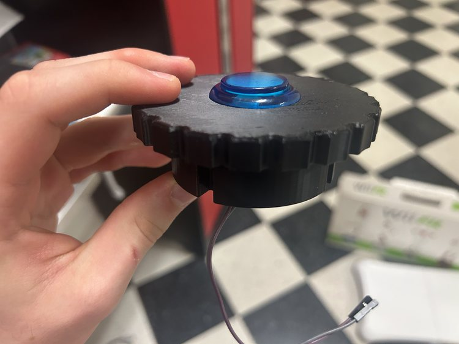

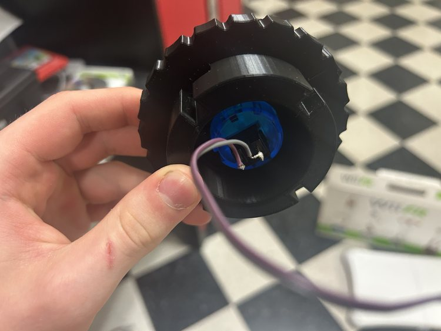

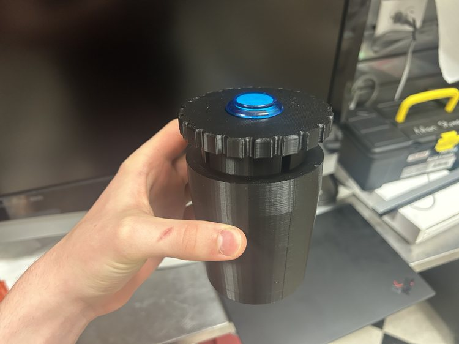

I spent a very long time trying to get code to upload to the XIAO Seeed Studio ESP32C3 and I learned two things: I need to use the board under the `Seeed` package, and that when I see `Leaving... Hard resetting via RTS pin...` in the Arduino IDE after uploading with the Bootloader button, I need to press the `Reset` button on the board.

I realized that my [old design](https://fabacademy.org/2023/labs/charlotte/students/adam-stone/lessons/week8/milling-the-pcb/#redesigining-the-board-again) was faulty, and decided to, instead, utilize the built in pull-up resistor in the ESP32c3. As I redesign it I also want to keep in mind that, according to [this forum](https://forum.seeedstudio.com/t/xiao-internal-pull-up-resistors/253961) I found [previously](https://fabacademy.org/2023/labs/charlotte/students/adam-stone/lessons/week8/milling-the-pcb/#confirming-success), pins `D0-3` don't have built in pull-up resistors.

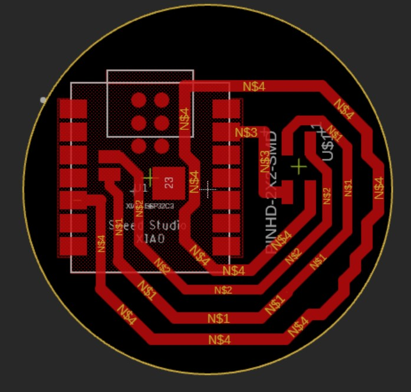

I had to remember to uncheck `Solder Mask` when pushing to the 3D PCB.

There was only a blank cylinder when I pushed to the 3D PCB. To fix this problem, under the drop down where I selected to push to 3D PCB, I selected to break the link to the 3D PCB, then created a new one, which worked. This issue probably had something to do with the EIP workflow and my PCB design being imported into another model. I unchecked the component with the package bodies then followed the same steps as [this page](./display-electronics.md#moving-on) to mill on my home machine - I also had to create a new `0.5mm` tool and configure the settings. I created two toolpaths in the setup, both `2D Contours`.

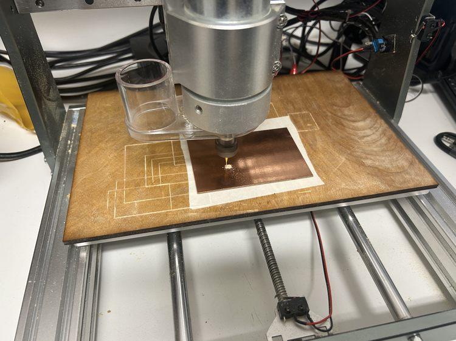

After re-milling the board, I used a knife to cut one small connection at a corner that wasn't cut all the way. Then I soldered the board on using solder paste for the bottom connections and a heat gun, but ultimately there were shorts between the paris of output pins. Removing the board using the heat gun revealed that the short was due not to the board, but because of a solder bridge underneath. I also tried using a knife to scrape out the rest of the copper underneath the board to avoid shorts. As I implemented these solutions, I ended up ripping the traces on the header pins. After the fact, I also realized I was using the wrong pin numbers in the code.

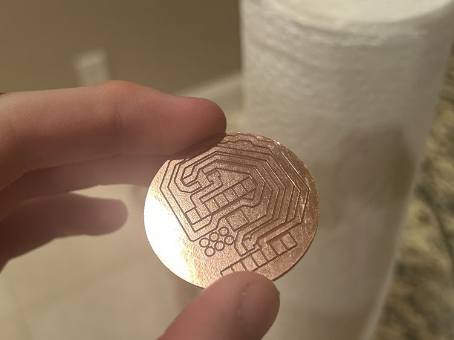

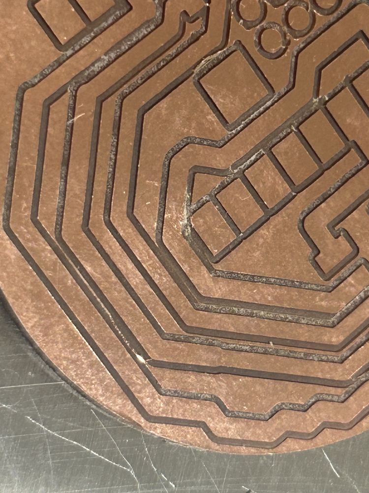

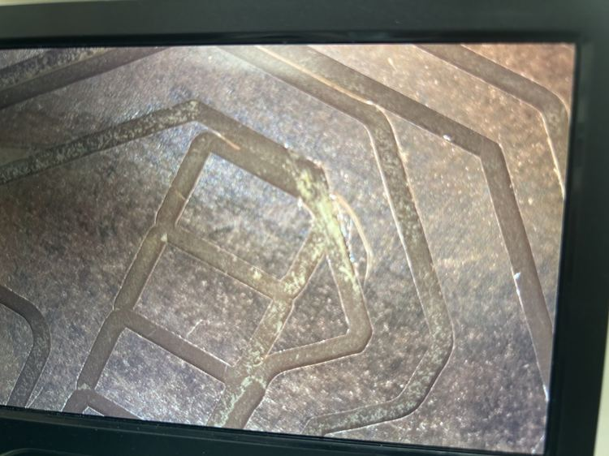

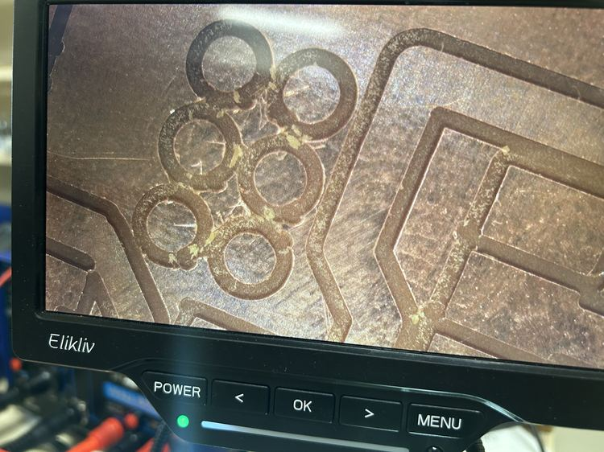

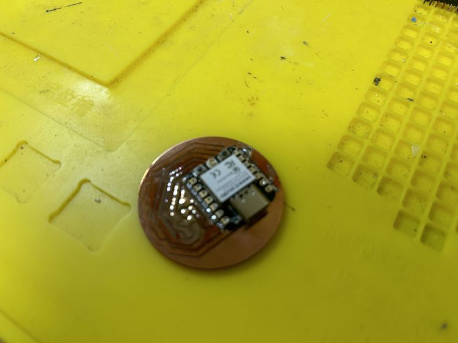

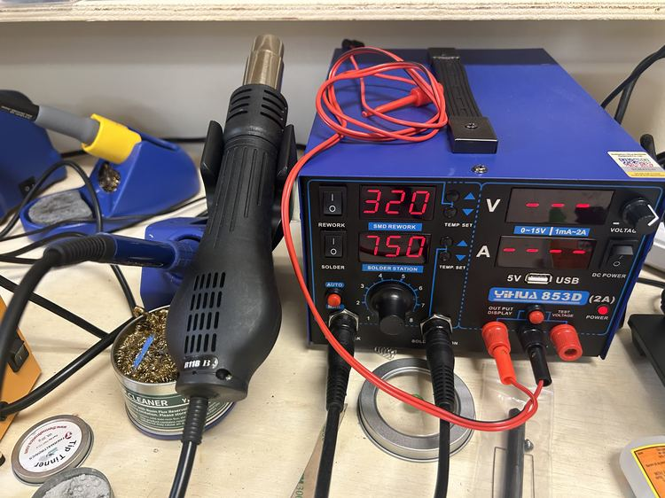

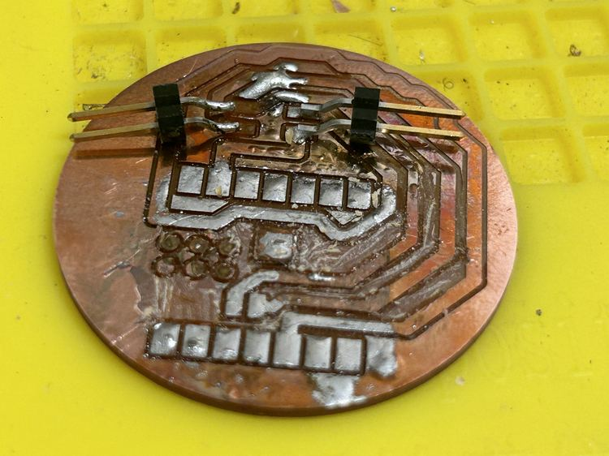

I then redesigned the board to be simpler and cause less issues, which worked (I had planned to mill out all of the excess copper if this failed, but in the end, I didn't have to)! The only problem is that the surrounding copper of the board has continuity with the ground, but since none of the other header pins have continuity with it, this should be find (there were some bridges where I connected continuity with other pins, but all of those didn't do anything). I also modified the wiring to use a pull-up resistor instead of a pull-down resistor. I also used a different footprint (in the WirePad library) called `SMD5`.

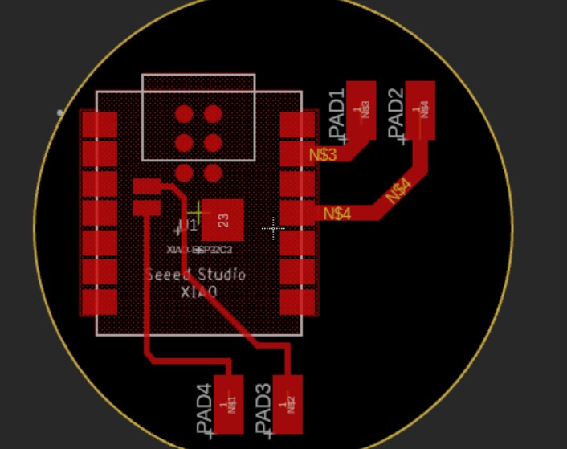

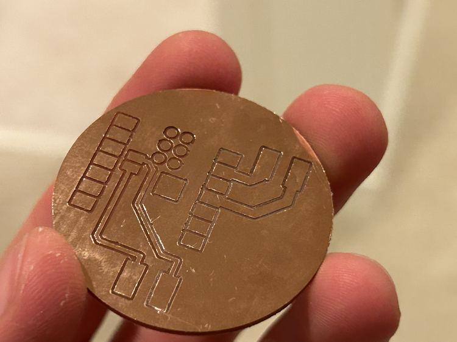

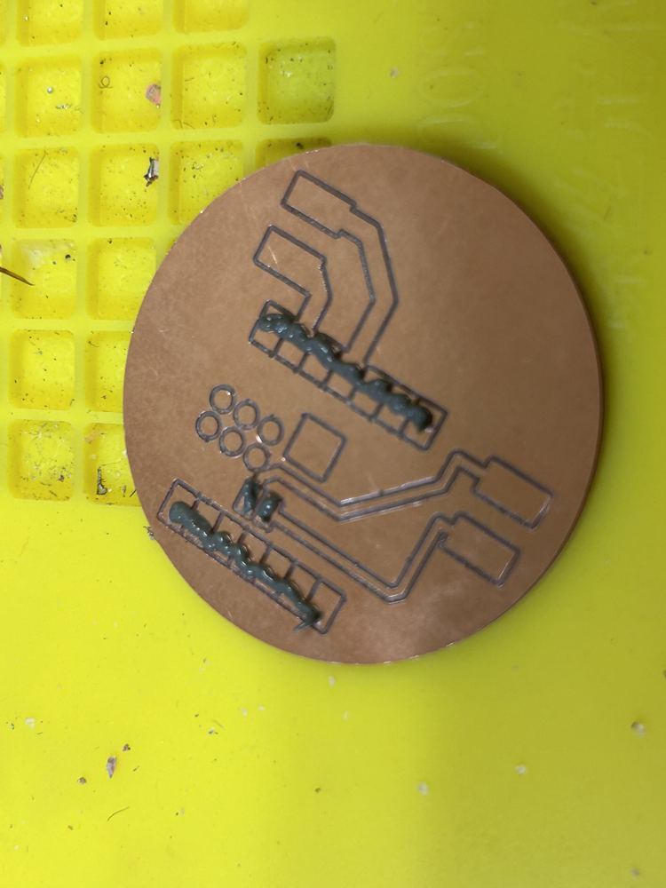

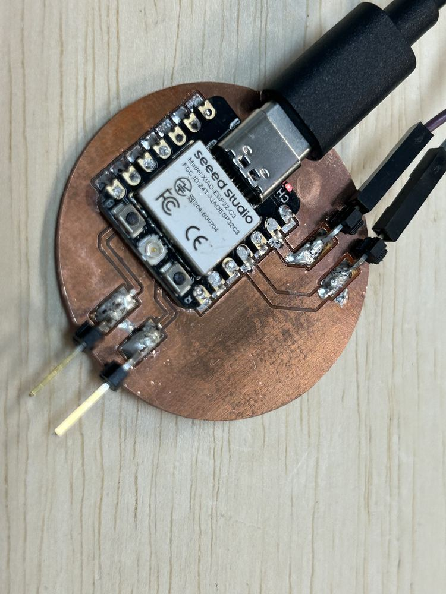

<video src="../../../assets/images/stem/disability-forewarning-system/z4.mp4" controls="controls" style="max-width: 730px;">
</video>

Here was the final, working code for the button.

```cpp
void setup() {
  pinMode(10, INPUT_PULLUP);
  Serial.begin(9600);
}

void loop() {
  Serial.println("Snew tatus?");
  if (digitalRead(10) == LOW) {
    Serial.println("YAYYYYYY!!!!!! :):):)");
  }
}
```

## Rechargeable Batteries

Using the same battery as the [display electronics](./display-electronics.md#rechargeable-batteries), I didn't see a light when I plugged it in, but the multimeter revealed 3v3 was working.

After recharging the battery, I was getting inconsistent results, and I decided to use a USB plug into the car instead. I drilled a hole in the bottom of the cup and used a USB to USBC wire so that the cupholder device can be plugged into the car! This worked wonderfully! I also redid the design to where there is a hole in the bottom side of the botton, but I never ended up printing it.

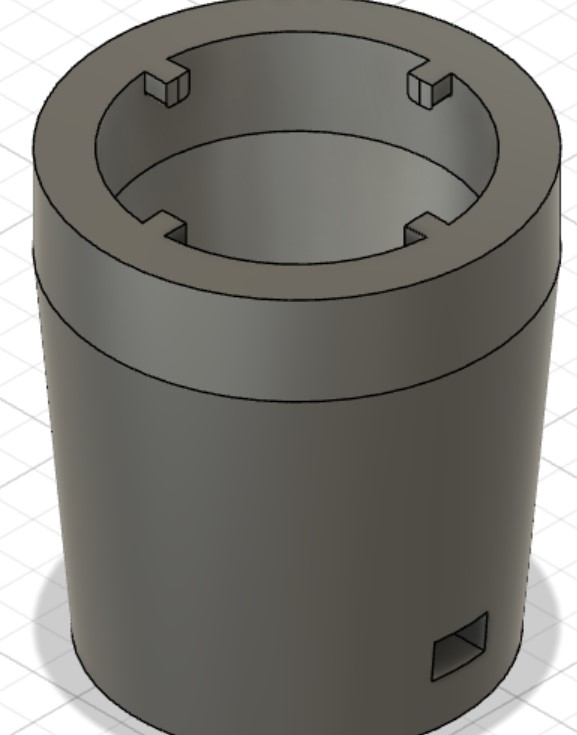

## Melted Button

One time the solder for the button became undone, but after resoldering it, the button stopped working and was stuck shut. I opened up the button, but I was unable to open the electronics box (I believe it melted shut). My solution was to simply use a different spare button, but I was very careful to never have the solder touching the button for more than a couple of seconds at a time, and I instead created a circular shape out of the wire, melted a substantial amount of solder onto it, then moved it quickly onto the button. This method worked!