# Updating Board Design

## Choosing A Microcontroller

Since I have two different boards for the driver-side electronics and back-of-car electronics, I need to choose an appropriate microcontroller to design a second board with.

[This forum](https://www.reddit.com/r/esp32/comments/xq942m/does_anyone_know_how_to_control_servo_motor_by/) revealed to me that the `ESP32-C3` isn't suitable for controlling servo motors.

In hindsight, it's good that I designed my first board with a microcontroller that can use WiFi and Bluetooth because some part of the board will need to communicate the custom message to display on the screen, which can be updated remotely from an app or website. I might also want to consider handling this functionality on the other board, but I feel it's not necessary.

**Prompt**

```txt
I'm designing a PCB board to control a servo motor, an e-paper/e-ink LCD display, and receive signals  over bluetooth (or wifi - they won't be connected to internet so bluetooth is probably a better idea). I am trying to use a microcontroller. I originally was going to use the ESP32-C3 because of the built in bluetooth and wifi, but read some forum posts which revealed that it's not great at controlling a servo motor. I also want to use an integrated circuit and not an arduino or raspberry pi pico, but a board, for example, like the XIAO Seeed rp2040 or an ATTINYMEGA/ATTINY. What do you recommend? Also comment on any choices I've described to you and provide feedback for anything that's not a well-warranted decision or explain why my choices are logical.
```

**Response**

```txt
Your requirement to control a servo motor, an e-paper/e-ink LCD display, and receive signals over Bluetooth (or WiFi) can be achieved using various microcontroller options. Since you prefer not to use an Arduino or Raspberry Pi Pico, I will recommend a few alternatives.

STM32 microcontrollers: STM32 microcontrollers, particularly the STM32F series (e.g., STM32F103C8T6), offer a good balance of performance, power efficiency, and a variety of peripherals. They can handle servo motor control, e-paper/e-ink displays, and can be paired with a separate Bluetooth module (e.g., HC-05) for communication. You can find various STM32 development boards, such as the Blue Pill, that can be programmed using the Arduino IDE or other development environments.

nRF52 series microcontrollers: The nRF52832 and nRF52840 are ARM Cortex-M4-based microcontrollers with built-in Bluetooth Low Energy (BLE) capabilities. They have sufficient processing power and peripherals to control a servo motor and e-paper/e-ink displays. They are designed for low-power applications, which might be beneficial if power consumption is a concern.

ATSAMD21/51 microcontrollers: These microcontrollers from Microchip (previously Atmel) are ARM Cortex-M0+/M4 based and have good performance for controlling servo motors and e-paper/e-ink displays. You can pair them with an HC-05 Bluetooth module for communication. The Adafruit Feather M0/M4 boards use these microcontrollers, and you can find a variety of examples for controlling peripherals and communication.

Regarding your original choice of ESP32-C3, it is true that it might not be the best option for precise servo motor control due to the
```

**Prompt**

```txt
pick up where you left off
```

**Response**

```txt
Due to the fact that ESP32-C3 uses an RISC-V based core, it might not be the best option for precise servo motor control as it can have timing-related challenges. It is also designed with WiFi and Bluetooth connectivity as its primary focus, which can be overkill if you only require Bluetooth communication.

In summary, based on your requirements, I would recommend considering STM32 microcontrollers, nRF52 series microcontrollers, or ATSAMD21/51 microcontrollers as potential options for your PCB board design. These microcontrollers provide sufficient processing power and peripherals to handle servo motor control, e-paper/e-ink displays, and can be paired with a separate Bluetooth module for communication.

Ensure that you verify the specific peripherals and communication interfaces required for your chosen e-paper/e-ink display, servo motor, and Bluetooth module, and make sure the selected microcontroller supports those interfaces. Additionally, consider factors such as power consumption, form factor, and the availability of development resources, libraries, and community support when making your decision.
```

**Prompt** 

```txt
This servo motor which moves the display needs to move the display onto the back window of a car, from the inside. How to you recommend I mount it?
```

**Response**

```txt
Mounting a servo motor to move a display inside a car can be done in a few steps. I will outline a general approach, but please note that the specific details may vary depending on the make and model of your car, the size and weight of the display, and the type of servo motor you are using.

Determine the best mounting location: Choose a location on the inside of the car's back window where the servo motor can be securely mounted and has sufficient space for the display to move. Make sure there are no obstructions and the window is not tinted in a way that would hinder the visibility of the display.

Design a mounting bracket: Create a custom mounting bracket that can securely hold the servo motor and attach it to the car's interior. The bracket should be made from a durable, lightweight material like aluminum or a strong plastic. The design should also consider cable management for the servo motor, display, and any other required connections.

Attach the mounting bracket: Attach the mounting bracket to the car's interior using strong adhesives, like automotive-grade double-sided tape or adhesive sealant, or by using screws or other fasteners if the car's design allows for it. Ensure that the mounting is secure and does not interfere with any other vehicle functions.

Attach the servo motor to the bracket: Secure the servo motor to the mounting bracket using screws, bolts, or other suitable fasteners. Make sure the servo motor is positioned correctly to move the display as desired.

5
```

It didn't finish its response for the last prompt, but that's fine since it advise was far to general to be helpful.

The responses for the microcontroller suggestion were helpful, though.

I took a look at [Florian Becker](https://fabacademy.org/2022/labs/digiscope/students/florian-becker/assignments/week11/) and asked ChatGPT 4.0 several other questions.

**Prompt**

```txt
which of the three suggested microcontrollers should i use
```

**Response**

```txt
Selecting the most suitable microcontroller from the three suggested options depends on your specific requirements, priorities, and design constraints. I will provide a brief comparison to help you decide:

STM32 microcontrollers: STM32 microcontrollers, particularly the STM32F series, offer a good balance of performance, power efficiency, and a variety of peripherals. They are widely used in the maker community, and you can find extensive resources, libraries, and examples for various applications. If you want a powerful, well-supported microcontroller and don't mind adding a separate Bluetooth module, the STM32 is a solid choice.

nRF52 series microcontrollers: The nRF52832 and nRF52840 are ARM Cortex-M4-based microcontrollers with built-in Bluetooth Low Energy (BLE) capabilities. They are particularly suitable for low-power applications, and their integrated BLE support simplifies the design. If power consumption is a concern or you prefer an integrated Bluetooth solution, the nRF52 series is an excellent option.

ATSAMD21/51 microcontrollers: These microcontrollers from Microchip (previously Atmel) are ARM Cortex-M0+/M4 based and have good performance for controlling peripherals. They are less powerful than STM32 microcontrollers but still provide sufficient resources for your application. If you are already familiar with Atmel microcontrollers or prefer a lower-cost solution, consider the ATSAMD21/51 microcontrollers
```

I decided on a STM32F series board and found [this Instructables tutorial](https://www.instructables.com/How-to-use-E-ink-display-on-the-stm32/) on how to wire and program an e-paper/e-ink display to the microcontroller. I also downloaded [this EagleCAD library](https://github.com/chiengineer/Eagle-Libraries/blob/master/Processors/Misc/stm32.lbr) and imported it into Fusion 360.

I found [this site](https://www.digikey.com/en/maker/blogs/2020/understanding-stm32-naming-conventions?utm_adgroup=STMicroelectronics&utm_source=google&utm_medium=cpc&utm_campaign=Dynamic%20Search_EN_Focus%20Suppliers&utm_term=&utm_content=STMicroelectronics&gclid=CjwKCAjwzuqgBhAcEiwAdj5dRqGDWFl4oWHrIUEmdNNbsnrrBx-EOeSO3mVuDJg3zip7cnMl0IVmbRoCYqQQAvD_BwE) which explains naming conventions for the STM32 boards. 

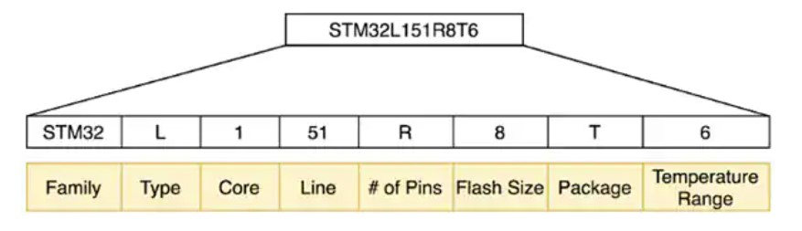

In the EagleCAD library I saw four boards:

- *STM32F10XCXT6*
- STM32F10XRXT6
- STM32F10XTXU6
- STM32F10XVXT6

I decided on the first board, *STM32F10XCXT6*, since it has the least number of pins (from what I could tell in the EagleCAD schematic) and is surface-mount where the pin headers are exposed (unlike the *STM32F10XTXU6*).

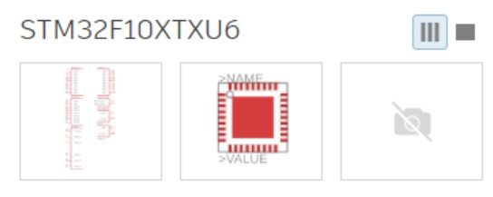{: style="width:500px;"}

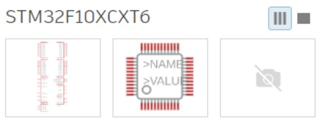{: style="width:500px;"}

When I put the component in my schematic I at first only saw a small portion of the pins from one port. I then realized that if I kept added components the other pins would be added. I was quickly overwhelmed by the amount of boards and decided to switch to one with less pins.

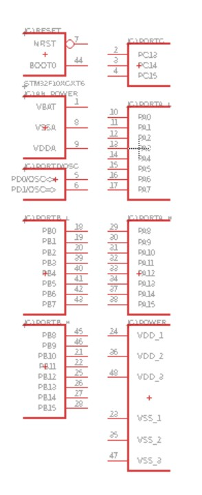

Based on the Instructable I decided to assign different pins on a 2x5 SMD pin header I found (`PINHD-2X5-SMD` in the `fab` library) to the following.

|Header Pin|STM32 Pin|
|--|--|
|1|SDA|
|2|SCL|
|3|CS|
|4|DC|
|5|RST|
|6|BU|
|7|BS|

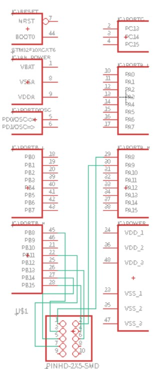

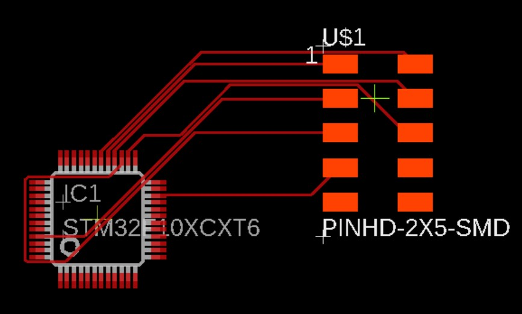

I realized this chip has even more pins than an RP2040 (`ATTINY328P`) so I may as well just use that one. I could also use that [XIAO Seeed RP2040](https://wiki.seeedstudio.com/XIAO-RP2040/) but am worried it won't have enough pins. [This example](https://embeddedcomputing.weebly.com/driving-a-large-e-paper-display-with-a-compact-xiao-rp2040.html) confirms my worries.

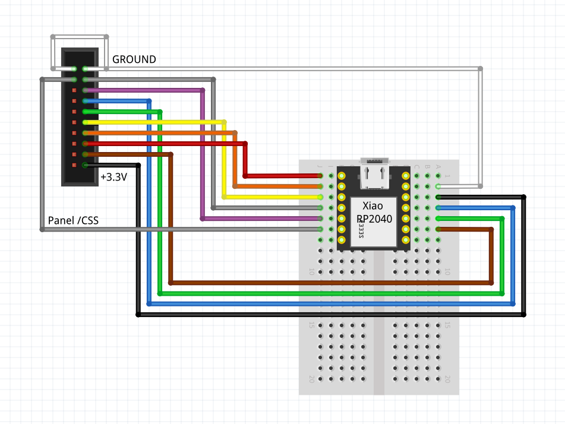

I instead decided to use an [ATTINY328P-AN](https://www.digikey.com/en/products/detail/microchip-technology/ATMEGA328P-AN/2357082). The DigiKey site linked to [this page](https://www.digikey.com/en/models/2357082) where I could download a component that I thought I could import into EagleCAD (I selected the `Eaglecad6 Library` format in the DigiKey download). That format didn't work so I selected `Fusion360 PCB` which gave an LBR file, as needed.

After talking to [Mr. Dubick](http://archive.fabacademy.org/fabacademy2016/charlottelatin/students/999/about.html), I decided to use a [Raspberry Pi Pico](https://www.raspberrypi.com/products/raspberry-pi-pico/) which allows for me to more easily use an RP2040 with a lot of pins. I downloaded the EagleCAD library [here](https://github.com/Lobo-T/RPI-Pico-Eagle-lib/blob/main/RpiPico.lbr). I used this of the three components since it was the entire Pico board (not just the RP2040 microprocessor) and is surface mount.

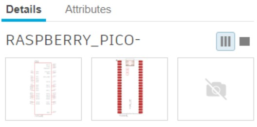

I also found [this schematic](https://www.waveshare.com/w/upload/8/87/E-Paper-Driver-HAT-Schematic.pdf) for an e-paper HAT driver linked on [this page](https://www.waveshare.com/wiki/File:E-Paper-Driver-HAT-Schematic.pdf) from [this website](https://www.waveshare.com/wiki/E-Paper_Driver_HAT). I also found [this post](https://hackaday.io/project/11537-nekocal-an-e-ink-calendar/log/191001-basics-of-driving-e-paper-displays) which compares different methods of operating the e-paper display, and I also skimmed [this article](http://essentialscrap.com/eink/).

[This website](https://www.digikey.be/en/maker/projects/raspberry-pi-pico-rp2040-spi-example-with-micropython-and-cc/9706ea0cf3784ee98e35ff49188ee045) confirmed that SPI communication can be achieved with the Raspberry Pi Pico, and [this tutorial](https://www.youtube.com/watch?v=s7Lud1Gqrqw) eloborates on how to implement it. I also learned that there's a [specific HAT driver](https://www.waveshare.com/wiki/Pico-ePaper-2.9) for a smaller e-paper display designed for the Pico, which is concerned as to whether it's possible to use the Pico to operate a larger display. [This website](https://forum.arduino.cc/t/waveshare-e-paper-displays-with-spi/467865/2768?page=139#:~:text=%2DDiagnostic%20Output%20was,5) suggested a potential wiring for Arduino to talk to the driver. [Here](https://datasheets.raspberrypi.com/pico/Pico-R3-A4-Pinout.pdf) is a detailed pinout sheet for the Pico and [here](https://images.prismic.io/circuito/8e3a980f0f964cc539b4cbbba2654bb660db6f52_arduino-uno-pinout-diagram.png?auto=compress,format) is a detailed pinout sheet for the Arduino Uno.

I then watched [this tutorial](https://www.youtube.com/watch?v=4onIqHClh2s) to gain a better understanding of e-paper displays. This revealed to me that the other wiring I got wasn't correct.

I wasn't sure whether my display was a `7.5"`, `7.5"B`, or `7.5"C` display, so I guessed `7.5"` for now. I then downloaded a zip file of the code. I copied the `epd7in5` folder in the `7.5in` display folder to the Arduino Library folder (`C:\Users\*YOUR_USER*\Documents\Arduino\libraries`). Then it appeared in the Arduino IDE!

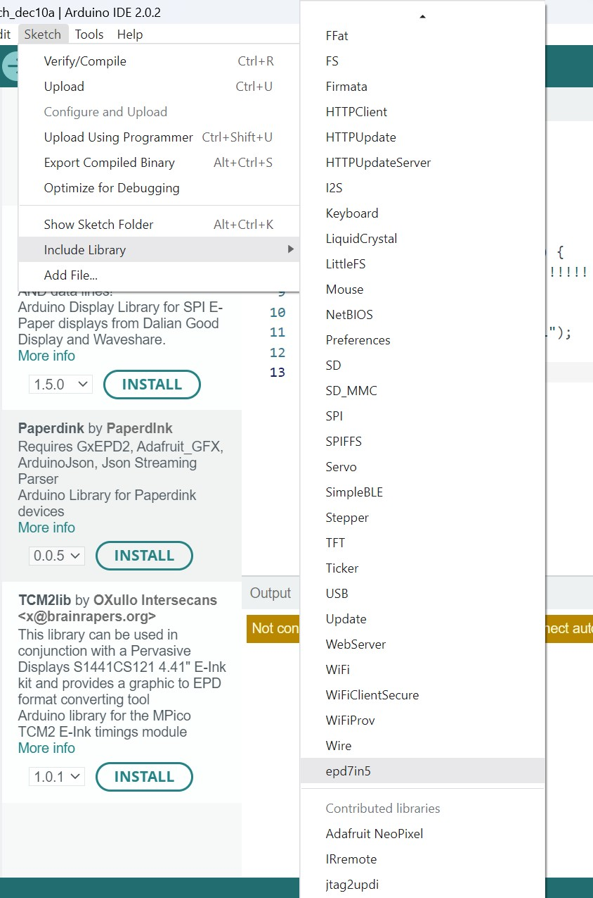

I clicked in which added the following to the top of my code.

```cpp
#include <epd7in5.h>
#include <epdif.h>
```

I then went to `File > Examples > epd7in5 > epd7in5-demo` but got an error that the path didn't exist. I then realized that this used a different address (which I accidentally put the library in before) so I wanted to copy the folder there, as well. But before I did that, I tried again, clicking the library under `Examples from Custom Libraries` and the example opened! I uploaded the code but got the following error.

```cmd
:\Users\*USER*\AppData\Local\Temp\.arduinoIDE-unsaved2023223-2744-55l82c.2wca4\epd7in5-demo\imagedata.cpp:27:10: fatal error: avr/pgmspace.h: No such file or directory
 #include <avr/pgmspace.h>
          ^~~~~~~~~~~~~~~~
compilation terminated.

Using library SPI at version 2.0.0 in folder: C:\Users\*USER*\AppData\Local\Arduino15\packages\esp32\hardware\esp32\2.0.7\libraries\SPI 
Using library epd7in5 at version 1.0 in folder: C:\Users\*USER*\Documents\Arduino\libraries\epd7in5 
exit status 1

Compilation error: avr/pgmspace.h: No such file or directory
```

[This site](https://forum.arduino.cc/t/fatal-error-avr-pgmspace-h-no-such-file-or-directory-error-for-esp8266/538262/3#:~:text=I%20found%20the%20answer.%20You%20can%20remove%20%23include%20%3Cavr/pgmspace%3E%20from%20the%20LedControl.h%20header%20file%20or%20just%20create%20the%20dir%20where%20it%20is%20looking%20for%20the%20file.%20I%20took%20the%20easy%20route.) recommended that I simply commented out this include statement, so I changed the top of `imagedata.cpp` to the following.

```cpp
#include "imagedata.h"
//#include <avr/pgmspace.h>
```

[The same post](https://forum.arduino.cc/t/fatal-error-avr-pgmspace-h-no-such-file-or-directory-error-for-esp8266/538262/5#:~:text=%23if%20defined(AVR)%0A%23include%20%3Cavr/pgmspace.h%3E%0A%23else%C2%A0%20//defined(AVR)%0A%23include%20%3Cpgmspace.h%3E%0A%23endif%C2%A0%20//defined(AVR)) later suggested that I change it to the following, and the compilation was successful, but I got an error that I forgot to select a port. I also changed the board to Arduino Uno.

```cpp
#include "imagedata.h"
//#include <avr/pgmspace.h>
#if defined(AVR)
#include <avr/pgmspace.h>
#else  //defined(AVR)
#include <pgmspace.h>
#endif  //defined(AVR)
```

I then got an error that the sketch was too large.

```cmd
Sketch too big; see https://support.arduino.cc/hc/en-us/articles/360013825179 for tips on reducing it.
Sketch uses 33522 bytes (103%) of program storage space. Maximum is 32256 bytes.
Global variables use 185 bytes (9%) of dynamic memory, leaving 1863 bytes for local variables. Maximum is 2048 bytes.
text section exceeds available space in board

Compilation error: text section exceeds available space in board
```

I then tried to use an Arduino Mega 2560 that had more memory. I was able to upload the sketch but nothing happened on the screen. I tried directly connecting the screen to the hat without the long ribbon cable and I tried the B/C and V2 versions of the examples in the [Waveshare E-Paper](https://github.com/waveshare/e-Paper/tree/master/Arduino) library but nothing worked. I tried both the wiring configuration on [this website](https://forum.arduino.cc/t/waveshare-e-paper-displays-with-spi/467865/2982?page=149#:~:text=BUSY%20%2D%3E%207%2C%20RST%20%2D%3E%209%2C%20DC%20%2D%3E%208%2C%20CS%2D%3E%2053%2C%20CLK%20%2D%3E%2052%2C%20DIN%20%2D%3E%2051%2C%20GND%20%2D%3E%20GND%20%2C%20VCC%20%2D%3E%203.3v) and the one on [this website](https://www.waveshare.com/wiki/7.5inch_e-Paper_HAT_Manual) none of which worked!

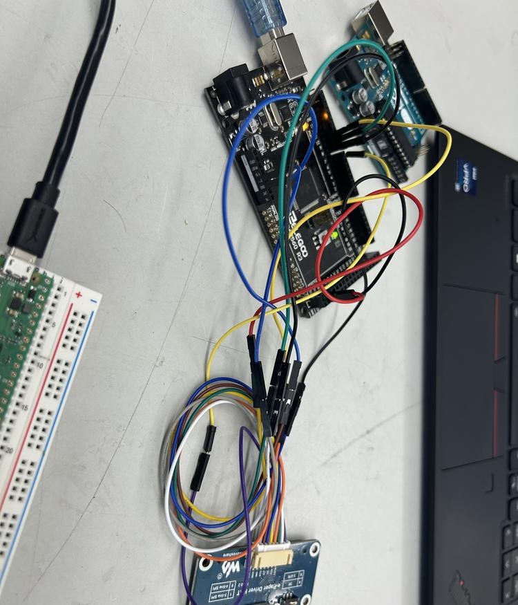

I copied my documentation thus far into ChatGPT (excluding long parts at the end of some links to reduce the number of tokens) and asked it for advice. It's response wasn't helpful.

```txt
It seems like you have tried several different approaches to get the 7.5" e-paper waveshare display to work with your Raspberry Pi Pico, but haven't had success yet. Here are some suggestions that may help:

Double check the wiring connections: It's important to make sure that all the wiring connections between the display and the Pico are correct. Make sure to consult the datasheets and schematics of both the display and the Pico to ensure that you're connecting the correct pins.

Check the power supply: Make sure that the display is receiving adequate power. E-paper displays require a high voltage to operate, and it's possible that the power supply you're using isn't providing enough voltage.

Try a different library: If you're having trouble with the library you're currently using, try a different one. There are several libraries available for e-paper displays that work with the Raspberry Pi Pico, so try a few to see which one works best for your setup.

Verify the code: Make sure that the code you're using is correct and that it's compatible with your display and Pico. Double-check the code and verify that it matches the wiring connections.

Try a different display: If you're still having trouble, it's possible that the display itself is faulty. Try using a different display to see if that works with your Pico.

I hope these suggestions help you get your e-paper display working with your Raspberry Pi Pico. Good luck!
```

I then installed MicroPython using [my old documentation](https://fabacademy.org/2023/labs/charlotte/students/adam-stone/lessons/week4/programming-microcontrollers/) as a tutorial. I had already downloaded a ZIP file of [this entire repo](https://github.com/waveshare/e-Paper) so I copied the `waveshare_epd` folder into the RP2040 disk drive that appears when I plug it in while holding the bootloader button.

I installed MicroPython using my old documentation then followed ChatGPT's advice for writing a program in MicroPython using the Waveshare E-Paper library. I right-clicked a file and clicked `Upload to /` to move it into the Raspberry Pi Pico's harddrive.

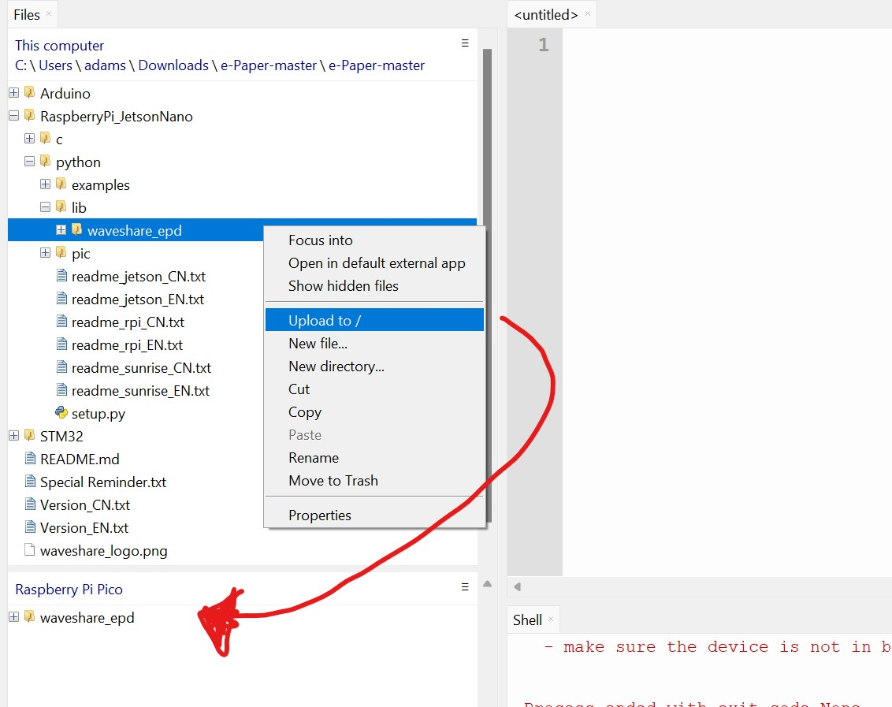

I encountered many errors using ChatGPT and spent several hours going down a rabbit hole telling it everything that wasn't working. It told me that actually this wouldn't work with MircoPython and gave me the files and a workflow for how to install CircuitPython on a Raspberry Pi Pico. I held the bootloader button while plugging it in then dragged a UF2 file into the drive, causing the board to restart. [Here](https://fabacademy.org/2023/labs/charlotte/students/adam-stone/lessons/week9/gpt/) is the full text of my conversation with ChatGPT, or just skip it and move on. The formatting may be slightly strange. In essence, there were so many hallucinations, and it was extremely unhelpful. I learned that I can be much more efficient if I just try to do it myself.

## Different Approach

I give up - too much hallucination.

Luckily, I found [this library](https://github.com/mcauser/micropython-waveshare-epaper) that specifically deals with e-paper in MicroPython, but it doesn't go up to the `9.7"` display, so for now I'll just focus on the `7.5"` display.

Board not showing up - Press Bootsel, [reset button](https://www.okdo.com/project/raspberry-pi-pico-reset-button/#:~:text=Push%20and%20hold%20the%20reset,Release%20the%20BOOTSEL%20button.), releaes Bootsel, release reset button.

When I selected `< Try to detect port automatically >` finally worked. Turns out it wasn't the 3V output plugged into the e-paper display.

```py
from micropython import const
from time import sleep_ms
import ustruct

# Display resolution
EPD_WIDTH  = const(640)
EPD_HEIGHT = const(384)

# Display commands
PANEL_SETTING                  = const(0x00)
POWER_SETTING                  = const(0x01)
POWER_OFF                      = const(0x02)
#POWER_OFF_SEQUENCE_SETTING     = const(0x03)
POWER_ON                       = const(0x04)
#POWER_ON_MEASURE               = const(0x05)
BOOSTER_SOFT_START             = const(0x06)
DEEP_SLEEP                     = const(0x07)
DATA_START_TRANSMISSION_1      = const(0x10)
#DATA_STOP                      = const(0x11)
DISPLAY_REFRESH                = const(0x12)
#IMAGE_PROCESS                  = const(0x13)
#LUT_FOR_VCOM                   = const(0x20)
#LUT_BLUE                       = const(0x21)
#LUT_WHITE                      = const(0x22)
#LUT_GRAY_1                     = const(0x23)
#LUT_GRAY_2                     = const(0x24)
#LUT_RED_0                      = const(0x25)
#LUT_RED_1                      = const(0x26)
#LUT_RED_2                      = const(0x27)
#LUT_RED_3                      = const(0x28)
#LUT_XON                        = const(0x29)
PLL_CONTROL                    = const(0x30)
#TEMPERATURE_SENSOR_COMMAND     = const(0x40)
TEMPERATURE_CALIBRATION        = const(0x41)
#TEMPERATURE_SENSOR_WRITE       = const(0x42)
#TEMPERATURE_SENSOR_READ        = const(0x43)
VCOM_AND_DATA_INTERVAL_SETTING = const(0x50)
#LOW_POWER_DETECTION            = const(0x51)
TCON_SETTING                   = const(0x60)
TCON_RESOLUTION                = const(0x61)
#SPI_FLASH_CONTROL              = const(0x65)
#REVISION                       = const(0x70)
#GET_STATUS                     = const(0x71)
#AUTO_MEASUREMENT_VCOM          = const(0x80)
#READ_VCOM_VALUE                = const(0x81)
VCM_DC_SETTING                 = const(0x82)
FLASH_MODE                     = const(0xE5)

BUSY = const(0)  # 0=busy, 1=idle

class EPD:
    def __init__(self, spi, cs, dc, rst, busy):
        self.spi = spi
        self.cs = cs
        self.dc = dc
        self.rst = rst
        self.busy = busy
        self.cs.init(self.cs.OUT, value=1)
        self.dc.init(self.dc.OUT, value=0)
        self.rst.init(self.rst.OUT, value=0)
        self.busy.init(self.busy.IN)
        self.width = EPD_WIDTH
        self.height = EPD_HEIGHT

    def _command(self, command, data=None):
        self.dc(0)
        self.cs(0)
        self.spi.write(bytearray([command]))
        self.cs(1)
        if data is not None:
            self._data(data)

    def _data(self, data):
        self.dc(1)
        self.cs(0)
        self.spi.write(data)
        self.cs(1)

    def init(self):
        self.reset()
        self._command(POWER_SETTING, b'\x37\x00')
        self._command(PANEL_SETTING, b'\xCF\x08')
        self._command(BOOSTER_SOFT_START, b'\xC7\xCC\x28')
        self._command(POWER_ON)
        self.wait_until_idle()
        self._command(PLL_CONTROL, b'\x3C')
        self._command(TEMPERATURE_CALIBRATION, b'\x00')
        self._command(VCOM_AND_DATA_INTERVAL_SETTING, b'\x77')
        self._command(TCON_SETTING, b'\x22')
        self._command(TCON_RESOLUTION, ustruct.pack(">HH", EPD_WIDTH, EPD_HEIGHT))
        self._command(VCM_DC_SETTING, b'\x1E') # decide by LUT file
        self._command(FLASH_MODE, b'\x03')

    def wait_until_idle(self):
        while self.busy.value() == BUSY:
            sleep_ms(100)

    def reset(self):
        self.rst(0)
        sleep_ms(200)
        self.rst(1)
        sleep_ms(200)

    # draw the current frame memory
    def display_frame(self, frame_buffer):
        self._command(DATA_START_TRANSMISSION_1)
        for i in range(0, self.width * self.height // 8):
            temp1 = frame_buffer[i]
            j = 0
            while (j < 8):
                if (temp1 & 0x80):
                    temp2 = 0x03
                else:
                    temp2 = 0x00
                temp2 = (temp2 << 4) & 0xFF
                temp1 = (temp1 << 1) & 0xFF
                j += 1
                if (temp1 & 0x80):
                    temp2 |= 0x03
                else:
                    temp2 |= 0x00
                temp1 = (temp1 << 1) & 0xFF
                self._data(bytearray([temp2]))
                j += 1
        self._command(DISPLAY_REFRESH)
        sleep_ms(100)
        self.wait_until_idle()

    # to wake call reset() or init()
    def sleep(self):
        self._command(POWER_OFF)
        self.wait_until_idle()
        self._command(DEEP_SLEEP, b'\xA5')

import framebuf

epd = EPD(0, 17, 20, 21, 22)
#self, spi, cs, dc, rst, busy
epd.init()
buffer = bytearray(epd.width * epd.height // 8)
fb = framebuf.FrameBuffer(buffer, epd.width, epd.height, framebuf.MONO_HLSB)
fb.fill(0)
epd.display_frame(buffer)

fb.text("Hello, World!", 0, 0, 1)
epd.display_frame(buffer)
```

Didn't work because numbers in `EPD` constructor needed to be Pin and SPI objects.

```py
from micropython import const
from time import sleep_ms
import ustruct

# Display resolution
EPD_WIDTH  = const(640)
EPD_HEIGHT = const(384)

# Display commands
PANEL_SETTING                  = const(0x00)
POWER_SETTING                  = const(0x01)
POWER_OFF                      = const(0x02)
#POWER_OFF_SEQUENCE_SETTING     = const(0x03)
POWER_ON                       = const(0x04)
#POWER_ON_MEASURE               = const(0x05)
BOOSTER_SOFT_START             = const(0x06)
DEEP_SLEEP                     = const(0x07)
DATA_START_TRANSMISSION_1      = const(0x10)
#DATA_STOP                      = const(0x11)
DISPLAY_REFRESH                = const(0x12)
#IMAGE_PROCESS                  = const(0x13)
#LUT_FOR_VCOM                   = const(0x20)
#LUT_BLUE                       = const(0x21)
#LUT_WHITE                      = const(0x22)
#LUT_GRAY_1                     = const(0x23)
#LUT_GRAY_2                     = const(0x24)
#LUT_RED_0                      = const(0x25)
#LUT_RED_1                      = const(0x26)
#LUT_RED_2                      = const(0x27)
#LUT_RED_3                      = const(0x28)
#LUT_XON                        = const(0x29)
PLL_CONTROL                    = const(0x30)
#TEMPERATURE_SENSOR_COMMAND     = const(0x40)
TEMPERATURE_CALIBRATION        = const(0x41)
#TEMPERATURE_SENSOR_WRITE       = const(0x42)
#TEMPERATURE_SENSOR_READ        = const(0x43)
VCOM_AND_DATA_INTERVAL_SETTING = const(0x50)
#LOW_POWER_DETECTION            = const(0x51)
TCON_SETTING                   = const(0x60)
TCON_RESOLUTION                = const(0x61)
#SPI_FLASH_CONTROL              = const(0x65)
#REVISION                       = const(0x70)
#GET_STATUS                     = const(0x71)
#AUTO_MEASUREMENT_VCOM          = const(0x80)
#READ_VCOM_VALUE                = const(0x81)
VCM_DC_SETTING                 = const(0x82)
FLASH_MODE                     = const(0xE5)

BUSY = const(0)  # 0=busy, 1=idle

class EPD:
    def __init__(self, spi, cs, dc, rst, busy):
        self.spi = spi
        self.cs = cs
        self.dc = dc
        self.rst = rst
        self.busy = busy
        self.cs.init(self.cs.OUT, value=1)
        self.dc.init(self.dc.OUT, value=0)
        self.rst.init(self.rst.OUT, value=0)
        self.busy.init(self.busy.IN)
        self.width = EPD_WIDTH
        self.height = EPD_HEIGHT

    def _command(self, command, data=None):
        self.dc(0)
        self.cs(0)
        self.spi.write(bytearray([command]))
        self.cs(1)
        if data is not None:
            self._data(data)

    def _data(self, data):
        self.dc(1)
        self.cs(0)
        self.spi.write(data)
        self.cs(1)

    def init(self):
        self.reset()
        self._command(POWER_SETTING, b'\x37\x00')
        self._command(PANEL_SETTING, b'\xCF\x08')
        self._command(BOOSTER_SOFT_START, b'\xC7\xCC\x28')
        self._command(POWER_ON)
        self.wait_until_idle()
        self._command(PLL_CONTROL, b'\x3C')
        self._command(TEMPERATURE_CALIBRATION, b'\x00')
        self._command(VCOM_AND_DATA_INTERVAL_SETTING, b'\x77')
        self._command(TCON_SETTING, b'\x22')
        self._command(TCON_RESOLUTION, ustruct.pack(">HH", EPD_WIDTH, EPD_HEIGHT))
        self._command(VCM_DC_SETTING, b'\x1E') # decide by LUT file
        self._command(FLASH_MODE, b'\x03')

    def wait_until_idle(self):
        while self.busy.value() == BUSY:
            sleep_ms(100)

    def reset(self):
        self.rst(0)
        sleep_ms(200)
        self.rst(1)
        sleep_ms(200)

    # draw the current frame memory
    def display_frame(self, frame_buffer):
        self._command(DATA_START_TRANSMISSION_1)
        for i in range(0, self.width * self.height // 8):
            temp1 = frame_buffer[i]
            j = 0
            while (j < 8):
                if (temp1 & 0x80):
                    temp2 = 0x03
                else:
                    temp2 = 0x00
                temp2 = (temp2 << 4) & 0xFF
                temp1 = (temp1 << 1) & 0xFF
                j += 1
                if (temp1 & 0x80):
                    temp2 |= 0x03
                else:
                    temp2 |= 0x00
                temp1 = (temp1 << 1) & 0xFF
                self._data(bytearray([temp2]))
                j += 1
        self._command(DISPLAY_REFRESH)
        sleep_ms(100)
        self.wait_until_idle()

    # to wake call reset() or init()
    def sleep(self):
        self._command(POWER_OFF)
        self.wait_until_idle()
        self._command(DEEP_SLEEP, b'\xA5')

from machine import Pin, SPI
import framebuf

spi = SPI(0, sck=Pin(18), mosi=Pin(19), miso=Pin(16), baudrate=2000000)
cs = Pin(17, Pin.OUT)
dc = Pin(20, Pin.OUT)
rst = Pin(21, Pin.OUT)
busy = Pin(22, Pin.IN)

epd = EPD(spi, cs, dc, rst, busy)
#self, spi, cs, dc, rst, busy
epd.init()
buffer = bytearray(epd.width * epd.height // 8)
fb = framebuf.FrameBuffer(buffer, epd.width, epd.height, framebuf.MONO_HLSB)
fb.fill(0)
epd.display_frame(buffer)

fb.text("Hello, World!", 0, 0, 1)
epd.display_frame(buffer)
```

This didn't work:

```py
from micropython import const
from time import sleep_ms
import ustruct

# Display resolution
EPD_WIDTH  = const(640)
EPD_HEIGHT = const(384)

# Display commands
PANEL_SETTING                  = const(0x00)
POWER_SETTING                  = const(0x01)
POWER_OFF                      = const(0x02)
#POWER_OFF_SEQUENCE_SETTING     = const(0x03)
POWER_ON                       = const(0x04)
#POWER_ON_MEASURE               = const(0x05)
BOOSTER_SOFT_START             = const(0x06)
DEEP_SLEEP                     = const(0x07)
DATA_START_TRANSMISSION_1      = const(0x10)
#DATA_STOP                      = const(0x11)
DISPLAY_REFRESH                = const(0x12)
#IMAGE_PROCESS                  = const(0x13)
#LUT_FOR_VCOM                   = const(0x20)
#LUT_BLUE                       = const(0x21)
#LUT_WHITE                      = const(0x22)
#LUT_GRAY_1                     = const(0x23)
#LUT_GRAY_2                     = const(0x24)
#LUT_RED_0                      = const(0x25)
#LUT_RED_1                      = const(0x26)
#LUT_RED_2                      = const(0x27)
#LUT_RED_3                      = const(0x28)
#LUT_XON                        = const(0x29)
PLL_CONTROL                    = const(0x30)
#TEMPERATURE_SENSOR_COMMAND     = const(0x40)
TEMPERATURE_CALIBRATION        = const(0x41)
#TEMPERATURE_SENSOR_WRITE       = const(0x42)
#TEMPERATURE_SENSOR_READ        = const(0x43)
VCOM_AND_DATA_INTERVAL_SETTING = const(0x50)
#LOW_POWER_DETECTION            = const(0x51)
TCON_SETTING                   = const(0x60)
TCON_RESOLUTION                = const(0x61)
#SPI_FLASH_CONTROL              = const(0x65)
#REVISION                       = const(0x70)
#GET_STATUS                     = const(0x71)
#AUTO_MEASUREMENT_VCOM          = const(0x80)
#READ_VCOM_VALUE                = const(0x81)
VCM_DC_SETTING                 = const(0x82)
FLASH_MODE                     = const(0xE5)

BUSY = const(0)  # 0=busy, 1=idle

class EPD:
    def __init__(self, spi, cs, dc, rst, busy):
        self.spi = spi
        self.cs = cs
        self.dc = dc
        self.rst = rst
        self.busy = busy
        self.cs.init(self.cs.OUT, value=1)
        self.dc.init(self.dc.OUT, value=0)
        self.rst.init(self.rst.OUT, value=0)
        self.busy.init(self.busy.IN)
        self.width = EPD_WIDTH
        self.height = EPD_HEIGHT

    def _command(self, command, data=None):
        self.dc(0)
        self.cs(0)
        self.spi.write(bytearray([command]))
        self.cs(1)
        if data is not None:
            self._data(data)

    def _data(self, data):
        self.dc(1)
        self.cs(0)
        self.spi.write(data)
        self.cs(1)

    def init(self):
        print("started restart")
        self.reset()
        print("finished restarting")
        self._command(POWER_SETTING, b'\x37\x00')
        self._command(PANEL_SETTING, b'\xCF\x08')
        self._command(BOOSTER_SOFT_START, b'\xC7\xCC\x28')
        self._command(POWER_ON)
        print("waiting until idle")
        self.wait_until_idle()
        self._command(PLL_CONTROL, b'\x3C')
        self._command(TEMPERATURE_CALIBRATION, b'\x00')
        self._command(VCOM_AND_DATA_INTERVAL_SETTING, b'\x77')
        self._command(TCON_SETTING, b'\x22')
        self._command(TCON_RESOLUTION, ustruct.pack(">HH", EPD_WIDTH, EPD_HEIGHT))
        self._command(VCM_DC_SETTING, b'\x1E') # decide by LUT file
        self._command(FLASH_MODE, b'\x03')

    def wait_until_idle(self):
        while self.busy.value() == BUSY:
            sleep_ms(100)

    def reset(self):
        self.rst(0)
        sleep_ms(200)
        self.rst(1)
        sleep_ms(200)

    # draw the current frame memory
    def display_frame(self, frame_buffer):
        self._command(DATA_START_TRANSMISSION_1)
        for i in range(0, self.width * self.height // 8):
            temp1 = frame_buffer[i]
            j = 0
            while (j < 8):
                if (temp1 & 0x80):
                    temp2 = 0x03
                else:
                    temp2 = 0x00
                temp2 = (temp2 << 4) & 0xFF
                temp1 = (temp1 << 1) & 0xFF
                j += 1
                if (temp1 & 0x80):
                    temp2 |= 0x03
                else:
                    temp2 |= 0x00
                temp1 = (temp1 << 1) & 0xFF
                self._data(bytearray([temp2]))
                j += 1
        self._command(DISPLAY_REFRESH)
        sleep_ms(100)
        self.wait_until_idle()

    # to wake call reset() or init()
    def sleep(self):
        self._command(POWER_OFF)
        self.wait_until_idle()
        self._command(DEEP_SLEEP, b'\xA5')

from machine import Pin, SPI
import framebuf

print("creating objs")
spi = SPI(0, sck=Pin(18), mosi=Pin(19), miso=Pin(16), baudrate=2000000)
cs = Pin(17, Pin.OUT)
dc = Pin(20, Pin.OUT)
rst = Pin(21, Pin.OUT)
busy = Pin(22, Pin.IN)

print("initializing")
epd = EPD(spi, cs, dc, rst, busy)
#self, spi, cs, dc, rst, busy
print("epd instance created")
epd.init()
print("initialized")
buffer = bytearray(epd.width * epd.height // 8)
fb = framebuf.FrameBuffer(buffer, epd.width, epd.height, framebuf.MONO_HLSB)
fb.fill(0)
epd.display_frame(buffer)

print("ready to hello, world!")
fb.text("Hello, World!", 0, 0, 1)
epd.display_frame(buffer)
```

I thought I maybe had the wrong type of board. I also tried the `4.2"` e-paper display using the example code and fixing the wiring, and nothing happened. Partway through I noticed that the screen had become red and there were some gray specks, but I couldn't get anything to be controlled. I realized that I had all of the ribbon cables upside down, but they still didn't work when I corrected them. I even tried a different Pico and asked ChatGPT about the wiring, but it was all failing.

# Milling The Board

## Moving On

I decided to move on from the e-paper display for right now to focus on the servo and come back to the display later. I realized that the footprint for the `SLIDE-SWITCH` component in the `fab` library had the same SMD pads as I needed for three headers pins.

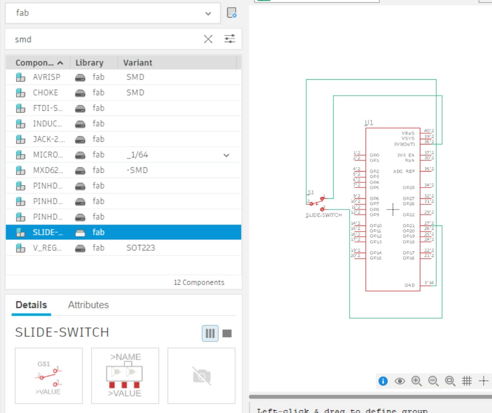

When routing I realized that there were holes in the slide-switch footprint but I simply designed my routes around them and will simply not mill them when I cut out my board.

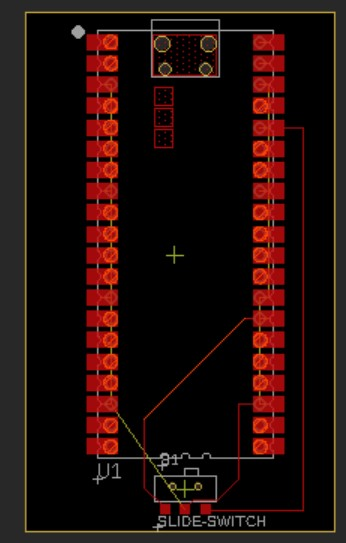

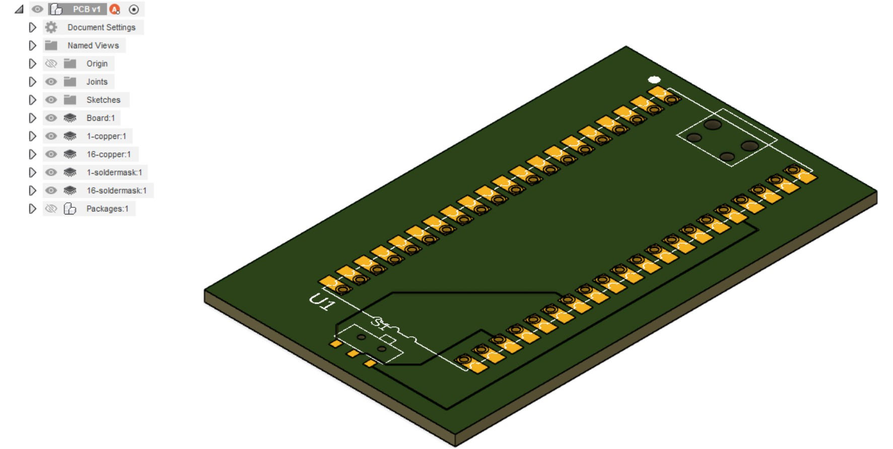

I was going to mill this board on the `Genmitsu 3020-Pro Max` milling machine, so I went to the `Manufacturing` workspace and created a new `Setup`. I selected a boxpoint on the *top* of the stock to where the x and y axes were hugging the stock. I selected all the traces and the top face of the board to be the `Model`, changed the `Stock Top Offset` to `0mm`.

I went back and made the traces larger in the layout then made sure to deselect `Solder Masks` after I pressed `Push to 3D PCB`.

I then created a `2D Contour`. When I selected the tool, I went to `Milling Tools (Metric)` and copied the smallest `Flat Endmill` I could find (`3mm Flat Endmill`). I then copied and pasted it into my `Local > Library` tools and right-clicked it and selected `Edit tool`. I changed the `Description` to `0.8mm Flat Endmill`, `Diameter` to `0.8mm` in the `Cutter` menu, `Spindle speed` to `12000 rpm` in the `Cutting data` menu, `Cutting feedrate` to `100 mm/min` in the same menu, and `Plunge feedrate` to `100 mm/min` in the same menu.I then pressed the blue `Accept` button. I selected the new tool and set the `Coolant` setting to `Disabled`. Then for the `Contour Selection` I pressed the `Chain` icon and selected one of the traces. I repeated this for the top outline of every trace I wanted milled, which took a fairly large amount of time.

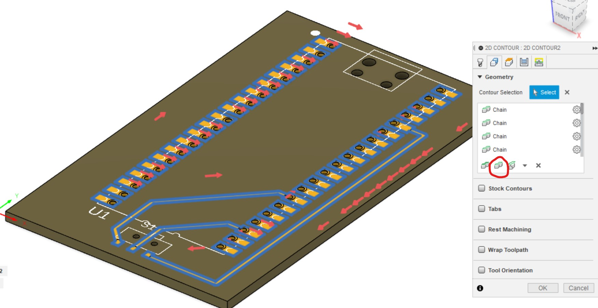

Next, under `Top Height` I set `Offset` to `0mm`. I checked the `Multiple Depths` option (scroll down under the `Passes` menu) and set `Maximum Roughing Stepdown` to `0.4mm`. I then pressed `OK` and activated the `2D Contour` tool again. I selected the bottom outline of the board and used all the same other settings as the previous contour.

As I zoomed in I noticed that there were no blue lines around the second and third pads of the slide-switch component so I had to go back to the layout editor, decrease the DRC rules for minimum distance between a pad and a wire, then move the middle route in between the two switch holes. I also made all of the traces thicker. I then `Pushed to 3D PCB` again and made sure to uncheck `Solder Mask`. I got errors under the `2D Contour`, so to recalculate I 

Finally I right-clicked the previously-created `Setup` in the hierarchy and pressed `Post Process`. I made sure `Post` was set to `Grbl / grbl` and pressed `Post`. 

The milling process was very smooth! I moved the z-axis high and zeroed it, then pressed `Send` to do an air cut. Everything looked OK so I moved the z-axis down until a piece of paper couldn't move in between the copper and the mill then zeroes the z-axis and moved the bit higher. I moved the x and y axes to the bottom left corner of the copper and zeroed them, as well. Then I pressed `Reset` and `Send`, and it worked! I occasionally vaccumed throughout the milling process.

<video src="../../../assets/images/stem/disability-forewarning-system/milling-timelapse-vid.mp4" controls="controls" style="max-width: 730px;">
</video>

Here's the result after rinsing in water!

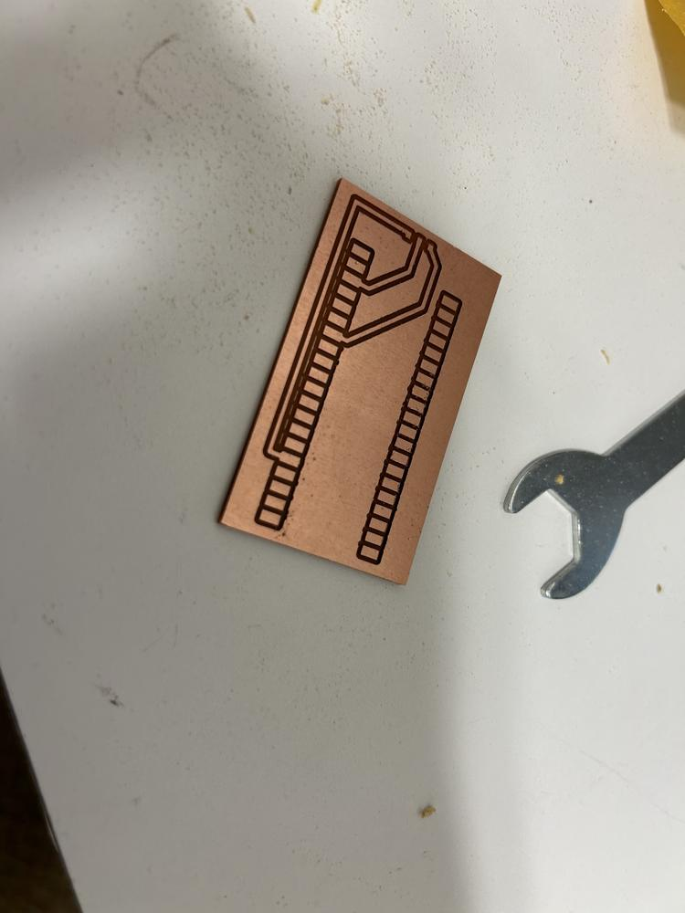

The soldering process was very smooth.

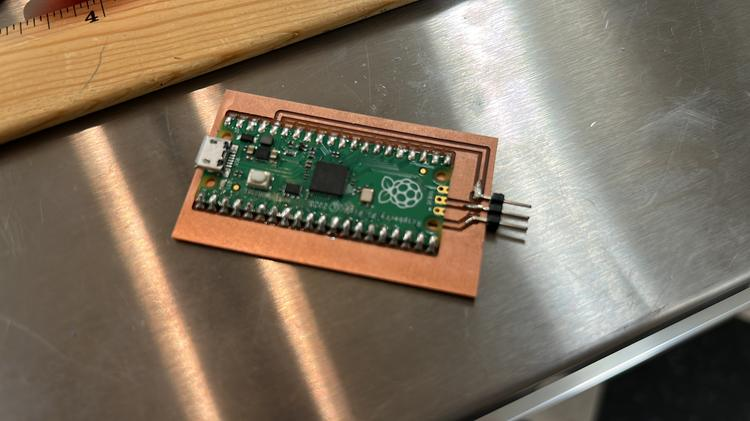

[](../../assets/images/stem/disability-forewarning-system/h-soldered-2.jpg)

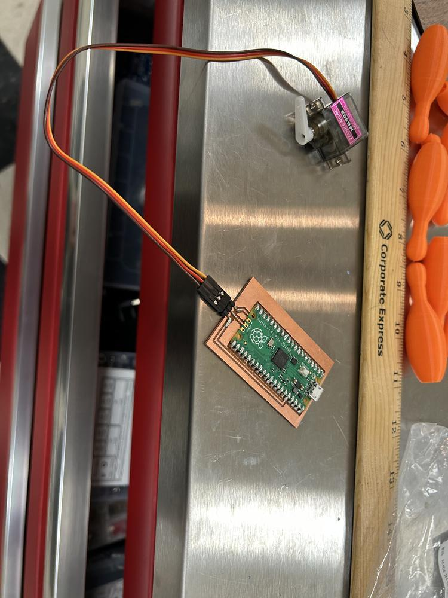

Unfortunately I realized that the order of the wires didn't match up with the servo so connecting it directly like this wouldn't work - I'll correct this in the next iteration of the design. For now I'll connect the servo like this.

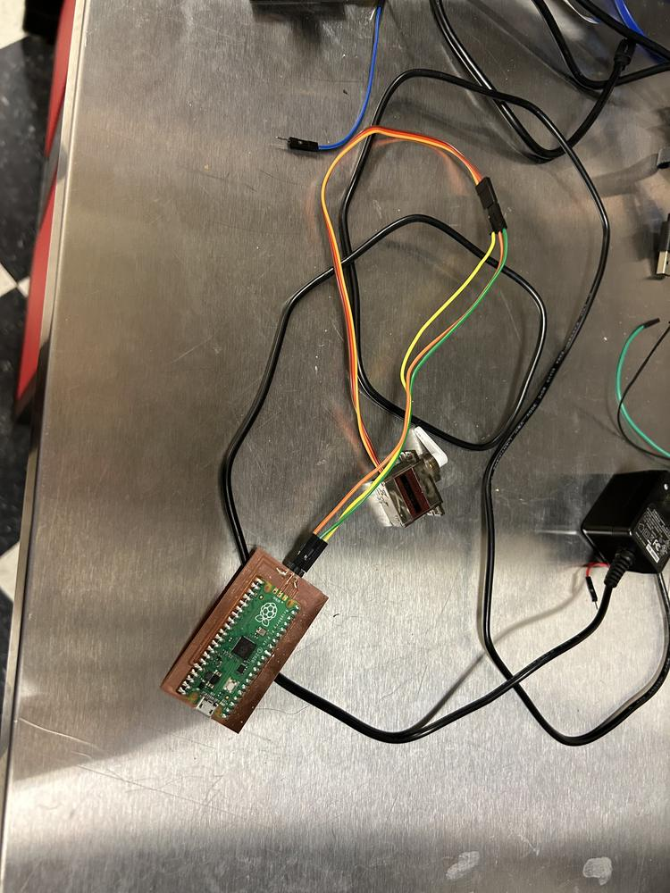

The next day when I took the board out of my bag to test I noticed the traces ripped! These were thinner than other traces I'd milled so that might be why.

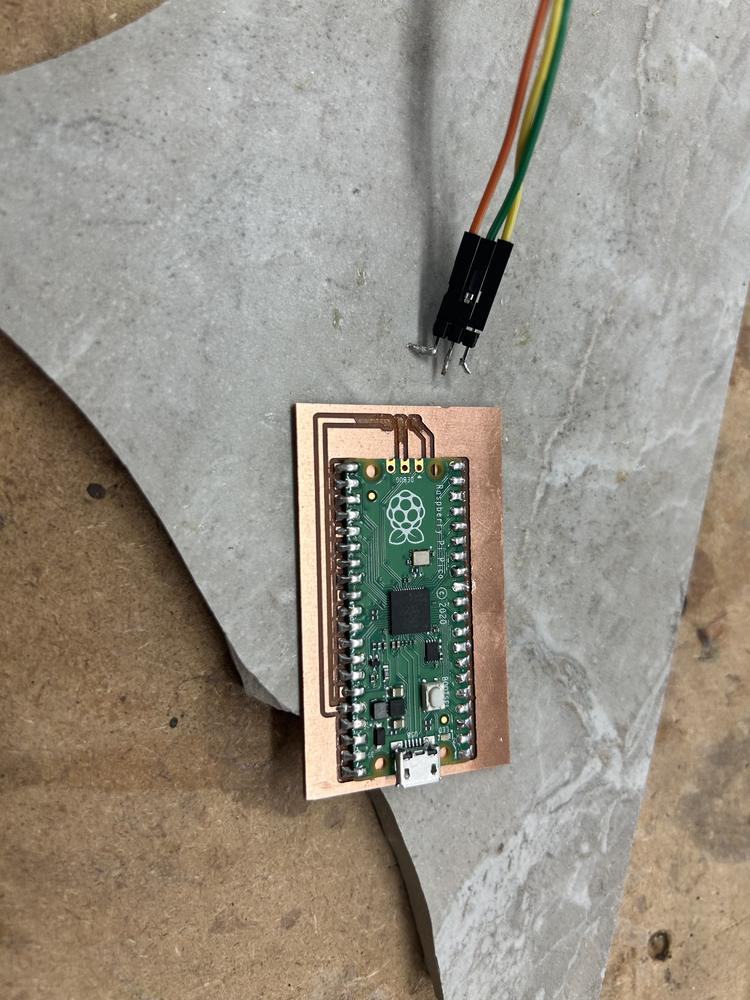

I tried resoldering with a lot of solder to reach what was left of the traces, but this failed.

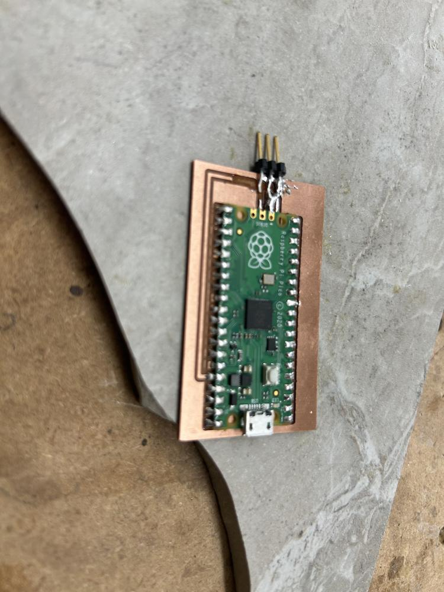

I then tried to desolder mistakes and failed again - I needed to make a new board.

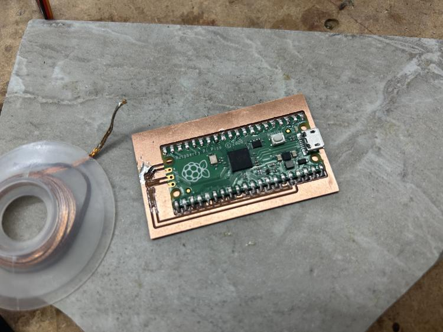

## Redesigning Again

Just to be sure everything will work OK I made the traces' width `50mil`.

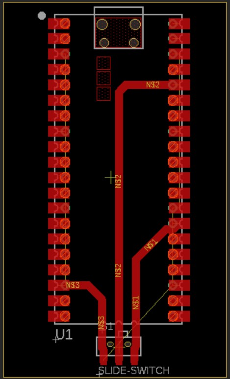

I milled the board, deburred it, washed it in soap and water, soldered it (very few connections to the pico so I could always unsolder if needed), and connected it to a servo motor. The only learning I had was that when I install a new tool I have to select the new tool button in the Bantam software then re-zero it. Also, I'd originally tried to only solder the corners and test the conections, but even though the other legs were touching, they weren't connected, so I soldered all of the legs that were connected to pin headers.

<video src="../../../assets/images/stem/disability-forewarning-system/n-milling-vid.mp4" controls="controls" style="max-width: 730px;">
</video>

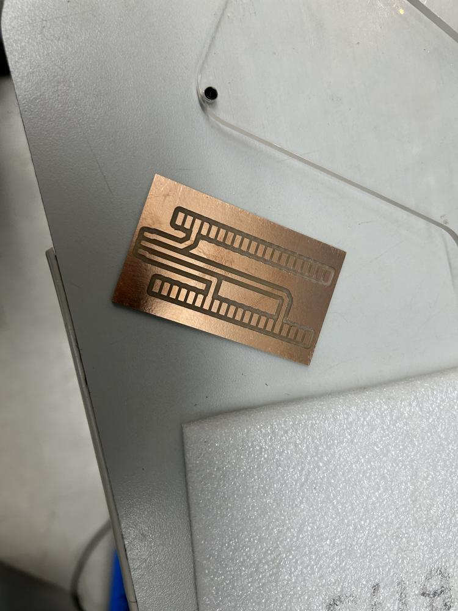

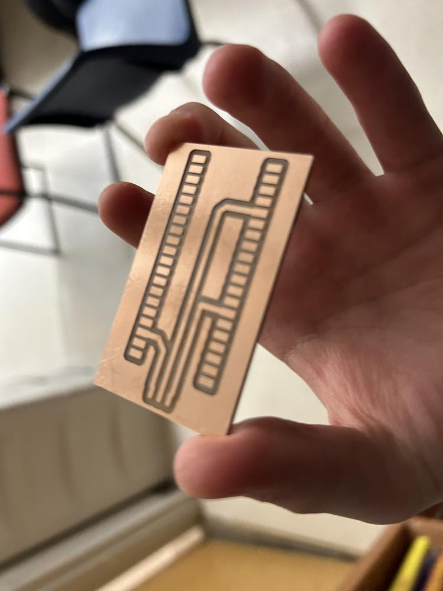

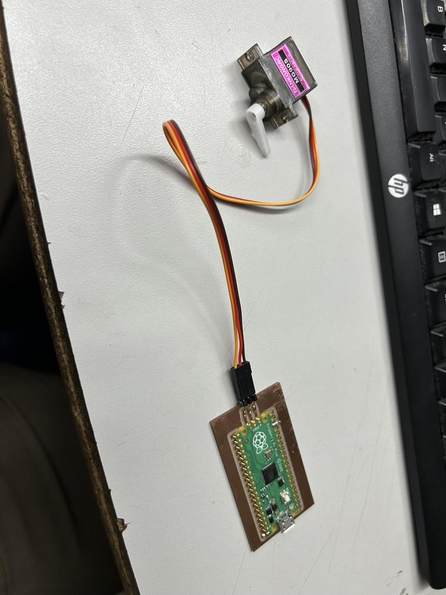

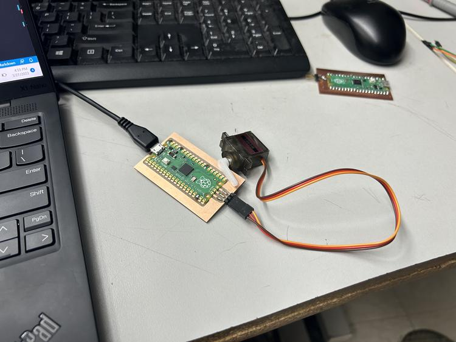

I tried plugging the board into my computer and nothing happened! I became very worried that I wasted another Pico, but tried a different chord, and it worked! I installed MicroPython using Thonny then ran the code from [this website](https://how2electronics.com/how-to-control-servo-motor-with-raspberry-pi-pico/) to operate a servo motor (I modified it to use `GPIO 21`). I copied and pasted both files into Thonny then saved them in the base directory of the Pico.

**servo.py**

```py
from machine import Pin, PWM
 
 
class Servo:
    """ A simple class for controlling a 9g servo with the Raspberry Pi Pico.
 
    Attributes:
 
        minVal: An integer denoting the minimum duty value for the servo motor.
 
        maxVal: An integer denoting the maximum duty value for the servo motor.
 
    """
 
    def __init__(self, pin: int or Pin or PWM, minVal=2500, maxVal=7500):
        """ Creates a new Servo Object.
 
        args:
 
            pin (int or machine.Pin or machine.PWM): Either an integer denoting the number of the GPIO pin or an already constructed Pin or PWM object that is connected to the servo.
 
            minVal (int): Optional, denotes the minimum duty value to be used for this servo.
 
            maxVal (int): Optional, denotes the maximum duty value to be used for this servo.
 
        """
 
        if isinstance(pin, int):
            pin = Pin(pin, Pin.OUT)
        if isinstance(pin, Pin):
            self.__pwm = PWM(pin)
        if isinstance(pin, PWM):
            self.__pwm = pin
        self.__pwm.freq(50)
        self.minVal = minVal
        self.maxVal = maxVal
 
    def deinit(self):
        """ Deinitializes the underlying PWM object.
 
        """
        self.__pwm.deinit()
 
    def goto(self, value: int):
        """ Moves the servo to the specified position.
 
        args:
 
            value (int): The position to move to, represented by a value from 0 to 1024 (inclusive).
 
        """
        if value < 0:
            value = 0
        if value > 1024:
            value = 1024
        delta = self.maxVal-self.minVal
        target = int(self.minVal + ((value / 1024) * delta))
        self.__pwm.duty_u16(target)
 
    def middle(self):
        """ Moves the servo to the middle.
        """
        self.goto(512)
 
    def free(self):
        """ Allows the servo to be moved freely.
        """
        self.__pwm.duty_u16(0)
```

**main.py**

```py
import utime
from servo import Servo
 
s1 = Servo(21)       # Servo pin is connected to GP21
 
def servo_Map(x, in_min, in_max, out_min, out_max):
    return (x - in_min) * (out_max - out_min) / (in_max - in_min) + out_min
 
def servo_Angle(angle):
    if angle < 0:
        angle = 0
    if angle > 180:
        angle = 180
    s1.goto(round(servo_Map(angle,0,180,0,1024))) # Convert range value to angle value
    
if __name__ == '__main__':
    while True:
        print("Turn left ...")
        for i in range(0,180,10):
            servo_Angle(i)
            utime.sleep(0.05)
        print("Turn right ...")
        for i in range(180,0,-10):
            servo_Angle(i)
            utime.sleep(0.05)
```

It worked! However, the servo movement was very jittery. To make sure this was a software problem and not a hardware problem, I modified `main.py`, and this reduced the jitteriness!

```py
import utime
from servo import Servo
 
s1 = Servo(21)       # Servo pin is connected to GP21
 
def servo_Map(x, in_min, in_max, out_min, out_max):
    return (x - in_min) * (out_max - out_min) / (in_max - in_min) + out_min
 
def servo_Angle(angle):
    if angle < 0:
        angle = 0
    if angle > 180:
        angle = 180
    s1.goto(round(servo_Map(angle,0,180,0,1024))) # Convert range value to angle value
    
if __name__ == '__main__':
    while True:
        print("Turn left ...")
        for i in range(0,180,1):
            servo_Angle(i)
            utime.sleep(0.001)
        print("Turn right ...")
        for i in range(180,0,-10):
            servo_Angle(i)
            utime.sleep(0.001)
```

I tried making it even more smooth, but the servo wouldn't turn `180 deg`, which I suspect is because `0.001sec` is too short of a time for the servo to turn.

I modified the code to the following to test a functionality more similar to what I'll actually use.

```py
import utime
from servo import Servo
 
s1 = Servo(21)       # Servo pin is connected to GP21
 
def servo_Map(x, in_min, in_max, out_min, out_max):
    return (x - in_min) * (out_max - out_min) / (in_max - in_min) + out_min
 
def servo_Angle(angle):
    if angle < 0:
        angle = 0
    if angle > 180:
        angle = 180
    s1.goto(round(servo_Map(angle,0,180,0,1024))) # Convert range value to angle value
    
if __name__ == '__main__':
    while True:
        try:
            servo_Angle(float(input(">> Angle? ")))
        except:
            print("Error: NaN")
```

This was a critical mistake! The program worked very well, and it moved up until `180 deg` and wouldn't go below `0 deg`, but I couldn't exit the program! Even when I tried to soft reboot in Thonny my program simply rejected the message since it wasn't a float. I tried re-entering bootloader mode and reinstalling MicroPython but the program simply started up again. Next I had an idea that if I installed a different version of MicroPython that wasn't compatible with the board it wouldn't know how to run my program, so I installed the Pico WH version of MicroPython and the program stopped! I then reinstalled the correct one and the problem was solved!

## Redesigning The Driver-Side Board

I want to redesign my board from [Week 8](https://fabacademy.org/2023/labs/charlotte/students/adam-stone/lessons/week8/fixing-eaglecad/) to where I can use one of the pins with a built in pulldown resistor, D4. I'll come back to this if I have time this week and if not in the future.

## A New Display

I accidentally ripped the ribbon cable when opening the box - I learned I should always unplug the HAT Driver from the ribbon cable when I put the display away! I ordered a new one.

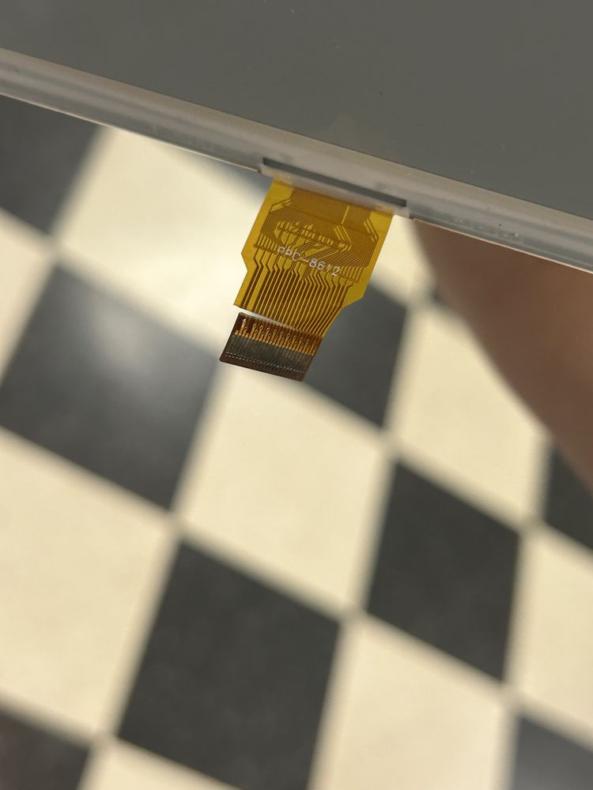

## 3.7" Display

### Code

**Pico_ePaper.py**

```py
# +++++++++++++++++++++++++++++++++++++++++++++++++++++++++++++++++++++++++++++++++
#
# LUTs have been copied from original example for Waveshare Pico e-Paper 3.7,
# which can be found here:
# https://github.com/waveshare/Pico_ePaper_Code/blob/main/python/Pico-ePaper-3.7.py
#
# +++++++++++++++++++++++++++++++++++++++++++++++++++++++++++++++++++++++++++++++++


EPD_3IN7_lut_4Gray_GC = bytes([
    0x2A, 0x06, 0x15, 0x00, 0x00, 0x00, 0x00, 0x00, 0x00, 0x00,  # 1
    0x28, 0x06, 0x14, 0x00, 0x00, 0x00, 0x00, 0x00, 0x00, 0x00,  # 2
    0x20, 0x06, 0x10, 0x00, 0x00, 0x00, 0x00, 0x00, 0x00, 0x00,  # 3
    0x14, 0x06, 0x28, 0x00, 0x00, 0x00, 0x00, 0x00, 0x00, 0x00,  # 4
    0x00, 0x00, 0x00, 0x00, 0x00, 0x00, 0x00, 0x00, 0x00, 0x00,  # 5
    0x00, 0x02, 0x02, 0x0A, 0x00, 0x00, 0x00, 0x08, 0x08, 0x02,  # 6
    0x00, 0x02, 0x02, 0x0A, 0x00, 0x00, 0x00, 0x00, 0x00, 0x00,  # 7
    0x00, 0x00, 0x00, 0x00, 0x00, 0x00, 0x00, 0x00, 0x00, 0x00,  # 8
    0x00, 0x00, 0x00, 0x00, 0x00, 0x00, 0x00, 0x00, 0x00, 0x00,  # 9
    0x00, 0x00, 0x00, 0x00, 0x00, 0x00, 0x00, 0x00, 0x00, 0x00,  # 10
    0x22, 0x22, 0x22, 0x22, 0x22
])

EPD_3IN7_lut_1Gray_GC = bytes([
    0x2A, 0x05, 0x00, 0x00, 0x00, 0x00, 0x00, 0x00, 0x00, 0x00,  # 1
    0x05, 0x2A, 0x00, 0x00, 0x00, 0x00, 0x00, 0x00, 0x00, 0x00,  # 2
    0x2A, 0x15, 0x00, 0x00, 0x00, 0x00, 0x00, 0x00, 0x00, 0x00,  # 3
    0x05, 0x0A, 0x00, 0x00, 0x00, 0x00, 0x00, 0x00, 0x00, 0x00,  # 4
    0x00, 0x00, 0x00, 0x00, 0x00, 0x00, 0x00, 0x00, 0x00, 0x00,  # 5
    0x00, 0x02, 0x03, 0x0A, 0x00, 0x02, 0x06, 0x0A, 0x05, 0x00,  # 6
    0x00, 0x00, 0x00, 0x00, 0x00, 0x00, 0x00, 0x00, 0x00, 0x00,  # 7
    0x00, 0x00, 0x00, 0x00, 0x00, 0x00, 0x00, 0x00, 0x00, 0x00,  # 8
    0x00, 0x00, 0x00, 0x00, 0x00, 0x00, 0x00, 0x00, 0x00, 0x00,  # 9
    0x00, 0x00, 0x00, 0x00, 0x00, 0x00, 0x00, 0x00, 0x00, 0x00,  # 10
    0x22, 0x22, 0x22, 0x22, 0x22
])

EPD_3IN7_lut_1Gray_DU = bytes([
    0x00, 0x00, 0x00, 0x00, 0x00, 0x00, 0x00, 0x00, 0x00, 0x00,  # 1
    0x01, 0x2A, 0x00, 0x00, 0x00, 0x00, 0x00, 0x00, 0x00, 0x00,
    0x0A, 0x55, 0x00, 0x00, 0x00, 0x00, 0x00, 0x00, 0x00, 0x00,  # 3
    0x00, 0x00, 0x00, 0x00, 0x00, 0x00, 0x00, 0x00, 0x00, 0x00,
    0x00, 0x00, 0x00, 0x00, 0x00, 0x00, 0x00, 0x00, 0x00, 0x00,  # 5
    0x00, 0x00, 0x05, 0x05, 0x00, 0x05, 0x03, 0x05, 0x05, 0x00,
    0x00, 0x00, 0x00, 0x00, 0x00, 0x00, 0x00, 0x00, 0x00, 0x00,  # 7
    0x00, 0x00, 0x00, 0x00, 0x00, 0x00, 0x00, 0x00, 0x00, 0x00,
    0x00, 0x00, 0x00, 0x00, 0x00, 0x00, 0x00, 0x00, 0x00, 0x00,  # 9
    0x00, 0x00, 0x00, 0x00, 0x00, 0x00, 0x00, 0x00, 0x00, 0x00,
    0x22, 0x22, 0x22, 0x22, 0x22
])

EPD_3IN7_lut_1Gray_A2 = bytes([
    0x00, 0x00, 0x00, 0x00, 0x00, 0x00, 0x00, 0x00, 0x00, 0x00,  # 1
    0x0A, 0x00, 0x00, 0x00, 0x00, 0x00, 0x00, 0x00, 0x00, 0x00,  # 2
    0x05, 0x00, 0x00, 0x00, 0x00, 0x00, 0x00, 0x00, 0x00, 0x00,  # 3
    0x00, 0x00, 0x00, 0x00, 0x00, 0x00, 0x00, 0x00, 0x00, 0x00,  # 4
    0x00, 0x00, 0x00, 0x00, 0x00, 0x00, 0x00, 0x00, 0x00, 0x00,  # 5
    0x00, 0x00, 0x03, 0x05, 0x00, 0x00, 0x00, 0x00, 0x00, 0x00,  # 6
    0x00, 0x00, 0x00, 0x00, 0x00, 0x00, 0x00, 0x00, 0x00, 0x00,  # 7
    0x00, 0x00, 0x00, 0x00, 0x00, 0x00, 0x00, 0x00, 0x00, 0x00,  # 8
    0x00, 0x00, 0x00, 0x00, 0x00, 0x00, 0x00, 0x00, 0x00, 0x00,  # 9
    0x00, 0x00, 0x00, 0x00, 0x00, 0x00, 0x00, 0x00, 0x00, 0x00,  # 10
    0x22, 0x22, 0x22, 0x22, 0x22
])
# +++++++++++++++++++++++++++++++++++++++++++++++++++++++++++++++++++++++++++++++++

from machine import Pin
import framebuf
from utime import ticks_ms, ticks_diff, sleep_ms
from ustruct import pack
import gc
import micropython


def profile(func):
    def wrapper(*args, **kwargs):
        gc.collect()
        start_mem = gc.mem_free()
        start_t = ticks_ms()
        func(*args, **kwargs)
        fin_t = ticks_ms()
        fin_mem = gc.mem_free()
        print(f'{func.__name__} took: {ticks_diff(fin_t, start_t)} ms to finish')
        print(f'{func.__name__} used around {start_mem - fin_mem} B of memory')

    return wrapper


class EinkBase:
    black = 0b00
    white = 0b11
    darkgray = 0b01
    lightgray = 0b10

    RAM_BW = 0b01
    RAM_RED = 0b10
    RAM_RBW = 0b11

    def __init__(self, rotation=0, cs_pin=None, dc_pin=None, reset_pin=None, busy_pin=None):
        if rotation == 0 or rotation == 180:
            self.width = 280
            self.height = 480
            buf_format = framebuf.MONO_HLSB
            self._horizontal = False
        elif rotation == 90 or rotation == 270:
            self.width = 480
            self.height = 280
            buf_format = framebuf.MONO_VLSB
            self._horizontal = True
        else:
            raise ValueError(
                f"Incorrect rotation selected ({rotation}). Valid values: 0, 90, 180 and 270.")

        self._rotation = rotation

        if reset_pin is None:
            self._rst = Pin(12, Pin.OUT, value=0)
        else:
            self._rst = reset_pin
            self._rst.init(Pin.OUT, value=0)

        if dc_pin is None:
            self._dc = Pin(8, Pin.OUT, value=0)
        else:
            self._dc = dc_pin
            self._dc.init(Pin.OUT, value=0)

        if cs_pin is None:
            self._cs = Pin(9, Pin.OUT, value=1)
        else:
            self._cs = cs_pin
            self._cs.init(Pin.OUT, value=1)

        if busy_pin is None:
            self._busy = Pin(13, Pin.IN, Pin.PULL_UP)
        else:
            self._busy = busy_pin
            self._busy.init(Pin.IN)

        self._luts = {0: EPD_3IN7_lut_4Gray_GC,
                      1: EPD_3IN7_lut_1Gray_GC,
                      2: EPD_3IN7_lut_1Gray_DU,
                      3: EPD_3IN7_lut_1Gray_A2}

        self._buffer_bw = bytearray(self.width * self.height // 8)
        self._buffer_red = bytearray(self.width * self.height // 8)
        self._bw = framebuf.FrameBuffer(self._buffer_bw, self.width, self.height, buf_format)
        self._red = framebuf.FrameBuffer(self._buffer_red, self.width, self.height, buf_format)

        self.fill()

        self._init_disp()
        sleep_ms(500)

    def _reset(self):
        self._rst(1)
        sleep_ms(30)
        self._rst(0)
        sleep_ms(3)
        self._rst(1)
        sleep_ms(30)

    def _send_command(self, command):
        raise NotImplementedError

    def _send_data(self, data):
        raise NotImplementedError

    def _send(self, command, data):
        self._send_command(command)
        self._send_data(data)

    def _read_busy(self):
        while self._busy.value() == 1:
            sleep_ms(10)
        sleep_ms(200)

    def _load_LUT(self, lut=0):
        self._send(0x32, self._luts[lut])

    def _set_cursor(self, x, y):
        self._send(0x4e, pack("h", x))
        self._send(0x4f, pack("h", y))

    def _set_window(self, start_x, end_x, start_y, end_y):
        self._send(0x44, pack("2h", start_x, end_x))
        self._send(0x45, pack("2h", start_y, end_y))

    def _clear_ram(self, bw=True, red=True):
        if red:
            self._send(0x46, 0xf7)
            self._read_busy()
        if bw:
            self._send(0x47, 0xf7)
            self._read_busy()

    def _init_disp(self):
        # HW reset.
        self._reset()

        # SW reset.
        self._send_command(0x12)
        sleep_ms(300)

        # Clear BW and RED RAMs.
        self._clear_ram()

        # Set gate number.
        self._send(0x01, pack("hB", 479, 0))

        # Set gate voltage.
        self._send(0x03, 0x00)

        # Set source voltage.
        self._send(0x04, pack("3B", 0x41, 0xa8, 0x32))

        # Set Data Entry mode.
        if self._rotation == 0:
            seq = 0x03
        elif self._rotation == 180:
            seq = 0x00
        elif self._rotation == 90:
            seq = 0x06
        elif self._rotation == 270:
            seq = 0x05
        else:
            raise ValueError(f"Incorrect rotation selected")

        self._send(0x11, seq)

        # Set border.
        self._send(0x3c, 0x03)

        # Booster Soft-start Control.
        self._send(0x0c, pack("5B", 0xae, 0xc7, 0xc3, 0xc0, 0xc0))

        # Internal sensor on.
        self._send(0x18, 0x80)

        # Set VCOM.
        self._send(0x2c, 0x44)

        # Set window.
        if self._rotation == 0:
            self._set_window(0, self.width - 1, 0, self.height - 1)
        elif self._rotation == 180:
            self._set_window(self.width - 1, 0, self.height - 1, 0)
        elif self._rotation == 90:
            self._set_window(self.height - 1, 0, 0, self.width - 1)
        elif self._rotation == 270:
            self._set_window(0, self.height - 1, self.width - 1, 0)
        else:
            raise ValueError(f"Incorrect rotation selected")

        # Set Display Update Control 2
        self._send(0x22, 0xcf)

    # --------------------------------------------------------
    # Public methods.
    # --------------------------------------------------------

    def show(self, lut=0):
        if self._rotation == 0:
            self._set_cursor(0, 0)
        elif self._rotation == 180:
            self._set_cursor(self.width - 1, self.height - 1)
        elif self._rotation == 90:
            self._set_cursor(self.height - 1, 0)
        else:
            self._set_cursor(0, self.width - 1)

    def sleep(self):
        self._send(0x10, 0x03)

    # --------------------------------------------------------
    # Drawing routines (wrappers for FrameBuffer methods).
    # --------------------------------------------------------

    def fill(self, c=white):
        self._bw.fill(c & 1)
        self._red.fill(c >> 1)

    def pixel(self, x, y, c=black):
        self._bw.pixel(x, y, c & 1)
        self._red.pixel(x, y, c >> 1)

    def hline(self, x, y, w, c=black):
        self._bw.hline(x, y, w, c & 1)
        self._red.hline(x, y, w, c >> 1)

    def vline(self, x, y, h, c=black):
        self._bw.vline(x, y, h, c & 1)
        self._red.vline(x, y, h, c >> 1)

    def line(self, x1, y1, x2, y2, c=black):
        self._bw.line(x1, y1, x2, y2, c & 1)
        self._red.line(x1, y1, x2, y2, c >> 1)

    def rect(self, x, y, w, h, c=black):
        self._bw.rect(x, y, w, h, c & 1)
        self._red.rect(x, y, w, h, c >> 1)

    def fill_rect(self, x, y, w, h, c=black):
        self._bw.fill_rect(x, y, w, h, c & 1)
        self._red.fill_rect(x, y, w, h, c >> 1)

    def text(self, text, x, y, c=black):
        self._bw.text(text, x, y, c & 1)
        self._red.text(text, x, y, c >> 1)

    def blit(self, fbuf, x, y, key=-1, palette=None, ram=RAM_RBW):
        if ram & 1 == 1:
            self._bw.blit(fbuf, x, y, key, palette)
        if (ram >> 1) & 1 == 1:
            self._red.blit(fbuf, x, y, key, palette)


class Eink(EinkBase):
    from machine import SPI

    def __init__(self, spi=None, *args, **kwargs):
        if spi is None:
            self._spi = self.SPI(1, baudrate=20_000_000)
        else:
            self._spi = spi
        super(Eink, self).__init__(*args, **kwargs)

    def _send_command(self, command):
        self._dc(0)
        self._cs(0)
        if isinstance(command, int):
            self._spi.write(bytes([command]))
        elif isinstance(command, (bytes, bytearray)):
            self._spi.write(command)
        else:
            raise ValueError  # For now
        self._cs(1)

    def _send_data(self, data):
        self._dc(1)
        self._cs(0)
        if isinstance(data, int):
            self._spi.write(bytes([data]))
        elif isinstance(data, (bytes, bytearray)):
            self._spi.write(data)
        else:
            raise ValueError  # For now
        self._cs(1)

    @micropython.viper
    def _reverse_bits(self, num: int) -> int:
        result = 0
        for i in range(8):
            result = (result << 1) | ((num >> i) & 1)
        return result

    # --------------------------------------------------------
    # Public methods.
    # --------------------------------------------------------

    @profile
    def show(self, lut=0):
        super().show()
        # Load BW buffer to BW RAM and RED buffer to RED RAM.
        if not self._horizontal:
            self._send(0x24, self._buffer_bw)
            self._send(0x26, self._buffer_red)
        else:
            self._send(0x24, bytes(map(self._reverse_bits, self._buffer_bw)))
            self._send(0x26, bytes(map(self._reverse_bits, self._buffer_red)))

        self._load_LUT(lut)
        self._send_command(0x20)
        self._read_busy()


class EinkPIO(EinkBase):
    from machine import mem32

    def __init__(self, sm_num=0, dma=5, *args, **kwargs):
        self._sm_num = sm_num
        self._dma = int(dma * 0x40 + 0x50000030)
        self._sm = None
        self._sm_shiftctrl = (0x502000d0 + 0x100000 * (self._sm_num // 4)
                              + 0x18 * (self._sm_num % 4))
        self._dma_write_addr = (0x50200010 + 0x100000 * (self._sm_num // 4)
                                + 0x4 * (self._sm_num % 4))
        dreq = self._sm_num % 4 + 8 * (self._sm_num // 4)
        self._dma_ctrl = dreq << 15 | 1 << 4 | 1
        self._pio_setup()
        super(EinkPIO, self).__init__(*args, **kwargs)

    def _pio_setup(self):
        from rp2 import asm_pio, PIO, StateMachine

        @asm_pio(out_init=PIO.OUT_LOW,
                 sideset_init=PIO.OUT_LOW,
                 autopull=True,
                 pull_thresh=8,
                 out_shiftdir=PIO.SHIFT_LEFT)
        def pio_serial_tx():
            out(pins, 1).side(0)
            nop().side(1)

        self._sm = StateMachine(self._sm_num, pio_serial_tx, freq=40_000_000,
                                sideset_base=Pin(10), out_base=Pin(11))
        self._sm.active(1)

    def _reversed_output(self):
        self.mem32[self._sm_shiftctrl + 0x2000] = 1 << 19

    def _normal_output(self):
        self.mem32[self._sm_shiftctrl + 0x3000] = 1 << 19

    def _send_command(self, command):
        self._dc(0)
        self._cs(0)
        if isinstance(command, int):
            self._sm.put(command, 24)
        elif isinstance(command, (bytes, bytearray)):
            for cmd in command:
                self._sm.put(cmd, 24)
        else:
            raise ValueError
        self._cs(1)

    def _send_data(self, data):
        self._dc(1)
        self._cs(0)
        if isinstance(data, int):
            self._sm.put(data, 24)
        elif isinstance(data, (bytes, bytearray)):
            for cmd in data:
                self._sm.put(cmd, 24)
        else:
            raise ValueError
        self._cs(1)

    @micropython.viper
    def _dma_start(self, buffer):
        dma_ptr = ptr32(self._dma)
        dma_ptr[0] = int(self._dma_ctrl)
        dma_ptr[1] = int(self._dma_write_addr)
        dma_ptr[2] = int(len(buffer))
        dma_ptr[3] = int(ptr32(buffer))

    @micropython.viper
    def _check_dma_busy(self, a: ptr32) -> int:
        return (a[0] >> 24) & 1

    def _send_buffer(self, buffer):
        if self._horizontal:
            self._reversed_output()

        self._dc(1)
        self._cs(0)

        self._dma_start(buffer)
        dma_ctrl = self._dma

        start = ticks_ms()
        while self._check_dma_busy(dma_ctrl) and ticks_diff(ticks_ms(), start) < 5000:
            pass
        self._cs(1)
        if ticks_diff(ticks_ms(), start) >= 5000:
            print('loading data took too long')

        if self._horizontal:
            self._normal_output()

    # --------------------------------------------------------
    # Public methods.
    # --------------------------------------------------------

    @profile
    def show(self, lut=0):
        super().show()
        self._send_command(0x24)
        self._send_buffer(self._buffer_bw)
        self._send_command(0x26)
        self._send_buffer(self._buffer_red)

        self._load_LUT(lut)
        self._send_command(0x20)
        self._read_busy()


if __name__ == "__main__":
    epd = EinkPIO(rotation=270)
    epd.fill()

    epd.text("test", 10, 10)
    epd.fill_rect(0, 19, 52, 10, epd.lightgray)
    epd.text("test", 10, 20, epd.darkgray)
    epd.fill_rect(0, 29, 52, 10, epd.darkgray)
    epd.text("test", 10, 30, epd.lightgray)
    epd.fill_rect(0, 39, 52, 10)
    epd.text("test", 10, 40, epd.white)
    epd.rect(0, 8, 52, 41)

    epd.hline(5, 60, 50)
    epd.hline(5, 160, 50)
    epd.vline(5, 60, 100)
    epd.vline(55, 60, 100)
    epd.line(5, 60, 55, 160)
    epd.line(55, 60, 5, 160)
    epd.show()

    sleep_ms(5000)

    epd.fill_rect(100, 20, 50, 50)
    epd.fill_rect(100, 70, 50, 50, epd.darkgray)
    epd.fill_rect(100, 120, 50, 50, epd.lightgray)
    epd.fill_rect(100, 170, 50, 50)
    epd.rect(100, 20, 50, 200)
    epd.show()

    epd.sleep()
```

**IMG_0182_gs_d.py**

```py
width = 184
height = 135
img_bw = bytearray(b'\x02\x92\xaa\xaa\xf7~\x01\xf0\x02x\x00A?\xf8\x0b\x11\x00\x14"G\xc2\xa9\x0fQJUU/\xbc\x03\xbc\x02x \x01\xff\xe4\x058\x04>\x087\x82\x14\x0fP\xe1UT\xae\xc2\x01\xbfP\xf0\x00a\xb0\xe1`\x1d\x00\x15\x10\x1f\xb6\x00\x0f\x15\x12\x14\xaa\x15\xb9\xf7\xff\xfap\x00@\xf0\xe6 ?\x80\x84\n\x00\xac\x08\x0f\x90XUUJ\xef\xff\xff\xf0w\x88\x00i\xf9\x00\x7f\xc3e\x0f\x01r`\x0f\xa8\xaa\xaa\xaa\xab7\xf3\xf9\xf0/\xc1\x00`\xdf\xad\xff\xf10\xdf\xc0\xaa\x90/D\x15J\xabA\xd5\xc1\xaa\xd1o\x80\x048-\xad\xfe\xf8r\xde\xe0\xb1@_\xa9J%UJk\xc3\x97\xb0\x7f\x00\x00\x00\xdfO\xe0?Z\x0f\xe0j\x00\x0fT\xa1\x95UP\xaa\xe2p\xf0\xf0\x00\x08\x00\xfe\x9c\xf9\x0f\xfe,\xb1\xd4\x80/R\x01A*\xa8U\x7f\xf0{\xc0\x80P\x01\xfa\xc6<\x07\x97>\xb1J \x1fU\x00B\x15TR\xff\xfe\x08\xdd\x1a\x00\x13\xf6\x0b\n\x07\xbe48\xe8\x00\x0fZ\x00\x92\xaa\xa0\xa2\x9f\xff\x07\x1c\x89\x04\x07\xfd\xa9\x00\x07[\xabxP@\x0f*\x80AJ\x98\x14\xaf\xff\x00}\x10\x00\x05\xf5\xa0\n\x0f\x0fGYu\xa0\x0fUQT\xa5TE_\xff\xc0\x02`\x90\x0b\xdb\x04\x04\x0fOS\xb0\x8a\x80\x0f\x15()U*\x14\x0f\xff\xf0\x80\xea\x1c\x17\xbf\xb0\x00\xbfO\xafP\x13\x00\x0fJ\x85(ET\x02\x8f\xff\xe2\xaa|\x84\xf6\xfe!0\xc7\x17\x93\xc1)\x00\x0f%@T\xa9J\x80\xbf\xff\xfdZ\x1d\xc1\xa7\xfdQ\xc0\x02\x10w\xea(\x00\x0f\x15@(T\xaaP\xf7\xff\xfdI\x0f\xbe\xeb\xfd$@\x00\x14\x0f\xd0 \x00O\x08\xa1\n\xa2\xa5@\xdf\xff\xefe\x03\xff\xc1\xf6\x98\xc0\x10\x10\x07\xf0)\x02\x0f\x05T\nUT#\xff\xff\xef\xb5\x7f\xcf\xc1\xfa| \x00\x00\'\x80\x80\x00\x0fJ\xa8\x15(\xa8\x87\x8f\xbfQ\xcf\xf7\xff\x00H\x9d\x08\x00\x00/\xa0@\x00\x0f%Q\x02\x95\x00(\x07\xda\x80G\xdb\xe4\xc0eq\x06\x00\x8d\x1f\x1a\x00\x8a\x0fP\xaa\x15H\x100\x03\xc6\x00\xc7\xfd\xb6@\xd0\xf4\x04 \xe8?`\x00\x00\x0f\n\xa9\x01T\x00 \x03\xeb\xc0#\xf5WTEt\x00\xb0p\x7fP\x00\x00_)J\x80(\x00j\x83\xf3\xf0G\xe8\xbe\xe8\x00\x04\x00|\xfd\xff@\x00\x00\xaf\x04)$\x05\x00\xff\x83\xf1\xf0\xc2\xf5\xfa\x04\x01$\x02\x7f\xff\xff\x80\x01\x00O\x05J\x90\x00C\xbf\x03\xf9\xfe\x95\xb5\x89\t\x00\x06\x04\xbf\xff\xff\x00\x00 \x0f \xa2D\x00\x07\x01\x05\xdc\xff\xc2\xfb\x80\x03\x00\x04!_\xff\xfe\x00\x02\xb5\x0fA \xa2\x00\x0f@\x03\xef\xfeUq\xc0 `\x06\x00\x04\x7f\xfe\xa0\x05l\x0f\x04\x12@\x00\x7f\xc0\x01\xfb\xfez\xf7\x80$\x00\x04\x00\x05\x8f\xfc\x00\x1f\xb8\x0f\x12@ \xa0\xfb\xf0\x01\xbf\xf1\x7f{\x80\x08\x00\x04\x00\x05\xf3\xf8\x00\x05\x00_H\x00\x00\x03\xff\xfc\x00\xbf\xbc~\xbf\xc0P\x00\x04\x01\x80\xd8\xf5\x00\x02\x03\xef \x00\x00G\xff\xfc\x00\xff\xee\xff_\xc0\x10\x00\x08\x02\x01\xf4\xfe\x90\x00\n\x0f\x00E\x00\x07\xff\xff\x01\x7f\xf3\xff_\xc0\xaa\x00\x08\x06\x01\xfbm@\x00(\x0f@\x00@\x03\xff\xff\x00\xfe\xb7\xff\xff\xa6T\x00\x08\x06\x01\xd81 \x00\xc0\x0f\x00\n\x00\x00\xff\xff\x80\xfek\xff\xf5\xe2u\x00\x18\x00C\xdb@\x80\x01 \x0f\x80 \x00\x00?\xffA\xcf_\xf9\xffd7\x00\x10\x00\x01\xf6\x00\x10\x04\x10\x0f@\x08\x00\x00?\xff\xa0\xe3\xdf\xfa\xef\xb0.\x00\x10\x00a\xfc\x02 \x08\x10\x0f@ \x00\x00_\xff@B?\x7f\xf7`\x12\x80\x10\x00\xab\xd8\x01\x00\x10(\x0f@\x00\x00\x00\x03\xfd H=\xfeg\x10\x05\x000\x7f\xffQ@\x80\x00,/ \x00\x00\x01\x07\xcb\xb5`\x1f\xfbj@\x00\x00\x10?\xd7\xe0\x02\x00\x00\xb7\xff \x00\x00\x01_\xbdz1\x7f\xff\xdf`\x00\x007\xdf8\x90\x00\x90\x80\xdf\xff\x00\x00\x00\x00\xff\xff\xdc\xb5_\xbc\xeb\xc0\x0f\x00\'\x83@\x00\x00\x00\x10\x16\xdf\x00\x08\x00\x00C\xc5\x8e\xbd\x7f\xf7\xff\xa0\'\x00/\x07\xf1\x01\n\x08\x00\x05\xef\x10\x00\x00\x00\xa7\xfcg\x8f\xf6\xf2\x7f\xc0G\x00 \x1f\xfc\x00%\x00\x00\x00\x0f\x00\x00\x03\xc0\xc0\xed;\xa7\xff7\x0f\xc0g@aG\xfe\x10@\x82\x00\x00\x0f\x00\x00/\xb0\xff\xae\xcf\x8b\xbb\xb1\xc7\xe0?\x80 ?\xccP\x1aP\x00\x00\x1f@\x00g\xf3\xff\xffRB\x1b\xd7\x82@7\x00h\x7f\xe6\x04\x81\x08\x00\x00_\x00\x00w\xe7\xfb\xdd\xa4\x00\x0f\xcbR`\x00\x00@?\xff\xba A\x19\xfa\xbf\x00\x00\xc7\xed~\xa5\xf4\x00\x0e\xf9\xf2@\x00\x00@?\xfe\xc5\x03\xcb\x7f\xfe\xbf\x00\x0b\xe3\xe8\x7f\x92\xb8\x00E\x7f\xf6 \x00\x00O\xff\xfb\x90\n\xc3\xff\xff\xff\x00\x07\xfd\xcc\x0f\xe4\xb8\x01f\x05\xd6`\x00\x00\x9f\xff\xfdm\x17\xd7\xff\xff\xff\x00\x07\xff\x83\xd7\xf04!\x97\x80\x7f\xc0\x00\x00\x1f\xff\xea\xa4G\xc7\xff\xff\x7f\x00\x0f\xeb\xd5\xffp\n!G \x1f\xe0\x00\x00}\xff\xc9X\xbf\xd7\xff\xff\xff\x00\x0f\xff\xfa\x99\xd0\t\x05S\xc0\xc7\xc0\x00\x00\xcf\xfc\xca\xf9\xcf\xc7\xff\xff\xff\x00?\xdf\xe0\x06\xe8\x00\x04\xa3\xb6\x1f\xc0\x00\x00\x9f\x10\xff\xf3\xff\xc7\xff\xff\xff\x00?\n\x00\xbf\xfc\x00@\xd1\xe9S\xe0\x00\x00\xbf \xff\xf3\xff\x87\xff\xff\xff\x00\x00\x00\x0f\xff\xfc\x04\x10\xa9\xd6\xac`\x00\x00?B\x7f\xe7\xff\x87\xff\xff\xff\x00\x00\x01\x7f\xfd>\x00\x00\xc1\xfe\xe60\x00\x00\xbf!\xff\xe7\xff\x97\xef\xff\xff\x00\x00\x1f\xff\xe0\x1e\x00\x82 \xef\xbc0\x00\x00\\\xa2\x7f\xe7\xff\x07\xcf\xff\xff\x00\x02\xff\xff\xa8\x9f\x00\x00\x01#\xef\xf8\x00\x01`\xe0\x7f\xf3\xff\x17\xdf\xff\xff\x00\xaf\xff\xeaU/\x00 \x04\xaf\xb5\xbf\x00\x00\x10d\xff\xe1\xff\x07\x9e?\xff\x06\xff\xfe\xaa\x88\x9f\x82\x00\x07\xf3\xff\x0f\xc0\x00L\xe4\xff\xe6:\x83\x9c\x7f\xff?\xff\xf9\x00%O\x80\x82\x0b\xf5\xfe\x03\xe0\x00\x06/\xff\x8e\x02\xa1\x00\xbf\xff\xff\xff\xf5P\x00/\x80\x00\x05\xf8\xfe\x03\xe0@B-\xfeq\xc9\xacp\x7f\xff\xff\xff\xa9\x04\x80\x87\xc8\x00\x03\xf0?\t\xa2\x00\x11\r\xee\xc09~x\xff\xff\xff\xda\xa4\xa2\x00\x0b\xc0\x00\x01\xfa\x15\x18!@\x01\xc3\xcc0yv\xb3\xff\xff\xfdm)\x10@\x07\xc0\x00\x00\xfc!RA\x80\x00r\x88\xc0\x10B>\xff\xcf\xf5\x15B\x04\x08\x01` \x03>\xb1\x87\xc2@\x00b\xf9\xff\xfd\x80\x1c\xff\xbf\xaa\xca(Q\x00\x01P\x00\x03\x8f\x90\xcd\x06\x80\x00 \r\xf8 \x01@<O\xaa\xa1B\x00\x00\x01`\x00\x03\xc7\xea\x18\n\x80\x004\xfd\x80\x03\x90\x03\x88\x9f\xd5T\x08\x90\x00\x00\xb0@\x07\xe7\xe4\xfdE\x80\x00\x15\xbc\x1c\x12\xdc\x08>\xbfUB\x80\x02\x00\x01x\x00\x06\xf9\xf1~\xb3\x00\x00\x01\xd8\xfe_\xc8\x18\xc0\x7f\xaa\xa8\x00\x00\x00\x00\\\x00\n\xf8\xfc\xfe\xfa\x00\x00\x08\xfd\xfe\xff\xa0\x12\x00\x0fT\x92\x10\x00\x00\x00 \x00\x11\xfc??l\x00\x00\x00\x07\xff\xee\xbc \x80\x1f\xa2H\x80\x00\x00\x00\x1c\x00\x02\xfe\x8d\x7f\xf4\x00\x00\x06\xc9\xbf\xf6\x94\x10\x81\x1f\xad"\x02\x00\x00\x00\x06\x00&~\xe0\xff\xf8\x00\x00\x02\xfe\xfe\xebh \x80\xaf\xb2\x08\x00@\x00\x00\n\x00\x17\x7f\x82\xff\xf0\x00\x00\x02~?\xea\xf8\x01\x00\x1fI\x00\x00\x00\x00\x00\x07\x00G\xff{\xf3\xe0\x00\x00\x01~\x04\xb5\xa8\x00\x80O\xaa\xa9\x00\x00\x00\x00\x01\x80\'g\xdaB\xda\x00\x04\x01>\x07\x1a\xa0\x01\x00OTD\xa0\x00\x00\x00\x00\xa2\x0f\xf8\x80\x00=@\x06\x00\x9fO\x00\xa8\x02\x00\x8f\xadU(\x00\x00\x00\x10P\x8f\xbe \x88}\x00\x02\x00\x8b\x06\x1e\x14\x00\x00\x0fUT\x92\x00\x10\x00HP\x9f\xbe\x04q\xfe\x00\x04\x00\xf5\x06\xff\x8a\x14\x01\x8f\xb5R\xa0 \x00* \x08\x9f\xae\x01\xc2\xfe\x80\x00\x00_\xc1\xff\xf1\xb4\x01\x8fT\x8a\t\x00\x00\x01\x15\x00?\x9a\x0f\xf8\xfe\x00\x00\x00/\xc1\xff\xfe\x07\xee\x0f\x95QD\x00\x00\x08\x80\x80?\xbd\x1e\xe6\x7f\x00\x00\x007\xe7\xff\xff\xf0\xfdORJ \x00\x00\x04R\xa5?\xe3\x0f\xe9\x15 \x00\x00\x1f\xff\xff\xff\xfc;\x9f\xa9(\x00\x00\n"\x02\x08\x1f\x96\xcd\xf8\x8a@\x00\x00\x07\xff\xff\xff\xff\x82\xffT\x80\x00\x04\x00P\tU>\xe3\xf1\xf0B\x00\x00\x00\x0b\xff\xff\xff\xff\xfco\x02 \x00\x00\x10\x01P\t\x1f\x17\xf9\x88p\x00\x00\x00\x03\xff\xff\xff\xff\xff\xcfT\x84\x00\x08\x00\x00@H?V\xd0\x068\x00\x00\x00\x04S\xff\xff\xff\xff\xff\x01\x10\x00\x00\x00\x00\x10%\x1eR\xa4\x01\x1e\x00\x00\x00\x04\x7f\xff\xff\xff\xff\xff\x00\x00\x00\x00\x00\x80\x01\x11\x1f\xa9u\x00\x9f\xc0\x00\x00\x00\xbf\xff\xff\xff\xff\xff\x00\x00\x00\x00\x00\x00T\x00\x1f*q\x00F\x00\x00\x00\x03\xdf\xff\xff\xff\xff\xff\x00\x00\x00\x00\x00\x00\x08\xa0\x87@a\x81\xb1\x00\x00\x00\x02\xab\xff\xff\xff\xff\xff\x10\x00\x02\x00\x00\x00\xa0\x00\x0fA3\x83\x9d\x80\x00\x00\x02\x00?\xff\xff\xff\xff\x05$\x00\x80\x00\x00(@\x87\x001\x00\x8f\x00\x00\x00\x03\x08\x0f\xff\xff\xff\xff\x10\x00\x80\x00\x00\x00\x01\x06G\xc0\x11\x00O\x00\x00\x00\x02\xa4\x03\xff\xff\xff/\x04\x90\x10\x01@\x14\x10\x0e\x07\x80\x00\x00?\x00\x00\x00\x02J\x01\xff\xff\xfe?\x91\x04\x00\x00\x00\x00\x04\n\x07\x00\x00\x00\x8a\x80\x00\x00\x02 \x02\x1f\xff\xff\xffJQ@\x00\x00\x00\x10\x1fG\x00\x00\x00o\x00\x00\x00\x02\xe0\x00\x1f\xff\xff\xff\xa0\x88\x00\x00\x08\x04A\x1e\x07\x00\x00\x005\x80\x00\x00\x03\x18\x00\x03\xff\xff\xffzU\x00\x00\x00\x00\x10>O\x00!\x00\x1e@\x00\x00\x07\x84\x00\x00\x03\xff\xff\xa9\x04 \x00\x00\x01\x00~\x07\x00\x80\x00\x0b\x00\x00\x00\x03c\x00\x00\x03\xff\xffn\x95\x00\x00\x00\x01\x00~O\x00\x00\x00\x15\x00\x00\x00\x07\xa9\xe2\x00\x03\xff\xff\xf5B\x80\x00\x00\x00\x84\x7fN\x04\x00h\x1e\x80\x00\x00\x07\xf0\xf2`Q\xf0o\xcb\xa8\x90\x00\x00\x00@>\x0e\x00\x00\x0en\xc0\x00\x00\x06\xbf\xbd-T \x0f\xf2\xeaB\x00\x00@ \x13\x1c\x00\x00\x0f7 \x00\x00\x0f\xfd~\xd0\t@\x0f\xf1\xb4\x90\x00\x00\x00\x10,\x0e\x04\x00\x1f\x8d\x80\x00\x00\x0e\xaa?\xea\xa2(\x0f\xfe\xf9\x08\x00\x00\x08\x08\x10\x1f\x00\x00\x0f\xe8\x00\x00\x00\x15X\x8f\xea\x08@\x0f\xff*@\x00\x01\x00\x02!\x1e@\x00\x0f\xb4\x00\x00\x00\x14\x80\x0f\xf4\x01\x10\x0f\xf7\xdd\x80\x00\x00\x00@\x10\x1a\x02\x00\x0f;\x80\x00\x00\x00\x01\xe2PL\x00\x0f\xb5\xe6\xa0\x00\x00\x15\n*\x1d\x00\x00\x17\x00@\x00\x00\x00>\x80\n\x80\x08\x0f\xff\xfb\xa8\x02\x00\x08\x01\n\x9c\x82\x00\x0e7\xe0\x00\x00\x00`\x00\x06@\x02/\xee\xbd\xb0\x02\x00P\x92\x00\x0f\x00\x00\x14Z\xa0\x00\x00\x01\xc0\x10\x016\xa1_\xbc\x01\x08\x05\xc1\x00\t\x80\x0e\x80\x00BO\xd0\x00\x00\x07\xa0\x05\x00\xa9T\xbf\x1f\xff4\x15\xe8\x15\'D\x03\x80\x00\x08\x8d0\x00\x00\x1d\x80\x05P[\xaa\xaf\xfc\x07\x8a\x14\xb5@\x93\xc11\xc0\x00"\x00\x88\x00\x00\xf0\x00\x03\xe4\xaf\xd7\x7f=\xff\xdc\x07|\x04\x05@\x07\xc0\x00\x00\x00\x00\x00\x03\xea\xb0\x05\xf3o{\xff\xff\x90>\x07\xafQC\x83\x03\xc0\x000\x04 \x00\x06\t\x08\x03~\xb7\xff\xff\x83\xff\xc3\x81\xff\xa0\x02\x04!\xe0\x01\x02{\xc0\x00\x08\x05L\x01\xfd\xdb\xfb\xff>\x01\x1c@\xff\xc0\x05\x86\x01\xe0\x00!\xad\xc0\x00\n\x11#\xa8\x0f\xef\xff\xff\xe7j\xff\xa0\xff\xf0\x01E!\xf0\x00\x81^\x80\x00\x08J\xdd\xdc\x9f\xff\xff\xff\xfd-\x80\x08\x7f\xf8\x01\n\x00\xf8\x00\x01\xf7@\x00\x0c?~\xf7\xff\xff\xfd\x7f-\xe0\xff\xfe\x9f\xf9\xfc\x8f\x03\xf0\x00\x03\xdf\x80\x00\x0e/\xff\xda\xff\xaf\xff\xff\xc1\xff\xff\xff\x07\xfb\xf8\xc5\x07\xf0\x00\x01\xff\xc0\x00\x06\x9f\xff\xff\xfd\xfe\xbb\xef\xfb\xff\xff\xff\xcb\xf3\xdc\x87\x0f\xb0\x00\x03\xff\x80\x00\x07\xcf\xbb\xff\xfd\xbf\xfd\xbf\xff\xff\xff\xfc\xf5\xce6E\x83\xf0\x00\x01{\xc0\x00\x03\xf7\xff\xff\xff\xf6\xf6\xff\xfe\x7f\xff\xfcx\x08\x06\x07O\xd0\x00\x01+ \x00\x03\xff\xfa\xf7_\xdd\xbf\xff\xff\xff\xff\xff\xfc8\x06E\x8b\xc0\x00\x02[\x90\x00\x02\xea\xd6\x9a\xed\xae]\x7f\xff\xff\xff\xff\xff:\xbc\x0b\x97\x80\x00\x00\x7f\xa0\x00\x03\x00\x00\x0b\xfe\xab\xef\xbf\xff\xaf\xff\xff\xff\x97\xe0\x05\x87\x80\x00\x04\xdf\x80\x00\x00\x00\x00\x10\xaf\xb6\xaf\xdf\xff\xe7\xff\xff\xff\xc0\x00\x83\x87\x80\x18\x04\xff\x80\x00\x00\x00\x00\x00U\xdf\xff_\xbf\xff\xff\xff\xff\xe0\x00\x03\x0f\xc0\x08\r\xff\xa0\x00\x00\x00\x00\x00\x0f\xef\xd5\x7f\x7f\xfb\xff\xff\xff\xf06\x01\xc7\x80\r\xc9\xff@\x00\x00\x00\x00\x00\x07\xd2\xb5\x9f')
img_red = bytearray(b'\x00\x00\x00\x00\x00\xff\xfe\x0f\xfd\xff\xff\xfe\xff\xff\xff\xff\xff\xff\xff\xff\xff\xff\xff\x00\x00\x00\x00\x00\x7f\xfc\x03\xfd\xff\xff\xfe\x1f\xff\xff\xff\xff\xff\xff\xff\xff\xff\xff\x00\x00\x00\x00\x00=\xfe\x00\xaf\xff\xff\xfe\x0f\xfe\x1f\xff\xff\xff\xff\xff\xff\xff\xff\x00\x00\x00\x00\x00\x06\x08\x00\x07\xff\xff\xff\x0f\xf8\x1f\xff\xff\xff\xff\xff\xff\xff\xff\x00\x00\x00\x00\x00\x00\x00\x00\x0f\xff\xf7\xff\x9f\xe0\x1f\xff\xff\xff\xff\xff\xff\xff\xff\x00\x00\x00\x00\x00\x00\x00\x06\x0f\xff\xfe\xff\x9f\xe0\x1f\xff\xff\xff\xff\xff\xff\xff\xdf\x00\x00\x00\x00\x00\x00\x00\x05.\xff\xff\xff\xc7\xc0\x1f\xff\xff\xff\xff\xff\xff\xff\xaf\x00\x00\x00\x00\x00\x00\x00\x00O\xff\xff\xff\xff\x00\x1f\xff\xff\xff\xff\xff\xff\xff\xff\x00\x00\x00\x00\x00\x00\x00\x00\x0f\xff\xff\xff\xff\x00\x0f\xff\xff\xff\xff\xff\xff\xff\xdf\x00\x00\x00\x00\x00\x00\x00\x00\x07\xff\x7f\xbf\xfe\x00\x0f\xff\xff\xff\xff\xff\xff\xff\xef\x00\x00\x00\x00\x00\x00\x00\x00\x07\xe2\xe5\xff\xec\x00\x07\xff\xff\xff\xff\xff\xff\xff\xff\x00\x00\x00\x00\x00\x00\x00\x00\x00\xe3\xf6\xff\xf8\x00\x07\xff\xff\xff\xff\xff\xff\xff\xff\x00\x00\x00\x00\x00\x00\x00\x00\x00\x03\xef\xff\xf8\x00\x07\xf5\xff\xff\xff\xff\xff\xff\xff\x00\x00\x00\x00\x00\x00\x00\x00\x00\x01\x9fo\xf0\x00\x03\xfb\xff\xff\xff\xff\xff\xff\xff\x00\x00\x00\x00\x00\x00\x00\x00\x00\x00\x15\xe3\xe0\x00\x07\xff\xff\xff\xff\xff\xff\xff\xff\x00\x00\x00\x00\x00\x00\x00\x00\x00\x00\x03{\x00\x00\x07\xff\xff\xff\xff\xff\xff\xff\xff\x00\x00\x00\x00\x00\x00\x00\x00\x00\x00\x02>@\x00\x07\xff\xff\xff\xff\xff\xff\xff\xff\x00\x00\x00\x00\x00\x00\x00\x00\x00\x00\x00A\x00\x00\x03\xff\xff\xff\xff\xff\xff\xff\xbf\x00\x00\x00\x00\x00\x00\x00\x00\x10\x00\x00\x00\x00\x00\x07\xff\xff\xff\xff\xff\xfe\xfd\xff\x00\x00\x00\x00\x00\x00\x00\x00\x10\x00\x00\x00\x00\x00\x03\xff\xff\xff\xdf\xff\xff\xff\xff\x00\x00\x00\x00\x00\x00p@\xae\x00\x08\x00\x00\x00\x02\xff\xff\xff\xdf\xff\xff\xff\xff\x00\x00\x00\x00\x00\x07\xf8%\x7f\x80$\x18\x00\x00\x06\xff\xff\xff\xff\xff\xffu\xff\x00\x00\x00\x00\x00\x0f\xfc9\xff\x00\x02H\x00\x00\x03\xff\xff\xff\xff\xff\xff\xff\xff\x00\x00\x00\x00\x00\x1f\xfc\x14?\x80\n\xa8\x00\x00\x03\xff\xff\xff\xff\xff\xff\xff\xaf\x00\x00\x00\x00\x00\x15|\x0c\x0f\x80\x17@\x00\x00\x03\xff\xff\xff\xff\xff\xff\xff_\x00\x00\x00\x00\x00\x00|\x0e\x0f\x00\n\x00\x00\x00\x03\xff\xff\xff\xff\xff\xfe\xff\xbf\x00\x00\x00\x00\x00@\xfc\x06\x01\x00\n\x00\x00\x00\x01\xff\xff\xff\xff\xff\xff\xdf\xff\x00\x00\x00\x00\x00\xfe\xfa#\x00\x00\x04\x00\x00\x00\x03\xdf\xff\xff\xff\xff\xfdJ\xff\x00\x00\x00\x00\x00\xbf\xfc\x10\x01\x80\x0e\x00\x00\x00\x01\xff\xff\xff\xff\xff\xfa\x93\xff\x00\x00\x00\x00\x00?\xfe\x04\x01\x80\x08\x00\x00\x00\x03\xff\xfe\x7f\xff\xff\xe0G\xff\x00\x00\x00\x00\x00\x0f\xfe@\x0f\x80\x04\x00\x00\x00\x03\xff\xfe\x0f\xff\xff\xfa\xff\xaf\x00\x00\x00\x00\x00\x03\xff@\x03\x80\x00\x00\x00\x00\x03\xff\xff\x07\xff\xff\xfd\xfc\x1f\x00\x00\x00\x00\x00\x03\xff\x00\x01\x00\x00\x00\x00\x00\x07\xff\xfe\x03\xff\xff\xff\xf5\xff\x00\x00\x00\x00\x00\x00\xfe\x80\x00\x00\x00\x00\x00\x00\x07\xff\xfe\x00\xff\xff\xff\xd7\xff\x00\x00\x00\x00\x00\x00\xff\x00\x00\x00\x00\x00\x00\x00\x07\xff\xfe\x00\xff\xff\xff?\xff\x00\x00\x00\x00\x00\x00\x7f\x00\x00\x00\x02\x00\x00\x00\x07\xff\xbc\x00\xff\xff\xfe\xdf\xff\x00\x00\x00\x00\x00\x00\xbe\x00\x00\x06\x00\x00\x00\x00\x0f\xff\xfe\x01\xff\xff\xfb\xef\xff\x00\x00\x00\x00\x00\x00_\x00\x00\x05\x00\x00\x00\x00\x0f\xff\x9e\x03\xfd\xff\xf7\xef\xff\x00\x00\x00\x00\x00\x00\xbf\x80\x00\x80\x00\x00\x00\x00\x0f\xffT\x07\xfe\xff\xef\xd7\xff\x00\x00\x00\x00\x00\x02\xdf\x80\x02\x01\x80\x00\x00\x00\x0f\x80\x00\x0f\xff\x7f\xff\xd3\xdf\x00\x00\x00\x00\x004J\x80\x00\x00\x80\x00\x00\x00\x0f\xc0\x00\x1f\xfd\xff\xffH\x0f\x00\x00\x00\x00\x00B\x85\xc0\x00\x00\x00\x00\x00\x00\x0f\xe0\xc7\x7f\xff\x7f\x7f \x0f\x00\x00\x00\x00\x00\x00\x03@\x00\x00\x00\x00\x00\x00\x1f\xff\xff\xff\xff\xff\xff\xe9/\x00\x00\x00\x00\x00\x02\x01@\x00\x08\x00\x00\x00\x00\x1f\xff\xff\xfe\xff\xff\xff\xfa\x1f\x00\x00\x00\x00\x00\x03\x80p\x01?\x80\x00\x00\x00\x1f\xff\xff\xff\xff\xff\xff\xff\xff\x00\x00\x00\x00\x00\x02\xc0X\x00\xfb\xf0\x00\x00\x00\x1f\xff\xff\xef\xff\xfd\xff\xff\xff\x00\x00\x00@\x00\x010t@{\xb8\x00\x00\x00\x1f\xff\xff\xaf\xff\xff\xff\xff\xff\x00\x00\x00\x00\x00\x00\xad\xbd\xe0;\xfd\x80\x00\x00\x17\xff\xff\xff\xff\xf7\xff\xff\xff\x00\x00\x00\x00\x04"[\xff\xf0?\xbd\x80\x00\x00?\xff\xff\xff\xff\xff\xff\xff\xff\x00\x00\x00\x02\x81Z\x0b\xff\xf0\x07=\x80\x00\x00?\xff\xff\xff\xff\xf7\xff\xff\xff\x00\x00\x00\x07\x80mG\xff\xf8\x009\xc0\x00\x00?\xff\xff\xff\xff\xff\xff\xff\xff\x00\x00\x00\x03\xf0\x1bG\xff\xf8\x00)\x80\x00\x00\x7f\xff\xff\xff\xff\xef\xff\xff\xff\x00\x00\x00\x00(\x0f\xcb\xff\xf8\x00\x00\x00\x00\x00\x7f\xff\xff\xff\xff\xff\xff\xff\xff\x00\x00\x14\x00\x00\x0f\xf5\xff\xf8\x00\x00\x00\x00\x00?\xff\xff\xff\xff\xef\xff\xff\xff\x00\x00\x00\x00\x00\x0f\xf6\xff\xfc\x00\x00\x00\x00\x00?\xff\xff\xff\xff\xff\xff\xff\xff\x00\x00\x00\x00\x00\x07\xff\xff\xfc\x00\x00\x00\x00\x00\x7f\xff\xff\xff\xff\xff\xff\xff\xff\x00\x00\x00\x00\x00\x03\xff\xbf\xfe\x00\x00\x00\x00\x00\x7f\xff\xff\xff\xff\xff\xff\xff\xff\x00\x00\x00\x00\x00\x03\xff\xef\xfe\x00\x03\x80\x00\x00\xff\xfd\xff\xff\xff\xff\xff\xff\xff\x00\x00\x00\x00\x02\xc1\xff\xff\xfe\x00\x01\xc0\x00\x00\x7f\xfe\xff\xff\xff\xef\xff\xff\xff\x00\x00\x00\x00\x1f\xe1\xff\xfd\xff\x10\x03\xc0\x00\x00?\xfd\xff\xff\xff\xff\xff\xff\xff\x00\x00\x00\x00W`\xff\xff\xfe\xdc\x00\x00\x00\x00\x1f\xff\xff\xff\xff\xef\xff\xff\xff\x00\x00\x00\x15\xaa\xd0\xff\xff\xfbP\x00@\x00\x00\x0f\xfb\xff\xff\xff\xff\xff\xff\xff\x00\x00\x01Uw`\x7f\xff\xf8\x0c\x00\xf0\x00\x00\x03\xfb\xff\xf9\xff\x7f\xff\xbf\xff\x00\x00\x06\xff\xda\xb0\x7f\xff\xf4\n\x01\xfc\x00\x00\x01\xf1\xff\xf1\xff\x7f\xff\x7f\xff\x00\x00\n\xaf\xff\xd0\x7f\xff\xfa\x07\x01\xfc\x00\x00\x01\xf3\xff\xfe>s\x8f\xff\xff\x00\x00V\xfb\x7fx?\xff\xfc\x0f\xc1\xfe@\x00\x00\xf3\xff\xff\xfe\xf1\x87\xff\xff\x00%[]\xff\xf4?\xff\xfe\x05\xeb\xff\xc0\x00\x00?\xff\xcf\xfe\xf9\xcf\xff\xff\x02\x92\xd6\xef\xbf\xf8?\xff\xff\x03\xdf\xfd\x80\x00\x00\x0f\xff\xff\xff\xfd\xff\xff\xff\n\xea\xbd\xfb\xf7\xfe\x9f\xff\xff\xc1O\xf8\x00\x00\x00\x1f\xff\xff\xff\xff\xff\xff\xcfU5\xd7\xae\xff\xfe\xaf\xff\xff\xf0o\xf0\x00\x00\x00\x1f\xf3\xff\xff\xff\xff\xff\xbfU^\xbd\xff\xff\xfe\x9f\xff\xff\xf8\x17\xe0\x00\x00\x00\x0b\x03\xff\xfco\xff\xff\x7f*\xab\xf7o\xff\xffO\xff\xff\xf8\x1b\x00\x00\x00\x00\n\x03\xe3\xed#\xf7\xff\xff\xaa\xbd\x7f\xfd\xff\xfe\x87\xff\xff\xfe\x0e\x80\x00\x00\x00\x0e\x07\x01\xa07\xe7?\xffUW\xff\xff\xff\xff\xa3\xff\xff\xff\x03\x00\x00\x00\x00\x07\x02\x01\x00_\xef\xff\xff\xabm\xef\xff\xff\xff\xdf\xff\xff\xff\xc0\xc0\x00\x00\x00\x07\xf8\x00\x11C\xdf\x7f\xef]\xb7\x7f\xff\xff\xff\xe3\xff\xfd\xff\xf2\x80\x00\x00\x00\x01\xfe\x00\tk\xef\x7f\xefR\xdd\xfd\xff\xff\xff\xf9\xff\xf9\xff\xff\x00\x00\x00\x00\x01\xff\x00\x14\x97\xdf\x7f\xdfM\xf7\xff\xbf\xff\xff\xf5\xff\xf8\xff}\x00\x00\x00\x00\x01\xff\xc0\x15\x07\xfe\xff\xef\xb6\xff\xff\xff\xff\xff\xf8\xff\xf8?\x84\x0c\x00\x00\x00\x00\xff\xfbJW\xff\x7f\xbfUV\xff\xff\xff\xff\xfe\x7f\xf8\x1f\xa5\xbc\x00\x00\x00\x00\xff\xff\xe5_\xfe\xff\xbf\xab\xbb_\xff\xff\xff\xff_\xf0\x07\xff\xfc\x00\x00\x00\x00\x7f\xbf\xffW\xfd\xff\x7fR\xaa\xd7\xff\xff\xff\xff\xaf\xf0\x01\xdf\xf0\x00\x00\x00\x00\x7f\xff\xff\xeb\xff\xff\xff\xaa\xabm\xff\xff\xff\xff\xaf\xe0\x01\xff\x80\x00\x00\x00\x00?\xff\xff\xf5\xeb\xfe\x7fJ\xad_\xdf\xff\xff\xff\xf7\xe0\x01\xfe\x00\x00\x00\x00\x00?\xff\xff\xfeK\xfe\x7f\xabu\xf6\xff\xff\xff\xff\xff\xc0\x01\xf0\x00\x00\x00\x00\x00\x1f\xff\xff\xff\xf8\x11\xffj\xae\xbb\xff\xff\xff\xff\xff\xc0\x00\xe1\x08\x00\x00\x00\x00\x0f\xff\xff\xff\xff\x02\xbf\xad\xb5\xdf\xff\xff\xff\xff\xff\xc0\x00\xf0\x06\x00\x00\x00\x00\x0f\xff\xff\xff\xff\xc0oV\xd7\xff\xff\xff\xff\xff\xff\xe0\x002\x07\x00\x00\x00\x00\x0f\xff\xff\xff\xff\xfc\x0f\xab\x7f\xff\xff\xff\xff\xff\xff\xc0\x00\x0e\x0f\x80\x00\x00\x00\x07\xff\xff\xff\xff\xff\x8f\xfd\xdf\xff\xff\xff\xff\xff\xff\xe0\x00\x06\x07\x80\x00\x00\x00\x07\xff\xff\xff\xff\xff\xff\xab{\xff\xff\xff\xff\xff\xff\xc0\x00\x0c\x01\xc0\x00\x00\x00\x03\xff\xff\xff\xff\xff\xff\xfe\xef\xff\xff\xff\xff\xff\xff\xe0\x00\x18\x00\xe0\x00\x00\x00\x03\xff\xff\xff\xff\xff\xff\xff\xff\xff\xff\xff\xff\xff\xff\xe0\x00\x18\x00`\x00\x00\x00\x03\xff\xff\xff\xff\xff\xff\xff\xff\xff\xff\xff\xff\xff\xff\xe0\x00\x1c\x009\xc0\x00\x00\x01\xff\xff\xff\xff\xff\xff\xff\xff\xff\xff\xff\xff\xff\xff\xf8\x00\x1c\x00\x0f\x80\x00\x00\x01\xff\xff\xff\xff\xff\xff\xef\xff\xff\xff\xff\xff\xff\xff\xf0\x00\x0c\x00\x02\x00\x00\x00\x01\xff\xff\xff\xff\xff\xff\xfa\xdb\xff\xff\xff\xff\xff\xff\xf8\x00\x0e\x00\x00\x00\x00\x00\x00\xf7\xff\xff\xff\xff\xff\xef\xff\x7f\xff\xff\xff\xff\xf9\xf8\x00\x00\x00\x00\x00\x00\x00\x01[\xff\xff\xff\xff\xff\xfbo\xef\xff\xff\xff\xff\xf1\xf8\x00\x00\x00\x00\x00\x00\x00\x01\xb5\xff\xff\xff\xff\xffn\xfb\xff\xff\xff\xff\xff\xf1\xf8\x00\x00\x00\x00\x00\x00\x00\x01\xdf\xff\xff\xff\xff\xff\xb5\xae\xbf\xff\xff\xff\xff\xe0\xf8\x00\x00\x00\x00\x00\x00\x00\x01\x1f\xff\xff\xff\xff\xff_w\xff\xff\xff\xff\xff\xe1\xf8\x00\x00\x00\x00\x00\x00\x00\x00\xe7\xff\xff\xff\xff\xff\x85\xaa\xff\xff\xff\xff\xff\xc1\xf0\x00\x00\x00\x00\x00\x00\x00\x00{\xff\xff\xff\xff\xffV\xfb\xdf\xff\xff\xff\xff\x81\xf8\x00\x00\x00\x00\x00\x00\x00\x00\x9c\xff\xff\xff\xff\xff\x91j\xff\xff\xff\xff\xff\x81\xf0\x00\x00\x00\x00\x00\x00\x00\x00V\x1d\xff\xff\xff\xff\n\xbd\x7f\xff\xff\xff\xff\x80\xf0\x00\x00\x00\x00\x00\x00\x00\x00\x0f\r\x9f\xaf\xff\xff\x04Wo\xff\xff\xff\xff\xc1\xf0\x00\x00\x00\x00\x00\x00\x00\x01@B\xd2\xab\xff\xff\x01\x15\xbd\xff\xff\xff\xff\xec\xe0\x00\x00\x00\x00\x00\x00\x00\x00\x00\x01/\xf6\xbf\xff\x00Ko\xff\xff\xff\xff\xd3\xf0\x00\x00\x00\x00\x00\x00\x00\x00\x00\x00\x15]\xd7\xff\x00\x06\xf7\xff\xff\xff\xff\xef\xe0\x00\x00\x00\x00\x00\x00\x00\x00\x00\x00\x15\xf7\xbf\xff\x00\x15\xbf\xff\xff\xff\xff\xde\xe0\x00\x00\x00\x00\x00\x00\x00\x00\x00\x00\x0b\xfe\xef\xff\x08\x02\x7f\xff\xff\xff\xff\xef\xe0\x00\x00\x00\x00\x00\x00\x00\x00\x00\x1d\xaf\xb3\xff\xffJ\x01_\xff\xff\xff\xff\xd5\xe0\x00\x00\x00\x00\x00\x00\x00\x00\x01\x7f\xf5\x7f\xf7\xff\x00\x00W\xff\xff\xff\xff\xf5`\x00\x00\x00\x00\x00\x00\x00\x00\x1f\xff\xf9\xbf\xfd\xdf\x11@O\xff\xff\xff\xff\xff\xf0\x00\x00\x00\x00\x00\x00\x00\x00?\xef\xfe\xc9^\xafC\xff\xf7\xff\xff\xff\xff\xff\xf0\x00\x00\x00\x00\x00\x00\x00\x00_\xfa\xffV\xabO\xff\xff\xcb\xff\xff\xff\xff\xfb\xfc\x00\x00\x00\x00\x00\x00\x00\x02\x7f\xfa\xaf\xa4U_\xff\xf8\x05\xff\xff\xff\xff\xfe\xfe\x00\x00\x00\x00\x00\x00\x00\x0f\xff\xfc\x1bP(\x8f\xc2\x00\x03\xff\xff\xff\xff\xff\xf8\x00\x00\x00\x00\x00\x00\x00\x15O\xfa\x0c\x90\x84\x0f\x00o\xff\xff\xff\xff\xff\xfc\xfc\x00\x00\x00\x00\x00\x00\x01\xf6\xf7\xfc\x81H\x00\x0f\x7f\xff\xfc\x7f\xff\xff\xff\xfb\xfe\x00\x00\x00\x00\x00\x00\x07\xfa\xb3\xfe\x02$\x04\x0f\xff\xfe\xe0?\xff\xff\xff\xf9\xfe\x00\x00\x00\x00\x00\x00\x05\xee\xdcW\xf0\x10\x00\x0f\x18\x95\x00\x1f\xff\xff\xff\xfa\xfe\x00\x00\x00\x00\x00\x00\x07\xb5"#`\x00\x00\x0f\x02\xd2\x7f\xff\xff\xff\xff\xf5\xff\x00\x00\x00\x00\x00\x00\x03\xc0\x81\x08\x00\x00\x00\x0f\xd2\x1f\xff\xff\xff\xfe\x03\xf0\xfc\x00\x00\x00\x00\x00\x00\x01\xd0\x00%\x00\x00\x00\x0f\xff\xff\xff\xff\xff\xfc\x07\xfa\xf8\x00\x00\x00\x00\x00\x00\x01`\x00\x00\x00\x00\x00\x0f\xff\xff\xff\xff\xff\xfc\x03\xf8\xf0\x00\x00\x00\x00\x00\x00\x000@\x00\x00\x00\x00\x0f\xff\xff\xff\xff\xff\xf0\x01\xfa|\x00\x00\x00\x84\x00\x00\x00\x08\x00\x00\x00\x00\x00\x0f\xff\xff\xff\xff\xff\xf0\x01\xf8\xb0\x00\x00\x00\xd4\x00\x00\x00\x00\x00\x00\x00\x00\x00\x0f\xff\xff\xff\xff\xff\xc0\x01\xfat\x00\x00\x01\xa4\x00\x00\x00\x00\x00\x00\x00\x00\x00\x0f\xff\xff\xff\xff\xff\xc0\x03\xf4h\x00\x00\x03\x80\x00\x00\x00\x00\x00\x00\x00\x00\x00\x0f\xff\xff\xff\xff\xff\xe8\x1f\xfax\x00\x00\x03 \x00\x00\x00\x00\x00\x00\x00\x00\x00\x0f\xff\xff\xff\xff\xff\xff\xff\xfcx\x00\x00\x03\x00\x00\x00\x00\x00\x00\x00\x00\x00\x00\x0f\xff\xff\xff\xff\xff\xff\xff\xfc\xf0\x00\x00\x02\x00\x00\x00\x00\x00\x00\x00\x00\x00*\x8f\xff\xff\xff\xff\xff\xff\xc9\xfe8\x00\x00\x06\x00\x00\x00\x00\x00\x00\x00\x00-Jo')
```

**IMG_0182_gs.py**

```py
width = 184
height = 135
img_bw = bytearray(b'\x00\x00\x00\x00\xff\x7f\x01\xf0\x02x\x10\x01\xbf\xfc\x0f\x18\x00\x0c\x02\'\xc3\x10\x0f\x00\x00\x00\x00?\xbc\x01\xfc\x00x\x00\x01\xcf\xf0\x02\x18\x00\x1e\x00\x07\x83\x00\x0f\x00\x00\x00\x00\x0f\xc0\x03\xff\x00p\x00!\xf0\xe3\xe0\x1c\x00\x00\x00\x1f\x82\x00\x0f\x00\x00\x00\x00\x0f\xf9\xf1\xff\xf8p\x00 \xe0f ?\x80\x00\x00\x00\x00\x00\x0f\x00\x00\x00\x00\x00\xff\xff\xff\xf0s\x80\x00a\xff\x00\x7f\xc1 \x0e\x00\x00\x00\x0f\x80\x00\x00\x00\x00\x07\xf3\xf8\xf0g\x80\x00p\xdf\xad\xff\xf1`\x1f\xc0\x00\x00\x0f\x00\x00\x00\x00\x00\x03\x81\xfb\xf1o\x80\x008?\xad\xfc\xfc0_\xe0!\x00\x1f\x00\x00\x00\x00\x00a\xc3\xcf\xb0\x7f\x00\x00\x00\xff\x8f\xe0?\x1a\x0f\xe0V\x00\x0f\x00\x00\x00\x00\x00\x00\xf3\xf0\xf0\xf0\x00\x00\x00\xff\x9e\xf8\x0f\xfe\x0c\xf0B\x00\x0f\x00\x00\x00\x00\x00\x00\x7f\xfc3\xc8\x80@\x01\xfe\x06<\x07\xbf>0\x10\x00\x1f\x00\x00\x00\x00\x00\x00\x7f\xfe\x08\xd8\x14\x00\x13\xfe\x0f\x08\x07?>8\x00\x00\x0f\x00\x00\x00\x00\x00\x00?\xff\x03\x1c\x98\x00\x07\xff\x08\x00\x07\x1f\xbe8\x00\x00\x0f\x08\x00\x00\x00\x00\x00\x1f\xff\x80}0\x00\x07\xff\x80\x0c\x0f\x0f\x83\xf8\x00\x00\x0f\x00\x00\x00\x00\x10\x00\x0f\xff\xc0\x06\xe0\x10\x0f\xff\x80\x00\x0f\x0f\x83\x90\x00\x00\x0f\x00\x00\x00\x00\x00\x00\x0f\xff\xe0\x00\xf0\x1c\x17\xff\x80\x00\x9f\x0f\x87\x00\x00\x00\x0f\x00\x00\x00\x00\x00\x00\x0f\xff\xf1\xf8x\x00\xe7\xff\x01\x00\x87\x0f\x83\xc0\x00\x00\x0f\x00\x00\x00\x00\x00\x00?\xff\xf8\xfc\x1d\xc1\xe7\xfe\x13\xc0\x00\x003\xc0\x00\x00\x0f\x00\x00\x00\x00\x00\x00\xff\xff\xfc\xef\x0f\xdf\xe7\xfe\x14@\x00\x00\x07\xc0 \x00\x0f\x00\x00\x00\x00\x00\x01\xff\xff\xff\xff\x8f\xff\xc1\xfe\x1c@\x00\x18\x07\x98\x10\x00\x0f\x00\x00\x00\x00\x00\x03\xff\xff\xe7\xff\xff\xdf\xc1\xf8<\x00\x00\x00\x07\x98@\x00\x0f\x00\x00\x00\x00\x00\x07\x8f\xff\xf0\xcf\xf7\xff\x00\x009\x04\x00\x00/\x80\xc0\x00\x0f\x00\x00\x00\x00\x00\x08\x07\xdf\x00g\xff\xe6\x00 y\x84\x00\x00_\x80\x00\x04\x0f\x00\x00\x00\x00\x00\x10\x07\xc7\x00G\xff\xa7\xc0`t\x04\x00\xe0?\x00\x00\x00\x0f\x00\x00\x00\x00\x00 \x03\xe7\xc0G\xfd\xb7\xfc@t\x008x\x7f`\x00\x00\x1f\x00\x00\x00\x00\x00c\x83\xe3\xf0g\xec\xff\xfc\x00$\x00|\xf9\xff\x00\x00\x00\xef\x00\x00\x00\x00\x00\xff\x83\xf1\xf8\xc7\xf9\xffL\x00\x04\x00\x7f\xff\xff\x00\x00\x00\x0f\x00\x00\x00\x00\x03\xff\x03\xf8\xff\xc7\xfb\xc8\r\x00\x04\x06?\xff\xff\x00\x00\x00\x0f\x00\x00\x00\x00\x07\x00\x07\xfc\xff\xc3\xf9\xc0\x13\x00\x04\x00\x1f\xff\xfe\x00\x007\x8f\x00\x00\x00\x00\x0f\x80\x01\xff\xfec\xfb\xc0"\x00\x04\x00\x00\x7f\xfc\x00\x03\xfc\x0f\x00\x00\x00\x00?\xe0\x01\xff\xfe\x7f\xf3\x80,\x00\x04\x02\x05\x8f\xf8\x00\x0f\xf8\x0f\x00\x00\x00\x00\xff\xf0\x01\xff\xf1\x7f\xf7\xc0\x08\x00\x04\x00\x05\xf3\xf8\x00\x0f\x80\x1f\x00\x00\x00\x01\xff\xf8\x01\x7f\xfc\x7f\xff\xc0P\x00\x04\x01\x81\xf8\xf0\x00\x00\x01\xff\x00\x00\x00\x07\xff\xfc\x01\xff\xfd\xff\xff\xc0p\x00\x08\x03\x01\xf4^\x00\x00\x0f\x8f\x00\x00\x00\x07\xff\xfe\x01\xff\xf3\xff\xff\xc0n\x00\x08\x06\x01\xfb|\x00\x008\x0f\x00\x00\x00\x03\xff\xff\x80\xff\xff\xff\xff\xe2|\x00\x08\x06\x01\xfcq\x00\x00\xc0\x0f\x00\x00\x00\x00\x7f\xff\x80\xfe\x7f\xff\xff\xe6\x7f\x00\x00\x00\x03\xfd\x00\x00\x01\x00\x0f\x00\x00\x00\x00?\xff\xc1\xe7\x1f\xfd\xfd\xf6\x7f\x00\x10\x00A\xfe\x00\x00\x00\x00\x0f\x00\x00\x00\x00?\xff\x80\xc3\xbf\xf9\xff\xf0?\x00\x10\x00a\xfc\x00\x00\x080\x0f\x00\x00\x00\x00\x1f\xff\x80@?\xff\xf7\xf0\x1f\x80\x10\x00\xf9\xf8\x00\x00\x108\x0f\x00\x00\x00\x00\x03\xff\x80@?\xfew0\x07\xc00\x7f\xff\xf0@\x00\x00\\\x0f\x00\x00\x00\x00\x07\xdf0`\x1f\xff\x7fp\x00\x00\x10?\xff\xe0\x00\x00\x00\xff\xff\x00\x00\x00\x00?\xff\xf8 ?\xff\xef\xe0\x00\x00\x17\xdc\x18\x00\x00\x00\x81\xff\xff\x00\x00\x00\x00\xef\xff\xdc0\x7f\xfe\xff\xe0\x0e\x00\'\xc1\x80\x00\x00\x00\x00\x1f\xff\x00\x00\x00\x00\xc3\xff\xc7\xbf\xff\xe3\xff\xe0\x07\x00\'\x07\xf0\x00\x00\x00\x00\x07\xef\x00\x00\x00\x00\xc3\xfcg\x8f\xfe\xd2\x7f\xc0g\x00 \x0f\xfc\x00\x02\x00\x00\x00\x0f\x00\x00\x03\xc0\xc4\xec\x1b\x87\xfe\xb5\xcf\xc0g\x00`\x07\xfc\x00\x01\x00\x00\x00\x0f\x00\x00\x07\xf0\xff\xff\xcf\x83\xbf\xb1\x87\xc0?\x80p?\xc4\x00\x08`\x00\x00\x0f\x00\x00/\xf3\xff\xff\xe2\x00\x1f\xd7\x82@?\x80`?\xe6\x04\x00 \x00\x00?\x00\x00w\xe7\xff\xff\xf0\x00\x0f\xe3R@\x02\x00@?\xff\xb8\x00\x01\x1f\xf8?\x00\x00\xe7\xcc\x7f\xc7\xfc\x00\x0f\xfb\xf2`\x00\x00@?\xff\xe0\x07\xc3\x7f\xf8\x7f\x00\x07\xe3\xe8?\x81\xf8\x00\x06\xff\xb6`\x00\x00G\xff\xff\x80\x07\xe7\xff\xff\xff\x00\x07\xfd\xcc\x0f\xe0x\x00\x06\x00\xce`\x00\x00\x9f\xff\xfc\x06\x07\xe7\xff\xff\xff\x00\x07\xff\x83\xc7\xe0\x18\x00\x07\x00\xfe\xc0\x00\x00\x9f\xff\xfc|\x1f\xc7\xff\xff\x7f\x00\x0f\xff\xf9\xff\xf0\x0e\x00\x07\xc0\x7f\xc0\x00\x00]\xff\x87\xfc\xdf\xc7\xff\xff\x7f\x00\x0f\xff\xfb\xc7\xf0\x00\x00\x03\xe0\x1f\xc0\x00\x00\x9f\xfc\xcf\xf9\xff\xc7\xff\xff\xff\x00?\xdf\xc0\x0f\xf8\x00\x00\x03\xf0\x0f\xe0\x00\x00\x9f\x10\xff\xf3\xff\xc7\xff\xff\xff\x00\x1f\x00\x00?\xfc\x00\x00\x01\xfe\x1f\xe0\x00\x00\xbf\x00\xff\xf3\xff\xc7\xff\xff\xff\x00\x00\x00\x03\xff\xfc\x00\x00\x01\xff\xfcp\x00\x00\xbf\x00\x7f\xe7\xff\x87\xff\xff\xff\x00\x00\x00\xff\xfc>\x00\x00\x01\xff\xfc8\x00\x00\xbe@\x7f\xe7\xff\x87\xef\xff\xff\x00\x00\x0f\xff\xe0\x1e\x00\x00\x00\xf7\xfcp\x00\x00\\@\x7f\xe7\xff\x87\xcf\xff\xff\x00\x00\xff\xff\xc0\x1f\x00\x00\x00\x03\xff\xf0\x00\x00``\xff\xe3\xff\x07\xcf\xff\xff\x00\x1f\xff\xfe\x00\x1f\x00\x00\x00\x1f\xff\x9f\x00\x00p`\xff\xe1\xff\x07\x9e?\xff\x03\xff\xff\x80\x00\x0f\x80\x00\x03\xff\xff\x0f\xc0\x00\x0cl\xff\xe6\xba\x83\x9c?\xff?\xff\xf8\x00\x00\x0f\x80\x00\x03\xf9\xfe\x03\xe0\x00\x06.\xff\x8e\x02\xa1\x80\xbf\xff\xff\xff\xfc\x00\x00\x0f\x80\x00\x07\xf8~\x03\xe0\x00\x02-\xffp\xcd\xbcp\x7f\xff\xff\xff\xf0\x00\x00\x07\xc0\x00\x03\xf8=\t\xe0\x00\x01\r\xee\xc0;\xfep\xff\xff\xff\xff\x80\x00\x00\x07\xc0\x00\x01\xf8\x05\x08\x00\x00\x00\xeb\xcc0xv\xb3\xff\xff\xff\xfe\x00\x00\x00\x03\xe0\x00\x00\xfc\x01\x00@\x80\x00s\x8c@\x00Q>\xff\xcf\xff\x0c\x00\x00\x00\x03\xe0\x00\x03>1\xc7\x81\xc0\x00`\xf9\xff\xff\x80\x1c\xff\xbf\xff\x04\x00\x00\x00\x01`\x00\x03\x8f\x98\xd8\x03\x80\x00 \x05\xf8 \x00\x84\xbe\x7f\xf0\x00\x00\x00\x00\x00p\x00\x03\xc7\xe8\x18\x0f\x80\x00<\xfd\xc0\x03\x98\x03\xec?\xf0\xc0\x00\x00\x00\x00\xf8\x00\x07\xe3\xe0\xff\x0f\x00\x00\x15\xfc\x1c\x13\xd8\x00\x1f\xff\xf0\xe0\x00\x00\x00\x00\xf8\x00\x02\xf9\xf1\xff\xff\x00\x00\x11\xf8\xfe?\xc0\x18\xc0\x7f\xc0@\x00\x00\x00\x00|\x00\x02\xfc\xfc\xff\xfe\x00\x00\x08y\xfe\xff\xc0\x10\xc0\x0f\x00\x00\x00\x00\x00\x00\x1c\x00\x01\xfe??\xf4\x00\x00\x0c\x07\xff\xff\xcc0\x80\x1f\x80\x00\x00\x00\x00\x00\x08\x00\x01\xfe\x8f\xbf\xfc\x00\x00\x04\xcd\xff\xef\x9c \x80\x1f\xec\x00\x00\x00\x00\x00\x0e\x00\x07~\xc0\xff\xf8\x00\x00\x02\xfe\xff\xff\xf8\x01\x80\x0f\xf0\x00\x00\x00\x00\x00\x07\x00\x07~\x00\x7f\xf0\x00\x00\x02\xfe\x1f\xf3\xf8\x00\x80/\xe0\x00\x00\x00\x00\x00\x07\x00\x07\xff\x7f\xf3\xe0\x00\x00\x01~\x00y\xf0\x01\x00O\xc0\x00\x00\x00\x00\x00\x01\xc0\x07\xf7\xdaB\x9e\x00\x04\x01>\x07>\xf0\x00\x00O\x8c\x00\x00\x00\x00\x00\x00\xc0\x0f\xfc\x00\x02?\x80\x06\x01\x9f\x0e\x00\x00\x00\x00\x8f\x1c\x00\x00\x00\x00\x00\x00p\x0f\xfc\x00\x80\x7f\x00\x06\x00\x83\x07\x1e\x00\x00\x00\x8f:\x00\x00\x00\x00\x00\x00p\x1f\xfe\x00p\xff\x00\x04\x00\xcd\x06\x7f\xce\x10\x01\x8f8\x00\x00\x00\x00\x00\x00\x00\x1f\xbe\x01\xc3\xff\x00\x00\x00_\x81\xff\xf1\xb8\x03\x8f\x1c\x00\x00\x00\x00\x00\x00\x00?\x9e\x07\xd8\xfe\x00\x00\x00/\xc1\xff\xfe\x07\xf7\x0f\xcc\x00\x00\x00\x00\x00\x00\x00?\xdf\x1eb\x7f\x00\x00\x00\x17\xe7\xff\xff\xf1\xfe\x0f\xc0\x00\x00\x00\x00\x00\x00\x00?\xfb\x07\xe9\x1f\x00\x00\x00\x17\xff\xff\xff\xfc\x1b\x8f\x80\x00\x00\x00\x00\x00\x00\x00?\xc3\xcd\xf0\x8e@\x00\x00\x07\xff\xff\xff\xff\x83\xff\x00\x00\x00\x00\x00\x00\x00\x00?\x87\xf1\xf0`\x00\x00\x00\x0b\xff\xff\xff\xff\xfe\x7f\x00\x00\x00\x00\x00\x00\x00\x00\x1f7\xf9\x880\x00\x00\x00\x03\xff\xff\xff\xff\xff\xcf\x00\x00\x00\x00\x00\x00\x00\x00?\x03\xf2\x02\x18\x00\x00\x00\x04C\xff\xff\xff\xff\xff\x00\x00\x00\x00\x00\x00\x00\x00\x1fE\xe4\x05\x1e\x00\x00\x00\x04\x1f\xff\xff\xff\xff\xff\x00\x00\x00\x00\x00\x00\x00\x00\x1f\x00u\x00\x8f\xc0\x00\x00\x04\xff\xff\xff\xff\xff\xff\x00\x00\x00\x00\x00\x00\x00\x00\x1f\x00Q\x00F \x00\x00\x02\xff\xff\xff\xff\xff\xff\x00\x00\x00\x00\x00\x00\x00\x00\x0f\x00d\x81\xb0\x00\x00\x00\x02\xc9\xff\xff\xff\xff\xff\x00\x00\x00\x00\x00\x00\x00\x00\x0f\xc03\x83\x9d\x80\x00\x00\x02\x00?\xff\xff\xff\xff\x00\x00\x00\x00\x00\x00\x00\x00\x07\xc01\x80\x8f\x00\x00\x00\x02\x00\x0f\xff\xff\xff\xff\x00\x00\x00\x00\x00\x00\x00\x06\x07\x80\x1e\x00o\x80\x00\x00\x02@\x03\xff\xff\xff/\x00\x00\x00\x00\x00\x00\x00\x0e\x07\x80\x00\x00?\x80\x00\x00\x02d\x01\xff\xff\xfe?\x00\x00\x00\x00\x00\x00\x00\x1e\x07\x00\x00\x00\x1f\x00\x00\x00\x02 \x00\x1f\xff\xff\xff\x80\x00\x00\x00\x00\x00\x00\x1f\x07\x00\x00\x00o\x00\x00\x00\x03\xe0\x00\x0f\xff\xff\xff\xe0\x00\x00\x00\x00\x00\x00>\x07\x00\x00\x00?\x80\x00\x00\x03\x00\x00\x03\xff\xff\xffp\x00\x00\x00\x00\x00\x00>\x07\x00 \x00?\xc0\x00\x00\x07\x84\x00\x00\x03\xff\xff\xfc\x00\x00\x00\x00\x00\x00~\x07\x00\x00\x00/\x00\x00\x00\x07\xe3\x00\x00\x03\xff\xff\x7f\x00\x00\x00\x00\x00\x00~\x0f\x00\x00\x00\x1f\x00\x00\x00\x07\xe1\xe2\x00\x03\xff\xff\xf7\x80\x00\x00\x00\x00\x00\x7f\x0e\x00\x00 \x1e\x80\x00\x00\x07\xf0\xf0\x00\x01\xf8?\xcf\xc0\x00\x00\x00\x00\x00?\x0e\x00\x00\x0e?\xe0\x00\x00\x0f\xff\xf8\x00@ \x0f\xe3\xf0\x00\x00\x00\x00\x00\x13\x1c\x00\x00\x0f\xbf\xa0\x00\x00\x0f\xff\xff\xe0\x00\x00\x0f\xf1\xf8\x00\x00\x00\x00\x00>\x1c\x00\x00\x0f\xcf\x80\x00\x00\x0f\xfe?\xf0\x00\x00\x0f\xfex\x00\x00\x00\x00\x00\x10\x1f\x00\x00\x0f\xe4\x00\x00\x00\x0f\xe0\x1f\xfc\x00\x00\x0f\xff6\x00\x00\x00\x00\x000\x1e\x00\x00\x0f\xfe\x00\x00\x00\x1f\x00\x0f\xf0\x00\x00\x0f\xff\xdf\x80\x00\x00\x00\x00\x00\x1e\x02\x00\x0f\xbf\x80\x00\x00\x00\x01\xe0`\x00\x00\x0f\xfd\xe7\xc0\x00\x00\x00\x002\x1e\x02\x00\x1f\x80\xc0\x00\x00\x00>\x00\x00\x00\x00\x0f\xff\xfb\xe0\x00\x00\x00\x00\x00\x0c\x00\x00\x0f\x1f\xe0\x00\x00\x00`\x00\x06\x00\x00\x0f\xff\xfd\xb0\x00\x00\x00\x00\x00\x1e\x00\x00\x1e\x1f\xf0\x00\x00\x01\x80\x00\x00 \x00\x7f\xfc\x00 \x00\x00\x00\x00\x00\x07\x80\x00 _\xf0\x00\x00\x0f\x80\x00\x001\xc0\x1f\x1f\xff0\x00@\x00\x00\x00\x01\x80\x00\x00\x8fx\x00\x00\x1c\x80\x03\x00{\xe4\x7f\xfc\x03\x88\x000\x00\x01\x00\x01\xc0\x00 \x00\x18\x00\x00\xf0\x00\x03\xe0\x1f\xff\xff?\xff\xf8\x06\x1c\x00\x03\x80\x07\xc0\x00 \x00`\x00\x03\xc0\x10\x01\xf3\xef\xff\xff\xff\xc0>\x03\x8e\x00\x01\x01\x07\xc0\x00\x10\x040\x00\x06\t\x00\x03\xff\x7f\xff\xff\x81\xff\xc3\x81\xff\x80\x01\x06\x03\xe0\x00 ?\xc0\x00\x08\x00\x04\x01\xff\xff\xff\xff>\x00\x1e@\xff\xc0\x00\x06\x01\xe0\x00!\xff\xc0\x00\x08\x00\x01\xe0\x1f\xff\xff\xff\xe7\xf1\xff\xa0\x7f\xe0\x00\x06\x01\xf8\x00\x81\xff\xc0\x00\x0c\x08\xe7\xde\x9f\xff\xff\xff\xff/\x80\x08\x1f\xf0\x10\x0f\x01\xf8\x00A\xff\xc0\x00\x0c?\xff\xff\xdf\xff\xff\xff\x0f\xe0\xff\xfc\x0f\xfb\xf8\x8f\x03\xf8\x00\x01\xff\x80\x00\x0c\x1f\xff\xff\xff\xff\xff\xff\xc0\xff\xff\xff\x07\xfb\xfc\x0f\x07\xf0\x00\x03\xff\xc0\x00\x06\x1f\xff\xff\xff\xff\xff\xff\xfb\xff\xff\xff\xc1\xf3\xfc\x07\x8f\xf0\x00\x03\xff\xc0\x00\x07\xdf\xff\xff\xff\xff\xff\xff\xf3\xff\xff\xfc\xe0\xcf\xfe\x03\x87\xf0\x00\x01{\xc0\x00\x03\xf7\xff\xff\xff\xff\xff\xff\xfe\x7f\xff\xfcx\x1c\x06\x07\x07\xd0\x00\x00{\x80\x00\x03\xff\xff\xff\xff\xff\xff\xff\xff\xff\xff\xff\xfc8\x06\x07\x8b\xc0\x00\x02?\xc0\x00\x03\xff\xff\xff\xff\xff\xff\xff\xff\xff\xff\xff\xfe8|\t\x8b\xc0\x00\x00\x7f\xe0\x00\x03\xc0\x00\x1f\xff\xff\xff\xff\xff?\xff\xff\xff\x87\xc0\x07\x87\xc0\x00\x04\xff\x80\x00\x00\x00\x00\x1b\xff\xff\xff\xff\xff\xef\xff\xff\xff\xc0\x00\x03\x87\x80\x08\x04\xff\xe0\x00\x00\x00\x00\x00\xff\xff\xff\xff?\xff\xff\xff\xff\xe0\x00\x03\x87\xc0\x1c\r\xff\xc0\x00\x00\x00\x00\x00\x1f\xff\x80\xff\x7f\xfb\xff\xff\xff\xf0>\x03\x87\xc0\x0f\xe9\xff\xc0\x00\x00\x00\x00\x00\x07\xc1\xfd\x8f')
img_red = bytearray(b"\x00\x00\x00\x00\x00\xff\xfe\x0f\xfd\xff\xff\xfe\x7f\xff\xff\xff\xff\xff\xff\xff\xff\xff\xff\x00\x00\x00\x00\x00\x7f\xfe\x03\xff\xff\xff\xfe?\xff\xff\xff\xff\xff\xff\xff\xff\xff\xff\x00\x00\x00\x00\x00?\xfc\x00\xff\xff\xff\xfe\x0f\xfc\x1f\xff\xff\xff\xff\xff\xff\xff\xff\x00\x00\x00\x00\x00\x06\x0e\x00\x07\xff\xff\xff\x1f\xf8\x1f\xff\xff\xff\xff\xff\xff\xff\xff\x00\x00\x00\x00\x00\x00\x00\x00\x0f\xff\xff\xff\x9f\xe0\x1f\xff\xff\xff\xff\xff\xff\xff\xff\x00\x00\x00\x00\x00\x00\x00\x07\x0f\xff\xff\xff\x8f\xe0\x1f\xff\xff\xff\xff\xff\xff\xff\xff\x00\x00\x00\x00\x00\x00\x00\x04\x0e\xff\xff\xff\xc7\xc0\x1f\xff\xff\xff\xff\xff\xff\xff\xef\x00\x00\x00\x00\x00\x00\x00\x00O\xff\xff\xff\xff\x00\x1f\xff\xff\xff\xff\xff\xff\xff\xff\x00\x00\x00\x00\x00\x00\x00\x00\x0f\xff\xff\xff\xff\x00\x0f\xff\xff\xff\xff\xff\xff\xff\xff\x00\x00\x00\x00\x00\x00\x00\x00\x0f\xf7\x7f\xbf\xfe\x00\x0f\xff\xff\xff\xff\xff\xff\xff\xef\x00\x00\x00\x00\x00\x00\x00\x00\x07\xe7\xeb\xff\xec\x00\x07\xff\xff\xff\xff\xff\xff\xff\xff\x00\x00\x00\x00\x00\x00\x00\x00\x00\xe3\xe7\xff\xf8\x00\x07\xff\xff\xff\xff\xff\xff\xff\xff\x00\x00\x00\x00\x00\x00\x00\x00\x00\x03\xcf\xff\xf8\x00\x07\xf3\xff\xff\xff\xff\xff\xff\xff\x00\x00\x00\x00\x00\x00\x00\x00\x00\x01\x1f\xef\xf0\x00\x07\xff\xff\xff\xff\xff\xff\xff\xff\x00\x00\x00\x00\x00\x00\x00\x00\x00\x00\x0f\xe3\xe0\x00\x07\xff\xff\xff\xff\xff\xff\xff\xff\x00\x00\x00\x00\x00\x00\x00\x00\x00\x00\x07\xff\x00\x00\x07\xff\xff\xff\xff\xff\xff\xff\xff\x00\x00\x00\x00\x00\x00\x00\x00\x00\x00\x02>\x00\x00\x07\xff\xff\xff\xff\xff\xff\xff\xff\x00\x00\x00\x00\x00\x00\x00\x00\x00\x00\x00 \x00\x00\x03\xff\xff\xff\xff\xff\xff\xff\xff\x00\x00\x00\x00\x00\x00\x00\x00\x00\x00\x00\x00\x00\x00\x03\xff\xff\xff\xff\xff\xff\xff\xff\x00\x00\x00\x00\x00\x00\x00\x00\x18\x00\x00\x00\x00\x00\x03\xff\xff\xff\xff\xff\xff\xff\xff\x00\x00\x00\x00\x00\x00p\x00\x0f\x00\x08\x00\x00\x00\x06\xff\xff\xff\xdf\xff\xff\xff\xff\x00\x00\x00\x00\x00\x07\xf8 \xff\x80\x00\x18\x00\x00\x06\x7f\xff\xff\xbf\xff\xff\xfb\xff\x00\x00\x00\x00\x00\x0f\xf88\xff\x80\x00X\x00\x00\x03\xff\xff\xff\xff\xff\xff\xff\xff\x00\x00\x00\x00\x00\x1f\xfc\x18?\x80\x02H\x00\x00\x03\xff\xff\xff\xff\xff\xff\xff\xef\x00\x00\x00\x00\x00\x1c|\x1c\x0f\x80\x13\x00\x00\x00\x03\xff\xff\xff\xff\xff\xff\xff\x1f\x00\x00\x00\x00\x00\x00|\x0e\x07\x00\x06\x00\x00\x00\x03\xff\xff\xff\xff\xff\xff\xff\xff\x00\x00\x00\x00\x00\x00\xfc\x07\x00\x00\x04\x00\x00\x00\x03\xff\xff\xff\xff\xff\xff\xff\xff\x00\x00\x00\x00\x00\xff\xf8\x03\x00\x00\x06\x00\x00\x00\x03\xff\xff\xff\xff\xff\xff\xc8\x7f\x00\x00\x00\x00\x00\x7f\xfe\x00\x01\x80\x04\x00\x00\x00\x03\xff\xff\xff\xff\xff\xfc\x03\xff\x00\x00\x00\x00\x00\x1f\xfe\x00\x01\x80\x0c\x00\x00\x00\x03\xfd\xfe\x7f\xff\xff\xf0\x07\xff\x00\x00\x00\x00\x00\x0f\xfe\x00\x0f\x80\x08\x00\x00\x00\x03\xff\xfe\x0f\xff\xff\xf0\x7f\xef\x00\x00\x00\x00\x00\x07\xfe\x80\x03\x80\x00\x00\x00\x00\x03\xff\xfe\x07\xff\xff\xff\xfe\x0f\x00\x00\x00\x00\x00\x03\xfe\x00\x02\x00\x00\x00\x00\x00\x07\xff\xfe\x03\xff\xff\xff\xf0\x7f\x00\x00\x00\x00\x00\x01\xfe\x00\x00\x00\x00\x00\x00\x00\x07\xff\xfe\x00\xff\xff\xff\xc7\xff\x00\x00\x00\x00\x00\x00\x7f\x00\x00\x00\x00\x00\x00\x00\x07\xff\xfe\x00\xff\xff\xff?\xff\x00\x00\x00\x00\x00\x00\x7f\x00\x00\x00\x00\x00\x00\x00\x0f\xff\xfc\x00\xff\xff\xfe\xff\xff\x00\x00\x00\x00\x00\x00>\x00\x00\x02\x02\x00\x00\x00\x0f\xff\xbe\x01\xff\xff\xff\xff\xff\x00\x00\x00\x00\x00\x00\x7f\x00\x00\x06\x00\x00\x00\x00\x0f\xff\x9e\x03\xff\xff\xf7\xcf\xff\x00\x00\x00\x00\x00\x00\x7f\x80\x00\x00\x00\x00\x00\x00\x0f\xff\x06\x07\xff\xff\xef\xc7\xff\x00\x00\x00\x00\x00\x00\x7f\x80\x00\x01\x80\x00\x00\x00\x0f\x80\x00\x0f\xff\xff\xff\xa3\xff\x00\x00\x00\x00\x00 \xcf\x80\x00\x00\x80\x00\x00\x00\x0f\xc0\x00\x1f\xff\xff\xff\x00\x0f\x00\x00\x00\x00\x00\x00\x07\xc0\x00\x00\x00\x00\x00\x00\x0f\xe3\xe7\xff\xff\xff~\x00\x0f\x00\x00\x00\x00\x00\x00\x03\xc0\x00\x00\x00\x00\x00\x00\x1f\xff\xff\xff\xff\xff\xff\xe0\x0f\x00\x00\x00\x00\x00\x00\x00@\x00\x1c\x00\x00\x00\x00\x1f\xff\xff\xff\xff\xff\xff\xf8\x1f\x00\x00\x00\x00\x00\x03\x80p\x01?\x80\x00\x00\x00\x1f\xff\xff\xff\xff\xff\xff\xff\xff\x00\x00\x00\x00\x00\x03\xe0x\x01{\xb0\x00\x00\x00\x1f\xff\xff\xff\xff\xff\xff\xff\xff\x00\x00\x00\x00\x00\x000|@{\xf8\x00\x00\x00\x0f\xff\xff\xff\xff\xff\xff\xff\xff\x00\x00\x00\x00\x00\x00\x1d\xff\xe0;\xfd\x80\x00\x00\x1f\xff\xff\xff\xff\xff\xff\xff\xff\x00\x00\x00\x00\x00\x00\x0f\xff\xf0\x1f\xbd\x80\x00\x00?\xff\xff\xff\xff\xff\xff\xff\xff\x00\x00\x00\x03\x808\x03\xff\xf0\x07=\x80\x00\x00?\xff\xff\xff\xff\xff\xff\xff\xff\x00\x00\x00\x07\xc0~\x07\xff\xf8\x00y\x80\x00\x00?\xff\xff\xff\xff\xff\xff\xff\xff\x00\x00\x00\x03\xf0\x1f\x87\xff\xf8\x001\x80\x00\x00\x7f\xff\xff\xff\xff\xff\xff\xff\xff\x00\x00\x00\x008\x1f\xe7\xff\xf8\x00\x01\x00\x00\x00\x7f\xff\xff\xff\xff\xff\xff\xff\xff\x00\x00\x00\x00\x00\x0f\xf1\xff\xf8\x00\x00\x00\x00\x00?\xff\xff\xff\xff\xff\xff\xff\xff\x00\x00\x00\x00\x00\x0f\xff\xff\xfc\x00\x00\x00\x00\x00\x7f\xff\xff\xff\xff\xff\xff\xff\xff\x00\x00\x00\x00\x00\x07\xff\xff\xfc\x00\x00\x00\x00\x00\x7f\xff\xff\xff\xff\xff\xff\xff\xff\x00\x00\x00\x00\x00\x03\xff\xff\xfe\x00\x00\x00\x00\x00\x7f\xff\xff\xff\xff\xff\xff\xff\xff\x00\x00\x00\x00\x00\x03\xff\xff\xfe\x00\x03\x80\x00\x00\x7f\xff\xff\xff\xff\xff\xff\xff\xff\x00\x00\x00\x00\x03\xc1\xff\xff\xfe\x00\x03\xc0\x00\x00\x7f\xff\xff\xff\xff\xff\xff\xff\xff\x00\x00\x00\x00\x1f\xe1\xff\xff\xff\x08\x03\x80\x00\x00?\xff\xff\xff\xff\xff\xff\xff\xff\x00\x00\x00\x00?\xe0\xff\xff\xff\xfc\x00\x00\x00\x00\x1f\xff\xff\xff\xff\xff\xff\xff\xff\x00\x00\x00\x01\xff\xe0\xff\xff\xff\xe0\x00`\x00\x00\x0f\xff\xff\xff\xff\xff\xff\xff\xff\x00\x00\x00\x7f\xff\xf0\x7f\xff\xfc\x00\x00\xf0\x00\x00\x03\xf3\xff\xf9\xff\x7f\xff\xff\xff\x00\x00\x07\xff\xff\xf0\x7f\xff\xfc\x06\x01\xfc\x00\x00\x01\xf1\xff\xf1\xff\x7f\xff\x7f\xff\x00\x00\x03\xff\xff\xf0\x7f\xff\xf8\x07\x81\xfc\x00\x00\x01\xf3\xff\xff>s\x8f\xff\xff\x00\x00\x0f\xff\xff\xf8?\xff\xfc\x07\xc3\xfe\x00\x00\x00\xf3\xff\xff\xfcq\x8f\xff\xff\x00\x00\x7f\xff\xff\xf8?\xff\xfe\x07\xfb\xff\xc0\x00\x00\x17\xff\xcf\xff\xf9\xcf\xff\xff\x00\x01\xff\xff\xff\xfc\x1f\xff\xff\x03\xff\xff\x80\x00\x00\x0f\xff\xff\xff\xfe\xff\xff\xff\x00\xf3\xff\xff\xff\xfc\x1f\xff\xff\xc1\xcf\xf8\x00\x00\x00\x1f\xff\xff\xff\xff\xff\xff\xcf\x00\xfb\xff\xff\xff\xfe\x9f\xff\xff\xf0g\xe0\x00\x00\x00\x1f\xfb\xff\xff\xff\xff\xff\x9f\x0f\xff\xff\xff\xff\xff\x8f\xff\xff\xf8\x17\xe0\x00\x00\x00\x03\x03\xff\xfcg\xff\xff\xff\x0f?\xff\xff\xff\xff\x07\xff\xff\xfc\x1f\x00\x00\x00\x00\n\x03\xe3\xec\'\xff\xff\xff\x0f\x1f\xff\xff\xff\xff\x07\xff\xff\xfe\x0e\x00\x00\x00\x00\x0e\x07\x01\xc0?\xe7?\xff?\xbf\xff\xff\xff\xff\x83\xff\xff\xff\x03\x00\x00\x00\x00\x07\x86\x01\x00?\xef?\xff\xff\xff\xff\xff\xff\xff\xe3\xff\xff\xff\xc0\xc0\x00\x00\x00\x03\xf8\x00\x003\xcf\x7f\xef\x7f\xff\xff\xff\xff\xff\xf7\xff\xff\xff\xf0@\x00\x00\x00\x03\xfe\x00\x10c\xdf\x7f\xef\x13\xff\xff\xff\xff\xff\xf1\xff\xf8\xff\xff\x00\x00\x00\x00\x01\xff\x00\x00\x07\xfe\x7f\xff\x0f\xff\xff\xff\xff\xff\xf8\xff\xf8\xff\xff\x80\x00\x00\x00\x01\xff\xe0\x0c\x07\xff\x7f\xdf\x1f\xff\xff\xff\xff\xff\xf8\xff\xf8?\x80\x0c\x00\x00\x00\x00\xff\xff\x86\x0f\xfe\xff\xbf?\xff\xff\xff\xff\xff\xfe?\xf8\x0f\xa5\xbc\x00\x00\x00\x00\xff\xff\xc1\x0f\xff\xff\xbfs\xff\xff\xff\xff\xff\xff?\xf0\x03\xff\xfc\x00\x00\x00\x00\x7f\xff\xff\xff\xff\xff\x7f\xe3\xff\xff\xff\xff\xff\xff\x8f\xf0\x03\xff\xf8\x00\x00\x00\x00\x7f\xff\xff\xff\xff\xff\x7f\xc5\xff\xff\xff\xff\xff\xff\x8f\xe0\x01\xff\x80\x00\x00\x00\x00?\xff\xff\xf1\xef\xfe\x7f\xc7\xff\xff\xff\xff\xff\xff\xff\xe0\x01\xfe\x00\x00\x00\x00\x00?\xff\xff\xfeG\xfc\x7f\xe3\xff\xff\xff\xff\xff\xff\xff\xc0\x01\xf8\x00\x00\x00\x00\x00\x1f\xff\xff\xff\xf8\x08\xff3\xff\xff\xff\xff\xff\xff\xff\xc0\x00\xe1\x8c\x00\x00\x00\x00\x0f\xff\xff\xff\xfe\x01\xff?\xff\xff\xff\xff\xff\xff\xff\xc0\x00\xf8\x06\x00\x00\x00\x00\x0f\xff\xff\xff\xff\xe0\x7f\x7f\xff\xff\xff\xff\xff\xff\xff\xc0\x002\x0f\x00\x00\x00\x00\x0f\xff\xff\xff\xff\xfc\x0f\xff\xff\xff\xff\xff\xff\xff\xff\xc0\x00\x0e\x0f\x80\x00\x00\x00\x07\xff\xff\xff\xff\xff\x8f\xff\xff\xff\xff\xff\xff\xff\xff\xe0\x00\x06\x07\xc0\x00\x00\x00\x07\xff\xff\xff\xff\xff\xff\xff\xff\xff\xff\xff\xff\xff\xff\xc0\x00\x0c\x01\xe0\x00\x00\x00\x03\xff\xff\xff\xff\xff\xff\xff\xff\xff\xff\xff\xff\xff\xff\xe0\x00\x18\x00\xe0\x00\x00\x00\x03\xff\xff\xff\xff\xff\xff\xff\xff\xff\xff\xff\xff\xff\xff\xe0\x00\x18\x00p\x00\x00\x00\x03\xff\xff\xff\xff\xff\xff\xff\xff\xff\xff\xff\xff\xff\xff\xe0\x00<\x009\xc0\x00\x00\x01\xff\xff\xff\xff\xff\xff\xff\xff\xff\xff\xff\xff\xff\xff\xf0\x00\x18\x00\x0f\x80\x00\x00\x01\xff\xff\xff\xff\xff\xff\xff\xff\xff\xff\xff\xff\xff\xff\xf0\x00\x0c\x00\x02\x00\x00\x00\x01\xff\xff\xff\xff\xff\xff\xff\xff\xff\xff\xff\xff\xff\xff\xf8\x00\x0e\x00\x00\x00\x00\x00\x01\xff\xff\xff\xff\xff\xff\xff\xff\xff\xff\xff\xff\xff\xf9\xf8\x00\x00\x00\x00\x00\x00\x00\x01\xbf\xff\xff\xff\xff\xff\xff\xff\xff\xff\xff\xff\xff\xf1\xf8\x00\x00\x00\x00\x00\x00\x00\x01\x9b\xff\xff\xff\xff\xff\xff\xff\xff\xff\xff\xff\xff\xe1\xf8\x00\x00\x00\x00\x00\x00\x00\x01\xdf\xff\xff\xff\xff\xff\x7f\xff\xff\xff\xff\xff\xff\xe0\xf8\x00\x00\x00\x00\x00\x00\x00\x00\x1f\xff\xff\xff\xff\xff\x1f\xff\xff\xff\xff\xff\xff\xc1\xf8\x00\x00\x00\x00\x00\x00\x00\x00\xff\xff\xff\xff\xff\xff\x8f\xff\xff\xff\xff\xff\xff\xc1\xf8\x00\x00\x00\x00\x00\x00\x00\x00{\xff\xff\xff\xff\xff\x03\xff\xff\xff\xff\xff\xff\x81\xf8\x00\x00\x00\x00\x00\x00\x00\x00\x1c\xff\xff\xff\xff\xff\x80\xff\xff\xff\xff\xff\xff\x81\xf0\x00\x00\x00\x00\x00\x00\x00\x00\x1e\x1d\xff\xff\xff\xff\x08\x7f\xff\xff\xff\xff\xff\x80\xf0\x00\x00\x00\x00\x00\x00\x00\x00\x0f\x0f\xff\xff\xff\xff\x00?\xff\xff\xff\xff\xff\xc0\xf0\x00\x00\x00\x00\x00\x00\x00\x00\x00\x07\xff\xbf\xff\xff\x00\x0f\xff\xff\xff\xff\xff\xec\xe0\x00\x00\x00\x00\x00\x00\x00\x00\x00\x00\x1f\xff\xff\xff\x00\x07\xff\xff\xff\xff\xff\xc1\xe0\x00\x00\x00\x00\x00\x00\x00\x00\x00\x00\x0f\xff\xff\xff\x00\x07\xff\xff\xff\xff\xff\xef\xe0\x00\x00\x00\x00\x00\x00\x00\x00\x00\x00\x03\xff\xff\xff\x00\t\xff\xff\xff\xff\xff\xcf\xe0\x00\x00\x00\x00\x00\x00\x00\x00\x00\x00\x0f\xff\xff\xff\x00\x00\x7f\xff\xff\xff\xff\xff\xe0\x00\x00\x00\x00\x00\x00\x00\x00\x00\x1f\x9f\xff\xff\xff\x02\x00?\xff\xff\xff\xff\xcd\xe0\x00\x00\x00\x00\x00\x00\x00\x00\x01\xff\xff\xff\xff\xff\x00\x00\x1f\xff\xff\xff\xff\xff\xf0\x00\x00\x00\x00\x00\x00\x00\x00\x1f\xff\xf9\xff\xff\xff\x00\x00O\xff\xff\xff\xff\xff\xe0\x00\x00\x00\x00\x00\x00\x00\x00\x7f\xff\xff\xdf\xff\x8f\x03\xff\xdf\xff\xff\xff\xff\xff\xf8\x00\x00\x00\x00\x00\x00\x00\x00\x7f\xff\xff\xce?\xef\xff\xff\xcf\xff\xff\xff\xff\xff\xfe\x00\x00\x00\x00\x00\x00\x00\x03\x7f\xfc\xff\x84\x1b\x8f\xff\xfc\x07\xff\xff\xff\xff\xff\xfe\x00\x00\x00\x00\x00\x00\x00\x0f\xff\xfc\x1f\xe0\x00\x0f\xc0\x00\x07\xff\xff\xff\xff\xff\xf8\x00\x00\x00\x00\x00\x00\x00?\xef\xfe\x0c\x10\x00\x0f\x00?\xff\xff\xff\xff\xff\xfe\xf8\x00\x00\x00\x00\x00\x00\x01\xf6\xff\xfc\x00\x80\x00\x0f\x7f\xff\xfc\x7f\xff\xff\xff\xf9\xfc\x00\x00\x00\x00\x00\x00\x07\xff\xfb\xfe\x00\x00\x00\x0f\xff\xff\xe0?\xff\xff\xff\xf9\xfe\x00\x00\x00\x00\x00\x00\x07\xff\xfe\x1f\xe0\x00\x00\x0f\x18\x0e\x00\x1f\xff\xff\xff\xf9\xfe\x00\x00\x00\x00\x00\x00\x03\xf7\x18!`\x00\x00\x0f\x00\xd0\x7f\xff\xff\xff\xef\xf0\xfe\x00\x00\x00\x00\x00\x00\x03\xc0\x00\x00 \x00\x00\x0f\xf0\x1f\xff\xff\xff\xfc\x07\xf0\xfc\x00\x00\x00\x00\x00\x00\x03\xe0\x00\x00\x00\x00\x00\x0f\xff\xff\xff\xff\xff\xfc\x03\xf0\xf8\x00\x00\x00\x00\x00\x00\x01\xe0\x00\x00\x00\x00\x00\x0f\xff\xff\xff\xff\xff\xfc\x03\xf8p\x00\x00\x00\x00\x00\x00\x00 \x00\x00\x00\x00\x00\x0f\xff\xff\xff\xff\xff\xf0\x01\xfcx\x00\x00\x00\x84\x00\x00\x00\x08\x00\x00\x00\x00\x00\x0f\xff\xff\xff\xff\xff\xe0\x01\xf8\xf8\x00\x00\x01\x84\x00\x00\x00\x00\x00\x00\x00\x00\x00\x0f\xff\xff\xff\xff\xff\xc0\x01\xf8t\x00\x00\x01\xc0\x00\x00\x00\x00\x00\x00\x00\x00\x00\x0f\xff\xff\xff\xff\xff\xc0\x03\xf6t\x00\x00\x03\x80\x00\x00\x00\x00\x00\x00\x00\x00\x00\x0f\xff\xff\xff\xff\xff\xf8?\xf8x\x00\x00\x03\x00\x00\x00\x00\x00\x00\x00\x00\x00\x00\x0f\xff\xff\xff\xff\xff\xff\xff\xfcx\x00\x00\x03\x00\x00\x00\x00\x00\x00\x00\x00\x00\x00\x0f\xff\xff\xff\xff\xff\xff\xff\xfcx\x00\x00\x02\x00\x00\x00\x00\x00\x00\x00\x00\x00\x7f\x0f\xff\xff\xff\xff\xff\xff\xc1\xfcx\x00\x00\x06\x00\x00\x00\x00\x00\x00\x00\x00>\x02\x7f")
```

**IMG_0182_bw_d.py**

```py
width = 184
height = 135
img_bw = bytearray(b'\x00\x00\x00\x00"\xff\xb5\x15\xaa\xfd\xbb\xda\xbf\xff\x7f\xbd\xdd\xde\xf7\xf7\xef\xde\xdf%UUU\x14z\xd5J\xb5\xba\xedm?\xf5J\xf6\xaa\xbb]_Z\xb5_\x08\x00\x00\x00\x81\x15,*\xab{U\xb5E\xea7]\xdfn\xd6\xed\xefwoAR\xaa\xaa*J\xabA-\xf5\xb6\xed-t\x9a\xbfU\xb7{[z\xda\xbf\x10\x04\x00\x00\x80\x95Q,\x96\xbf\xd5V\xb7\xe2\x16\xff\xeb\xed\xae\xed\xafm_D\x90\x95T$"\x04\x86\xaa\xee\xd5{J\xd4\xad\xff\xfd{\xdf\xb5\xfa\xdbO\x10\x04\x00\x02\x82\x89A)Uo\xda\x95\xaa\x82\x1f\xed\xfb\xae\xf6\xebW\xb5\x7fBQUP( \x88\x84\xaa\xfbon\xb6\xa9[\xf6\xbe\xfb_\xbd\xfdm\x8f\x10\x04\x00\x05\x01\n"!+\xadR\xbbU$\x0e\xfb_\xaf\xb5\xf6\xaf\xb5\x7fE!$\x90\xa4@\x91T\x0e\xea\xad\xad\xea\x92\x9f]\xaf\xfa\xfe\xbb\xf5k\xaf\x10\x08A\n\x01)*!%\xd5j\xb5,P\x05\xb6\xd6\xbfWm^\xda\xafD\xa2\x12@\xa8\x00\x04\x94\x02S\xd5]\xb5J\xa7[o\xd7\xfd\xfb\xf5\xb5\xbf\x11\x00\x80\x14\x02J\xa9UHJ\xaa\xd6\xd1A\x05\xe5_}Wm[n\xdfD\x12*\x81P\x10\x04$\x80\x02\xadUU*%Z\xef\xaf\xed\xbb\xef\xb5o\x11@@$\x04\x82B\x92R\xa8UUR\x10\x96\xeb\xbe\xef{\xedZ\xdb\xbf\x04\t\x12A" \x14\xaa\x80\x02\x15j\xa1U\x03\xbd\xd7_\xaf[\xbfmOQ \x04\x14H\tB\xa4UQ%UH\xa0V\xd5k\xb5\xf7\xf6\xea\xab\x7f\x04\x04\xa1A\x02\x80\x14\x95P\x08\x82U"U\x05\xebz\xbd[\xbbZ\xb5O!P\x08\x08P%J\xaa\xadR\x11D\x89B&\xb6\xadko\xddv\xd5\x7f\x08\x02"B\x04\x80!RU\tM\x12\x80\x90\x92\xed\xb6\xb6\xaf\xeb\xaa\xad\xafB\xa8\x84\x10\x90\n\xdc\xaa\xaa\xa4\xaaJ$\n\x15^\xd5\xdb\xbf]\xf6\xb5_\x10\x00\x11D\x01%\xb2UUB\xa9h\x81@\xa5kkn\xbf\xf6\xaa\xd5\xbfEJ@\x11H\x16\xd9Un\x89%T$(\x15\xae\xdb\xbb\x7f[[V\xcf\x00\x10\x05\x04\x00[l\xaa\xb5D\x9a\xaa\x90\x82\xa2\xb5\xbc\xed\xfb\xed\xadj\xbf*\x82\x90P$*\xb5\x1aO"\xa5TD\x10\x0bZ\xfb\xfd\xffUj\xadO\x00(\x01\x01\x01D\xac\xab)\x88\x9a\x82\x12D\xa2\xd7\x7f\xff\xff\xdbZ\xb6\xbfI\x02H\x10$\xb2\xb5UU"JP\x81\x00\x05]\xdf\xff\xfdj\xaa\xca\xaf\x00P\x02B\x02\xadT\xaa\x8a\x88\xaa\x84("\x12\xab{\xef\xff\xabmU_)\x05P\x00IV\xea\xaa\xa5B\x15\x01\x05\x08C\xd6\xd6\xbf\xfa\xed\xaa\xaa\xbf\x00@\x02H\x12Z\xaeT\x15\xa9UP @\n\xba\xad_\xfdUT\xa5\xcfI\x11\x08\x01A+uJ\xaa\x92*\x04\x89\x04\x85\xd5\xb6%\xb6\xdbj\xb6_\x00\x04 \x84TJ\xaa\xa8KI\x11\x90 \x10\x05^\xda\x96\xfbm\xaa\xd5_$@\x02\x11I%\xb6\xa5\x05T\xac\x82\x92\x01\x15\xab\xadCo\xb6\xdbU_\x01\x02H\x02\xa4\x95Z\x90\xa8\x92\x02H$@\x06\xde\xb5(\xfa\xdbmUo$\x10\x00A*%mJ"IU"@\x08Kk\\\x81_u\xb5V\xaf\x00B"\x04IJ\xab$\x89U%D*\x81\n\xb6\xd5T\xe9\xde\xd6\xab\x7fH\x00\x00\x00$)Z\x88%J\x92!\x12 \r\xabZ#V\xb5\xb5Z\x9f\x01\x12H\x11\x15\xa5mB\x92\xaaJ\x90H\x84+]UMZ\xdbU\xaa\xdfD\x00\x00@D\x95U *UQ%\x04\x10\x15\xa5U%\xeam\xaa\xd5_\x10D\x01\x02\x02\xaa\xab\x89\x15B\x84\x00"\x81\x15U$\x9b[V\xaf*\xaf\x00\x00\x90\x00\x92UU@\x8a*\xa2\xa8\x08HV\xa0\x89-\xaa\xbbt\xaa\xafD\x90\x00\n)UJ\xaa!QJ\x01 \x00\x1f\xde\xd6\xf6\xb5mV\xa4\x9f\x10\x02\x00 \x85%%@\x95\x08$\xa0\nD\x8be\xb5\xaa\xdb\xb6\xb5UO\x00\x00\x02\x00BE\n\xb5$\xb6\x92I"\x00>\xbf\xfbZ\xae\xda\xdbj_\x02H\x08\x89\x11%\xc2\xd4\x92\xbbU\x00E)\x15\xd6\xde\xd5wj\xad\xb5\xafH\x00! D\x951*R\xf7\xa9D\x12\x80W{\xf6\xab\xda\xbbv\xad\x7f\x00\x00\x04\xa4\x92EUUI9\xed@\x84\t*\xaf]V\xbf\xd5\xabV\xaf\x02D\xa5QU*\xadj\xe4\xf7\xb5 )@+\x7f\xf7\xbd\xd5v\xdd\xdb\xdf \x00\x12\xa4*\xa9U\xb6\xb2\x1b*\x89\x02\x12Z\xff\xfd\xebm\xd5\xb7u\x7f\x00\x01E\x07\x85UU[T\xa7{@\x08\x00V\xbd\xefv\xdbk}\xde\xdf\t\x14P\xa9qUK\xad\xe9\x10\xb5P\x80\x92_\xef\xfb\xafw\xd7\xdf\xfb\xbf \x02\x8aE\xaaV\xaa\xebtDR\x82\x10\x00\xbb\xbf\xdd{\xadov\xfe\xff\x00\ti\x02T\x9a\xab[\xaa\x11\n\xa0\x02\x94n\xff\xb7\xad\x7f\xed\xff\xdb\xbf\x05$\x95(\x92*\xd5v\xf5@R\x88@\x01;\xfe\xed\xfb\xab\xd7\xf6\xff\x7f\x00\x05J\xa2\x08\x8e\xaa\xbbZ\x14\x84@\x08Ho{\xbb]\xffo\xdf\xff\xff\x014\x89\x08\xa2Su\xad\xea\xa0"\xa1\x02\x02_\xac\xef\xf7\xaf\xdf{\xfb\x7f\x10B  \tE\xae\xab]\n\x8a\x84 \x90\xfdu\xfd\xb6\xfd\xd7\xffo\xdf\x01\x08\x04\x05U*\xb5\xad\xea\xa0%P\x02\x04\x7f\xd6\xdf\xf7\xff\xaf\xed\xff\x7f\x00\x00\x11Q*\xd2\xd6\xd5u\x15K\xa0\x88A^\xb9{\xef\xef\xdd\xb7\xff\xff\x08\x01B*\xadU[u\xadT\x91J\x00\x146\xeb\xff\xb6\xbd\xaf\xdf\xfe\xff\x01(\x14\xa5U\xa9m\xadj\xdaD\xa0"A[l\xef\xfb\xefU\xef_\xdf \x05J\x95UT\xb5v\xb5U)U\x00\x08\n\xf5\xfe\xeb}\xaf]\xbf\x7f\n\xa9)j\xaa\xaa\xd6\xab\xaa\xaa\x84\xd4\x92\x82E\xaa\xfb\xe9\xabu\xfa\xbf\xff@\x92\xaa\xadj\xd2[\xddU\x14\xa9\xb5@(\x12\xf3\xff\xaa\xb6\xabN\xbd\xff*JUU\xadYmk\xb4\xabR\xdd$\x81B\xaa\xee\xfa\xadu%\x7f\xdf\x95UU\xaa\xb6\xaa\xaa\xadmUK\xb6\x82\x10\x11s\xf7U|\xb2\xd6\xf7\xffR\xaa\xaa\xb6\xd5\xaa]\xd5\xb6\x95\xb5\xda\xd0BD\x97\xda\xab\xd5y\xab\xffoJ\xaa\xadUZ\xea\xabz\xda\xa5W{B\x00\x00J\xad\xddz\xd6\xfe\xdd\xdf\xaa\xaa\xb5\xabWZ\xadWWUU\xd4\x88\x92\xa47\xfb\xf7\xaf\xba\x9b\xf7_UUU]j\xb5U\xaa\xb7\xa9V\xe0\x02\x00\x01\x1aJ\xdduov\xbe\xaf\xaa\xaa\xd6\xaa\xb5Z\xae\xfa\xdb\xe9WU \x84HK%\xea\xaa\x91\xad\xd5\x7fUmZ\xd5\xae\xedR\x96\xae\xf5) \x8a\x10\x00\x14\x96\x95T\xaa\xd6\xbf\xbf\xabU\xabmkUV\xeb[\xba\x96\x95 AI\nJ\xa2\xaaWSUoUV\xb5V\xb5\xb6\xabZ\xb6\xfdUH\n\x00\x00ORJ\x92\xa9\xad5\xbf\xaa\xaa\xdb\xbb\xde\xdb\xa9m\xdb\xf7Ue@\t$\x01\xaa\x92IV\xaa\xda\xcfZ\xb5UUR\xadU\xaa\xb5\xde\xd5R(\x80\x00\x95\xfcI*\xa2\xd6m\xaf\xabV\xadj\xbd\xb5\xaa\xd6\xd5\x7f\xea\xa8\x92\x04\x92\x02\xdf$\xaaU[V\xdfUZ\xd5\xad\xd6\xda\xd5kt\xfaUE@ \x00!\xfe\xd2UK\xac\xbb_\xaa\xd5z\xb6\xaa\xafj\xbd\xaa?\x95\x14"\x02H\x84\xffm\x95-UUOUV\xad\xd5[uZ\xaa\xe9N\xad\xad\x08\x88\x02\x01[_\xaa\xa5\xb5{_\xaa\xaa\xa6\xae\xed\xabmWT%\xf6\xb4R \xa4\x10\xbfV\xd5Z\xd5\xadoV\xb5\xb5kUm\xb6\xaa\xd5UJ\xd0I\x00\x00DU\xbf\x7fUUj\xbf\xaa\xd5U\xb5{\xb6\xdbU\xaa\x05o%$I\x12\x01\x7f\xd6\xff\xea\xaa\xb5OU*\xaa\xad\xadm\xb6\xab\xd1R\xd4\x80\xaa\x00@\x10-k\xff\xf5U\xaa\x7f\xaa\xd5[V\xab\xb6\xdb\xddT\tRRQI\x08\x84\x9f\xd5\xff\xff\xaaUOkV\xd5j\xdd[mkR\xa2\xd9H$\x00\x02\x00\x17\xff\xff\xff\xfa\x8a\xbf\xadZ\xad\xb7km\xb7\xb6\xc9\x11eG\n\xa4H$\x9d\xef\xff~\xffaOUUv\xda\xdd\xb6\xda\xdd\xa8\x88\xaaZ\x80\x01\x00\x00\x07\x7f\xff\xff\xfd\xdc/\xaa\xab\xabm\xb6\xdbm\xb7U"-\x0e\xa5$!"M\xdd\xff\xef\xef\xff\x9fU\xb5Z\xaa\xd5m\xb6\xda\xd2\tFE@\x00\x04\x08\x07\xff\xff\xfd\xbf\xff\xef\xb6\xadm\xb7o\xb6\xdboT\xa2\x14\x12\xa8\x91 \x00\x92\xab\x7f\xff\xff\xf7\xff\xaa\xb5\xaa\xda\xb4\xdbm\xb9\xa2\x08\xa9\x00\xd2\x04\x01"\x02\xff\xf7\xff\x7f\x7f\xff\xb6\xd6\xb6\xad\xdbm\xb6\xee\xd8\xa24\ni@\x90\x08%\xb7\xff\xff\xfb\xff\x7f\xdb[kj\xad\xb6\xdbU\xa5\x089 *\xa4\x02 \x82\xfd\xbe\xfd\xef\xed\xffUj\xdd\xb6\xd6\xdbm\xf6\xd8A\x14\x81\x17\x00\x88\x00\x03\xaf\xfb\xf7\xff\xbf\xef\xad\xadj\xd5uj\xb6\x9bj\x10\x8a\x05%H \x84 \xd4\xbf\xff\xff\xff\x7f\xb5U\xaf[\xae\xad\xdbj\xd5D*\x80H\x02\x00\x10\x8bU\xaf\xbf\xbf\xfd\xff\xaa\xda\xa9\xb6\xb5\xd6\xb6\xd5i\x00\x80\x00\x05 \x84@\x00\xaa\xb5\xfe\xf6\xef_\xb6\xabV\xdbZ\xbb\xdbi\xb4\x90\x14I(\x88!\x02\x05\xaa\xdfo\xff\xfd\xbfUZ\xda\xad\xefmm\xa5U\x02A\x00E\x02\x00\x08QUU\xbf\xff\xff\xff\xaa\xd5m\xb5)\xb5\xb6\xd2\xea \x00\x12" \x88 \x02\xae\xda\xdb\xdd\xdf\xff[V\xaa\xd6\xee\xd6\xdbUX\x82\x92@\x94\x88!\x01\x05Skn\xff\xfd\xbf\xaa\xaa\xd6\xb5U[UB\xea\x08\x00\x08\t\x02\x00\x00!Z\xb5U\xab\xff\xffU[[[\xbbm\xbbUU!"\x92DP\x84H\x85UV\xb6\xaf\xf7\xef\xaa\xd4\xb5\xedm\xb6\xd5J\xe8\x00\x08\x00"\x02 \x00\t*\xaa\xd5U\xbf\x7f\x15V\xd6V\xd6\xd5n\xa5UJAQ\x14\x90\x01\x02"\xaa\x95Uk\xfa\xff\x85Z\xab\xabk[\xb5\xa9h\x00\x10\nJD\x88\x10\n\xa5J\xaa\xaa\xd5OR\xa5Z\xb5]\xb6\xde\xad\xaaI\x04$\x11\x10 \x01$\x90%U\xaa\xaf\x7f@\xaa\xaa\xdbj\xdbkR\xa8\x00 \x8a\x88B\x00\x84\x02%\x12\x96\xadR\xafZU\xb6\xad\xb7m\xb5\xadeT\x82\x02E\x08\x82\x00I\x08HUU\xad\xafT\x15U\xb6\xaa\xb6\xae\xab\xa8\x00\x00)( \x10\x10\x10\xa0\x0bUj\xaa\xbf\x92\x8a\xadZ\xdd\xdbwl\xa5$\x08\x84\x82\x82@\x02D\x02\xb5U\xaa\xd6\xafUR\xb6\xedkm\xad\xabh\x02@\x12(\x10\x00@\x00)Z\xaa\xb7Z\xdfUB\xabW\xb6\xb6\xf6\xaa\xa4\x88\x02E\x05D\x84\x01\x10\xafm\xda\x95k_\xaa\xa8\xaa\xfa\xdbm\xad\xd5r \x08\x10P\x90\x00\x08\x05U\xaa\xb5j\xaa\xafE_UWm\xb6\xdbv\xa9\x02@\x85\nB \x80\x91Z\xb5Z\xaa\xaa\xaf\xbf\xfb\xabm\xdbmn\xda\xed@\x02 D(\x82\x04\n\xabUUUU_\xfa\xaa\n\xbb}\xb7\xb7\xabZ\x10\x88\x14\x91\x00\x00\x10\xadU\xb5V\xaaUO\x8a\x91U\xaf\xb6\xda\xda\xf5u\x82\x00\x80\x00\xa4 \x02\xaa\xae\xd5)QJ_d\xae\xfe\xda\xefmo\xaa\xd4@\x10*J\x11\x02%USZ\x95U)O[\xff\xa9W\xbd\xdb\xb5\xb5kPB\x80\x10\x80\x08\x05\xaa\xb5UUT\x95/\xfe\xa9P:\xf7\xed[j\xbd\x02\x00"\xa5H@\x15mUV\xa2\x95H\xaf\x12\xaa\xaa\x8d\xfe\xf6\xed\xd5\xd5h \x80D\x01\x00\x8a\xaa\xaa\xa9Y$\xa5\x1fJ\xaa\xad\xf6\xaf\xbbV\xd5j\x80\x82\x12\x92\xa0\x12\x05\xa5RUT\x92\x92O\xb4\xab\xff\xfd\xbb\xec\x8bj\xaa\xa8\x00A*\x04@\x15T\x95UBI)_\xd7\xff\x7f\xff\xd6\xbaU\xb5jP\x08\x04\x85P\x00B\xaaH\x92Y$\x94\x8f\xfb\xff\xfb\xff\x7f\xfa\x92\xd4\xb5\x04 \x11i\x01\x12\tQRI$\x92B_\xee\xff\xff\xfa\xd5\xa4Kj\xaa\xa0\x81\x01*\x90@"\xadIT\x92I)/\xbb\xbf\xff\xff}h\x01\xb5TH\x00\x05\xaa"\x01\x00\x90\x92\x02I$\x94\x8f\xff\xff\xff\xfd\xfe\xa1\x15Uj\x80\x08@\xaa\x80\x10\nE$\xa9$\x92B_\xff\x7f\xff\xef\xffTE\xea\xaa\x12!\x0bR)\x02A\x10\x00\x14\x92I)/\xdf\xef\xff\xff\xff\xaa\xb6\xb5U@\x04\x02\xaa\x80@\x04\x00\x81\x01)$D\x8f\xff\xbf\xff\xff\xff\xeb[T\xa9\x00\x10E$H\x08 \x00\x08PD\x89*_\xbf\xf7\xff\xff\xff\xfd\xed\xda\xb4\x92D\x95R\x82\x01\x00\x84\x00\x02\x12UU\xaf\xfe\xfd\xef\xff\xff\xea\x92mU\x00\t\x06\x89 @\x12\x00 \x00\x05UU_')
```

**IMG_1028_bw.py**

```py
width = 184
height = 135
img_bw = bytearray(b'\x01\x82{\xf1\xff\xff\xff\xff\xff\xff\xff\xff\xff\xff\xff\xff\xff\xff\xff\xff\xff\xff\xff\x00\xc0\x02\x08\x7f\xff\xff\xff\xff\xff\xff\xff\xff\xff\xff\xff\xff\xff\xff\xff\xff\xff\xff\x00`\x00\x00\x1f\xff\xff\xff\xff\xff\xff\xff\xff\xff\xff\xff\xff\xff\xff\xff\xff\xff\xff\x00 \x08\x06\x0f\xff\xff\xff\xff\xff\xff\xff\xff\xfe?\xff\xff\xff\xff\xff\xff\xff\xff\x00\x10\x00\xcf\x07\xff\xff\xff\xff\xff\xff\xff\xff\xff\x9f\xff\xff\xff\xff\xff\xff\xff\xff\x80\x08\x00O\x01\xff\xf3\xff\xff\xff\xff\xff\xff\xff\xbf\xff\xff\xff\xff\xff\xff\xff\xff\xc0\x04\x00?\x81\xe7\x81\xff\xff\xff\xff\xff\xff\xff\xbf\xff\xff\xff\xff\xff\xff\xff\xff\xc0\x02\x00\x01\x80\xe3\xc3\xef\xff\xff\xff\xff\xff\xff\x9f\xff\xff\xff\xff\xff\xff\xff\xff`\x00\x00\x00\xc0q\xe3\xf0\xff\xff\xff\xff\xff\xff\x9f\xff\xff\xff\xff\xff\xff\xff\xff0\x00\x00\x00\xc00\xff\xfc\x7f\xff\xff\xff\xff\xff\x1f\xff\xff\xff\xff\xff\xff\xff\xff0\x00\x00\x07@\x00\x7f\xfe\x0f\xff\xff\xff\xff\xff\x0f\xff\xff\xff\xff\xff\xff\xff\xff\x18\x00\x00\x06 \x00\x7f\xff\x03\xff\xff\xff\xff\xff\x8f\xff\xff\xff\xff\xff\xff\xff\xff\x0c\x00\x00\x000\x00?\xff\x80\x7f\xff\xff\xff\xff\x87\xff\xff\xff\xff\xff\xff\xff\xff\x0e\x00\x00\x000\x00\x07\xff\xc0\x07\xff\xff\xff\xff\xa7\xff\xff\xff\xff\xff\xff\xff\xff\x06\x00\x00\x00\x00\x00\x07\xff\xe0\x00\xff\xff\xf7\xff\xa7\xff\xff\xff\xff\xff\xff\xff\xff\x03\x00\x10\x00\x08\x00\x0f\xff\xf1\xf8\x7f\xff\xf7\xff7\xff\xff\xff\xff\xff\xff\xff\xff\x01\x00\x00\x00\x04\x00\x1f\xff\xfd\xfc\x1f\xff\xe7\xff7\xff\xff\xff\xff\xff\xff\xff\xff\x00\x00\x00\x00@\x00\x7f\xff\xfe\xff\x0f\xff\xe7\xfe7\xff\xff\xff\xff\xff\xff\xff\xff\x00\x00\x00\x00@\x00\xff\xff\xff\xff\x8f\xff\xc3\xfe?\xff\xff\xff\xff\xff\xff\xff\xff\x00\x00\x00\x00\x00\x01\xff\xff\xff\xff\xff\xdf\xc1\xfc?\xff\xff\xff\xff\xff\xff\xff\xff\x01\x00\x00\x00\x00\x07\xff\xff\xff\xef\xff\xff\x80\xd0?\xff\xff\xff\xff\xff\xff\xff\xff\x00\x00\x00\x00\x00\x0f\xff\xff\xff\xe7\xff\xfe@`\x7f\xff\xff\xff\xff\xff\xff\xff\xff\x00\x00\x00\x00\x00\x1f\xff\xff\xff\xc7\xff\xff\xc0`\xf7\xff\xff\xff\xff\xff\xff\xff\xff\x00\x80\x00\x00\x00?\xff\xff\xff\xc7\xff\xff\xfc@w\xff\xff\xff\xff\xff\xff\xff\xff\x00\x00\x00\x00\x00\x7f\xff\xff\xff\xe7\xff\xff\xfc\x00\'\xff\xff\xff\xff\xff\xff\xff\xff\x00\x00\x00\x00\x00\xff\xff\xff\xff\xe7\xff\xffL\x00\x07\xff\xff\xff\xff\xff\xff\xff\xff\x00\x00\x00\x00\x01\xff\xff\xff\xff\xc7\xff\xc8\x0f\x00\x07\xff\xff\xff\xff\xff\xff\xff\xff\x00\x00\x00\x00\x03\xff\xff\xff\xff\xc3\xff\xc0\x13\x00\x07\xff\xff\xff\xff\xff\xff\xff\xff\x00\x00\x00\x00\x0f\xff\xff\xff\xff\xf7\xff\xc0"`\x07\xff\xff\xff\xff\xff\xff\xff\xff\x00\x00\x00\x00?\xff\xff\xff\xff\xff\xff\x80,\x00\x07\xff\xff\xff\xff\xff\xff\xff\xff\x00\x00\x00\x00{\xff\xff\xff\xff\xff\xff\xc0\x08\x00\x07\xff\xff\xff\xff\xff\xff\xff\xff\x00\x00\x00\x01\xff\xff\xff\xff\xff\xff\xff\xc0P\x00\x07\xff\xff\xff\xff\xff\xff\xff\xff\x00\x00\x00\x03\xff\xff\xff\xff\xff\xff\xff\xc0p\x00\x0f\xff\xff\xf7\xff\xff\xff\xff\xff\x00\x00\x00\x07\xff\xff\xff\xff\xff\xff\xff\xc0n\x00\x0f\xff\xff\xfb\xff\xff\xff\xff\xff\x00\x00\x00\x03\xff\xff\xff\xfe\xff\xff\xff\xe2|\x00\x0f\xff\xff\xf8\xff\xff\xff\xff\xff\x00\x00\x00\x00\xff\xff\xff\xfe\x7f\xff\xff\xe6\x7f\x00\x0f\xff\xff\xfd\xff\xff\xff\xff\xff\x00\x00\x00\x00?\xff\xff\xef\x7f\xff\xff\xf6\x7f\x00\x1f\xff\xff\xff\xff\xff\xff\xff\xff\x00\x00\x00\x00?\xff\xff\xc7?\xff\xff\xf0?\x00\x1f\xff\xff\xff\xff\xff\xff\xff\xff\x00\x00\x00\x00\x7f\xff\xff\xc0?\xff\xf7\xf0\x1f\x80\x1f\xff\xff\xff\xff\xff\xff\xff\xff\x00\x00\x00\x00\x03\xff\xff\xc0?\xff\xf7\xb0\x07\xc0?\xff\xff\xff\xff\xff\xff\xff\xff\x00\x00\x00\x01\x07\xff\xff\xe0?\xff\xffp\x00\x00\x1f\xff\xff\xff\xff\xff\xff\xff\xff\x00\x00\x00\x01?\xff\xff\xe0?\xff\xff\xf0\x00\x00\x1f\xff\xff\xff\xff\xff\xff\xff\xff\x00\x00\x00\x00\xff\xff\xdf\xf2\xff\xff\xff\xe0\x0e\x00?\xff\xff\xff\xff\xff\xff\xff\xff\x00\x00\x00\x00\xe3\xef\xc7\xff\xff\xff\xff\xe0\x07\x00?\xff\xff\xff\xff\xff\xff\xff\xff\x00\x00\x00\x00\xc7\xff\xe7\xff\xff\xff\xff\xc0g\x00?\xff\xff\xff\xff\xff\xff\xff\xff\x00\x00\x03\xc0\xc4\xef\xfb\xff\xff\xff\xff\xc0g\x00\x7f\xff\xff\xff\xff\xff\xff\xff\xff\x00\x00\x07\xf0\xff\xff\xff\xff\xff\xfb\xff\xe0?\x80\x7f\xff\xff\xff\xff\xff\xff\xff\xff\x00\x00\x7f\xf3\xff\xff\xff\xff\xff\xff\xff\xe0?\x80\x7f\xff\xff\xff\xff\xff\xff\xff\xff\x00\x00\xf7\xe7\xff\xff\xff\xff\xff\xff\xff\xc0\x02\x00\x7f\xff\xff\xff\xff\xff\xff\xff\xff\x00\x00\xe7\xef\xff\xff\xff\xff\xff\xff\xff\xe0\x00\x00\x7f\xff\xff\xff\xff\xff\xff\xff\xff\x00\x0f\xe3\xef\xff\xff\xff\xff\xfe\xff\xff\xe0\x00\x00\x7f\xff\xff\xff\xff\xff\xff\xff\xff\x00\x07\xff\xcf\xff\xff\xff\xff\xfe\x00\xff\xe0\x00\x00\xff\xff\xff\xff\xff\xff\xff\xff\xff\x00\x07\xff\xc3\xff\xff\xff\xff\xff\x00\xff\xc0\x00\x00\xff\xff\xff\xff\xff\xff\xff\xff\xff\x00\x0f\xff\xf9\xff\xff\xff\xff\xff\xc0\x7f\xe0\x00\x00\x7f\xff\xff\xff\xff\xff\xff\xff\xff\x00\x0f\xff\xff\xef\xff\xff\xff\xff\xe0\x1f\xe0\x00\x00\xff\xff\xff\xff\xff\xff\xff\xff\xff\x00?\xdf\xe0\x0f\xff\xff\xff\xff\xfc\x1f\xe0\x00\x00\xff\xff\xff\xff\xff\xff\xff\xff\xff\x00?\x00\x00?\xff\xff\xff\xff\xfe\x7f\xe0\x00\x00\xff\xff\xff\xff\xff\xff\xff\xff\xff\x00\x00\x00\x03\xff\xff\xff\xff\xff\xff\xff\xf0\x00\x00\xff\xff\xff\xff\xff\xff\xff\xff\xff\x00\x00\x00\x7f\xff\xff\xff\xff\xff\xff\xff\xf8\x00\x00\xff\xff\xff\xff\xff\xff\xff\xff\xff\x00\x00\x0f\xff\xff\xff\xff\xff\xff\xff\xff\xf8\x00\x00\x7f\xff\xff\xff\xff\xff\xff\xff\xff\x00\x00\x7f\xff\xff\xff\xff\xff\xff\xff\xff\xf8\x00\x00\x7f\xff\xff\xff\xff\xff\xff\xff\xff\x00\x1f\xff\xff\xff\xff\xff\xff\xff\xff\xff\xff\x00\x00\x7f\xff\xff\xff\xff\xff\xff\xff\xff\x01\xff\xff\xff\xff\xff\xff\xff\xff\xff\xff\xff\xc0\x00\x1f\xff\xff\xff\xff\xff\xff\xff\xff\x7f\xff\xff\xff\xff\xff\xff\xff\xff\xff\xff\xff\xe0\x00\x07\xff\xff\xff\xff\xff\xff\xff\xff\xff\xff\xff\xff\xff\xff\xff\xff\xff\xff\xff\xff\xe0\x00\x03\xff\xff\xff\xff\xff\xff\xff\xff\xff\xff\xff\xff\xff\xff\xff\xff\xff\xff\xff\xff\xe0\x00\x01\xff\xff\xff\xff\xff\xff\xff\xff\xff\xff\xff\xff\xff\xff\xff\xff\xff\xff\xff\xff\xc0\x00\x00\xff\xff\xff\xff\xff\xff\xff\xff\xff\xff\xff\xff\xff\xff\xff\xff\xff\xff\xff\xff\xc0\x00\x00\x7f\xff\xff\xff\xff\xff\xff\xff\xff\xff\xff\xff\xff\xff\xff\xff\xff\xff\xff\xff\x80\x00\x00\x7f\xff\xff\xff\xff\xff\xff\xff\xff\xff\xff\xff\xff\xff\xff\xff\xff\xff\xff\xf8\x00\x00\x00?\xff\xff\xff\xff\xff\xff\xff\xff\xff\xff\xff\xff\xff\xff\xff\xff\xff\xff\xfc\x01\x00\x00?\xff\xff\xff\xff\xff\xff\xff\xff\xff\xff\xff\xff\xff\xff\xff\xff\xff\xff\xff\x81\x00\x00\x1f\xff\xff\xff\xff\xff\xff\xff\xff\xff\xff\xff\xff\xff\xff\xff\xff\xff\xff\xff\xe3\x00\x00\x1f\xff\xff\xff\xff\xff\xff\xff\xff\xff\xff\xff\xff\xff\xff\xff\xff\xff\xff\xff\xe6\x00\x00\x0f\xff\xff\xff\xff\xff\xff\xff\xff\xff\xff\xff\xff\xff\xff\xff\xff\xff\xff\xffd\x00\x00\x0f\xff\xff\xff\xff\xff\xff\xff\xff\xff\xff\xff\xff\xff\xff\xff\xff\xff\xff\xff\xfc\x00\x00\x07\xff\xff\xff\xff\xff\xff\xff\xff\xff\xff\xff\xff\xff\xff\xff\xff\xff\xff\xff\xf8\x00\x00\x03\xff\xff\xff\xff\xff\xff\xff\xff\xff\xff\xff\xff\xff\xff\xff\xff\xff\xff\xff\xf0\x00\x00\x03\xff\xff\xff\xff\xff\xff\xff\xff\xff\xff\xff\xff\xff\xff\xff\xff\xff\xff\xff\xc0\x00\x00\x01\xff\xff\xff\xff\xff\xff\xff\xff\xff\xff\xff\xff\xff\xff\xff\xff\xff\xff\xff\x8e\x00\x00\x01\xff\xff\xff\xff\xff\xff\xff\xff\xff\xff\xff\xff\xff\xff\xff\xff\xff\xff\xfe?\x80\x00\x01\xff\xff\xff\xff\xff\xff\xff\xff\xff\xff\xff\xff\xff\xff\xff\xff\xff\xff\xf8\x7f\x00\x00\x00\xff\xff\xff\xff\xff\xff\xff\xff\xff\xff\xff\xff\xff\xff\xff\xff\xff\xff\xf0\xff\x00\x00\x00\xff\xff\xff\xff\xff\xff\xff\xff\xff\xff\xff\xff\xff\xff\xff\xff\xbf\xff\xc3\xff\x00\x00\x00\x7f\xff\xff\xff\xff\xff\xff\xff\xff\xff\xff\xff\xff\xff\xff\xff\xdf\xff\xd1\xfe\x00\x00\x00?\xff\xff\xff\xff\xff\xff\xff\xff\xff\xff\xff\xff\xff\xff\xff\xff\xff\xfe\x7f\x80\x00\x00\x1f\xff\xff\xff\xff\xff\xff\xff\xff\xff\xff\xff\xff\xff\xff\xff\xfb\xff\xef\x1f\x00\x00\x00\x1f\xff\xff\xff\xff\xfb\xff\xff\xff\xff\xff\xff\xff\xff\xff\xff\xd3\xff\xff\x8e@\x00\x00\x0f\xff\xff\xff\xff\xff\xff\xff\xff\xff\xff\xff\xff\xff\xff\xff\xe7\xff\xff\xc0\x00\x00\x00\x0f\xff\xff\xff\xff\xff\xff\xff\xff\xff\xff\xff\xff\xff\xff\xff7\xff\x9f\xf0\x00\x00\x00\x07\xff\xff\xff\xff\xff\xff\xff\xff\xff\xff\xff\xff\xff\xff\xff\x17\xfe\x07\xf8\x00\x00\x00\x07\xff\xff\xff\xff\xff\xff\xff\xff\xff\xff\xff\xff\xff\xff\xffE\xfc\x04\xfe\x00\x00\x00\x07\xff\xff\xff\xff\xff\xff\xff\xff\xff\xff\xff\xff\xff\xff\xff,=\x00\xff\xc0\x00\x00\x07\xff\xff\xff\xff\xff\xff\xff\xff\xff\xff\xff\xff\xff\xff\xff\x08?\x80\x7f\xc0\x00\x00\x03\xff\xff\xff\xff\xff\xff\xff\xff\xff\xff\xff\xff\xff\xff\xff\x00?\x81\xbf\x80\x00\x00\x03\xff\xff\xff\xff\xff\xff\xff\xff\xff\xff\xff\xff\xff\xff\xff\xc0\xbf\x83\x9f\x80\x00\x00\x03\xff\xff\xff\xff\xff\xff\xff\xff\xff\xff\xff\xff\xff\xff\xff\xc0\x1f\x00\xcf\x00\x00\x00\x03\xff\xff\xff\xff\xff\xff\xff\xff\xff\xff\xff\xff\xff\xff\xff\x80\x08\x00o\x80\x00\x00\x03\xff\xff\xff\xff\xff\xff\xff\xff\xff\xff\xff\xff\xff\xff\xff\x80\x00\x00?\x80\x00\x00\x03\xff\xff\xff\xff\xff\xff\xff\xff\xff\xff\xff\xff\xff\xff\xff\x00\x00\x00\x1f\x00\x00\x00\x03\xff\xff\xff\xff\xff\xff\xff\xff\xff\xff\xff\xff\xff\xff\xff\x00\x00\x00o\x00\x00\x00\x03\xff\xff\xff\xff\xff\xff\xff\xff\xff\xff\xff\xff\xff\xff\xff\x00\x00\x00\x7f\x80\x00\x00\x03\xff\xff\xff\xff\xff\xff\xff\xff\xff\xff\xff\xff\xff\xff\xff\x00 \x00?\xc0\x00\x00\x07\xff\xff\xff\xff\xff\xff\xff\xff\xff\xff\xff\xff\xff\xff\xff\x00\x00\x00/\x00\x00\x00\x07\xff\xff\xff\xff\xff\xff\xff\xff\xff\xff\xff\xff\xff\xff\xff\x00\x00\x00\x1f\x00\x00\x00\x07\xff\xff\xff\xff\xff\xff\xff\xff\xff\xff\xff\xff\xff\xff\xfe\x00\x000\x1e\x80\x00\x00\x07\xff\xff\xff\xff\xff\xff\xcf\xff\xff\xff\xff\xff\xff\xff\xfe\x00\x00\x1f?\xe0\x00\x00\x0f\xff\xff\xff\xff\xff\xff\xf3\xff\xff\xff\xff\xff\xff\xff\xfe\x00\x00\x1f\xff\xa0\x00\x00\x0f\xff\xff\xff\xff\xff\xff\xf1\xff\xff\xff\xff\xff\xff\xff\xfe\x00\x00\x1f\xcf\x80\x00\x00\x0f\xff?\xff\xff\xff\xff\xff\x7f\xff\xff\xff\xff\xff\xff\xff\x00\x00\x0f\xe4\x00\x00\x00\x1f\xf4\x1f\xff\xff\xff\xff\xff?\xff\xff\xff\xff\xff\xff\xff\x02\x00\x0f\xfe\x00\x00\x00\x1f\x00\x0f\xff\xff\xff\xff\xff\xdf\xff\xff\xff\xff\xff\xff\xfe\x02\x00\x0f\xbf\x80\x00\x00\x00\x01\xff\xff\xff\xff\xff\xff\xe7\xff\xff\xff\xff\xff\xff\xfe\x02\x00\x1f\x82\xc0\x00\x00\x00?\xff\xff\xff\xff\xff\xff\xfb\xff\xff\xff\xff\xff\xff\xfc\x00\x00\x0f\x1f\xe0\x00\x00\x00\x7f\xff\xff\xff\xff\xff\xff\xfd\xff\xff\xff\xff\xff\xff\xff\x00\x00\x1e?\xf0\x00\x00\x01\xff\xff\xff\xff\xff\xff\xff\xff\xff\xff\xff\xff\xff\xff\xff\x80\x00 _\xf0\x00\x00\x07\xff\xff\xff\xff\xff\xff\xff\xff\xff\xff\xff\xff\xff\xff\xff\x80\x00\x00\xcfx\x00\x00\x1f\xff\xff\xff\xff\xff\xff\xff\xff\x8f\xff\xff\xff\xff\xff\xff\xc0\x00 \x80\x18\x00\x00\xff\xff\xff\xff\xff\xff\xff\xff\xff\xff\xff\xff\xff\xff\xff\xff\xc0\x00 \x00`\x00\x03\xff\xff\xff\xff\xff\xff\xff\xff\xff\xff\xff\xff\xff\xff\xff\xff\xe0\x000\x040\x00\x07\xff\xff\xff\xff\xff\xff\xff\xff\xff\xff\xff\xff\xff\xff\xff\xff\xe0\x00 \x7f\xc0\x00\x0f\xff\xff\xff\xff\xff\xff\xff\xff\xff\xfe\x7f\xff\xff\xff\xff\xff\xe0\x00\xa1\xff\xc0\x00\x0f\xff\xff\xff\xff\xff\xff\xff\xff\xff\xff\xbf\xff\xff\xff\xff\xff\xf8\x00\x81\xff\xc0\x00\x0f\xff\xff\xff\xff\xff\xff\xff\xff\xff\xff\xff\xff\xff\xff\xff\xff\xf8\x00A\xff\xc0\x00\x0f\xff\xff\xff\xff\xff\xff\xff\xff\xff\xff\xff\xff\xff\xff\xff\xff\xf8\x00\x01\xff\x80\x00\x0f\xff\xff\xff\xff\xff\xff\xff\xff\xff\xff\xff\xff\xff\xff\xff\xff\xf0\x00\x03\xff\xc0\x00\x0f\xff\xff\xff\xff\xff\xff\xff\xff\xff\xff\xff\xff\xff\xff\xff\xff\xf0\x00\x03\xff\xc0\x00\x07\xff\xff\xff\xff\xff\xff\xff\xff\xff\xff\xff\xff\xff\xff\xff\xff\xf0\x00\x01\xff\xc0\x00\x07\xff\xff\xff\xff\xff\xff\xff\xff\xff\xff\xff\xff\xfc\x07\xff\xff\xd0\x00\x01\xff\xa0\x00\x03\xff\xff\xff\xff\xff\xff\xff\xff\xff\xff\xff\xff\xf8\x07\xff\xff\xc0\x00\x03\xff\xc0\x00\x03\xff\xff\xff\xff\xff\xff\xff\xff\xff\xff\xff\xff\xfd\x7f\xff\xff\xc0\x00\x03\xff\xe0\x00\x03\xc0\x00\x1f\xff\xff\xff\xff\xff\xff\xff\xff\xff\xff\xff\xff\xff\xc0\x00\x07\xff\xa0\x00\x00\x00\x00\x1f\xff\xff\xff\xff\xff\xff\xff\xff\xff\xff\xff\xff\xff\xc0\x08\x07\xff\xe0\x00\x00\x00\x00\x00\xff\xff\xff\xff\xff\xff\xff\xff\xff\xff\xff\xff\xff\xc0\x1c\x0f\xff\xc0\x00\x00\x00\x00\x00\x1f\xff\xff\xff\xff\xff\xff\xff\xff\xff\xff\xff\xff\xc0\x0f\xef\xff\xc0\x00\x00\x00\x00\x00\x0f\xff\xff\xff')
```

I got to move all of the files in the same directory and modify the import statements, as importing from files that aren't initiated as packages didn't work.

I got the code from [this repo](https://github.com/phoreglad/pico-epaper).

## 7.5" Pico Display

After wiring the display according to [this picture](https://www.waveshare.com/w/upload/8/8d/Pico-ePaper-connect020.jpg), I ran the following code from [this repo](https://github.com/waveshare/Pico_ePaper_Code/tree/main/python) found from [this tutorial](https://www.waveshare.com/wiki/Pico-ePaper-7.5#python:~:text=Open%20the%20Pico_ePaper%2Dxxx.py%20file%20in%20Thonny%20IDE%2C%20then%20run%20the%20current%20script%20(click%20the%20green%20triangle).) in Thonny, and it worked!

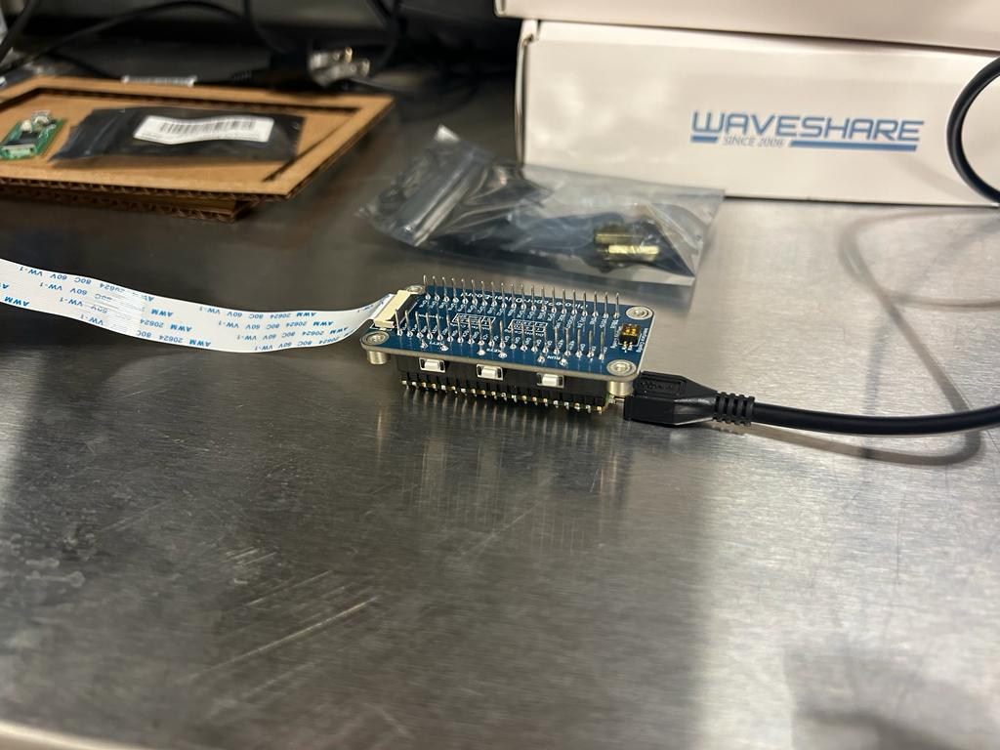

<video src="../../../assets/images/stem/disability-forewarning-system/working-epaper.mp4" controls="controls" style="max-width: 730px;">
</video>

**7in5_test_2.py**

```py
from machine import Pin, SPI
import framebuf
import utime

# Display resolution
EPD_WIDTH       = 800
EPD_HEIGHT      = 480

RST_PIN         = 12
DC_PIN          = 8
CS_PIN          = 9
BUSY_PIN        = 13

class EPD_7in5(framebuf.FrameBuffer):
    def __init__(self):
        self.reset_pin = Pin(RST_PIN, Pin.OUT)
        
        self.busy_pin = Pin(BUSY_PIN, Pin.IN, Pin.PULL_UP)
        self.cs_pin = Pin(CS_PIN, Pin.OUT)
        self.width = EPD_WIDTH
        self.height = EPD_HEIGHT
        
        self.spi = SPI(1)
        self.spi.init(baudrate=4000_000)
        self.dc_pin = Pin(DC_PIN, Pin.OUT)
        
        self.buffer = bytearray(self.height * self.width // 8)
        super().__init__(self.buffer, self.width, self.height, framebuf.MONO_HLSB)
        self.init()

    def digital_write(self, pin, value):
        pin.value(value)

    def digital_read(self, pin):
        return pin.value()

    def delay_ms(self, delaytime):
        utime.sleep(delaytime / 1000.0)

    def spi_writebyte(self, data):
        self.spi.write(bytearray(data))

    def module_exit(self):
        self.digital_write(self.reset_pin, 0)

    # Hardware reset
    def reset(self):
        self.digital_write(self.reset_pin, 1)
        self.delay_ms(50) 
        self.digital_write(self.reset_pin, 0)
        self.delay_ms(2)
        self.digital_write(self.reset_pin, 1)
        self.delay_ms(50)   

    def send_command(self, command):
        self.digital_write(self.dc_pin, 0)
        self.digital_write(self.cs_pin, 0)
        self.spi_writebyte([command])
        self.digital_write(self.cs_pin, 1)

    def send_data(self, data):
        self.digital_write(self.dc_pin, 1)
        self.digital_write(self.cs_pin, 0)
        self.spi_writebyte([data])
        self.digital_write(self.cs_pin, 1)
        
    def send_data1(self, buf):
        self.digital_write(self.dc_pin, 1)
        self.digital_write(self.cs_pin, 0)
        self.spi.write(bytearray(buf))
        self.digital_write(self.cs_pin, 1)

    def WaitUntilIdle(self):
        print("e-Paper busy")
        while(self.digital_read(self.busy_pin) == 0):    # Wait until the busy_pin goes LOW
            self.send_command(0x71)
            self.delay_ms(20)
        self.delay_ms(20) 
        print("e-Paper busy release")  

    def TurnOnDisplay(self):
        self.send_command(0x12) # DISPLAY REFRESH
        self.delay_ms(100)      #!!!The delay here is necessary, 200uS at least!!!
        self.WaitUntilIdle()
        
    def init(self):
        # EPD hardware init start     
        self.reset()
        
        self.send_command(0x01)  # POWER SETTING
        self.send_data(0x07)
        self.send_data(0x07)     # VGH=20V,VGL=-20V
        self.send_data(0x3f)     # VDH=15V
        self.send_data(0x3f)     # VDL=-15V
        
        self.send_command(0x04)  # POWER ON
        self.delay_ms(100)
        self.WaitUntilIdle()

        self.send_command(0X00)   # PANNEL SETTING
        self.send_data(0x1F)      # KW-3f   KWR-2F	BWROTP 0f	BWOTP 1f

        self.send_command(0x61)     # tres
        self.send_data(0x03)     # source 800
        self.send_data(0x20)
        self.send_data(0x01)     # gate 480
        self.send_data(0xE0)

        self.send_command(0X15)
        self.send_data(0x00)

        self.send_command(0X50)     # VCOM AND DATA INTERVAL SETTING
        self.send_data(0x10)
        self.send_data(0x00)

        self.send_command(0X60)     # TCON SETTING
        self.send_data(0x22)

        self.send_command(0x65)     # Resolution setting
        self.send_data(0x00)
        self.send_data(0x00)     # 800*480
        self.send_data(0x00)
        self.send_data(0x00)
        
        return 0;

    def Clear(self):
        
        high = self.height
        if( self.width % 8 == 0) :
            wide =  self.width // 8
        else :
            wide =  self.width // 8 + 1
        
        self.send_command(0x10)
        for i in range(0, wide):
            self.send_data1([0xff] * high)
                
        self.send_command(0x13) 
        for i in range(0, wide):
            self.send_data1([0x00] * high)
                
        self.TurnOnDisplay()
        
    def ClearBlack(self):
        
        high = self.height
        if( self.width % 8 == 0) :
            wide =  self.width // 8
        else :
            wide =  self.width // 8 + 1
        
        self.send_command(0x10)
        for i in range(0, wide):
            self.send_data1([0x00] * high)
                
        self.send_command(0x13) 
        for i in range(0, wide):
            self.send_data1([0xff] * high)
                
        self.TurnOnDisplay()
        
    def display(self,blackimage):
        
        high = self.height
        if( self.width % 8 == 0) :
            wide =  self.width // 8
        else :
            wide =  self.width // 8 + 1
        
        self.send_command(0x10) 
        for i in range(0, wide):
            self.send_data1(blackimage[(i * high) : ((i+1) * high)])
                
        self.send_command(0x13) 
        for i in range(0, wide):
            self.send_data1(blackimage[(i * high) : ((i+1) * high)])
                
        self.TurnOnDisplay()


    def sleep(self):
        self.send_command(0x02) # power off
        self.WaitUntilIdle()
        self.send_command(0x07) # deep sleep
        self.send_data(0xa5)

if __name__=='__main__':
    epd = EPD_7in5()
    epd.Clear()
    
    epd.fill(0x00)
    
    epd.text("Waveshare", 5, 10, 0xff)
    epd.text("Pico_ePaper-7.5", 5, 40, 0xff)
    epd.text("Raspberry Pico", 5, 70, 0xff)
    epd.display(epd.buffer)
    epd.delay_ms(5000)
    
    epd.vline(10, 90, 60, 0xff)
    epd.vline(120, 90, 60, 0xff)
    epd.hline(10, 90, 110, 0xff)
    epd.hline(10, 150, 110, 0xff)
    epd.line(10, 90, 120, 150, 0xff)
    epd.line(120, 90, 10, 150, 0xff)
    epd.display(epd.buffer)
    epd.delay_ms(5000)
    
    epd.rect(10, 180, 50, 80, 0xff)
    epd.fill_rect(70, 180, 50, 80, 0xff)
    epd.display(epd.buffer)
    epd.delay_ms(5000)
    
    epd.fill_rect(250, 150, 480, 20, 0xff)
    epd.fill_rect(250, 310, 480, 20, 0xff)
    epd.fill_rect(400, 0, 20, 480, 0xff)
    epd.fill_rect(560, 0, 20, 480, 0xff)

    for j in range(0, 3):
        for i in range(0, 15):
            epd.line(270+j*160+i, 20+j*160, 375+j*160+i, 140+j*160, 0xff)
        for i in range(0, 15):
            epd.line(375+j*160+i, 20+j*160, 270+j*160+i, 140+j*160, 0xff)
        for i in range(0, 15):
            epd.line(270+j*160, 20+j*160+i, 390+j*160, 125+j*160+i, 0xff)
        for i in range(0, 15):
            epd.line(270+j*160, 125+j*160+i, 390+j*160, 20+j*160+i, 0xff)        
    epd.fill_rect(270, 190, 100, 100, 0xff)
    epd.fill_rect(270, 350, 100, 100, 0xff)
    epd.display(epd.buffer)
    epd.delay_ms(5000)
        
    epd.Clear()
    epd.delay_ms(2000)
    print("sleep")
    epd.sleep()
```

Unfortunately, the text was very small, and I tried to change its size via [this forum](https://github.com/peterhinch/micropython-font-to-py/issues/25), but it didn't work, also revealing that larger font sizes may take up too much memory. I tried changing `self.width = EPD_WIDTH` and `self.height = EPD_HEIGHT` to `self.width = int(EPD_WIDTH/2)` and `self.height = int(EPD_HEIGHT/2)` but the result was grainy and has text smaller than what it was before. I also tried multiplying by too, but I recieved an error about allocating too much memory.

I original decided to try to write my own font library by drawing lines and coordinates (and trying to find people who've done similar things with Desmos) but realized this approach is not time efficient. Here was what I had gotten before I quit.

```py
from machine import Pin, SPI
import framebuf
import utime

# Display resolution
EPD_WIDTH       = 800
EPD_HEIGHT      = 480

RST_PIN         = 12
DC_PIN          = 8
CS_PIN          = 9
BUSY_PIN        = 13

class EPD_7in5(framebuf.FrameBuffer):
    def __init__(self):
        self.reset_pin = Pin(RST_PIN, Pin.OUT)
        
        self.busy_pin = Pin(BUSY_PIN, Pin.IN, Pin.PULL_UP)
        self.cs_pin = Pin(CS_PIN, Pin.OUT)
        self.width = EPD_WIDTH 
        self.height = EPD_HEIGHT 
        
        self.spi = SPI(1)
        self.spi.init(baudrate=4000_000)
        self.dc_pin = Pin(DC_PIN, Pin.OUT)
        
        self.buffer = bytearray(self.height * self.width // 8)
        super().__init__(self.buffer, self.width, self.height, framebuf.MONO_HLSB)
        self.init()

    def digital_write(self, pin, value):
        pin.value(value)

    def digital_read(self, pin):
        return pin.value()

    def delay_ms(self, delaytime):
        utime.sleep(delaytime / 1000.0)

    def spi_writebyte(self, data):
        self.spi.write(bytearray(data))

    def module_exit(self):
        self.digital_write(self.reset_pin, 0)

    # Hardware reset
    def reset(self):
        self.digital_write(self.reset_pin, 1)
        self.delay_ms(50) 
        self.digital_write(self.reset_pin, 0)
        self.delay_ms(2)
        self.digital_write(self.reset_pin, 1)
        self.delay_ms(50)   

    def send_command(self, command):
        self.digital_write(self.dc_pin, 0)
        self.digital_write(self.cs_pin, 0)
        self.spi_writebyte([command])
        self.digital_write(self.cs_pin, 1)

    def send_data(self, data):
        self.digital_write(self.dc_pin, 1)
        self.digital_write(self.cs_pin, 0)
        self.spi_writebyte([data])
        self.digital_write(self.cs_pin, 1)
        
    def send_data1(self, buf):
        self.digital_write(self.dc_pin, 1)
        self.digital_write(self.cs_pin, 0)
        self.spi.write(bytearray(buf))
        self.digital_write(self.cs_pin, 1)

    def WaitUntilIdle(self):
        print("e-Paper busy")
        while(self.digital_read(self.busy_pin) == 0):    # Wait until the busy_pin goes LOW
            self.send_command(0x71)
            self.delay_ms(20)
        self.delay_ms(20) 
        print("e-Paper busy release")  

    def TurnOnDisplay(self):
        self.send_command(0x12) # DISPLAY REFRESH
        self.delay_ms(100)      #!!!The delay here is necessary, 200uS at least!!!
        self.WaitUntilIdle()
        
    def init(self):
        # EPD hardware init start     
        self.reset()
        
        self.send_command(0x01)  # POWER SETTING
        self.send_data(0x07)
        self.send_data(0x07)     # VGH=20V,VGL=-20V
        self.send_data(0x3f)     # VDH=15V
        self.send_data(0x3f)     # VDL=-15V
        
        self.send_command(0x04)  # POWER ON
        self.delay_ms(100)
        self.WaitUntilIdle()

        self.send_command(0X00)   # PANNEL SETTING
        self.send_data(0x1F)      # KW-3f   KWR-2F	BWROTP 0f	BWOTP 1f

        self.send_command(0x61)     # tres
        self.send_data(0x03)     # source 800
        self.send_data(0x20)
        self.send_data(0x01)     # gate 480
        self.send_data(0xE0)

        self.send_command(0X15)
        self.send_data(0x00)

        self.send_command(0X50)     # VCOM AND DATA INTERVAL SETTING
        self.send_data(0x10)
        self.send_data(0x00)

        self.send_command(0X60)     # TCON SETTING
        self.send_data(0x22)

        self.send_command(0x65)     # Resolution setting
        self.send_data(0x00)
        self.send_data(0x00)     # 800*480
        self.send_data(0x00)
        self.send_data(0x00)
        
        return 0;

    def Clear(self):
        
        high = self.height
        if( self.width % 8 == 0) :
            wide =  self.width // 8
        else :
            wide =  self.width // 8 + 1
        
        self.send_command(0x10)
        for i in range(0, wide):
            self.send_data1([0xff] * high)
                
        self.send_command(0x13) 
        for i in range(0, wide):
            self.send_data1([0x00] * high)
                
        self.TurnOnDisplay()
        
    def ClearBlack(self):
        
        high = self.height
        if( self.width % 8 == 0) :
            wide =  self.width // 8
        else :
            wide =  self.width // 8 + 1
        
        self.send_command(0x10)
        for i in range(0, wide):
            self.send_data1([0x00] * high)
                
        self.send_command(0x13) 
        for i in range(0, wide):
            self.send_data1([0xff] * high)
                
        self.TurnOnDisplay()
        
    def display(self,blackimage):
        
        high = self.height
        if( self.width % 8 == 0) :
            wide =  self.width // 8
        else :
            wide =  self.width // 8 + 1
        
        self.send_command(0x10) 
        for i in range(0, wide):
            self.send_data1(blackimage[(i * high) : ((i+1) * high)])
                
        self.send_command(0x13) 
        for i in range(0, wide):
            self.send_data1(blackimage[(i * high) : ((i+1) * high)])
                
        self.TurnOnDisplay()


    def sleep(self):
        self.send_command(0x02) # power off
        self.WaitUntilIdle()
        self.send_command(0x07) # deep sleep
        self.send_data(0xa5)

def poly(epd, points):
    coordinates = [[]]
    for point in points:
        if len(coordinates[-1]) == 4:
            coordinates.append([])
            coordinates[-1] += [coordinates[-2][2], coordinates[-2][3]]
        coordinates[-1].append(point[0])
        coordinates[-1].append(point[1])
    print(coordinates)
    for c in coordinates:
        epd.line(c[0], c[1], c[2], c[3], 0xff)
    epd.line(coordinates[-1][2], coordinates[-1][3], coordinates[0][0], coordinates[0][1], 0xff)

if __name__=='__main__':
    epd = EPD_7in5()
    epd.Clear()
    
    epd.fill(0x00)
    
    poly(epd, [(0, 100), (100, 0), (90, 0)])
    epd.display(epd.buffer)
    epd.delay_ms(5000)
    
    """
    epd.text("Waveshare", 5, 10, 0xff)
    epd.text("Pico_ePaper-7.5", 5, 40, 0xff)
    epd.text("Raspberry Pico", 5, 70, 0xff)
    epd.display(epd.buffer)
    epd.delay_ms(5000)
    
    epd.vline(10, 90, 60, 0xff)
    epd.vline(120, 90, 60, 0xff)
    epd.hline(10, 90, 110, 0xff)
    epd.hline(10, 150, 110, 0xff)
    epd.line(10, 90, 120, 150, 0xff)
    epd.line(120, 90, 10, 150, 0xff)
    epd.display(epd.buffer)
    epd.delay_ms(5000)
    
    epd.rect(10, 180, 50, 80, 0xff)
    epd.fill_rect(70, 180, 50, 80, 0xff)
    epd.display(epd.buffer)
    epd.delay_ms(5000)
    
    epd.fill_rect(250, 150, 480, 20, 0xff)
    epd.fill_rect(250, 310, 480, 20, 0xff)
    epd.fill_rect(400, 0, 20, 480, 0xff)
    epd.fill_rect(560, 0, 20, 480, 0xff)

    for j in range(0, 3):
        for i in range(0, 15):
            epd.line(270+j*160+i, 20+j*160, 375+j*160+i, 140+j*160, 0xff)
        for i in range(0, 15):
            epd.line(375+j*160+i, 20+j*160, 270+j*160+i, 140+j*160, 0xff)
        for i in range(0, 15):
            epd.line(270+j*160, 20+j*160+i, 390+j*160, 125+j*160+i, 0xff)
        for i in range(0, 15):
            epd.line(270+j*160, 125+j*160+i, 390+j*160, 20+j*160+i, 0xff)        
    epd.fill_rect(270, 190, 100, 100, 0xff)
    epd.fill_rect(270, 350, 100, 100, 0xff)
    epd.display(epd.buffer)
    epd.delay_ms(5000)
        
    """
        
    epd.Clear()
    epd.delay_ms(2000)
    print("sleep")
    epd.sleep()
```

I tried original to use the `epd.poly` function based off of [this documentation](https://docs.micropython.org/en/latest/library/framebuf.html#:~:text=Given%20a%20list,outline%20is%20drawn, since `EPD_7in5` inherents from `framebuf.FrameBuffer`, but I kept getting this error when using an array of points.

```cmd
TypeError: object with buffer protocol required
```

Instead I found [this example code](https://forum.micropython.org/viewtopic.php?t=4806&start=20#:~:text=from%20machine%20import,28)%0Aoled.show()) and adapted it to the following, which worked!

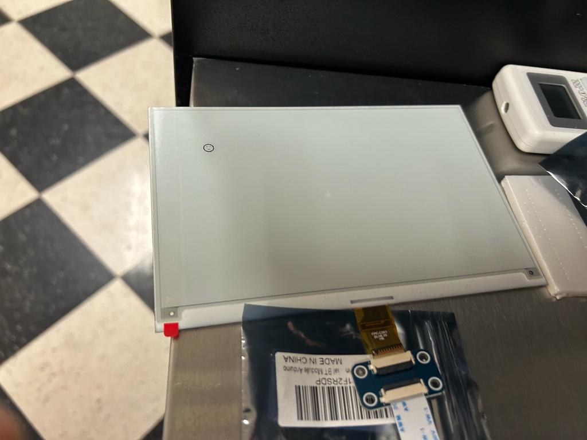

```py
from machine import Pin, SPI
import framebuf
import utime

# Display resolution
EPD_WIDTH       = 800
EPD_HEIGHT      = 480

RST_PIN         = 12
DC_PIN          = 8
CS_PIN          = 9
BUSY_PIN        = 13

class EPD_7in5(framebuf.FrameBuffer):
    def __init__(self):
        self.reset_pin = Pin(RST_PIN, Pin.OUT)
        
        self.busy_pin = Pin(BUSY_PIN, Pin.IN, Pin.PULL_UP)
        self.cs_pin = Pin(CS_PIN, Pin.OUT)
        self.width = EPD_WIDTH 
        self.height = EPD_HEIGHT 
        
        self.spi = SPI(1)
        self.spi.init(baudrate=4000_000)
        self.dc_pin = Pin(DC_PIN, Pin.OUT)
        
        self.buffer = bytearray(self.height * self.width // 8)
        super().__init__(self.buffer, self.width, self.height, framebuf.MONO_HLSB)
        self.init()

    def digital_write(self, pin, value):
        pin.value(value)

    def digital_read(self, pin):
        return pin.value()

    def delay_ms(self, delaytime):
        utime.sleep(delaytime / 1000.0)

    def spi_writebyte(self, data):
        self.spi.write(bytearray(data))

    def module_exit(self):
        self.digital_write(self.reset_pin, 0)

    # Hardware reset
    def reset(self):
        self.digital_write(self.reset_pin, 1)
        self.delay_ms(50) 
        self.digital_write(self.reset_pin, 0)
        self.delay_ms(2)
        self.digital_write(self.reset_pin, 1)
        self.delay_ms(50)   

    def send_command(self, command):
        self.digital_write(self.dc_pin, 0)
        self.digital_write(self.cs_pin, 0)
        self.spi_writebyte([command])
        self.digital_write(self.cs_pin, 1)

    def send_data(self, data):
        self.digital_write(self.dc_pin, 1)
        self.digital_write(self.cs_pin, 0)
        self.spi_writebyte([data])
        self.digital_write(self.cs_pin, 1)
        
    def send_data1(self, buf):
        self.digital_write(self.dc_pin, 1)
        self.digital_write(self.cs_pin, 0)
        self.spi.write(bytearray(buf))
        self.digital_write(self.cs_pin, 1)

    def WaitUntilIdle(self):
        print("e-Paper busy")
        while(self.digital_read(self.busy_pin) == 0):    # Wait until the busy_pin goes LOW
            self.send_command(0x71)
            self.delay_ms(20)
        self.delay_ms(20) 
        print("e-Paper busy release")  

    def TurnOnDisplay(self):
        self.send_command(0x12) # DISPLAY REFRESH
        self.delay_ms(100)      #!!!The delay here is necessary, 200uS at least!!!
        self.WaitUntilIdle()
        
    def init(self):
        # EPD hardware init start     
        self.reset()
        
        self.send_command(0x01)  # POWER SETTING
        self.send_data(0x07)
        self.send_data(0x07)     # VGH=20V,VGL=-20V
        self.send_data(0x3f)     # VDH=15V
        self.send_data(0x3f)     # VDL=-15V
        
        self.send_command(0x04)  # POWER ON
        self.delay_ms(100)
        self.WaitUntilIdle()

        self.send_command(0X00)   # PANNEL SETTING
        self.send_data(0x1F)      # KW-3f   KWR-2F	BWROTP 0f	BWOTP 1f

        self.send_command(0x61)     # tres
        self.send_data(0x03)     # source 800
        self.send_data(0x20)
        self.send_data(0x01)     # gate 480
        self.send_data(0xE0)

        self.send_command(0X15)
        self.send_data(0x00)

        self.send_command(0X50)     # VCOM AND DATA INTERVAL SETTING
        self.send_data(0x10)
        self.send_data(0x00)

        self.send_command(0X60)     # TCON SETTING
        self.send_data(0x22)

        self.send_command(0x65)     # Resolution setting
        self.send_data(0x00)
        self.send_data(0x00)     # 800*480
        self.send_data(0x00)
        self.send_data(0x00)
        
        return 0;

    def Clear(self):
        
        high = self.height
        if( self.width % 8 == 0) :
            wide =  self.width // 8
        else :
            wide =  self.width // 8 + 1
        
        self.send_command(0x10)
        for i in range(0, wide):
            self.send_data1([0xff] * high)
                
        self.send_command(0x13) 
        for i in range(0, wide):
            self.send_data1([0x00] * high)
                
        self.TurnOnDisplay()
        
    def ClearBlack(self):
        
        high = self.height
        if( self.width % 8 == 0) :
            wide =  self.width // 8
        else :
            wide =  self.width // 8 + 1
        
        self.send_command(0x10)
        for i in range(0, wide):
            self.send_data1([0x00] * high)
                
        self.send_command(0x13) 
        for i in range(0, wide):
            self.send_data1([0xff] * high)
                
        self.TurnOnDisplay()
        
    def display(self,blackimage):
        
        high = self.height
        if( self.width % 8 == 0) :
            wide =  self.width // 8
        else :
            wide =  self.width // 8 + 1
        
        self.send_command(0x10) 
        for i in range(0, wide):
            self.send_data1(blackimage[(i * high) : ((i+1) * high)])
                
        self.send_command(0x13) 
        for i in range(0, wide):
            self.send_data1(blackimage[(i * high) : ((i+1) * high)])
                
        self.TurnOnDisplay()


    def sleep(self):
        self.send_command(0x02) # power off
        self.WaitUntilIdle()
        self.send_command(0x07) # deep sleep
        self.send_data(0xa5)
"""
def poly(epd, points):
    coordinates = [[]]
    for point in points:
        if len(coordinates[-1]) == 4:
            coordinates.append([])
            coordinates[-1] += [coordinates[-2][2], coordinates[-2][3]]
        coordinates[-1].append(point[0])
        coordinates[-1].append(point[1])
    print(coordinates)
    for c in coordinates:
        epd.line(c[0], c[1], c[2], c[3], 0xff)
    epd.line(coordinates[-1][2], coordinates[-1][3], coordinates[0][0], coordinates[0][1], 0xff)
"""
fb_smile1 = framebuf.FrameBuffer(bytearray(b'\x00~\x00\x03\xff\xc0\x07\x81\xe0\x1e\x00x8\x00\x1c0\x00\x0c`\x00\x0ea\xc3\x86\xe0\x00\x07\xc0\x00\x03\xc0\x00\x03\xc0\x00\x02\xc0\x00\x03\xc0\x00\x03\xe0B\x07`<\x06`\x00\x060\x00\x0c8\x00\x1c\x1e\x00x\x07\x81\xe0\x03\xff\xc0\x00\xff\x00'), 24, 23, framebuf.MONO_HLSB)

if __name__=='__main__':
    epd = EPD_7in5()
    epd.Clear()
    
    epd.fill(0x00)
    
    epd.blit(fb_smile1, 100, 100)
    epd.display(epd.buffer)
    epd.delay_ms(5000)
    
    """
    epd.text("Waveshare", 5, 10, 0xff)
    epd.text("Pico_ePaper-7.5", 5, 40, 0xff)
    epd.text("Raspberry Pico", 5, 70, 0xff)
    epd.display(epd.buffer)
    epd.delay_ms(5000)
    
    epd.vline(10, 90, 60, 0xff)
    epd.vline(120, 90, 60, 0xff)
    epd.hline(10, 90, 110, 0xff)
    epd.hline(10, 150, 110, 0xff)
    epd.line(10, 90, 120, 150, 0xff)
    epd.line(120, 90, 10, 150, 0xff)
    epd.display(epd.buffer)
    epd.delay_ms(5000)
    
    epd.rect(10, 180, 50, 80, 0xff)
    epd.fill_rect(70, 180, 50, 80, 0xff)
    epd.display(epd.buffer)
    epd.delay_ms(5000)
    
    epd.fill_rect(250, 150, 480, 20, 0xff)
    epd.fill_rect(250, 310, 480, 20, 0xff)
    epd.fill_rect(400, 0, 20, 480, 0xff)
    epd.fill_rect(560, 0, 20, 480, 0xff)

    for j in range(0, 3):
        for i in range(0, 15):
            epd.line(270+j*160+i, 20+j*160, 375+j*160+i, 140+j*160, 0xff)
        for i in range(0, 15):
            epd.line(375+j*160+i, 20+j*160, 270+j*160+i, 140+j*160, 0xff)
        for i in range(0, 15):
            epd.line(270+j*160, 20+j*160+i, 390+j*160, 125+j*160+i, 0xff)
        for i in range(0, 15):
            epd.line(270+j*160, 125+j*160+i, 390+j*160, 20+j*160+i, 0xff)        
    epd.fill_rect(270, 190, 100, 100, 0xff)
    epd.fill_rect(270, 350, 100, 100, 0xff)
    epd.display(epd.buffer)
    epd.delay_ms(5000)
        
    """
        
    epd.Clear()
    epd.delay_ms(2000)
    print("sleep")
    epd.sleep()
```

Now I just had to make my display image and convert it into a byte array. In the future I'll consider trying to get the text to write bigger so that I can change the text in real time from the app without generating a new byte array (which is also a possibility), but for now I'll leave it at this.

I used [this website](https://www.mischianti.org/images-to-byte-array-online-converter-cpp-arduino/) to create a byte array of this image.


But it was far too large and I got a memory allocation error (Thonny was very slow saving the program). I also noticed it had commas instead of slashes. I tried running this python code on my computer so I could decompress it on the RP2040, but this also failed as I crashed Thonny when copying the output from the terminal..

```py
str_ = """THE BYTE ARRAY"""


items = []
for item_ in str_.split(","):
    item = item_.strip()
    if items and item == items[-1][0]:
        items[-1][1] += 1
    else:
        items.append([item, 1])
print(items)
```

I re-ran the byte array creation instead at a resolution of 100x100 but got a weird dot pattern when I run the program.

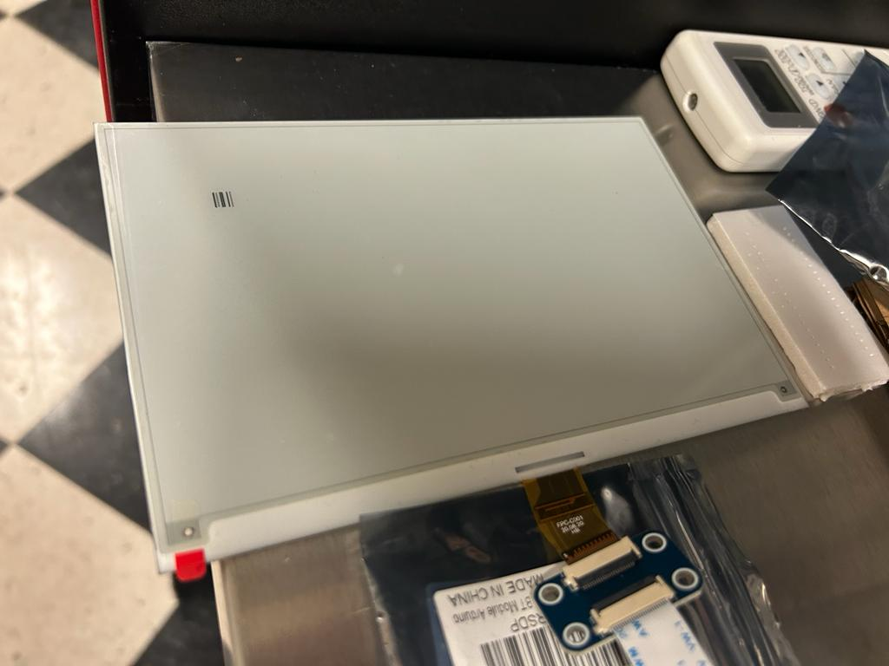

I tried converting it with this, but it also failed.

```py
str_ = """*the byte list*"""

print(str_.replace(" ","").replace(",", "").replace("0x", "\\x").replace("\n","").replace("\t",""))
```

Next I tried using [this website](https://cloudconvert.com/) to download a BMP file. I uploaded it to the Pico and changed the python to this, which gave a different, weird dot pattern.

```py
with open('medical-symbol.bmp', 'rb') as f:
    fb_smile1 = framebuf.FrameBuffer(bytearray(f.read()), 24, 23, framebuf.MONO_HLSB)
```

I tried every single one of the formats [here](https://docs.micropython.org/en/latest/library/framebuf.html#constants) and changed the dimensions to `100, 100`, but nothing worked.

Finally, [this forum](https://forum.micropython.org/viewtopic.php?t=4806&start=20#:~:text=Saved%20that%20as%20a%20.BMP%20file.%20Now%20I%20convert%20that%20into%20a%20very%20old%20bitmap%20format%20(binary%20PBM%20file%20format%20%27P4%27%20by%20Jef%20Poskanzer).%20That%20stuff%20dates%20back%20to%20the%201980%27s%2C%20but%20the%20fun%20here%20is%20that%20the%20data%20of%20that%20bitmap%20is%20arranged%20EXACTLY%20as%20it%20is%20in%20a%20MONO_HLSB%20type%20MicroPython%20FrameBuffer.), which I had used earlier, revealed that the MONO_HLSB is the same as a PBM file, so I used [this website](https://convertio.co/download/056e909eac491c9db80720981b0d65a0c341e9/) to convert my BMP to PBM and uploaded to the Pico. This time the result was much closer to what I wanted.

```py
with open('medical-symbol.pbm', 'rb') as f:
    fb_smile1 = framebuf.FrameBuffer(bytearray(f.read()), 100, 100, framebuf.MONO_HLSB)
```

The graininess was strange as the BMP file was not grainy whatsoever.

I tried using [this python program](https://github.com/seth-c-stenzel/bmp-to-pbm-converter) to convert the BMP file instead, since maybe it was a problem with the converting website, but this created no change.

I tried using the original JPG size of 580x531 and still had the same problem. I even used [this website](https://kylepaulsen.com/stuff/NetpbmViewer/) to verify it wasn' a problem with the PBM file.

I decided to print out the bytes with `print(f.read())` and the first 12 characters were `P4\n580 531`. I decided to try to cut these off by changing `fb_smile1 = framebuf.FrameBuffer(bytearray(f.read()), 100, 100, framebuf.MONO_HLSB)` to `fb_smile1 = framebuf.FrameBuffer(bytearray(f.read()[12:]), 100, 100, framebuf.MONO_HLSB)`, and this worked! (I also had to restart Thonny and reinstall MicroPython everytime I printed out the bytes then tried to stop the program when it would get stuck). When I printed out `f.read()[:13]` there were two more characters than what I intended to cut off - I'm not sure what these were, but the program works so I'll leave it for now.

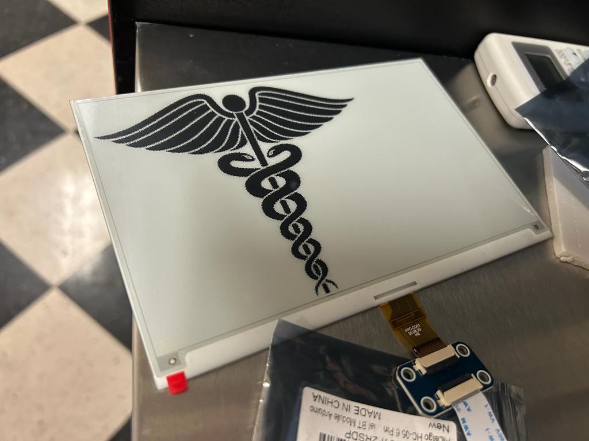

```py
from machine import Pin, SPI
import framebuf
import utime

# Display resolution
EPD_WIDTH       = 800
EPD_HEIGHT      = 480

RST_PIN         = 12
DC_PIN          = 8
CS_PIN          = 9
BUSY_PIN        = 13

class EPD_7in5(framebuf.FrameBuffer):
    def __init__(self):
        self.reset_pin = Pin(RST_PIN, Pin.OUT)
        
        self.busy_pin = Pin(BUSY_PIN, Pin.IN, Pin.PULL_UP)
        self.cs_pin = Pin(CS_PIN, Pin.OUT)
        self.width = EPD_WIDTH 
        self.height = EPD_HEIGHT 
        
        self.spi = SPI(1)
        self.spi.init(baudrate=4000_000)
        self.dc_pin = Pin(DC_PIN, Pin.OUT)
        
        self.buffer = bytearray(self.height * self.width // 8)
        super().__init__(self.buffer, self.width, self.height, framebuf.MONO_HLSB)
        self.init()

    def digital_write(self, pin, value):
        pin.value(value)

    def digital_read(self, pin):
        return pin.value()

    def delay_ms(self, delaytime):
        utime.sleep(delaytime / 1000.0)

    def spi_writebyte(self, data):
        self.spi.write(bytearray(data))

    def module_exit(self):
        self.digital_write(self.reset_pin, 0)

    # Hardware reset
    def reset(self):
        self.digital_write(self.reset_pin, 1)
        self.delay_ms(50) 
        self.digital_write(self.reset_pin, 0)
        self.delay_ms(2)
        self.digital_write(self.reset_pin, 1)
        self.delay_ms(50)   

    def send_command(self, command):
        self.digital_write(self.dc_pin, 0)
        self.digital_write(self.cs_pin, 0)
        self.spi_writebyte([command])
        self.digital_write(self.cs_pin, 1)

    def send_data(self, data):
        self.digital_write(self.dc_pin, 1)
        self.digital_write(self.cs_pin, 0)
        self.spi_writebyte([data])
        self.digital_write(self.cs_pin, 1)
        
    def send_data1(self, buf):
        self.digital_write(self.dc_pin, 1)
        self.digital_write(self.cs_pin, 0)
        self.spi.write(bytearray(buf))
        self.digital_write(self.cs_pin, 1)

    def WaitUntilIdle(self):
        print("e-Paper busy")
        while(self.digital_read(self.busy_pin) == 0):    # Wait until the busy_pin goes LOW
            self.send_command(0x71)
            self.delay_ms(20)
        self.delay_ms(20) 
        print("e-Paper busy release")  

    def TurnOnDisplay(self):
        self.send_command(0x12) # DISPLAY REFRESH
        self.delay_ms(100)      #!!!The delay here is necessary, 200uS at least!!!
        self.WaitUntilIdle()
        
    def init(self):
        # EPD hardware init start     
        self.reset()
        
        self.send_command(0x01)  # POWER SETTING
        self.send_data(0x07)
        self.send_data(0x07)     # VGH=20V,VGL=-20V
        self.send_data(0x3f)     # VDH=15V
        self.send_data(0x3f)     # VDL=-15V
        
        self.send_command(0x04)  # POWER ON
        self.delay_ms(100)
        self.WaitUntilIdle()

        self.send_command(0X00)   # PANNEL SETTING
        self.send_data(0x1F)      # KW-3f   KWR-2F	BWROTP 0f	BWOTP 1f

        self.send_command(0x61)     # tres
        self.send_data(0x03)     # source 800
        self.send_data(0x20)
        self.send_data(0x01)     # gate 480
        self.send_data(0xE0)

        self.send_command(0X15)
        self.send_data(0x00)

        self.send_command(0X50)     # VCOM AND DATA INTERVAL SETTING
        self.send_data(0x10)
        self.send_data(0x00)

        self.send_command(0X60)     # TCON SETTING
        self.send_data(0x22)

        self.send_command(0x65)     # Resolution setting
        self.send_data(0x00)
        self.send_data(0x00)     # 800*480
        self.send_data(0x00)
        self.send_data(0x00)
        
        return 0;

    def Clear(self):
        
        high = self.height
        if( self.width % 8 == 0) :
            wide =  self.width // 8
        else :
            wide =  self.width // 8 + 1
        
        self.send_command(0x10)
        for i in range(0, wide):
            self.send_data1([0xff] * high)
                
        self.send_command(0x13) 
        for i in range(0, wide):
            self.send_data1([0x00] * high)
                
        self.TurnOnDisplay()
        
    def ClearBlack(self):
        
        high = self.height
        if( self.width % 8 == 0) :
            wide =  self.width // 8
        else :
            wide =  self.width // 8 + 1
        
        self.send_command(0x10)
        for i in range(0, wide):
            self.send_data1([0x00] * high)
                
        self.send_command(0x13) 
        for i in range(0, wide):
            self.send_data1([0xff] * high)
                
        self.TurnOnDisplay()
        
    def display(self,blackimage):
        
        high = self.height
        if( self.width % 8 == 0) :
            wide =  self.width // 8
        else :
            wide =  self.width // 8 + 1
        
        self.send_command(0x10) 
        for i in range(0, wide):
            self.send_data1(blackimage[(i * high) : ((i+1) * high)])
                
        self.send_command(0x13) 
        for i in range(0, wide):
            self.send_data1(blackimage[(i * high) : ((i+1) * high)])
                
        self.TurnOnDisplay()


    def sleep(self):
        self.send_command(0x02) # power off
        self.WaitUntilIdle()
        self.send_command(0x07) # deep sleep
        self.send_data(0xa5)
"""
def poly(epd, points):
    coordinates = [[]]
    for point in points:
        if len(coordinates[-1]) == 4:
            coordinates.append([])
            coordinates[-1] += [coordinates[-2][2], coordinates[-2][3]]
        coordinates[-1].append(point[0])
        coordinates[-1].append(point[1])
    print(coordinates)
    for c in coordinates:
        epd.line(c[0], c[1], c[2], c[3], 0xff)
    epd.line(coordinates[-1][2], coordinates[-1][3], coordinates[0][0], coordinates[0][1], 0xff)
"""
with open('medical-symbol-o-o.pbm', 'rb') as f:
    fb_smile1 = framebuf.FrameBuffer(bytearray(f.read()[12:]), 580, 531, framebuf.MONO_HLSB)

if __name__=='__main__':
    epd = EPD_7in5()
    epd.Clear()
    
    epd.fill(0x00)
    
    epd.blit(fb_smile1, 0, -10)
    epd.display(epd.buffer)
    epd.delay_ms(5000)
    
    """
    epd.text("Waveshare", 5, 10, 0xff)
    epd.text("Pico_ePaper-7.5", 5, 40, 0xff)
    epd.text("Raspberry Pico", 5, 70, 0xff)
    epd.display(epd.buffer)
    epd.delay_ms(5000)
    
    epd.vline(10, 90, 60, 0xff)
    epd.vline(120, 90, 60, 0xff)
    epd.hline(10, 90, 110, 0xff)
    epd.hline(10, 150, 110, 0xff)
    epd.line(10, 90, 120, 150, 0xff)
    epd.line(120, 90, 10, 150, 0xff)
    epd.display(epd.buffer)
    epd.delay_ms(5000)
    
    epd.rect(10, 180, 50, 80, 0xff)
    epd.fill_rect(70, 180, 50, 80, 0xff)
    epd.display(epd.buffer)
    epd.delay_ms(5000)
    
    epd.fill_rect(250, 150, 480, 20, 0xff)
    epd.fill_rect(250, 310, 480, 20, 0xff)
    epd.fill_rect(400, 0, 20, 480, 0xff)
    epd.fill_rect(560, 0, 20, 480, 0xff)

    for j in range(0, 3):
        for i in range(0, 15):
            epd.line(270+j*160+i, 20+j*160, 375+j*160+i, 140+j*160, 0xff)
        for i in range(0, 15):
            epd.line(375+j*160+i, 20+j*160, 270+j*160+i, 140+j*160, 0xff)
        for i in range(0, 15):
            epd.line(270+j*160, 20+j*160+i, 390+j*160, 125+j*160+i, 0xff)
        for i in range(0, 15):
            epd.line(270+j*160, 125+j*160+i, 390+j*160, 20+j*160+i, 0xff)        
    epd.fill_rect(270, 190, 100, 100, 0xff)
    epd.fill_rect(270, 350, 100, 100, 0xff)
    epd.display(epd.buffer)
    epd.delay_ms(5000)
        
    """
        
    epd.Clear()
    epd.delay_ms(2000)
    print("sleep")
    epd.sleep()
```

### Final Image

I created a new project in [Adobe Premiere Pro](https://www.adobe.com/creativecloud/business/teams.html?sdid=B16P3W9X&mv=search&ef_id=CjwKCAjw1MajBhAcEiwAagW9MQWN2rzAf6raCD9Bak35L31fb3aLxki7eZ432obabxN6koCqr-4Q2RoCFQMQAvD_BwE:G:s&s_kwcid=AL!3085!3!566814725454!e!!g!!adobe%20premiere%20pro!15482932269!136265040208&gad=1) and made a new, white `Color Matte` that is `800x480` pixels per [this website](https://www.waveshare.com/wiki/7.5inch_NFC-Powered_e-Paper#:~:text=Paper%20Module%2C%20with-,800%20x%20480,-resolution.%20Users%20can) to match the epaper display. After creating a frame with the desired image, I clicked the camera icon in the preview window and exported the frame as a BMP. I just ignored the `.bmp.xmp` file as I'm not sure of its purpose. I then converted it to a PBM file with the same website as above.


It worked perfectly!! I also removed the code that clears the screen at the end of the program.

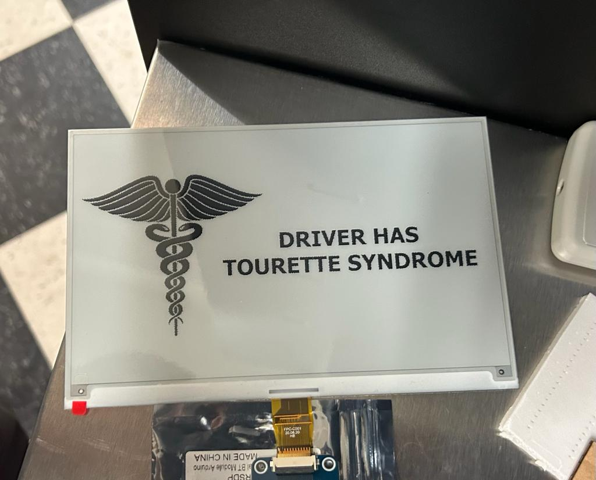

```py
from machine import Pin, SPI
import framebuf
import utime

# Display resolution
EPD_WIDTH       = 800
EPD_HEIGHT      = 480

RST_PIN         = 12
DC_PIN          = 8
CS_PIN          = 9
BUSY_PIN        = 13

class EPD_7in5(framebuf.FrameBuffer):
    def __init__(self):
        self.reset_pin = Pin(RST_PIN, Pin.OUT)
        
        self.busy_pin = Pin(BUSY_PIN, Pin.IN, Pin.PULL_UP)
        self.cs_pin = Pin(CS_PIN, Pin.OUT)
        self.width = EPD_WIDTH 
        self.height = EPD_HEIGHT 
        
        self.spi = SPI(1)
        self.spi.init(baudrate=4000_000)
        self.dc_pin = Pin(DC_PIN, Pin.OUT)
        
        self.buffer = bytearray(self.height * self.width // 8)
        super().__init__(self.buffer, self.width, self.height, framebuf.MONO_HLSB)
        self.init()

    def digital_write(self, pin, value):
        pin.value(value)

    def digital_read(self, pin):
        return pin.value()

    def delay_ms(self, delaytime):
        utime.sleep(delaytime / 1000.0)

    def spi_writebyte(self, data):
        self.spi.write(bytearray(data))

    def module_exit(self):
        self.digital_write(self.reset_pin, 0)

    # Hardware reset
    def reset(self):
        self.digital_write(self.reset_pin, 1)
        self.delay_ms(50) 
        self.digital_write(self.reset_pin, 0)
        self.delay_ms(2)
        self.digital_write(self.reset_pin, 1)
        self.delay_ms(50)   

    def send_command(self, command):
        self.digital_write(self.dc_pin, 0)
        self.digital_write(self.cs_pin, 0)
        self.spi_writebyte([command])
        self.digital_write(self.cs_pin, 1)

    def send_data(self, data):
        self.digital_write(self.dc_pin, 1)
        self.digital_write(self.cs_pin, 0)
        self.spi_writebyte([data])
        self.digital_write(self.cs_pin, 1)
        
    def send_data1(self, buf):
        self.digital_write(self.dc_pin, 1)
        self.digital_write(self.cs_pin, 0)
        self.spi.write(bytearray(buf))
        self.digital_write(self.cs_pin, 1)

    def WaitUntilIdle(self):
        print("e-Paper busy")
        while(self.digital_read(self.busy_pin) == 0):    # Wait until the busy_pin goes LOW
            self.send_command(0x71)
            self.delay_ms(20)
        self.delay_ms(20) 
        print("e-Paper busy release")  

    def TurnOnDisplay(self):
        self.send_command(0x12) # DISPLAY REFRESH
        self.delay_ms(100)      #!!!The delay here is necessary, 200uS at least!!!
        self.WaitUntilIdle()
        
    def init(self):
        # EPD hardware init start     
        self.reset()
        
        self.send_command(0x01)  # POWER SETTING
        self.send_data(0x07)
        self.send_data(0x07)     # VGH=20V,VGL=-20V
        self.send_data(0x3f)     # VDH=15V
        self.send_data(0x3f)     # VDL=-15V
        
        self.send_command(0x04)  # POWER ON
        self.delay_ms(100)
        self.WaitUntilIdle()

        self.send_command(0X00)   # PANNEL SETTING
        self.send_data(0x1F)      # KW-3f   KWR-2F	BWROTP 0f	BWOTP 1f

        self.send_command(0x61)     # tres
        self.send_data(0x03)     # source 800
        self.send_data(0x20)
        self.send_data(0x01)     # gate 480
        self.send_data(0xE0)

        self.send_command(0X15)
        self.send_data(0x00)

        self.send_command(0X50)     # VCOM AND DATA INTERVAL SETTING
        self.send_data(0x10)
        self.send_data(0x00)

        self.send_command(0X60)     # TCON SETTING
        self.send_data(0x22)

        self.send_command(0x65)     # Resolution setting
        self.send_data(0x00)
        self.send_data(0x00)     # 800*480
        self.send_data(0x00)
        self.send_data(0x00)
        
        return 0;

    def Clear(self):
        
        high = self.height
        if( self.width % 8 == 0) :
            wide =  self.width // 8
        else :
            wide =  self.width // 8 + 1
        
        self.send_command(0x10)
        for i in range(0, wide):
            self.send_data1([0xff] * high)
                
        self.send_command(0x13) 
        for i in range(0, wide):
            self.send_data1([0x00] * high)
                
        self.TurnOnDisplay()
        
    def ClearBlack(self):
        
        high = self.height
        if( self.width % 8 == 0) :
            wide =  self.width // 8
        else :
            wide =  self.width // 8 + 1
        
        self.send_command(0x10)
        for i in range(0, wide):
            self.send_data1([0x00] * high)
                
        self.send_command(0x13) 
        for i in range(0, wide):
            self.send_data1([0xff] * high)
                
        self.TurnOnDisplay()
        
    def display(self,blackimage):
        
        high = self.height
        if( self.width % 8 == 0) :
            wide =  self.width // 8
        else :
            wide =  self.width // 8 + 1
        
        self.send_command(0x10) 
        for i in range(0, wide):
            self.send_data1(blackimage[(i * high) : ((i+1) * high)])
                
        self.send_command(0x13) 
        for i in range(0, wide):
            self.send_data1(blackimage[(i * high) : ((i+1) * high)])
                
        self.TurnOnDisplay()


    def sleep(self):
        self.send_command(0x02) # power off
        self.WaitUntilIdle()
        self.send_command(0x07) # deep sleep
        self.send_data(0xa5)

with open('TS_FINAL_IMG.pbm', 'rb') as f:
    fb_smile1 = framebuf.FrameBuffer(bytearray(f.read()[12:]), EPD_WIDTH, EPD_HEIGHT, framebuf.MONO_HLSB)

if __name__=='__main__':
    epd = EPD_7in5()
    epd.Clear()
    
    epd.fill(0x00)
    
    epd.blit(fb_smile1, 0, 0)
    epd.display(epd.buffer)
    
    print("sleep")
    epd.sleep()
```

I cleared the epaper before I finished working on it, and I'm considering simply drawing it one time then not writing to it anymore and only using the Pico for controlling the servo and BLE communication. Also that was I didn't have to worry about using the shield with other wiring, as well, and a power source. But this also wouldn't be any better than a piece of paper, so I'm leaning against it.

*All of the code used MicroPython 1.20.0*

## Rechargeable Batteries

I want to use a rechargeable battery both for the cup holder and display electronics. I have a [HW-357](https://m.aliexpress.com/i/2255800311222146.html?gatewayAdapt=4itemAdapt) module and a [Lipo battery](https://www.amazon.com/gp/product/B06WGZB2N4/ref=ppx_yo_dt_b_search_asin_image?ie=UTF8&psc=1), and when I measured the output voltage of the battery, it was `1.7V`, so I let it charge inside of a [Derblue Lipo Safe Bag](https://www.amazon.com/DerBlue-Fireproof-Explosionproof-Battery-Bag%EF%BC%88185x75x60mm%EF%BC%89/dp/B01GCHBQJS).

The potentiometer didn't work - even after charging always ~1.7v - soldered a different one called a [TP4056 Lithium Battery Charger Module](https://www.amazon.com/Lind-Kitchen-Charging-Lithium-Battery/dp/B0BVFK5T2Z/ref=sr_1_1_sspa?crid=F5AMEBLJSMUO&keywords=tp4056&qid=1685987558&s=hi&sprefix=tp4056%2Ctools%2C75&sr=1-1-spons&psc=1&spLa=ZW5jcnlwdGVkUXVhbGlmaWVyPUFGNlRaQUkzMVZFMjImZW5jcnlwdGVkSWQ9QTA1MDI4NDMxSzVDTElBOUFXOUxLJmVuY3J5cHRlZEFkSWQ9QTAwMTU2NjIxMlBZQkQ0SzhMWkFTJndpZGdldE5hbWU9c3BfYXRmJmFjdGlvbj1jbGlja1JlZGlyZWN0JmRvTm90TG9nQ2xpY2s9dHJ1ZQ==).

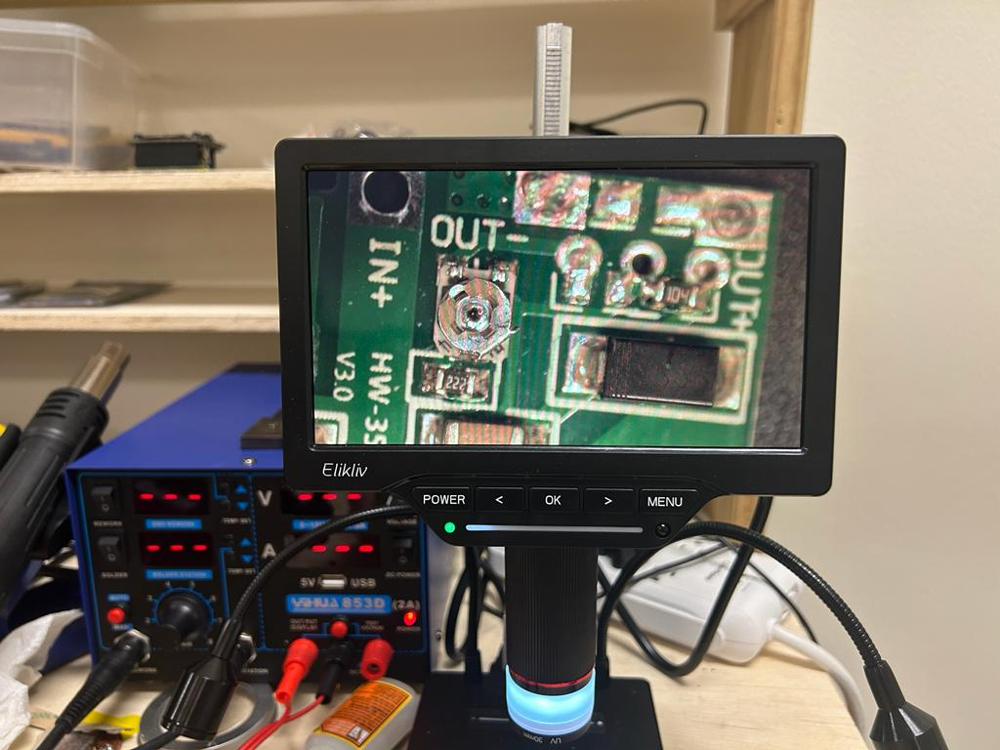

When I hooked up the servo, it worked!

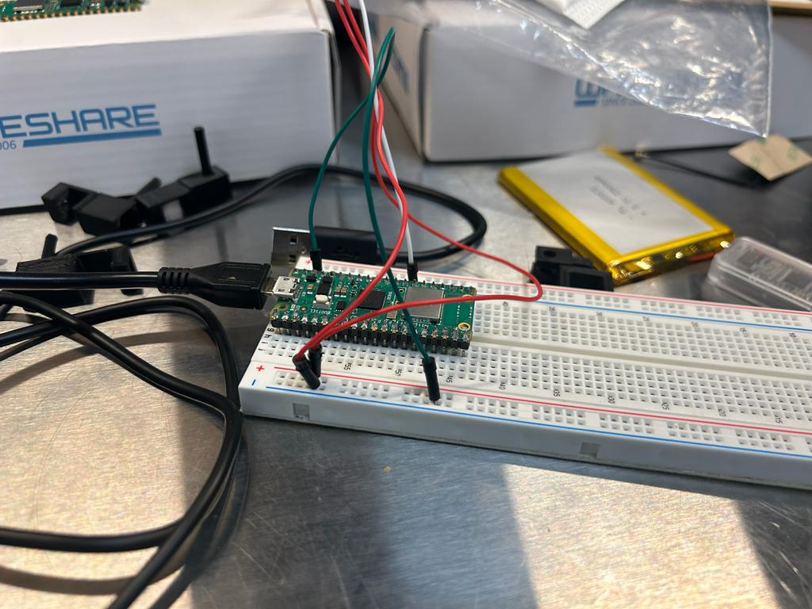

<video src="../../../assets/images/stem/disability-forewarning-system/vvid.mp4" controls="controls" style="max-width: 730px;">
</video>

[Here's where I put it together!](./display-mechanics.md#putting-it-together)

Sometimes the servo motor would become jitery, but I believe this was the result of a bad connection in the wiring, as after combining the electronics this problem disappeared.

## Combining With HAT

I put it in the e-paper HAT, and I couldn't connect to it in Thonny. I realized I placed it one too many over to the side, and after changing that, it worked!

[This page](https://www.waveshare.com/wiki/Pico-ePaper-7.5#:~:text=DEV_Digital_Read(UWORD%20Pin)%3B-,SPI%20transmits%20data,-void%20DEV_SPI_WriteByte(UBYTE)) leads me to believe that the e-paper uses SPI, so GP21 and UART 0 shouldn't be a problem!

I found switching between the angles 0 and 100 was optimal.

Now it was time to design the PCB board.

### Display Electronics PCB

#### Designing in EagleCAD

##### Iteration 1

**Note** I used `right-click > Mirror` to mirror the pico footprints since I inserted the board from the back using through-hole milling.

I used these two different footprints for pads:

- *wirepad* > **SMD5**
- *wirepad* > **SMD2**

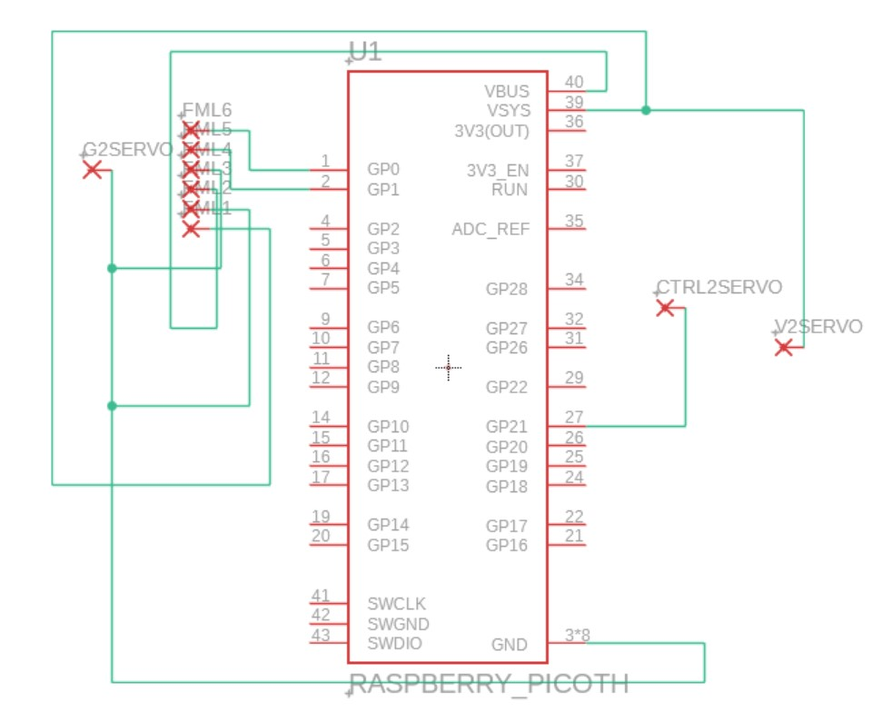

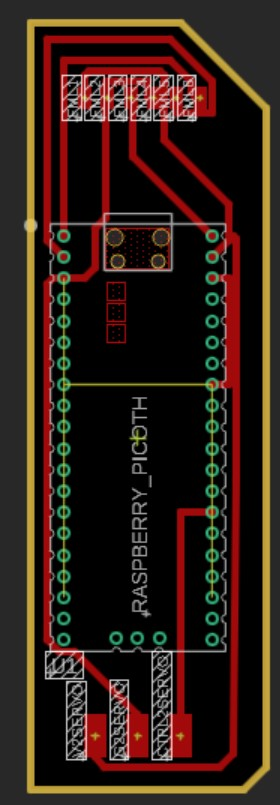

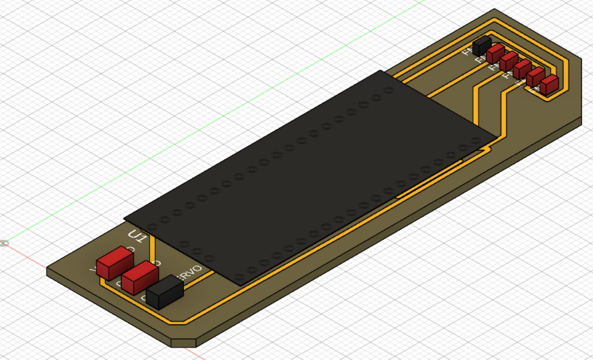

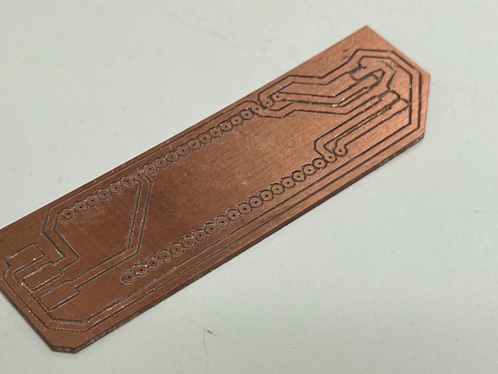

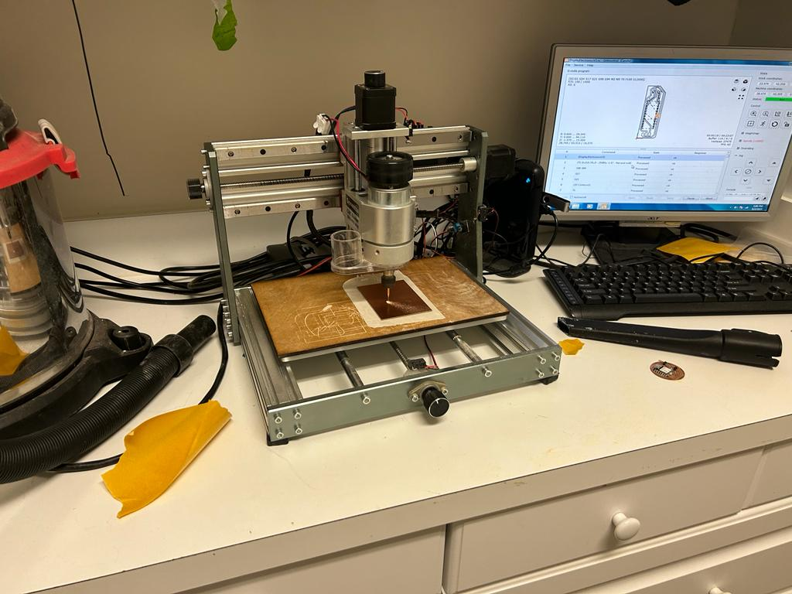

This didn't work until I soldered the wire on it because I realized that the `VSYS` pin only works when the board is powered via USB.

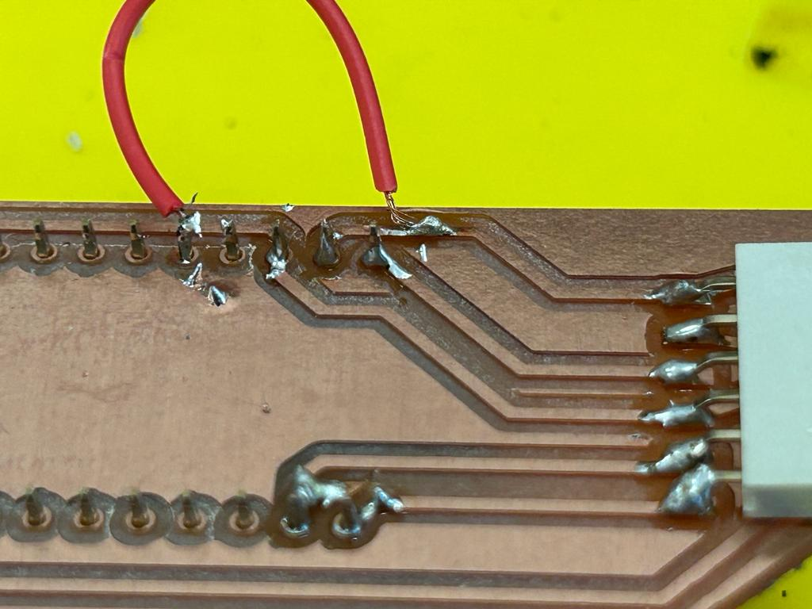

##### Iteration 2

I redesigned the board to fix the `VSYS` problem. I played with milling different routing patterns, some of which failed to mill because of too-small trace widths (see below).

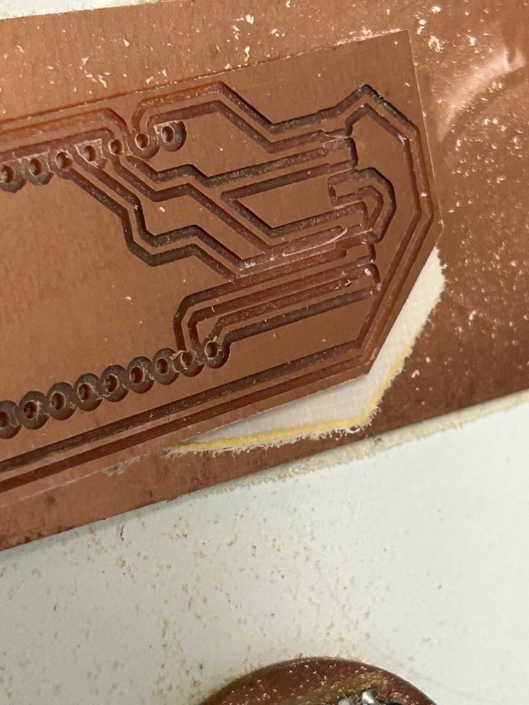

In terms of milling bits, I ended up using a `0.8mm` flat end mill.

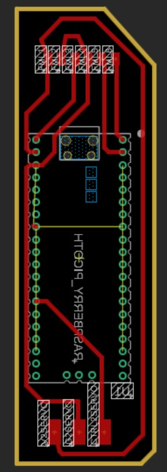

`VBUS` didn't completely solve the problem.

I redid it. It stripped when I tried to unsolder a couple of times, so I had to re-mill the board. Then it worked!

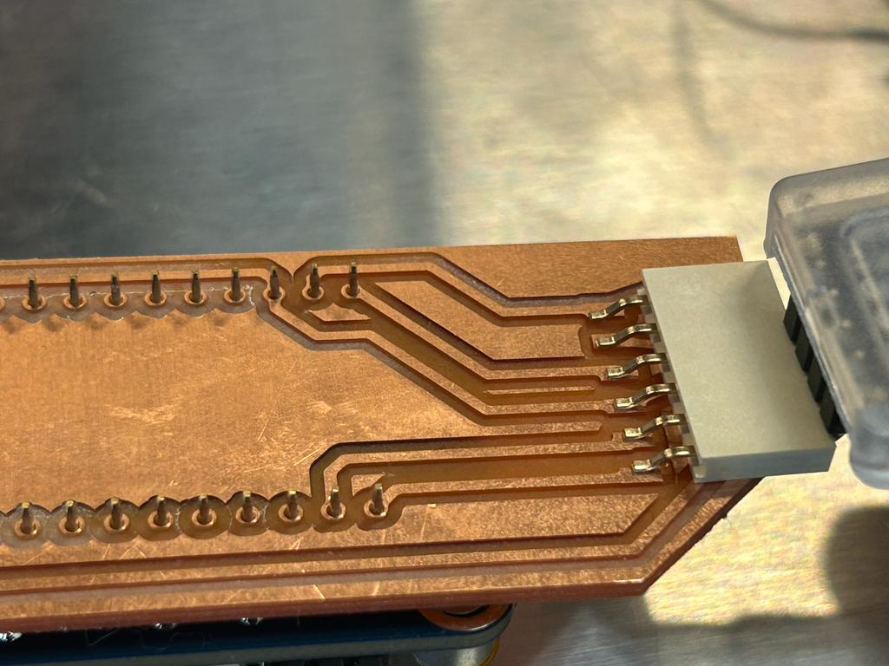

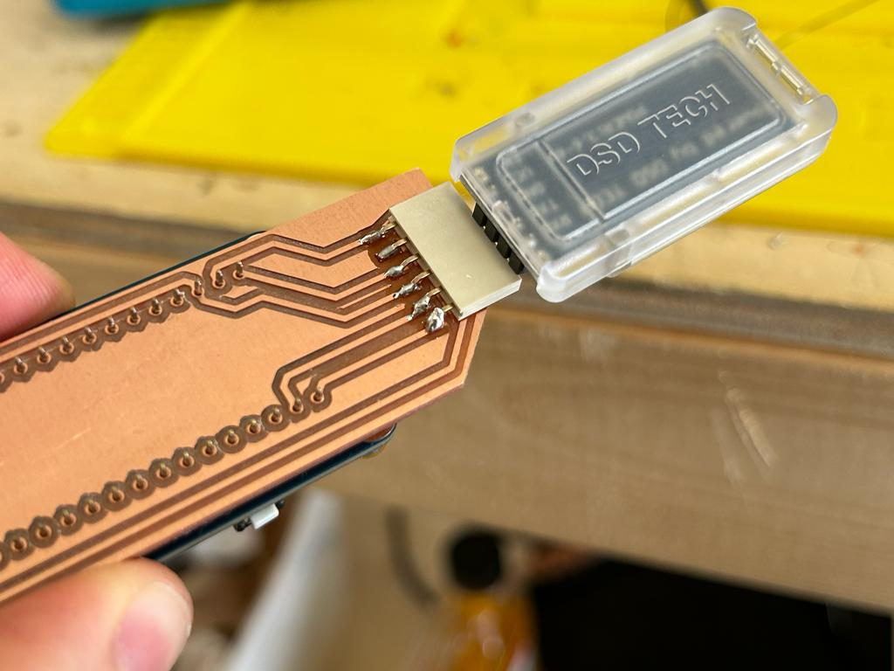

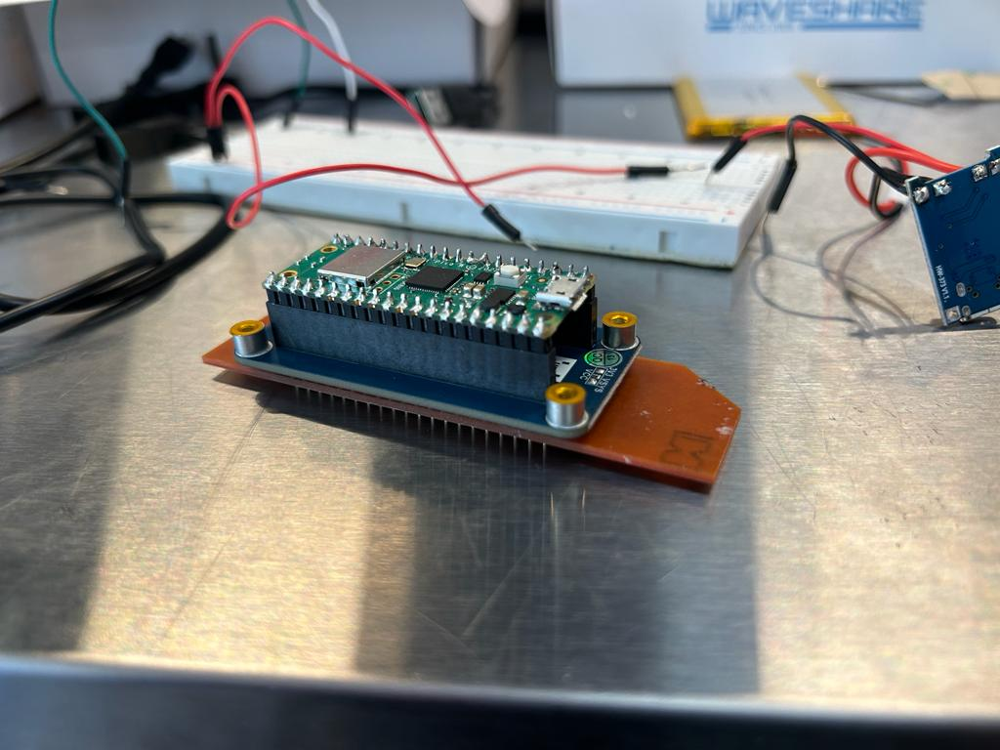

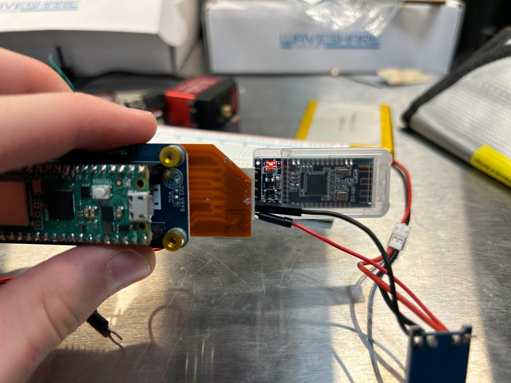

<video src="../../../assets/images/stem/disability-forewarning-system/xy4.mp4" controls="controls" style="max-width: 730px;">
</video>

### Iteration 3

To modify the wiring, I had to add a `0ohm` resistor to jump one trace over another. Now the design was fully functional!

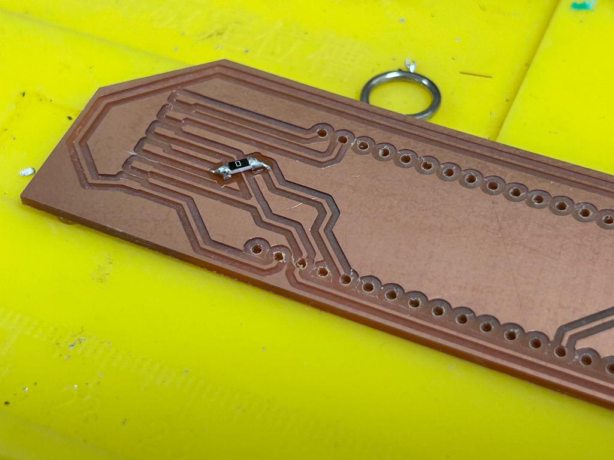

<video src="../../../assets/images/stem/disability-forewarning-system/fw.mp4" controls="controls" style="max-width: 730px;">
</video>