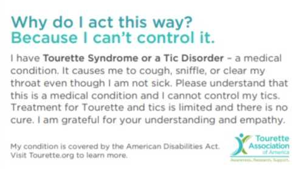
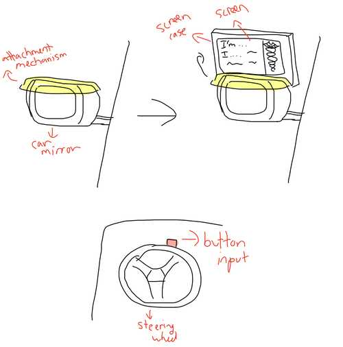
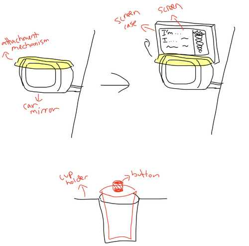
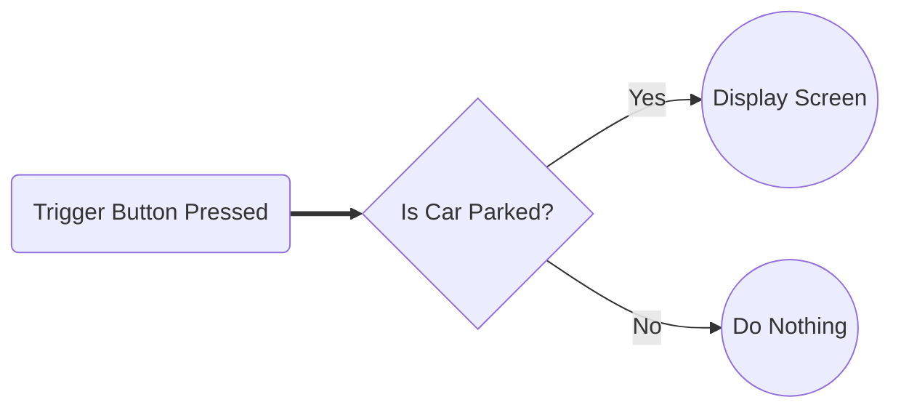
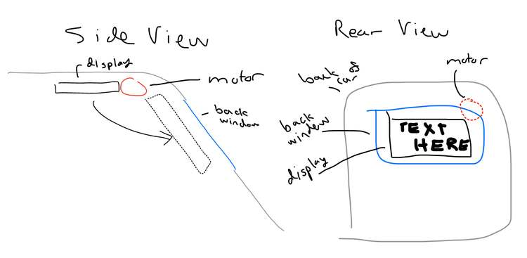
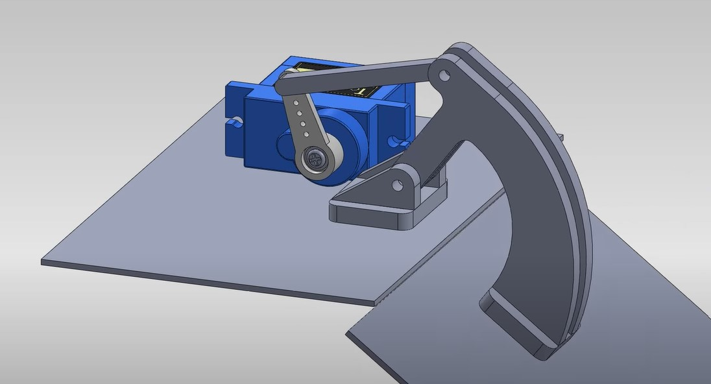
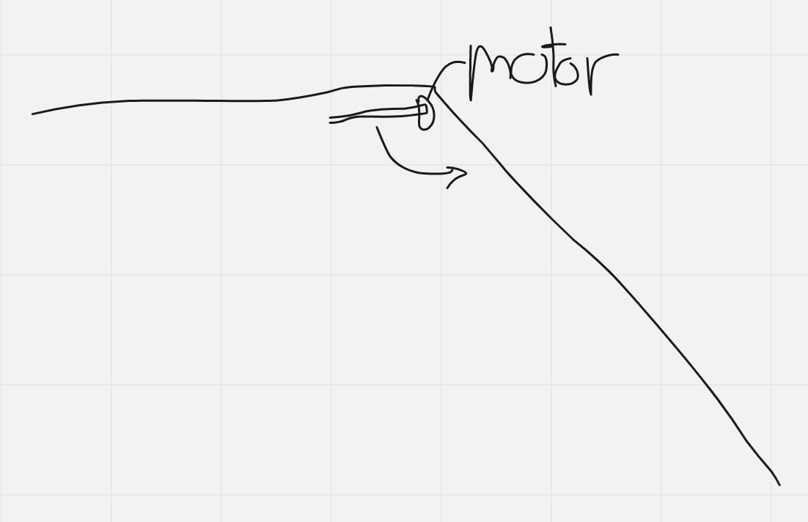
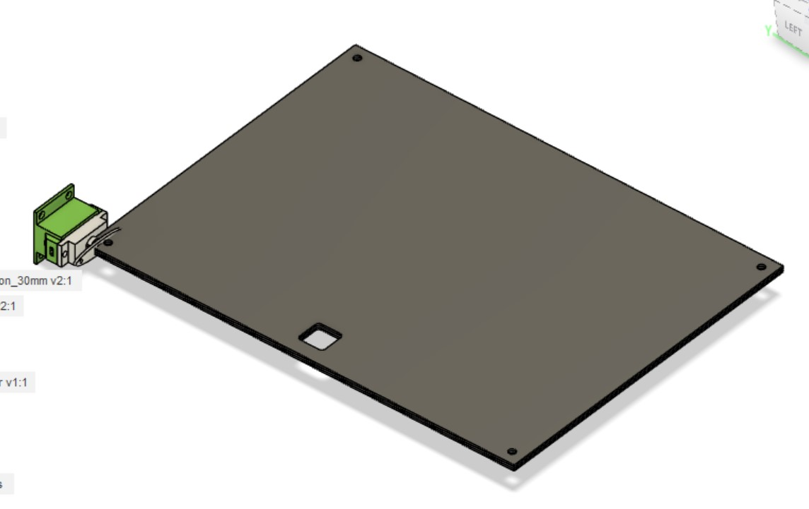
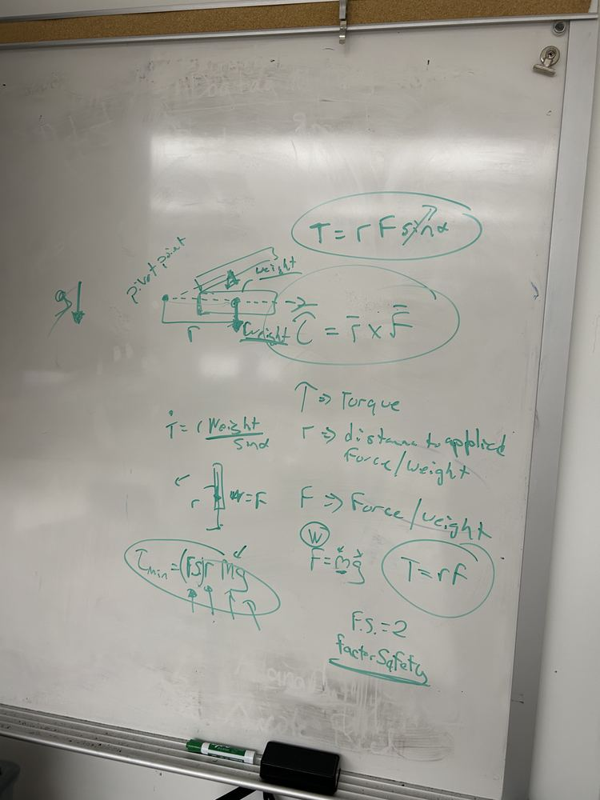
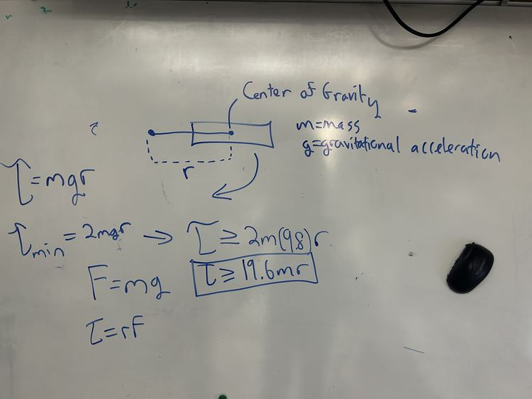

# Final Project Outline

## The Idea

Tourette Syndrome is not deadly, but ignorance about the condition can be life-threatening. For people with severe tics, their movements and vocalizations are often misinterpreted by law enforcement as intoxication or aggression, dangerously escalating encounters. I wanted to create a device to help facilitate safe interactions between law enforcement and people wtih severe tics.

The first step was to gain a strong understanding of the needs of drivers who have severe tics, as well as the perspective of law enfrocement officers at a traffic stop. To understand driver needs, I spoke with Heather Ramsey, the Tourette Association of America’s Director of Education, Support & Public Policy. She has worked extensively with law enforcement to spread awareness and education about Tourette Syndrome, and her insights were extremely valuable. She explained that the only current solution for drivers with severe tics is an information card that can be handed over to a law enforcement officer. However, there are several major problems with this solution:

- Reaching for the card takes the driver's hands out of the officer's view, potentially making the officer believe the driver is reaching for a weapon.
- If a driver waits for the officer to arrive to retrieve the card and is experiencing severe tics, the situation could escalate before information is provided.

**Current Card**

{: style="border-style: solid;"}

Next, I set up a time to meet with [Major Dale Greene](https://www.linkedin.com/in/dale-greene-6501266b), the [Director of Security at Charlotte Latin School](https://www.charlottelatin.org/programs/safety) and Curtis Bowers, a Security Officer at Charlotte Latin School who retired from the Charlotte-Mecklenburg Police Department after 30 years of service. They provided great insights from the law enforcement perspective about what's going through an officer's mind at a traffic stop and how they are trained to handle situations with different special populations. The biggest takeaway was that it is important to communicate to the officer that the driver has Tourette Syndrome as early as possible in the encounter. An officer starts at the highest level of alert and caution possible because suspecting the worst leaves them the most prepared.

The conclusion from the discussion was that the best solution would be a flip-up screen that mounts onto the driver-side outside mirror of a car and informs the officer that the driver has Tourette Syndrome. The screen would remain folded until the driver is pulled over. The officer would notice the device while walking up to the car, diffusing the situation as early as possible. Communicating in a precise and concise manner is especially important for officers who've recieved less training with special populations.

## Weekly Plan

|Week|Contribution To Final Project|
|---|---|
|Computer Aided Design|Attachment mechanism to mirror, cup holder mechanism, screen case, (screen weatherproofing?)|
|Computer Controlled Cutting|Cup holder mechanism|
|Electronics Production|Microcontrollers for screen and trigger button|
|3D Scanning and Printing|Screen case|
|Electronics Design|Microcontrollers for screen and trigger button|
|Computer Controlled Machining|TBD|
|Embedded Programming|Programming for both microcontrollers|
|Molding and Casting|Attachment mechanism to mirror|
|Input Devices|Trigger button, accelerometer (to detect when the car is stopped), (voice activated)?|
|Output Devices|Speaker, screen, servo to move up screen|
|Networking and Communications|SMS messaging, wireless communication from button to mirror microcontroller|
|Mechanical Design|TBD|
|Interface Application and Programming|Interfacing trigger button and accelerometer with output servo, screen, and speakers|

## Rough Sketch

Initially, I thought that a button on the steering wheel could be pressed by the driver to raise the screen mounted on the mirror and communicate that the driver has Tourette Syndrome. I believed that having the button on the steering wheel would require the least amount of movement by the driver as the officer approached.

However, I decided against the button because it could accidentally be pressed while driving. I started to design a mechanism with a button that fits into a cupholder that could activate the device.

I consulted with [Dr. Fagan](https://mees.charlotte.edu/directory/terence-j-fagan), a professor at UNC Charlotte, to brainstorm other potential ideas for the screen. We talked about a see-through LED screen that goes over the mirror and only turns on when activated, as well as a bendable LED screen that is released over the driver-side door when the window is rolled down.

If I still had time during Fab Academy after making the Minimum Viable Product (MVP), I planned to create a mobile app or website that would allow users customize the message displayed on the screen to expand the technology to help people with other conditions who may have difficulty communicating with law enforcement. Also, if time permitted, I would try to add a mechanism to the cup holder case that expands to fit a cup holder of any size. 

## Logic Flowchart

## Project Overhaul

I interviewed another law enforcement official on to get his advice on my project. He suggested that a display in the back window of the car might be a better idea than on the mirror for several reasons:

- The officer is focusing on the individual inside of the vehicle. The officer would only look at the mirror if it were the only line of visiblity to the driver. An officer would be more likely to see the display if it were in the back window.
- A device inside of the car mounted to the back window would not need clearance from the DMV.
- A screen mounted to the rear window could provide a larger viewing space.
- A device that resides inside of the car would not require weather-proofing.

Considering these insights, I changed the display of my project. The next challenge was to determine how to attach the device to the inside roof of the car and how to attach the motor to the display.

I originally imagined the servo motor to be placed like this where the screen flips downwards from the inside roof of the car.

I considered moving the display upward with a sliding motion like [this](https://www.youtube.com/watch?v=aXFCkfvWTHs) instead, but ended up going back to the above design since the angle between the roof and the trunk would prevent the upward sliding motion.

For the motor itself, I planned to make a servo-driven hinge mechanism similar to products I found while researching. [This Thingiverse page](https://www.thingiverse.com/thing:1323380/files) has the `STL` files from the design below, as well as a technical drawing. [This GrabCAD page](https://grabcad.com/library/servo-based-hinge-1) has 3D models also containing the servo motor itself.

I also planned on attaching the device through suction cups to the back window, as I felt this would be the easiest and most secure mechanism for holding the display in place.

## Design Shift

I met with [Dr. Fagan](https://mees.charlotte.edu/directory/terence-j-fagan) again who suggested that I slightly change my design so that the motor is on the axis the screen is rotating around.

Using [this servo motor case model](https://cults3d.com/en/orders/53123748), I adapted my design. Since I wasn't sure what motor I'd use yet, I didn't design the attachment mechanism between the motor shaft and the screen.

Next, given the weight of my screen and case `x`, I wanted to know the minimum torque for a motor to be able to turn it. [Dr. Fagan](https://mees.charlotte.edu/directory/terence-j-fagan) taught me to calculate the torque by multiplying the gravitational force by the distance between the axis of rotation and the center of mass. He said I could ignore the angle since it starts horizontal and `sin0 = 1`. He then said I should multiply the result by a safety factor of two.

Here's the calculation simplified to an inequality for which I could plug in my material and design once it was finalized: `torque >= 19.6 * m * r` where `m` is the mass and `r` is the distance from the motor to the center of gravity.

## Additional Features

Also, beyond the MVP, I wanted to implement low-battery notifications to make sure that the user would never be in a situation where the device fails during an encounter with law enforcement.