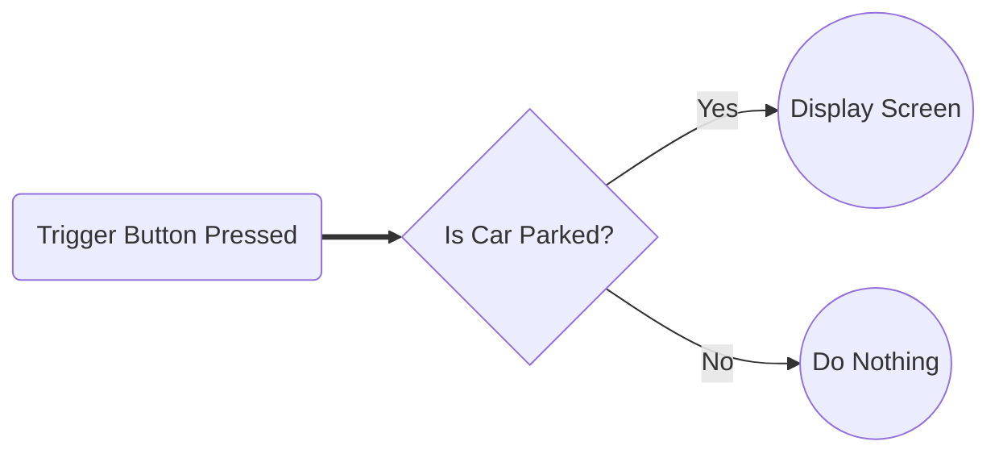

# Final Project Outline

## The Idea

Tourette Syndrome is not deadly, but ignorance about the condition can be life-threatening. For people with severe tics, their movements and vocalizations are often misinterpreted by law enforcement as intoxication or aggression, dangerously escalating encounters. I wanted to create a device to help facilitate safe interactions between law enforcement and people wtih severe tics.

The first step was to gain a strong understanding of the needs of drivers who have severe tics, as well as the perspective of law enfrocement officers at a traffic stop. To understand driver needs, I spoke with Heather Ramsey, the Tourette Association of America’s Director of Education, Support & Public Policy. She has worked extensively with law enforcement to spread awareness and education about Tourette Syndrome, and her insights were extremely valuable. She explained that the only current solution for drivers with severe tics is an information card that can be handed over to a law enforcement officer. However, there are several major problems with this solution:

- Reaching for the card takes the driver's hands out of the officer's view, potentially making the officer believe the driver is reaching for a weapon
- If a driver waits for the officer to arrive and ask for documents before taking out the card, his tics could escalate the situation before information can be provided
- If a driver have vocal tics, they may impair communication about reaching for and showing the card

**Current Card**

{: style="border-style: solid;"}

Next, I set up a time to meet with [Major Dale Greene](https://www.linkedin.com/in/dale-greene-6501266b), the [Director of Security at Charlotte Latin School](https://www.charlottelatin.org/programs/safety) and Curtis Bowers a Security Officer at Charlotte Latin School who retired from the Charlotte-Mecklenburg Police Department after 30 years of service. They provided great insights from the law enforcement perspective about what's going through an officer's mind at a traffic stop and how they are trained to handle situations with different special populations. The biggest takeaway was that an officer starts at the highest level of alert and caution possible - suspecting the worst leaves them the most prepared, but being too relaxed then encountering a dangerous scenario puts the officer's life at risk. Therefore, it is important to communicate to the officer that the driver has Tourette's as early as possible in the encounter.

Our conclusion from the discussion was that the best solution would be some device on the outside mirror of the car that informs the officer that the driver has Tourette's and they are not being aggressive or intoxicated, etc. This way the driver is not fiddling around with a device and the officer will notice the device as they're walking up to the car, diffusing the situation as early as possible. Communicating in a precise and concise manner is especially important when dealing with officers who've recieved less training with special populations.

They also recommended that I meet with a police officer from a smaller police department who has less training surrounding pedestrians with Tourette's to help guide my design towards a device that prevents escalation with an officer with any level of training.

## Weekly Plan

|Week|Contribution To Final Project|
|---|---|
|Computer Aided Design|Attachment mechanism to mirror, cup holder mechanism, screen case, (screen weatherproofing?)|
|Computer Controlled Cutting|Cup holder mechanism|
|Electronics Production|Microcontrollers for screen and trigger button|
|3D Scanning and Printing|Screen case|
|Electronics Design|Microcontrollers for screen and trigger button|
|Computer Controlled Machining|TBD|
|Embedded Programming|Programming for both microcontrollers|
|Molding and Casting|Attachment mechanism to mirror|
|Input Devices|Trigger button, accelerometer (to detect when the car is stopped), (voice activated)?|
|Output Devices|Speaker, screen, servo to move up screen|
|Networking and Communications|SMS messaging, wireless communication from button to mirror microcontroller|
|Mechanical Design|TBD|
|Interface Application and Programming|Interfacing trigger button and accelerometer with output servo, screen, and speakers|

## Rough Sketch

At first, I thought that a button on the steering wheel would require the least amount of scrambling by the driver as the officer approached.

But I ultimately decided against it because such a button would likely be accidentally pressed while driving. Instead, something that fits in the cupholder with a button that activates the machine would be a better solution.

Some other potential ideas instead of the flip-up screen I discussed with [Dr. Fagan](https://mees.charlotte.edu/directory/terence-j-fagan) were a see-through LED screen that goes over the mirror and only turns on when activated and a bendable LED screen that is released down the driver-side door when the window is rolled down.

If I still have time after making the MVP, I'd also like to create a mobile app or website that lets users customize the message displayed because this technology could be used to help people with other conditions who may have difficulty communicating with law enforcement. Also, if possible I'd like to add some mechanism to the cup holder case that expands to fit a cup holder of any size. This is not necessary for the MVP, but I'd like to work on this if time permits.

## Logic Flowchart

## Project Overhaul

I met with another law enforcement official on 2/2/23 to get his advice on my project. He suggested that a display in the back window of the car might be a better idea than on the mirror for several reasons:

- the officer is focusing on the individual inside of the vehicle - they only look at the mirror if that's their only line of visiblity - they're more likely to see the display if its in the back window
- I don't have to worry about legal considerations with the DMV for building something on the inside of a car
- I can make the screen bigger to clearly display a simple message to the officer
- I don't have to worry about weather-proofing my project

Considering these insights, I decided to go along with his idea and change the display of my project. The biggest challenges now were figuring out how to attach the project to the inside roof of the car and how to attach the motor to the display.

I originally imagined the servo motor to be placed like this where the screen flips downwards from the inside roof of the car.

I considered possibly moving the display with a sliding motion like [this](https://www.youtube.com/watch?v=aXFCkfvWTHs) and not folding it upwards, but I ended up going with the folding motion because for a lot of cars the display won't be able to move upwards considering the angle between the roof and the trunk.

For the motor itself, I am planning to make a servo-driven hinge mechanism similar to products I found while researching. [This Thingiverse page](https://www.thingiverse.com/thing:1323380/files) has the `STL` files from the video as well as a technical drawing. [This GrabCAD page](https://grabcad.com/library/servo-based-hinge-1) has 3D models also containing the servo motor itself.

I am also planning on attaching the device through suction cups to the back window, as I feel this is the easiest and most secure mechanism for holding the display in place.

## Design Shift

I met with [Dr. Fagan](https://mees.charlotte.edu/directory/terence-j-fagan) who suggested that I slightly change my design to where the motor is at the axis the screen is rotating around.

Using [this servo motor case model](https://cults3d.com/en/orders/53123748), I adapted my design. Since I'm not sure what motor I'll use yet, I didn't design the attachment mechanism between the motor shaft and the screen.

Next if the weight of my screen and case is `x`, I want to know the minimum torque for a motor to be able to turn it. [Dr. Fagan](https://mees.charlotte.edu/directory/terence-j-fagan) taught me that I can calculate the torque by multiplying the gravitational force by the distance between the axis of rotation and the center of mass, and I can ignore the angle since it starts horizontal and `sin0 (deg) = 1`. He then said I should multiply the result by a safety factor of two.

Here's my understanding of it simplified to an inequality for which I can plug in my material and design once it's finalized: `torque >= 19.6 * m * r` where `m` is the mass and `r` is the distance from the motor to the center of gravity.

## Another Idea

Also, beyond the MVP, I'd like to implement notifications when there is low battery to make sure that the user is never in a situation where the device fails during an encounter with law enforcement.