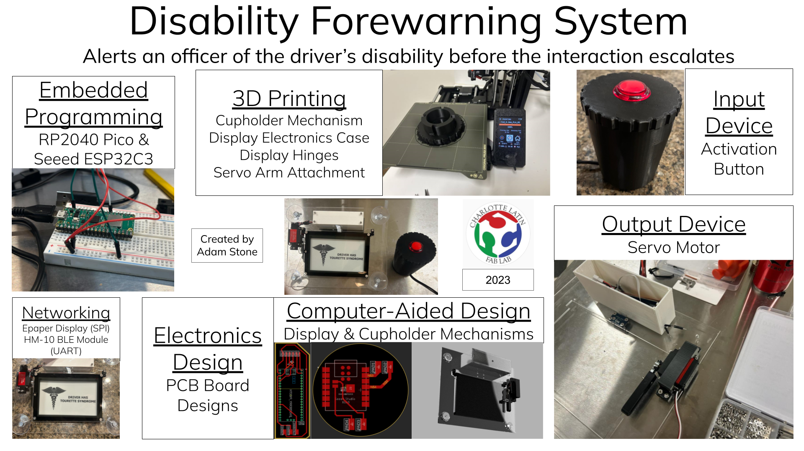

# Disability Forewarning System

Since seventh grade, I have been an active advocate for the Tourette Association of America. I understand how a moment of education can drastically improve the outcome of a situation. When I was in elementary school, I was diagnosed with Tourette Syndrome, a neurological disorder characterized by involuntary motor and vocal tics. Determined to transform an obstacle into an opportunity, I became a Youth Ambassador for the Tourette Association of America. For people with severe tics, their movements and vocalizations are often misinterpreted by law enforcement as intoxication or aggression, dangerously escalating encounters. In 2022, I was asked to help script and act in a Tourette Syndrome training video for law enforcement. While filming, I understood that this video faced obstacles in facilitating successful interactions, as not all officers would go through the training or recall the information during an encounter. I began dreaming of a device that could be a real-time advocate for people with Tourette Syndrome at a traffic stop.

When I enrolled in [Fab Academy](../fab-academy/index.md), I had the opportunity to make this dream a reality. For my final project, I created the Disability Forewarning System, a device that mounts onto the rear window of a car. The device remains out of sight until the driver presses a button that wirelessly moves a screen down, flashing the message “Driver Has Tourette Syndrome.” The Disability Forewarning System was showcased by Fab Academy as a `Featured Project` and won the `Fab Academy Best Assistive Technology Award`.

To read in-depth about the idea and plan for executing my final project, [click here](./final-project-planning.md)! To see the project summary, click [here](./project-requirements.md)!

**Final Project Presentation Video**

<video src="../../../assets/images/stem/disability-forewarning-system/final-project.mp4" controls="controls" style="max-width: 730px;">
</video>

**Final Project Presentation Slide**

