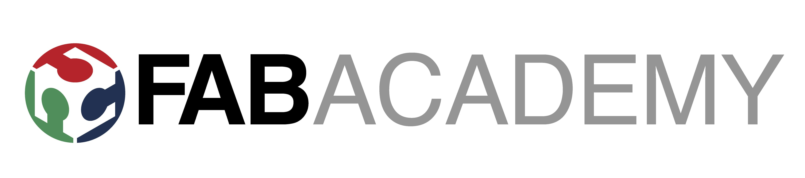

# Fab Academy

## What is Fab Academy?

[Fab Academy](https://fabacademy.org/) is a five-month digital fabrication course led by [MIT Professor Neil Gershenfeld](https://ng.cba.mit.edu/) focused on rapid-prototyping. Students create weekly projects, each focused on a digital fabrication skill ranging from 3D Printing to Molding & Casting, that culminate in a final project using all of the skills acquired.

Throughout the course, every student creates a digital portfolio website documenting their projects and course work. [Here is a link to my Fab Academy website!](https://fabacademy.org/2023/labs/charlotte/students/adam-stone/)

I graduated from Fab Academy my sophomore year. Read about my final project below!

## Disability Forewarning System

For my Fab Academy Final Project, I wanted to create something that helps people living with Tourette Syndrome. Tourette Syndrome a neurodevelopmental disorder included in the ADA that's characterized by making involuntary movements and vocalizations, called tics, and there's no cure. Tourette's affects 1-in-50 people. It ranges from very mild to very severe. For more information, see the [Tourette Association of America's website](https://tourette.org/).

My tics are mild, but for people with severe Tourette, tics can be misinterpreted by law enforcement as intoxication or aggression, dangerously escalating police encounters. I wanted to create a device that prevents escalation at a traffi stop when an officer is interacting with someone who has severe tics.

So, I created `Disability Forewarning System`. Whenever a button is pressed in the driverside cupholder of a car, a display is lowered into the rear window and an e-paper display flashes, displaying a message that informs an officer that the driver has Tourette Syndrome.

To read in-depth about the idea and plan for executing my final project, click [here](https://fabacademy.org/2023/labs/charlotte/students/adam-stone/lessons/final-project/final-project-planning/#the-idea). To see the project summary, click [here](https://fabacademy.org/2023/labs/charlotte/students/adam-stone/lessons/final-project/project-requirements/).

**Final Project Presentation Video**

<video src="../../../assets/images/stem/disability-forewarning-system/final-project.mp4" controls="controls" style="max-width: 730px;">
</video>

**Final Project Presentation Slide**

