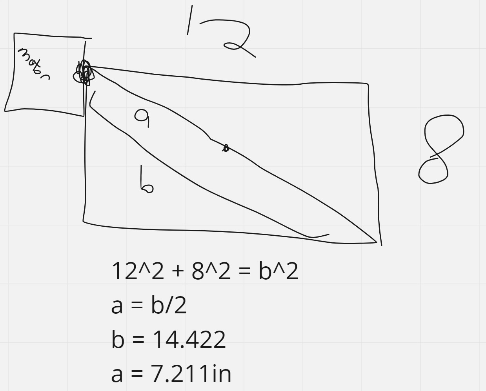

# Motor Calculations

Based off of my learning how to [calculate torque](./final-project-planning.md#design-shift), I'll find the minimum torque necessary for my project. I want to make all of my estimates conservative to be sure the motor will function smoothly.

## Estimating Weight

I'm not sure of the exact values, but I overestimate anything I'm unsure of here.

According to [this website](https://www.usplastic.com/knowledgebase/article.aspx?contentkey=884), `1/2"` acryllic is `2.879 lbs/sq. ft`.

`M = (2.879lbs/ft^2) * (12in * 8in) * (1ft / 12in)^2 * (0.453kg / 1lb) = 0.869458kg`

`r = 7.211in * (0.0254m / 1in) = 0.183m`

`torque >= 19.6 * M * r`

`torque >= 19.6 * 0.869458kg * 0.183m`

`torque >= 3.12 N m`

According to [this website](https://www.unitconverters.net/energy/newton-meter-to-kilogram-force-meter.htm), `3.12 N m * (0.1019716213 kilogram-force meter / 1 N m) = 0.318 kg-m`

`torque >= 0.318 kg-m`

So, I ordered two of [this motor](https://www.amazon.com/gp/product/B07HNTKSZT/ref=ppx_yo_dt_b_asin_image_o00_s00?ie=UTF8&psc=1). I know it's overkill, but I'm sure it will work, it has metal gears, and I was having trouble finding motors in the `~1kg` range.

I also realized that my calculations assume the center of gravity and the rotation poins have no difference in placement on the axis perpendicular to the plane of the triangle drawn above, but any small different here shouldn't make a significant impact.