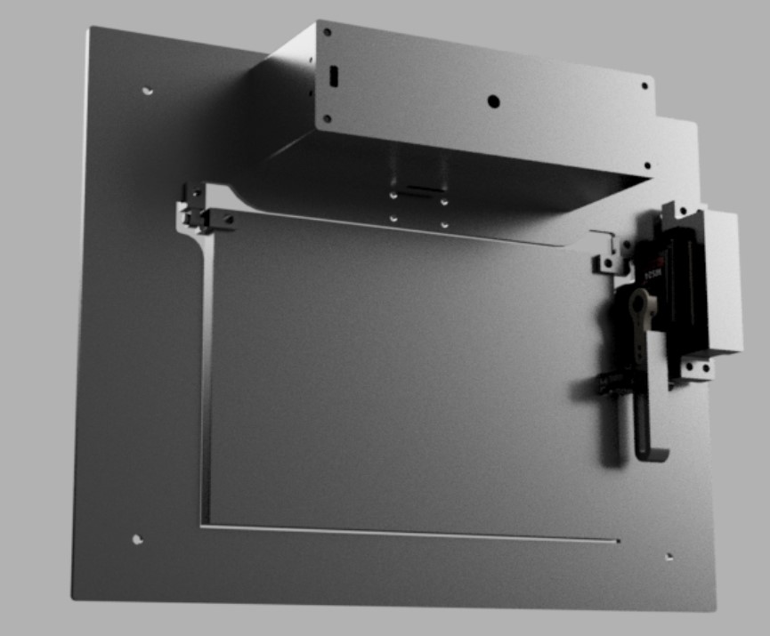
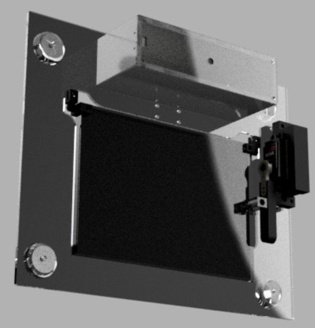
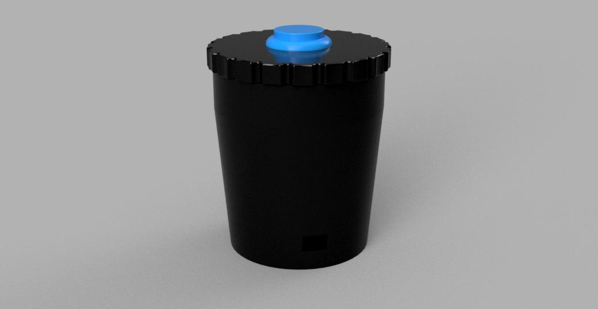

# Project Summary

## Final Project Demonstration

<video src="../../assets/images/stem/disability-forewarning-system/final-project.mp4" controls="controls" style="max-width: 730px;">
</video>

[Here's a link to a higher quality export of the video!](https://drive.google.com/file/d/1_eW-h7WXMSTnTjioNtfNBup1xtfgFQNx/view?usp=sharing)

## Essential Questions

### What does it do?

Whenever a button is pressed in the driverside cupholder of a car, a display is lowered into the rear window and an e-paper display flashes, displaying a message that informs an officer that the driver has Tourette Syndrome.

### Who’s done what beforehand?

The current solution used by the Tourette Association of America are information cards that people with Tourette can hand to a law enforcement officer, yet there are several problems with this card:

- Scrambling for the card making the officer nervous
- Escalation before the officer asks for documents
- Communication about reaching for the card if the driver has vocal tics

I met with [Major Dale Greene](https://www.linkedin.com/in/dale-greene-6501266b), the [Director of Security at Charlotte Latin School](https://www.charlottelatin.org/programs/safety) and Curtis Bowers a Security Officer at Charlotte Latin School who retired from the Charlotte-Mecklenburg Police Department after 30 years of service. They provided great insights from the law enforcement perspective about what's going through an officer's mind at a traffic stop and how they are trained to handle situations with different special populations. The biggest takeaway was that an officer starts at the highest level of alert and caution possible - suspecting the worst leaves them the most prepared, but being too relaxed then encountering a dangerous scenario puts the officer's life at risk. Therefore, it is important to communicate to the officer that the driver has Tourette's as early as possible in the encounter.

Our conclusion from the discussion was that the best solution would be some device visible to the officer walking up to the car that informs them that the driver has Tourette's and is not being aggressive or intoxicated, etc. This way the driver is not fiddling around with a device and the officer will notice the device as they're walking up to the car, diffusing the situation as early as possible. Communicating in a precise and concise manner is especially important when dealing with officers who've recieved less training with special populations.

Here are different projects I've found that have a similar e-paper display so that I can have a starting place for the mounting desing.

- [Instructable YouTube Subscriber Counter](https://www.instructables.com/YouTube-Subscriber-Counter-Using-an-E-Paper-Displa/)
- [E-paper Picture Frame](https://www.instructables.com/E-paper-Picture-Frame/)
- [Design Files for the Picture Frame](https://github.com/drtonis/5.65inch-E-ink-Photoframe/tree/main/STL)

### What did you design and what parts and systems were made?

**Parts and Systems Designed and Made:**

- [Cupholder Electronics Casing](./cupholder-mechanism.md#3d-printing), also see [here](./cupholder-electronics.md#code-and-casing)
- [Cupholder Electronics - PCB](./cupholder-electronics.md)
- [Display Electronics Casing](./display-mechanics.md#electronics-case)
- [Display Frame](./display-mechanics.md#frame)
- [Epaper Casing](./display-mechanics.md#display-case)
- [Display Electronics - PCB, Wiring](./display-electronics.md)

**Parts and Systems Bought:**

- Button
- Suction cups
- Microcontrollers (RP2040 & ESP32C3)
- Epaper Display
- Battery Recharging Module
- Batteries
- Servo Motor

### What materials and components were used, where did they come from, how much did they cost?

See the Bill-Of-Materials [here](https://fabacademy.org/2023/labs/charlotte/students/adam-stone/lessons/week16/applications-and-implications/#bom-table)!

|Item|Count|Use|Cost|Link|
|--|--|--|--|--|
|7.5" E-Paper Display|1|Display message in rear window|$57.99|[WaveShare](https://www.waveshare.com/pico-epaper-7.5.htm)|
|6"X8"X1/8" Sheets of Black Acryllic|3|Case for display|$22.56|[Amazon](https://www.amazon.com/SimbaLux-Acrylic-Plexiglass-Protective-Projects/dp/B084T7BS8L/ref=sr_1_4?keywords=black+acrylic&qid=1685221551&sr=8-4) (more than necessary)|
|11"X19X"1/8" Sheets of Clear Acryllic|2|Frame for display|$29.99|[Amazon](https://www.amazon.com/NIUBEE-Acrylic-Plexiglass-Plastic-Perspex/dp/B07K8PX5J3/ref=sr_1_1_sspa?keywords=acrylic+sheet&qid=1685574344&sr=8-1-spons&psc=1&spLa=ZW5jcnlwdGVkUXVhbGlmaWVyPUEyOEU2UlVENVdBRzAwJmVuY3J5cHRlZElkPUEwNjIxMzg0MU44RUtQR0JMUVgxUiZlbmNyeXB0ZWRBZElkPUEwNTkyNTk4MzFJUzFCMjUwNlZKWSZ3aWRnZXROYW1lPXNwX2F0ZiZhY3Rpb249Y2xpY2tSZWRpcmVjdCZkb05vdExvZ0NsaWNrPXRydWU=) (more than necessary)|
|20kg Servo Motor|1|Moving display|$11.99|[Amazon](https://www.amazon.com/gp/product/B07HNTKSZT/ref=ppx_yo_dt_b_asin_image_o00_s00?ie=UTF8&psc=1)|
|Raspberry Pi Pico RP2040|1|Display electronics|$9.95|[Amazon](https://www.amazon.com/Raspberry-Pi-Pico-RP2040-microcontroller/dp/B08W3SH4TD/ref=asc_df_B08W3SH4TD/?tag=hyprod-20&linkCode=df0&hvadid=647248209079&hvpos=&hvnetw=g&hvrand=16994243826523925205&hvpone=&hvptwo=&hvqmt=&hvdev=c&hvdvcmdl=&hvlocint=&hvlocphy=9009996&hvtargid=pla-1293310941961&psc=1&gclid=Cj0KCQjwjryjBhD0ARIsAMLvnF8y_G7JwJv5dowJmZlFqpp8g96uZlDOeP2Umz1jH8EKPLw41J7jJxcaArugEALw_wcB)|
|Seeed Studio XIAO ESP32C3|1|Cup Holder Electronics|$9.90|[Amazon](https://www.amazon.com/Seeed-Studio-XIAO-ESP32C3-Microcontroller/dp/B0B94JZ2YF/ref=sr_1_1_sspa?keywords=esp32c3&qid=1685039659&sr=8-1-spons&psc=1&spLa=ZW5jcnlwdGVkUXVhbGlmaWVyPUEzUlg0WjMzU0xLNURUJmVuY3J5cHRlZElkPUEwMTUzMzU2MklTSFAzUkw5NTJCMiZlbmNyeXB0ZWRBZElkPUEwMzIwNDgyMVVNWU1VTklWTjVUSiZ3aWRnZXROYW1lPXNwX2F0ZiZhY3Rpb249Y2xpY2tSZWRpcmVjdCZkb05vdExvZ0NsaWNrPXRydWU=)|
|TP4056 Lithium Battery Charger Module|1 set of 2|Battery recharging|$10.99|[Amazon](https://www.amazon.com/Lind-Kitchen-Charging-Lithium-Battery/dp/B0BVFK5T2Z/ref=sr_1_1_sspa?crid=F5AMEBLJSMUO&keywords=tp4056&qid=1685987558&s=hi&sprefix=tp4056%2Ctools%2C75&sr=1-1-spons&psc=1&spLa=ZW5jcnlwdGVkUXVhbGlmaWVyPUFGNlRaQUkzMVZFMjImZW5jcnlwdGVkSWQ9QTA1MDI4NDMxSzVDTElBOUFXOUxLJmVuY3J5cHRlZEFkSWQ9QTAwMTU2NjIxMlBZQkQ0SzhMWkFTJndpZGdldE5hbWU9c3BfYXRmJmFjdGlvbj1jbGlja1JlZGlyZWN0JmRvTm90TG9nQ2xpY2s9dHJ1ZQ==)|
|Lipo Battery|2|Powering electronics|$46.48|[Amazon](https://www.amazon.com/2500mAh-Battery-Rechargeable-Lithium-Connector/dp/B09LHC6ZXT)|
|HM-10 BLE Module|1|Wireless communication|$10.99|[Amazon](https://www.amazon.com/gp/product/B06WGZB2N4/ref=ppx_yo_dt_b_search_asin_image?ie=UTF8&psc=1)|
|Screws and hex nuts|--|Assembly|--|--|
|PCB Copper|--|PCB boards|--|--|
|Black PLA Filament|--|3D printing|--|--|
|White PLA Filament|--|3D printing|--|--|

**Total Cost: $210.84**

### What processes were used?

- 2D Design
    - [Laser Cutting with Cuttle](./display-mechanics.md#finding-similar-examples)
    - Electronics Design with EagleCAD
        - [Cupholder Electronics](./cupholder-electronics.md#code-and-casing)
        - [Display Electronics](./display-electronics.md#designing-in-eaglecad)
- 3D Design
    - 3D Printing with Fusion 360
        - [Cupholder](./cupholder-mechanism.md#3d-printing)
        - [Display Hinges](./display-mechanics.md#pins)
        - [Servo Arm Attachment](./display-mechanics.md#servo-arm-attachment)
        - [Servo Mount](./display-mechanics.md#servo-mount)
    - Full CAD Models
        - [Cupholder CAD](./cupholder-electronics.md#rechargeable-batteries)
        - [Display CAD](./display-mechanics.md)

<!-- Import the component -->

<!-- Use it like any other HTML element -->
<model-viewer id="mv-demo" shadow-intensity="1" src="../../../3d-viewer-files/cupholder.glb"
alt="A 3D model of an astronaut" auto-rotate camera-controls
poster="./spacesuit.jpg"></model-viewer>

<model-viewer id="mv-demo" shadow-intensity="1" src="../../../3d-viewer-files/display.glb"
alt="A 3D model of an astronaut" auto-rotate camera-controls
poster="./spacesuit.jpg"></model-viewer>

{style="width: 250px;"}

{style="width: 250px;"}

{style="width: 250px;"}

- Additive Fabrication
    - 3D Printing
        - [Cupholder](./cupholder-mechanism.md#3d-printing)
        - [Display Hinges](./display-mechanics.md#pins)
        - [Servo Arm Attachment](./display-mechanics.md#servo-arm-attachment)
        - [Servo Mount](./display-mechanics.md#servo-mount)
- Subtractive Fabrication
    - [Laser Cutting](./display-mechanics.md#laser-cutting)
    - Milling
        - [Cupholder Electronics](./cupholder-electronics.md#code-and-casing)
        - [Display Electronics](./display-electronics.md#milling-the-board)
- Electronics Design
    - EagleCAD
        - [Cupholder Electronics](./cupholder-electronics.md#code-and-casing)
        - [Display Electronics](./display-electronics.md#designing-in-eaglecad)
- Electronics Production
    - Candle
        - [Cupholder Electronics](./cupholder-electronics.md#code-and-casing)
        - [Display Electronics](./display-electronics.md#milling-the-board)
- Embedded Microcontroller Interfacing and Programming
    - Programming
        - [Arduino/C++](./wireless-communication.md)
        - [MicroPython](./wireless-communication.md)
    - Networking
        - [UART](./wireless-communication.md#hm-10-bluetooth-module)
        - [SPI](./display-electronics.md#75-pico-display)
        - [Bluetooth Low Energy](./wireless-communication.md#hm-10-bluetooth-module)
- System Integration and Packaging
    - [Electronics Integration](./combining-electronics.md)
    - [System Assembly](./display-mechanics.md#putting-it-together)
    - Electronics Casing
        - [Cupholder Electronics](./cupholder-electronics.md#code-and-casing)
        - [Display Electronics](./display-mechanics.md#electronics-case)

### What questions were answered?

- [How will the display be mounted in the car?](./display-mechanics.md#suction-cup-attachment)
- [How will the microcontrollers communicate wirelessly?](./wireless-communication.md#hm-10-bluetooth-module)
- [What torque is required from the servo motor?](./motor-calculations.md#motor-calculations)

### What worked? What didn’t?

The entire premise of the project was successfuly, including the trigger mechanism in the cupholder, the moving display, the message and image on the display, and the mounting mechanism. Throughout the process I had many smaller failures documented on their respective pages, but in the end, the only systems that weren't functioning were those beyond the MVP which I didn't get an opportunity to complete, including iPhone alerts when the system is activating and an app that interfaces with the display to customize the message, although these systems can be implemented in future improvements upon the project.

### How was it evaluated?

During [Applications and Implications Week](https://fabacademy.org/2023/labs/charlotte/students/adam-stone/lessons/week16/applications-and-implications/#how-will-the-project-be-evaluated), I said the project would be successful if it met all of the following criteria:

- When the button is pressed, the display is moved into the rear window
- There is a message shown on the display
- The display is visible from behind the car

All of these criteria are met, so the project is successful!

### What are the implications?

The technology developed through this project can be expanded to all different conditions when informing officers at a traffic stop, including deaf, austistic, and other groups. I hope that collaboration with different organizations will distribute the product to people whose lives it will benefit.

### What license was chosen?

The work is licensed under a [Creative Commons Attribution-NonCommercial 4.0 International License](https://creativecommons.org/licenses/by-nc/4.0/).
