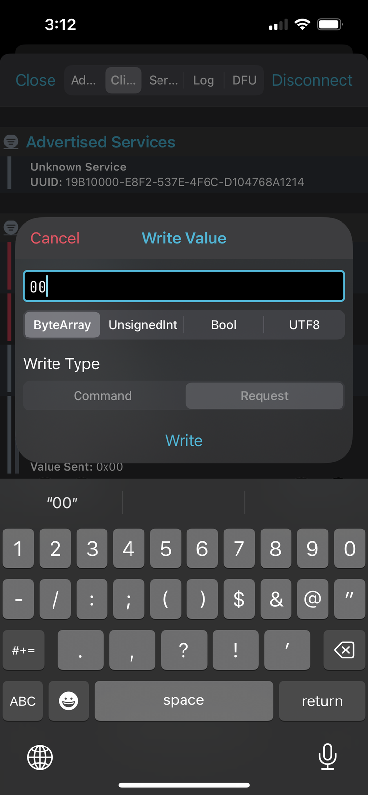
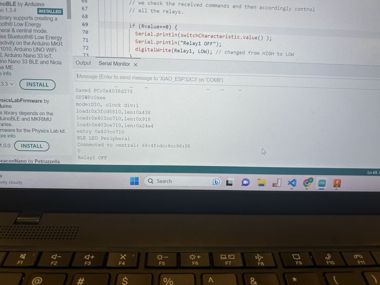
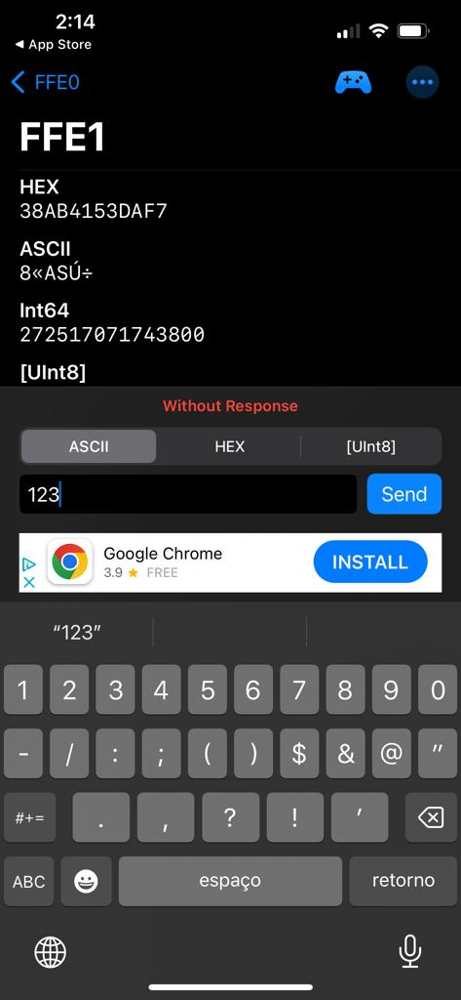
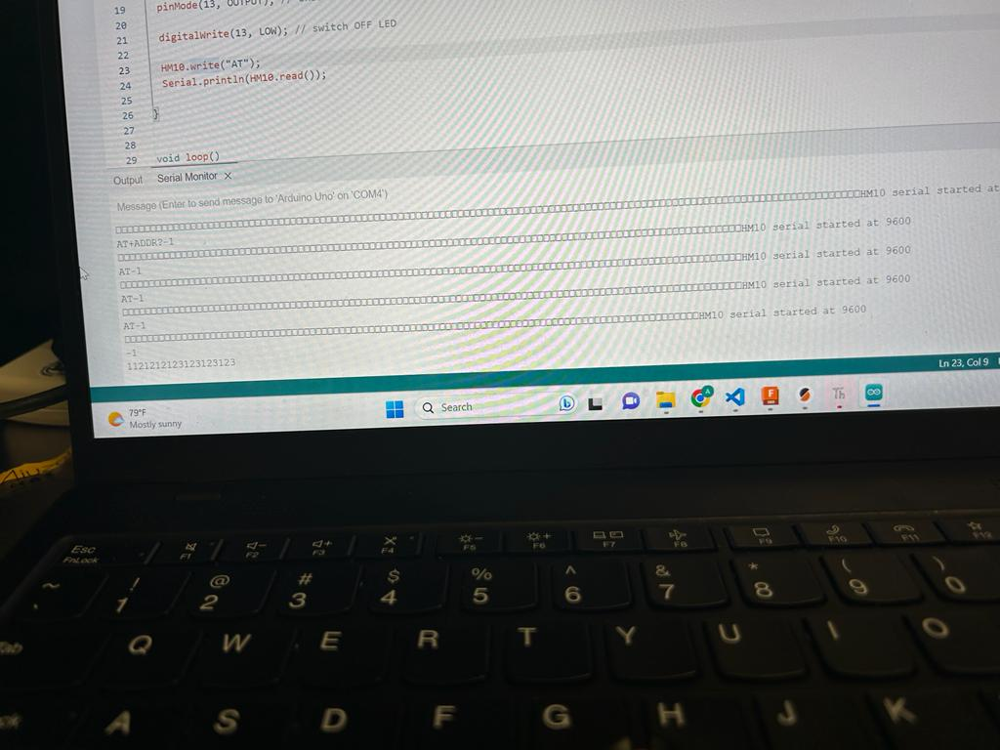
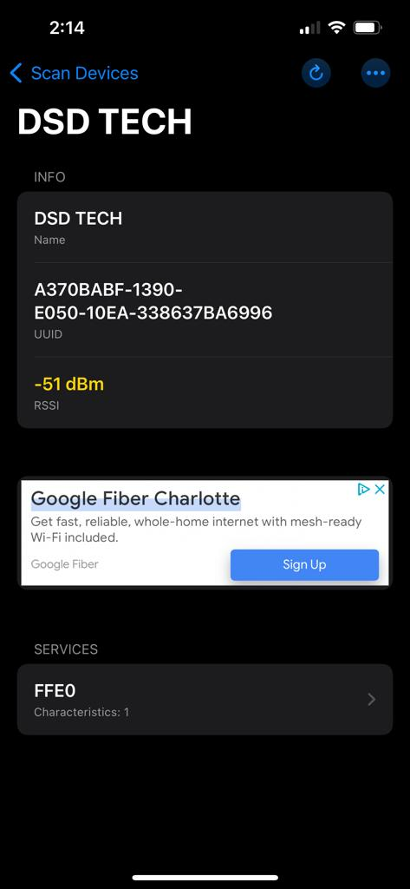
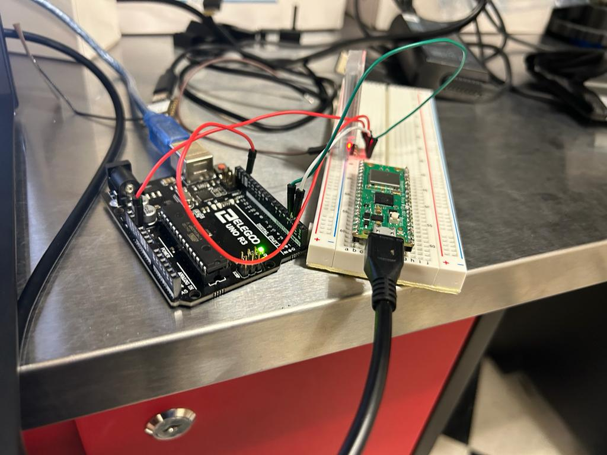
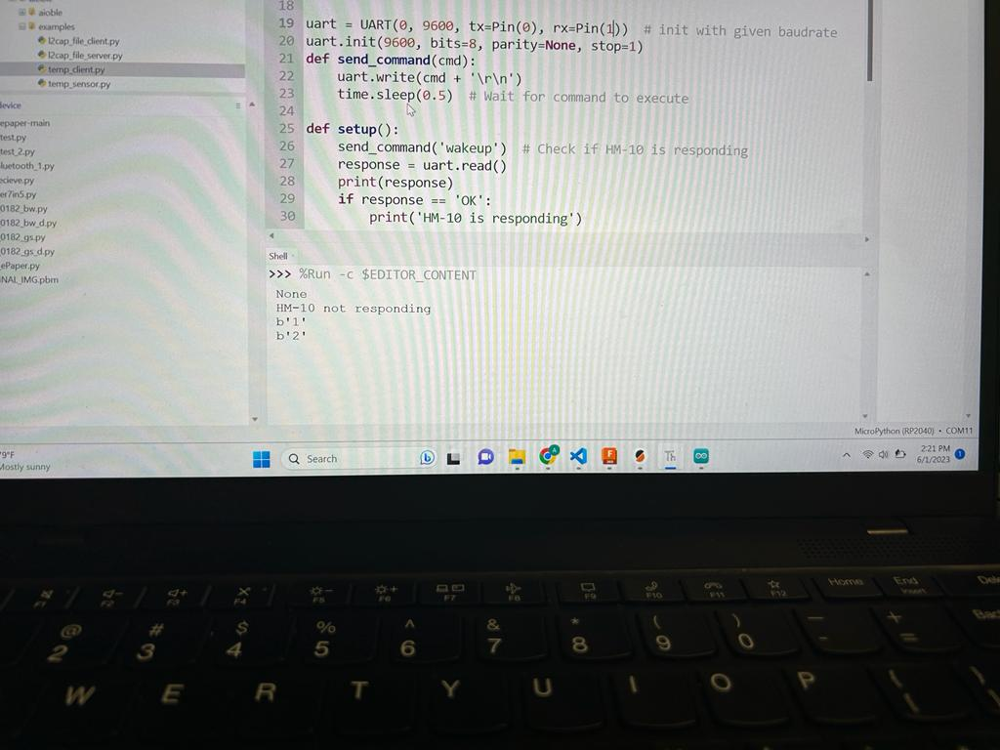

# Wireless Communication

I used the code from [this website](https://www.electroniclinic.com/xiao-esp32c3-bluetooth-tutorial-range-test-and-home-automation/) for the ESP32C3. I also installed the [ArduinoBLE](https://www.arduino.cc/reference/en/libraries/arduinoble/) package in the Arduino IDE through the package manager.

I then downloaded the `rNF Connect` app on my phone and followed the instructions in the tutorial, which worked!





Working ESP32C3 code:

```cpp
#include <ArduinoBLE.h>
 
BLEService ledService("19B10000-E8F2-537E-4F6C-D104768A1214"); // Bluetooth® Low Energy LED Service
 6
// Bluetooth® Low Energy LED Switch Characteristic - custom 128-bit UUID, read and writable by central
BLEByteCharacteristic switchCharacteristic("19B10001-E8F2-537E-4F6C-D104768A1214", BLERead | BLEWrite);
 
const int Relay1 = D2; 
const int Relay2 = D3; 
const int Relay3 = D4; 
const int Relay4 = D5; 
 
int Rvalue; // received value from Bluetooth Application
 
 
void setup() {
  Serial.begin(9600); //Baudrate
   
  // Set all the Relays as output
  pinMode(Relay1, OUTPUT);
   pinMode(Relay2, OUTPUT);
     pinMode(Relay3, OUTPUT);
   pinMode(Relay4, OUTPUT);
   
  // begin initialization
  if (!BLE.begin()) {
    Serial.println("starting Bluetooth® Low Energy module failed!");
 
    while (1);
  }
 
  // set advertised local name and service UUID:
  BLE.setLocalName("AdamsBluetoothESP32C3");            // this will appear in the App search result.
  BLE.setAdvertisedService(ledService);
 
  // add the characteristic to the service
  ledService.addCharacteristic(switchCharacteristic);
 
  // add service
  BLE.addService(ledService);
 
  // set the initial value for the characeristic:
  switchCharacteristic.writeValue(0);
 
  // start advertising
  BLE.advertise();
 
  Serial.println("BLE LED Peripheral");
}
 
void loop() {
  // listen for Bluetooth® Low Energy peripherals to connect:
  BLEDevice central = BLE.central();
 
  // if a central is connected to peripheral:
  if (central) {
    Serial.print("Connected to central: ");
    // print the central's MAC address:
    Serial.println(central.address());
 
    
  while (central.connected()) {
        if (switchCharacteristic.written()) {
          Rvalue=switchCharacteristic.value(); // received value is stored in variable Rvalue.
          Serial.print(Rvalue);
          Serial.println(" recieved!");
        }
      }
 
    // when the central disconnects, print it out:
    Serial.print(F("Disconnected from central: "));
    Serial.println(central.address());
  }
}
```

Some other forums revealed that HC-05's Bluetooth isn't supported by Apple, so I couldn't test whether this code works. This code (and the wiring) is based off of [this website](https://www.hackster.io/diyprojectslab/hc-05-bluetooth-with-raspberry-pi-pico-using-micropython-a5b152).

```py
from machine import Pin, UART

print("Something is happening")

uart = UART(0, 9600)
led = Pin(13, Pin.OUT)

while True:
  if uart.any() > 0:
    data = uart.read()
    print(data)
    if "on" in data:
      led.value(1)
      print('LED on \n')
      uart.write('LED on \n')
    elif "off" in data:
      led.value(0)
      print('LED off \n')
      uart.write('LED off \n')"""
```

ChatGPT said that the HC-05 can't use BLE, and gave me the following code to run instead on the ESP32. I also could order the HM-10 module instead, but I'll try the other solution for now. After I had it write the code it said it make a mistake and the ESP32C3 specifically doesn't support non-BLE bluetooth communication.

Here's code written for the MicroPython.

```py
from machine import Pin, UART
import time

uart = UART(0, 9600)  # The HM-10 uses a baud rate of 9600 by default

# Send AT commands to the HM-10 module to connect to the ESP32C3
# Replace the MAC address below with the MAC address of your ESP32C3
uart.write('AT+CONMAC_address_of_your_ESP32C3\n')
time.sleep(1) # Waiting for the connection to be established

while True:
    # Send a message to the ESP32C3
    message = "Hello, ESP32C3!"
    uart.write(message)
    
    # Wait for a second before sending the next message
    time.sleep(1)
    
    # Read any incoming messages
    if uart.any():
        data = uart.read()
        print(data)
```

Here's the code it wrote to figure out the address of the esp32c3.

```cpp
#include <WiFi.h>

void setup() {
  Serial.begin(115200);
  delay(1000);

  // Print ESP32 Local MAC Address
  Serial.printf("ESP32C3 MAC Address: %s\n", WiFi.macAddress().c_str());
}

void loop() {
}
```

Here was the output!

```cmd
34:85:18:00:8C:98
```

And based on that, here's the new MicroPython code:

```py
from machine import Pin, UART
import time

uart = UART(0, 9600)  # The HM-10 uses a baud rate of 9600 by default

# Send AT commands to the HM-10 module to connect to the ESP32C3
uart.write('AT+CON348518008C98\n')
time.sleep(1) # Waiting for the connection to be established

while True:
    # Send a message to the ESP32C3
    message = "Hello, ESP32C3!"
    uart.write(message)
    
    # Wait for a second before sending the next message
    time.sleep(1)
    
    # Read any incoming messages
    if uart.any():
        data = uart.read()
        print(data)
```

I asked to confirm that the original ESP32C3 code was *advertising* the BLE connection, and here was its affirmative response.

```txt
Yes, the original code you provided for the ESP32C3 does advertise it. The following line in the setup function starts the advertising process:
```
```cpp
BLE.advertise();
```
```txt
This line makes the ESP32C3 visible to other BLE devices, which allows the HM-10 module to discover and connect to it.

Moreover, the following line sets a local name for the device which can be helpful while scanning:
```
```cpp
BLE.setLocalName("AdamsBluetoothESP32C3");
```
```txt
When a BLE device such as the HM-10 scans for nearby devices, it will see a device named "AdamsBluetoothESP32C3". This is the name of your ESP32C3.
```

ChatGPT wrote the following code.

```py
from machine import UART, Pin
import time

uart = UART(0, 9600)  # init with given baudrate

def send_command(cmd):
    uart.write(cmd + '\r\n')
    time.sleep(0.5)  # Wait for command to execute

def setup():
    send_command('AT')  # Check if HM-10 is responding
    response = uart.read()
    if response == 'OK':
        print('HM-10 is responding')
    else:
        print('HM-10 not responding')

    send_command('AT+ROLE1')  # Set HM-10 to central role

    # Assuming you know the address of your peripheral
    # Replace the X's with the address of your peripheral
    send_command('AT+CON348518008C98\n')  

def loop():
    while True:
        if uart.any():  # If there's data on UART
            data = uart.read()
            print('Received:', data)
            # Process data here
            
        # Add your own data sending logic here
        # uart.write('Data to send')
        time.sleep(0.1)

if __name__ == "__main__":
    setup()
    loop()
```

And I used this for the ESP32-C3.

```py
#include <ArduinoBLE.h>

BLEService ledService("19B10000-E8F2-537E-4F6C-D104768A1214"); // Bluetooth® Low Energy LED Service
 
// Bluetooth® Low Energy LED Switch Characteristic - custom 128-bit UUID, read and writable by central
BLEByteCharacteristic switchCharacteristic("19B10001-E8F2-537E-4F6C-D104768A1214", BLERead | BLEWrite);

const int Relay1 = D2; 
const int Relay2 = D3; 
const int Relay3 = D4; 
const int Relay4 = D5; 

int Rvalue; // received value from Bluetooth Application


void setup() {
  Serial.begin(9600); //Baudrate

  // Set all the Relays as output
  pinMode(Relay1, OUTPUT);
   pinMode(Relay2, OUTPUT);
     pinMode(Relay3, OUTPUT);
   pinMode(Relay4, OUTPUT);

  // begin initialization
  if (!BLE.begin()) {
    Serial.println("starting Bluetooth® Low Energy module failed!");

    while (1);
  }

  // set advertised local name and service UUID:
  BLE.setLocalName("AdamsBluetoothESP32C3");            // this will appear in the App search result.
  BLE.setAdvertisedService(ledService);

  // add the characteristic to the service
  ledService.addCharacteristic(switchCharacteristic);

  // add service
  BLE.addService(ledService);

  // set the initial value for the characeristic:
  switchCharacteristic.writeValue(0);

  // start advertising
  BLE.advertise();

  Serial.println("BLE LED Peripheral");
}

void loop() {
  // listen for Bluetooth® Low Energy peripherals to connect:
  BLEDevice central = BLE.central();

  // if a central is connected to peripheral:
  if (central) {
    Serial.print("Connected to central: ");
    // print the central's MAC address:
    Serial.println(central.address());


  while (central.connected()) {
        if (switchCharacteristic.written()) {
          Rvalue=switchCharacteristic.value(); // received value is stored in variable Rvalue.
          Serial.print(Rvalue);
          Serial.println(" recieved!");
        }
      }

    // when the central disconnects, print it out:
    Serial.print(F("Disconnected from central: "));
    Serial.println(central.address());
  }
}
```

## HM-10 Bluetooth Module

I found [this page](https://docs.micropython.org/en/latest/library/bluetooth.html) updated today (6/1)! In the [page source](https://docs.micropython.org/en/latest/_sources/library/bluetooth.rst.txt) I saw a link to [this GitHub repo](https://github.com/micropython/micropython-lib/tree/master/micropython/bluetooth/aioble). I downloaded the entire repo as a zip file. Unfortunately, the bluetooth module wasn't recognized even though the repo said I needed only `1.17` MicroPython or higher. However, the original documentation said some features may not have been released yet.

I used the [Bluetooth Terminal](https://apps.apple.com/us/app/bluetooth-terminal/id1058693037) app on my iPhone and saw the name of the module was `DSD TECH` and the UUID (which [this post](https://softwareengineering.stackexchange.com/questions/442344/can-a-uuid-be-called-a-constant#:~:text=A%20UUID%20is%20not%20a%20constant%2C%20because%20constants%20are%20identifiers.) revealed is not constant) was `A370BABF-1390-E050-10EA-338637BA6996`.

I also realized that the red light flashing when it's not connected and contantly on when it is.

Sending the `AT` commands from [this source](https://electrocredible.com/raspberry-pi-pico-serial-uart-micropython/), [this source](https://www.instructables.com/How-to-Use-Bluetooth-40-HM10/), [this source](https://people.ece.cornell.edu/land/courses/ece4760/PIC32/uart/HM10/DSD%20TECH%20HM-10%20datasheet.pdf), [this source](https://www.youtube.com/watch?v=SosEZTOwPD0), and [thi ssource](https://docs.micropython.org/en/latest/_sources/library/bluetooth.rst.txt) never worked for me, although I could read information from UART.











Here's the working MicroPython code.

```py
from machine import UART, Pin
import time

uart = UART(0, 9600, tx=Pin(0), rx=Pin(1))  # init with given baudrate
uart.init(9600, bits=8, parity=None, stop=1)
def send_command(cmd):
    uart.write(cmd + '\r\n')
    time.sleep(0.5)  # Wait for command to execute

def setup():
    send_command('wakeup')  # Check if HM-10 is responding
    response = uart.read()
    print(response)
    if response == 'OK':
        print('HM-10 is responding')
    else:
        print('HM-10 not responding')

    send_command('AT+ROLE1')  # Set HM-10 to central role

    # Assuming you know the address of your peripheral
    # Replace the X's with the address of your peripheral
    send_command('AT+CON348518008C98\n')  

def loop():
    while True:
        if uart.any():
            print(uart.readline())

if __name__ == "__main__":
    setup()
    loop()
```

Here was the Arduino Uno code that worked.

```py
#include <SoftwareSerial.h>

SoftwareSerial HM10(2, 3); // RX = 2, TX = 3

char appData;  

String inData = "";

void setup()

{

  Serial.begin(9600);

  Serial.println("HM10 serial started at 9600");

  HM10.begin(9600); // set HM10 serial at 9600 baud rate

  pinMode(13, OUTPUT); // onboard LED

  digitalWrite(13, LOW); // switch OFF LED
 

}


void loop()

{

  HM10.listen();  // listen the HM10 port

  while (HM10.available() > 0) {   // if HM10 sends something then read

    appData = HM10.read();

    inData = String(appData);  // save the data in string format

    Serial.write(appData);

  }


 

  if (Serial.available()) {           // Read user input if available.

    delay(10);

    HM10.write(Serial.read());

  }

  if ( inData == "F") {

    Serial.println("LED OFF");

    digitalWrite(13, LOW); // switch OFF LED

    delay(500);

  }

  if ( inData == "N") {

    Serial.println("LED ON");

    digitalWrite(13, HIGH); // switch ON LED

    delay(500);

    digitalWrite(13, HIGH); // switch ON LED

    delay(500);

    digitalWrite(13, LOW); // switch OFF LED

    delay(500);
    
    digitalWrite(13, HIGH); // switch ON LED

    delay(500);
    
    digitalWrite(13, LOW); // switch OFF LED

    delay(500);
    
    digitalWrite(13, HIGH); // switch ON LED

    delay(500);
    
    digitalWrite(13, LOW); // switch OFF LED

    delay(500);
    
    digitalWrite(13, HIGH); // switch ON LED

    delay(500);
    
    digitalWrite(13, LOW); // switch OFF LED

    delay(500);
    
    digitalWrite(13, HIGH); // switch OFF LED

    delay(500);

    

  }

}

```

ChatGPT revised the ESP32C3's code to connect to the bluetooth module named `DSD TECH`, and it worked first try!

```cpp
#include <ArduinoBLE.h>

BLEService ledService("19B10000-E8F2-537E-4F6C-D104768A1214"); 
BLEByteCharacteristic switchCharacteristic("19B10001-E8F2-537E-4F6C-D104768A1214", BLERead | BLEWrite);

const int Relay1 = D2; 
const int Relay2 = D3; 
const int Relay3 = D4; 
const int Relay4 = D5;

int Rvalue;

void setup() {
  Serial.begin(9600); 

  pinMode(Relay1, OUTPUT);
  pinMode(Relay2, OUTPUT);
  pinMode(Relay3, OUTPUT);
  pinMode(Relay4, OUTPUT);

  if (!BLE.begin()) {
    Serial.println("starting Bluetooth failed!");
    while (1);
  }

  ledService.addCharacteristic(switchCharacteristic);
  BLE.addService(ledService);
  switchCharacteristic.writeValue(0);

  Serial.println("Scanning...");

  BLE.scanForName("DSD TECH");
}

void loop() {
  // check if a peripheral has been discovered
  BLEDevice peripheral = BLE.available();

  if (peripheral) {
    // discovered a peripheral
    Serial.print("Found ");
    Serial.print(peripheral.address());
    Serial.print(" '");
    Serial.print(peripheral.localName());
    Serial.println("'");

    // if the peripheral is named "DSD TECH", connect to it
    if (peripheral.localName() == "DSD TECH") {
      Serial.println("Connecting ...");

      if (peripheral.connect()) {
        Serial.println("Connected");
        // if connected, do something with the peripheral:
        // for example, read or write a characteristic
      } else {
        Serial.println("Failed to connect!");
      }
    }
  }
}
```

It then wrote this code to send a message.

```cpp
#include <ArduinoBLE.h>

BLEService ledService("19B10000-E8F2-537E-4F6C-D104768A1214"); 
BLEByteCharacteristic switchCharacteristic("19B10001-E8F2-537E-4F6C-D104768A1214", BLERead | BLEWrite);

const int Relay1 = D2; 
const int Relay2 = D3; 
const int Relay3 = D4; 
const int Relay4 = D5;

int Rvalue;

void setup() {
  Serial.begin(9600); 

  pinMode(Relay1, OUTPUT);
  pinMode(Relay2, OUTPUT);
  pinMode(Relay3, OUTPUT);
  pinMode(Relay4, OUTPUT);

  if (!BLE.begin()) {
    Serial.println("starting Bluetooth failed!");
    while (1);
  }

  ledService.addCharacteristic(switchCharacteristic);
  BLE.addService(ledService);
  switchCharacteristic.writeValue(0);

  Serial.println("Scanning...");

  BLE.scanForName("DSD TECH");
}

void loop() {
  // check if a peripheral has been discovered
  BLEDevice peripheral = BLE.available();

  if (peripheral) {
    // discovered a peripheral
    Serial.print("Found ");
    Serial.print(peripheral.address());
    Serial.print(" '");
    Serial.print(peripheral.localName());
    Serial.println("'");

    // if the peripheral is named "DSD TECH", connect to it
    if (peripheral.localName() == "DSD TECH") {
      Serial.println("Connecting ...");

      if (peripheral.connect()) {
        Serial.println("Connected");
        // if connected, do something with the peripheral:

        // discover peripheral attributes
        if (peripheral.discoverAttributes()) {
          // get the remote characteristic by its UUID
          BLECharacteristic remoteCharacteristic = peripheral.characteristic("19B10001-E8F2-537E-4F6C-D104768A1214");

          if (remoteCharacteristic) {
            uint8_t value = 1;
            if (remoteCharacteristic.canWrite()) {
              remoteCharacteristic.writeValue(value);
              Serial.println("Sent value to remote characteristic");
            } else {
              Serial.println("Remote characteristic is not writable");
            }
          } else {
            Serial.println("Remote characteristic not found");
          }
        } else {
          Serial.println("Attribute discovery failed");
        }
      } else {
        Serial.println("Failed to connect!");
      }
    }
  }
}
```

But it didn't work, so it revised it to the following.

[This repo](https://github.com/arduino-libraries/ArduinoBLE/blob/master/examples/Central/PeripheralExplorer/PeripheralExplorer.ino)

```cpp
#include <ArduinoBLE.h>

void setup() {
  Serial.begin(9600);
  while (!Serial);

  // begin initialization
  if (!BLE.begin()) {
    Serial.println("starting Bluetooth® Low Energy module failed!");

    while (1);
  }

  Serial.println("Bluetooth® Low Energy Central - Peripheral Explorer");

  // start scanning for peripherals
  BLE.scan();
}

void loop() {
  // check if a peripheral has been discovered
  BLEDevice peripheral = BLE.available();

  if (peripheral) {
    // discovered a peripheral, print out address, local name, and advertised service
    Serial.print("Found ");
    Serial.print(peripheral.address());
    Serial.print(" '");
    Serial.print(peripheral.localName());
    Serial.print("' ");
    Serial.print(peripheral.advertisedServiceUuid());
    Serial.println();

    // see if peripheral is a LED
    if (peripheral.localName() == "DSD TECH") { //LED
      // stop scanning
      BLE.stopScan();

      explorerPeripheral(peripheral);

      // peripheral disconnected, we are done
      while (1) {
        // do nothing
      }
    }
  }
}

void explorerPeripheral(BLEDevice peripheral) {
  // connect to the peripheral
  Serial.println("Connecting ...");

  if (peripheral.connect()) {
    Serial.println("Connected");
  } else {
    Serial.println("Failed to connect!");
    return;
  }

  // discover peripheral attributes
  Serial.println("Discovering attributes ...");
  if (peripheral.discoverAttributes()) {
    Serial.println("Attributes discovered");
  } else {
    Serial.println("Attribute discovery failed!");
    peripheral.disconnect();
    return;
  }

  // read and print device name of peripheral
  Serial.println();
  Serial.print("Device name: ");
  Serial.println(peripheral.deviceName());
  Serial.print("Appearance: 0x");
  Serial.println(peripheral.appearance(), HEX);
  Serial.println();

  // loop the services of the peripheral and explore each
  for (int i = 0; i < peripheral.serviceCount(); i++) {
    BLEService service = peripheral.service(i);

    exploreService(service);
  }

  Serial.println();

  // we are done exploring, disconnect
  Serial.println("Disconnecting ...");
  peripheral.disconnect();
  Serial.println("Disconnected");
}

void exploreService(BLEService service) {
  // print the UUID of the service
  Serial.print("Service ");
  Serial.println(service.uuid());

  // loop the characteristics of the service and explore each
  for (int i = 0; i < service.characteristicCount(); i++) {
    BLECharacteristic characteristic = service.characteristic(i);

    exploreCharacteristic(characteristic);
  }
}

void exploreCharacteristic(BLECharacteristic characteristic) {
  // print the UUID and properties of the characteristic
  Serial.print("\tCharacteristic ");
  Serial.print(characteristic.uuid());
  Serial.print(", properties 0x");
  Serial.print(characteristic.properties(), HEX);

  // check if the characteristic is readable
  if (characteristic.canRead()) {
    // read the characteristic value
    characteristic.read();

    if (characteristic.valueLength() > 0) {
      // print out the value of the characteristic
      Serial.print(", value 0x");
      printData(characteristic.value(), characteristic.valueLength());
    }
  }
  Serial.println();

  // loop the descriptors of the characteristic and explore each
  for (int i = 0; i < characteristic.descriptorCount(); i++) {
    BLEDescriptor descriptor = characteristic.descriptor(i);

    exploreDescriptor(descriptor);
  }
}

void exploreDescriptor(BLEDescriptor descriptor) {
  // print the UUID of the descriptor
  Serial.print("\t\tDescriptor ");
  Serial.print(descriptor.uuid());

  // read the descriptor value
  descriptor.read();

  // print out the value of the descriptor
  Serial.print(", value 0x");
  printData(descriptor.value(), descriptor.valueLength());

  Serial.println();
}

void printData(const unsigned char data[], int length) {
  for (int i = 0; i < length; i++) {
    unsigned char b = data[i];

    if (b < 16) {
      Serial.print("0");
    }

    Serial.print(b, HEX);
  }
}
```

output:

```cmd
	Characteristic 2a03, properties 0xA, value 0x000000000000
		Descriptor 2803, value 0x020B00042A
		Descriptor 2a04, value 0x5000A0000000E803
	Characteristic 2a04, properties 0x2, value 0x5000A0000000E803
Service 1801
	Characteristic 2a05, properties 0x20
		Descriptor 2902, value 0x0000
Service ffe0
	Characteristic ffe1, properties 0x16, value 0x38AB4153DAF7
		Descriptor 2902, value 0x0000
		Descriptor 2901, value 0x4453442054454348

Disconnecting ...
Disconnected
```

The `0X38AB...` was same as on the phone app Lightblue.

I decided to try to modify the scanner code, which worked! I was having trouble converting a `char[]` to a `char*` so I couldn't check the entire `UUID`, but checking the fourth character worked!

<video src="../../../assets/images/stem/disability-forewarning-system/wireless.mp4" controls="controls" style="max-width: 730px;">
</video>

```cpp
#include <ArduinoBLE.h>

void setup() {
  Serial.begin(9600);
  while (!Serial);

  // begin initialization
  if (!BLE.begin()) {
    Serial.println("starting Bluetooth® Low Energy module failed!");

    while (1);
  }

  Serial.println("Bluetooth® Low Energy Central - Peripheral Explorer");

  // start scanning for peripherals
  BLE.scan();
}

void loop() {
  // check if a peripheral has been discovered
  BLEDevice peripheral = BLE.available();

  if (peripheral) {
    // discovered a peripheral, print out address, local name, and advertised service
    Serial.print("Found ");
    Serial.print(peripheral.address());
    Serial.print(" '");
    Serial.print(peripheral.localName());
    Serial.print("' ");
    Serial.print(peripheral.advertisedServiceUuid());
    Serial.println();

    // see if peripheral is a LED
    if (peripheral.localName() == "DSD TECH") { //LED
      // stop scanning
      BLE.stopScan();

      explorerPeripheral(peripheral);

      // peripheral disconnected, we are done
      while (1) {
        // do nothing
      }
    }
  }
}

void explorerPeripheral(BLEDevice peripheral) {
  // connect to the peripheral
  Serial.println("Connecting ...");

  if (peripheral.connect()) {
    Serial.println("Connected");
  } else {
    Serial.println("Failed to connect!");
    return;
  }

  // discover peripheral attributes
  Serial.println("Discovering attributes ...");
  if (peripheral.discoverAttributes()) {
    Serial.println("Attributes discovered");
  } else {
    Serial.println("Attribute discovery failed!");
    peripheral.disconnect();
    return;
  }

  // read and print device name of peripheral
  Serial.println();
  Serial.print("Device name: ");
  Serial.println(peripheral.deviceName());
  Serial.print("Appearance: 0x");
  Serial.println(peripheral.appearance(), HEX);
  Serial.println();

  // loop the services of the peripheral and explore each
  for (int i = 0; i < peripheral.serviceCount(); i++) {
    BLEService service = peripheral.service(i);

    exploreService(service);
  }

  Serial.println();

  // we are done exploring, disconnect
  Serial.println("Disconnecting ...");
  peripheral.disconnect();
  Serial.println("Disconnected");
}

void exploreService(BLEService service) {
  // print the UUID of the service
  Serial.print("Service ");
  Serial.println(service.uuid());

  // loop the characteristics of the service and explore each
  for (int i = 0; i < service.characteristicCount(); i++) {
    BLECharacteristic characteristic = service.characteristic(i);

    exploreCharacteristic(characteristic);
  }
}

void exploreCharacteristic(BLECharacteristic characteristic) {
  // print the UUID and properties of the characteristic
  Serial.print("\tCharacteristic ");
  Serial.println(characteristic.uuid());
  char s[] = "ffe1";
  Serial.print(s[3]);Serial.print(" == ");Serial.print(characteristic.uuid()[3]);Serial.println("? ");Serial.println(characteristic.uuid()[3] == s[3]);
  if (characteristic.uuid()[3] == s[3]){
    Serial.print("WRITING 6 to ");Serial.println(characteristic.uuid());
  uint8_t v_ = 6;
  characteristic.writeValue(v_);
  }
  Serial.print(", properties 0x");
  Serial.print(characteristic.properties(), HEX);

  // check if the characteristic is readable
  if (characteristic.canRead()) {
    // read the characteristic value
    characteristic.read();

    if (characteristic.valueLength() > 0) {
      // print out the value of the characteristic
      Serial.print(", value 0x");
      printData(characteristic.value(), characteristic.valueLength());
    }
  }
  Serial.println();

  // loop the descriptors of the characteristic and explore each
  for (int i = 0; i < characteristic.descriptorCount(); i++) {
    BLEDescriptor descriptor = characteristic.descriptor(i);

    exploreDescriptor(descriptor);
  }
}

void exploreDescriptor(BLEDescriptor descriptor) {
  // print the UUID of the descriptor
  Serial.print("\t\tDescriptor ");
  Serial.print(descriptor.uuid());

  // read the descriptor value
  descriptor.read();

  // print out the value of the descriptor
  Serial.print(", value 0x");
  printData(descriptor.value(), descriptor.valueLength());

  Serial.println();
}

void printData(const unsigned char data[], int length) {
  for (int i = 0; i < length; i++) {
    unsigned char b = data[i];

    if (b < 16) {
      Serial.print("0");
    }

    Serial.print(b, HEX);
  }
}
```

I also noticed that I can't decode the uint8_t only can tell what it is in its byte form.

I then modified it to this so that it would only scan for a device that matched the HM-10's name, which worked!

```cpp
#include <ArduinoBLE.h>

void setup() {
  Serial.begin(9600);
  while (!Serial);

  // begin initialization
  if (!BLE.begin()) {
    Serial.println("starting Bluetooth® Low Energy module failed!");

    while (1);
  }

  Serial.println("Bluetooth® Low Energy Central - Peripheral Explorer");

  // start scanning for peripherals
  BLE.scanForName("DSD TECH");
}

void loop() {
  // check if a peripheral has been discovered
  BLEDevice peripheral = BLE.available();

  if (peripheral) {
    // discovered a peripheral, print out address, local name, and advertised service
    Serial.print("Found ");
    Serial.print(peripheral.address());
    Serial.print(" '");
    Serial.print(peripheral.localName());
    Serial.print("' ");
    Serial.print(peripheral.advertisedServiceUuid());
    Serial.println();

    // see if peripheral is a LED
    if (peripheral.localName() == "DSD TECH") { //LED
      // stop scanning
      BLE.stopScan();

      explorerPeripheral(peripheral);

      // peripheral disconnected, we are done
      while (1) {
        // do nothing
      }
    }
  }
}

void explorerPeripheral(BLEDevice peripheral) {
  // connect to the peripheral
  Serial.println("Connecting ...");

  if (peripheral.connect()) {
    Serial.println("Connected");
  } else {
    Serial.println("Failed to connect!");
    return;
  }

  // discover peripheral attributes
  Serial.println("Discovering attributes ...");
  if (peripheral.discoverAttributes()) {
    Serial.println("Attributes discovered");
  } else {
    Serial.println("Attribute discovery failed!");
    peripheral.disconnect();
    return;
  }

  // read and print device name of peripheral
  Serial.println();
  Serial.print("Device name: ");
  Serial.println(peripheral.deviceName());
  Serial.print("Appearance: 0x");
  Serial.println(peripheral.appearance(), HEX);
  Serial.println();

  // loop the services of the peripheral and explore each
  for (int i = 0; i < peripheral.serviceCount(); i++) {
    BLEService service = peripheral.service(i);

    exploreService(service);
  }

  Serial.println();

  // we are done exploring, disconnect
  Serial.println("Disconnecting ...");
  peripheral.disconnect();
  Serial.println("Disconnected");
}

void exploreService(BLEService service) {
  // print the UUID of the service
  Serial.print("Service ");
  Serial.println(service.uuid());

  // loop the characteristics of the service and explore each
  for (int i = 0; i < service.characteristicCount(); i++) {
    BLECharacteristic characteristic = service.characteristic(i);

    exploreCharacteristic(characteristic);
  }
}

void exploreCharacteristic(BLECharacteristic characteristic) {
  // print the UUID and properties of the characteristic
  Serial.print("\tCharacteristic ");
  Serial.println(characteristic.uuid());
  char s[] = "ffe1";
  Serial.print(s[3]);Serial.print(" == ");Serial.print(characteristic.uuid()[3]);Serial.println("? ");Serial.println(characteristic.uuid()[3] == s[3]);
  if (characteristic.uuid()[3] == s[3]){
    Serial.print("WRITING 6 to ");Serial.println(characteristic.uuid());
  uint8_t v_ = 6;
  characteristic.writeValue(v_);
  }
  Serial.print(", properties 0x");
  Serial.print(characteristic.properties(), HEX);

  // check if the characteristic is readable
  if (characteristic.canRead()) {
    // read the characteristic value
    characteristic.read();

    if (characteristic.valueLength() > 0) {
      // print out the value of the characteristic
      Serial.print(", value 0x");
      printData(characteristic.value(), characteristic.valueLength());
    }
  }
  Serial.println();

  // loop the descriptors of the characteristic and explore each
  for (int i = 0; i < characteristic.descriptorCount(); i++) {
    BLEDescriptor descriptor = characteristic.descriptor(i);

    exploreDescriptor(descriptor);
  }
}

void exploreDescriptor(BLEDescriptor descriptor) {
  // print the UUID of the descriptor
  Serial.print("\t\tDescriptor ");
  Serial.print(descriptor.uuid());

  // read the descriptor value
  descriptor.read();

  // print out the value of the descriptor
  Serial.print(", value 0x");
  printData(descriptor.value(), descriptor.valueLength());

  Serial.println();
}

void printData(const unsigned char data[], int length) {
  for (int i = 0; i < length; i++) {
    unsigned char b = data[i];

    if (b < 16) {
      Serial.print("0");
    }

    Serial.print(b, HEX);
  }
}
```

