# Expert Network Map

## Overview

[Here is a link to the `Expert Network Map`!](https://pub.fabcloud.io/project/expert-network-map/) *(be sure to use Chrome on a computer)*

The `Expert Network Map` is a network analysis research project to locate hidden expertise in the Fab Academy community and democratize access to helpful documentation.

I was invited by [MIT Professor Neil Gershenfeld](https://ng.cba.mit.edu/) to present this project at the [FAB23 Bhutan: Designing Resilient Futures](https://fab23.fabevent.org/) conference in Bhutan. This conference, focused on using technology to realize a collective vision for the shared future, is the 19th edition of the International Fab Lab Conference and Symposium, the largest digital fabrication event in the world.

<iframe width="560" height="315" src="https://www.youtube.com/embed/F12IUwdAcgs?si=glPwne61UZXOQMvC&hd=1" title="YouTube video player" frameborder="0" allow="accelerometer; autoplay; clipboard-write; encrypted-media; gyroscope; picture-in-picture; web-share" allowfullscreen></iframe>

## Project Description

### Background

My most significant research project was creating the `Expert Network Map`, an analysis of 1000+ members of the Fab Academy open-source community to locate hidden expertise in 18 subject areas and an interactive visualization of the network. Fab Academy is a digital fabrication course focused on rapid-prototyping led by MIT Professor Neil Gershenfeld. All Fab Academy students keep a documentation website detailing the process of completing projects, and students are encouraged to seek out others’ documentation to navigate technical roadblocks. For an example of a documentation website, see mine [here](https://fabacademy.org/2023/labs/charlotte/students/adam-stone/). To give credit to content referenced, students add links in their own websites to the documentation websites they found helpful. For example, in my documentation website, I linked [Nidhie Dhiman](https://fabacademy.org/2022/labs/charlotte/students/nidhie-dhiman/)'s documentation for help with embroidery. 

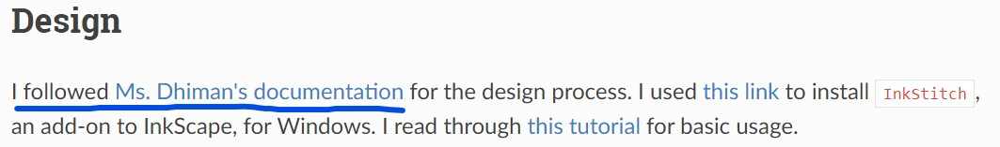

### Problem, Hypothesis, and Prototype

While I knew who had helpful documentation in my Charlotte Fab community, with over 1000 documentation websites globally, there was a lot of untapped expertise I couldn’t locate. I recognized that if expert documentation could quickly be identified, all students would be able to work more efficiently. 

I hypothesized that the more times students’ documentation websites were referenced by their peers in a subject area, the more expertise they possessed. As a test, I ran a network analysis of the 13 students in the Charlotte Fab community, quantifying the number of times each student’s documentation website was referenced by their peers. The analysis yielded promising results: some students had significantly more references than the rest of the peer group, and student were frequently linking each other's websites. Read more about my initial prototypes [here](https://fabacademy.org/2023/labs/charlotte/students/adam-stone/lessons/side-projects/lab-link-graph/#iteration-1) and [here](https://fabacademy.org/2023/labs/charlotte/students/adam-stone/lessons/side-projects/lab-link-graph/#iteration-2).

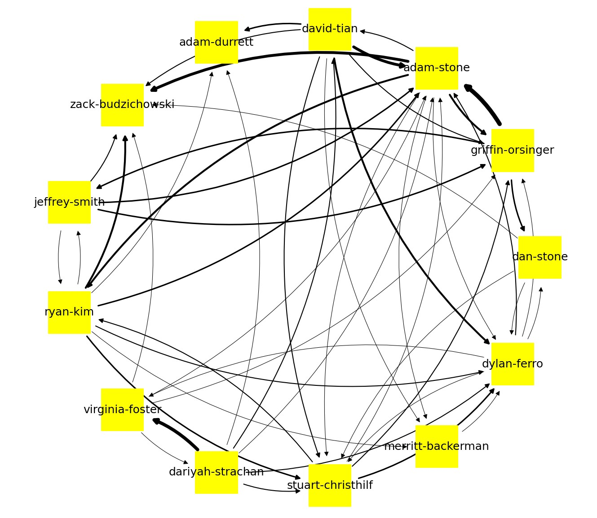

### Pitch

I showed the results to my local lab leader, [Mr. Dubick](https://www.linkedin.com/in/tomdubick), who suggested that I talk to Professor Gershenfeld and propose analyzing the global Fab community network to identify experts by topic. Professor Gershenfeld believed the network analysis would be incredibly valuable and connected me with a mentor in Spain, [Francisco Sanchez Arroyo](https://www.fablabs.io/users/francisco), who advised me on the best tools and structure to use.

## Project Execution

### GitLab Repo

I executed the project in three distinct phases: I wrote a script to collect the data, designed a text-classification AI model to sort links by subject area, and utilized D3JS to present the data in an interactive visualization.

You can download all the code from the project in [this GitLab repo](https://gitlab.fabcloud.org/pub/project/expert-network-map). In the repo, you will also find [`documentation.md`](https://gitlab.fabcloud.org/pub/project/expert-network-map/-/blob/main/documentation.md?ref_type=heads), a file that lists the technical changes made in each iteration of the project.

### Step 1: Scrape the Data

For the first step, I wrote a `Python` script to scrape all Fab Academy students’ documentation website GitLab repos over the past six years using the [`Python-GitLab API`](https://python-gitlab.readthedocs.io/en/stable/api-usage.html) and scan for URL references to other student websites using [`RegEx`](https://docs.python.org/3/library/re.html). I also stored 1,000 characters before and after to use for classification and used Pandas to create a reference matrix that structured the data for analysis. My program yielded a database of ~29,000 references.

### Step 2: Categorize the Data

After the data were collected, I knew I had a significant challenge. For the network analysis to be useful, I needed to calculate the number of times a student’s documentation was referenced for a specific subject area. I had collected tens of thousands of pages of documentation text that used vastly different naming conventions for each subject area (for example, "3D Scanning & Printing" vs "3d.printing.and.scanning"), and much of the text understandably had spelling errors given that many Fab Academy students do not speak English as a first language. To overcome the challenge of categorizing references by subject area with no consistent naming convention, I created a text-classification neural network. Using a list of keywords that were often associated with a Fab Academy subject-area, for example "PLA filament" for "3D Printing," I was able to classify ~13,000 of the ~29,000 references based on the surrounding text. Find a `JSON` file of the keywords I used for each subject area below.

```json
{
  "Prefab": [],
  "Computer-Aided Design": [
    "Computer-Aided Design",
    "freecad"
  ],
  "Computer-Controlled Cutting": [
    "Laser Cut",
    "CCC week",
    "Computer-Controlled Cutting"
  ],
  "Embedded Programing": [
    "Embedded Programming",
    "MicroPython",
    "C++",
    "pythoncpp",
    "ino",
    "Arduino IDE",
    "programming week"
  ],
  "3D Scanning and Printing": [
    "3D Printing",
    "3D Scanning",
    "TPU",
    "PETG",
    "filament",
    "Prusa",
    "3d printing week",
    "polyCAM",
    "3D Scanning and Printing",
    "3d printers",
    "3d printer"
  ],
  "Electronics Design": [
    "EagleCAD",
    "Eagle",
    "KiCAD",
    "Routing",
    "Auto-Route",
    "Trace",
    "Footprint",
    "electronic design",
    "Electronics Design"
  ],
  "Computer-Controlled Machining": [
    "CNC",
    "Shopbot",
    "Computer-Controlled Machining"
  ],
  "Electronics Production": [
    "Mill",
    "Milling",
    "copper",
    "electronic production",
    "Electronics Production"
  ],
  "Mechanical Design, Machine Design": [
    "Machine week",
    "actuation and automation",
    "Mechanical Design, Machine Design"
  ],
  "Input Devices": [
    "Input Devices",
    "Input Device",
    "Inputs Devices",
    "Electronic input",
    "sensor",
    "Input Devices"
  ],
  "Moulding and Casting": [
    "Part A",
    "Part B",
    "pot time",
    "pottime",
    "molding",
    "moulding",
    "casting",
    "cast",
    "Moulding and Casting"
  ],
  "Output Devices": [
    "Output Device",
    "Outputs Devices",
    "Outputs Device",
    "Servo",
    "motor",
    "Output Devices"
  ],
  "Embedded Networking and Communications": [
    "SPI",
    "UART",
    "I2C",
    "RX",
    "TX",
    "SCL",
    "networking week",
    "networking",
    "network",
    "networking and communications",
    "Embedded Networking and Communications"
  ],
  "Interface and Application Programming": [
    "Interfacing Week",
    "interface week",
    "Interface and Application Programming"
  ],
  "Wildcard Week": [
    "Wildcard Week"
  ],
  "Applications and Implications": [
    "Applications and Implications",
    "Bill-of-Materials",
    "Bill of materials"
  ],
  "Invention, Intellectual Property and Business Models": [
    "Patent",
    "copyright",
    "trademark",
    "Invention, Intellectual Property and Business Models"
  ],
  "Final Project": [
    "Final Project"
  ],
  "Other": []
}
```

To classify the remaining ~16,000 references, I trained my own text-classification neural network off of the 1,000 characters before and after each of the ~13,000 already classified references using `Python` and [`PyTorch`](https://pytorch.org/). I designed the neural network with 5,000 input nodes, a hidden layer of 200 nodes, and 18 output nodes (one for each Fab Academy subject area). To format the data for the neural network, I used the [`Sci-Kit Learn CountVectorizer`](https://scikit-learn.org/stable/modules/generated/sklearn.feature_extraction.text.CountVectorizer.html) to tokenize the text surrounding each URL, and the resulting matrix was converted to a [`NumPy`](https://numpy.org/) array and then to a [`PyTorch tensor`](https://pytorch.org/docs/stable/tensors.html). To train the neural network, I implemented [`Cross-Entropy Loss`](https://pytorch.org/docs/stable/generated/torch.nn.CrossEntropyLoss.html) as the loss function to measure the model's performance in predicting the correct subject-area, and I employed the [`Adam optimizer`](https://pytorch.org/docs/stable/generated/torch.optim.Adam.html) to adjust the model's weights. After [hyperparameter tuning](https://aws.amazon.com/what-is/hyperparameter-tuning/#:~:text=Hyperparameter%20tuning%20allows%20data%20scientists,the%20model%20as%20a%20hyperparameter.) using a grid-search algorithm, the model achieved its best accuracy of **86.3%** using a *learning rate of 0.01* and *dropout rate of 0.1*. You can see the gridsearch algorithm below.

```py
# Define grid of hyperparameters
learning_rates = [0.1, 0.01, 0.001]
dropout_rates = [0, 0.1, 0.2, 0.3, 0.4, 0.5, 0.6, 0.7, 0.8, 0.9]

# Perform the grid search
best_accuracy = 0.0
best_lr = None
best_dropout_rate = None
best_model = None

for lr in learning_rates:
    for dropout_rate in dropout_rates:
        # train_model is defined earlier
        accuracy, model = train_model(lr, dropout_rate)
        print(f'Learning rate: {lr}, Dropout rate: {dropout_rate}, Accuracy: {accuracy}')
        
        if accuracy > best_accuracy:
            best_accuracy = accuracy
            best_lr = lr
            best_dropout_rate = dropout_rate
            best_model = model
```

The model successfully classified the remaining  ~16,000 references, completing the second step of my project. 

### Step 3: Visualize the Data

Lastly, I wanted to provide the global Fab community with an easy-to-use navigation tool to locate expert documentation by subject area, as identified in my network analysis. I consulted with Mr. Arroyo and decided to create an interactive force simulation graph using [`D3.js`](https://d3js.org/). In the graph, each node represents a student and each edge represents references between students. 

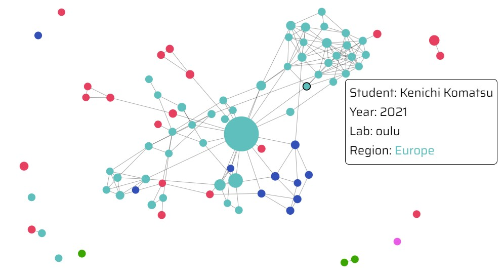

The more times a student’s documentation website has been referenced, the larger the student’s node, corresponding to more expertise. Other data, such as a student’s Fab Lab location and graduation year, were encoded via other visual mediums. I added interactive features, such as filters for subject area, geography, and graduation year, to help students quickly identify experts based on their needs.

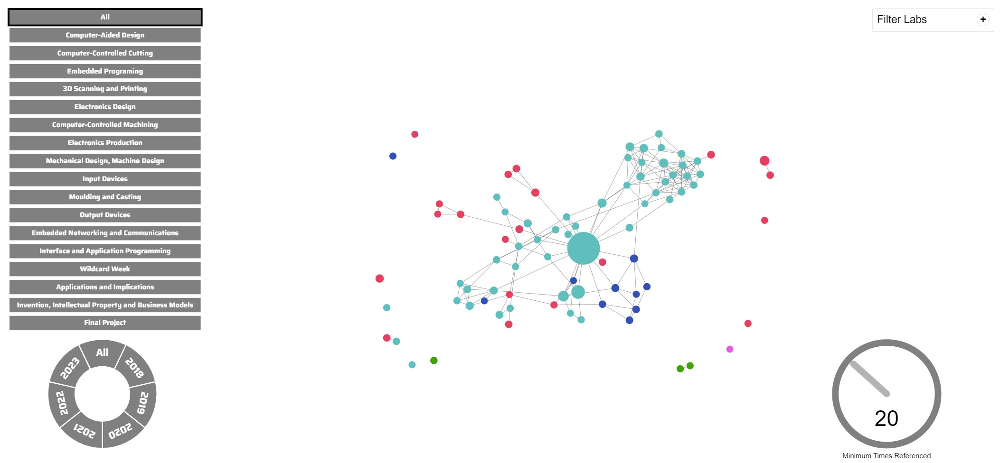

Because the first version of the `Expert Network Map` had tens of thousands of data points reloading in real-time, the tool was too slow to be usable. I made two modifications to optimize performance. First, I used D3JS’ enter-update-exit protocol to change the force simulation graph without reloading all of the data. Next, I collapsed multiple references between the same students into a single edge with greater force. The `Expert Network Map` is live and will be used by Fab Academy 2024 students.

## Documentation

### Step 1: Data Collection

The first step of the project is to collect data on all of the references between Fab Academy students' documentation from 2018-2023. Since every student's documentation website is hosted from a GitLab repo, I wrote a Python script that uses the [Python-GitLab API](https://python-gitlab.readthedocs.io/en/stable/api-usage.html) to scan each student's repo using a [RegEx](https://www.w3schools.com/python/python_regex.asp). 

In my first iteration of the script, I did not realize that the [GitLab API paginates to the first twenty projects or repos by default](https://gitlab.com/gitlab-org/gitlab/-/issues/17329#:~:text=Description,to%20a%20maximum%20of%20100%20.), and the RegEx failed to include links from students between years (for example, a student from 2023 referencing a student from 2018). I realized this error after I had completed part of [Step 2](#step-2-ai-sorting-data--analysis) and successfully trained and hyperparameter tuned a neural network to categorize text by subject-area. So, I could have included more training data, however I decided not to re-run the training process since the model had a lot of data to train on even with the pagination and missing references (~13,000 blocks of 2,000 characters of text, approximately 18,000 pages) and achieved a satisfactory accuracy of 86.3%. Most importantly, these students' data and the extra references *were* included in the network analysis in [Step 2](#step-2-ai-sorting-data--analysis), as well as in the data visualization in [Step 3](#step-3-data-visualization). I will show the code with the errors first (the changes were minimal between the versions), then include the altered version in [Step 2](#step-2-ai-sorting-data--analysis).

Data was stored in the below structure before being converted to a Pandas dataframe. There was an array of tuples that contained the GitLab ID of a student's lab's subgroup and a dictionary. The dictionary had one key, the name of the student, and had another dictionary as the value. The inner dictionary contained key-value pairs of how many times the student referenced other students' websites.

```py
[(lab_id: id (int), {"Student Name": {"student-referenced": num_references (int), ...}}), ...]
```

Additionally, I wrote a list of keywords for each subject-area. If the 2,000 characters surrounding a link contained one of the keywords, a new object was stored in a `jsonl` file containing the text and categorized subject-area. Additionally, self-links were included in the training data. Here's a sample from the collected data.

```json
{"text": "018/labs/fablabamsterdam/students/klein-xavier/pages/week8.html\">check here to know how i did it</a>), i set the clock to <i>internal 8 mhz</i>.\n\ni tried the code <a href=\"https://github.com/maltesemants1/charlieplexing-the-arduino/blob/master/charlieplexing%20sketch\" target=\"_blank\">from the tutorial i followed</a>.<br>\nnow, if you look at images of the board above, something is missing. the regulator. if you're already noticed it you win this \"very good eyes\" cup:<br><br>\n<br><br>\n\ni try first with the code above, i change the pins, looking to this type of datasheet: <br><br>\n<br><br>\n\n i've upload the code and nothing happened. the regulator started to fried!<br>\n it fried because i put it there to regulate a 9v from a battery to 5v. but there was no battery when i tested the code (using the programmer as power supply) and the regulator didn't enjoy it.<br>\n so for the next \"experiments\" i remove it and used only the programmer as power supply.<br><br>\n\n i manage to make charlieplexing working with the good pins, i've made some mods to the code in order to have a back and forth movement (you check this code <a href=\"http://archive.fabacademy.org/2018/labs/fablabamsterdam/students/klein-xavier/pages/week11/file/charlieplexing.ino\">here</a>.):<br><br>\n <br><br>\n here's the beast:<br><br>\n<iframe src=\"https://giphy.com/embed/1lxry3fbt0naiel2gn\" width=\"480\" height=\"266\" frameborder=\"0\" class=\"giphy-embed\" allowfullscreen></iframe><br><br>\n\n<b>the code:</b><br><br>\n\nt\n\n/*<br>\n * charlieplexing code for this board:<br>\n\n * http://archive.fabacademy.org/2018/labs/fablabamsterdam/students/klein-xavier/pages/week11/file/ledboard.zip <br>\n * wtfpl xavier klein <br>\n */ <br>\n\n<br>\n<b>here i have 3 variables related to the 3 pins i dedicated to for each row.</b><br>\n//setting the pin for each row.<br>\nconst int led_1 = 0;     //led", "label": "Embedded Programing", "metadata": {"from": "https://fabacademy.org/2018/labs/fablabamsterdam/students/klein-xavier/", "to": "https://fabacademy.org/2018/labs/fablabtrivandrum/students/aby-michael/"}}
```

Below is a list of the subject-areas and the corresponding keywords (later the subject-areas "Prefab" and "Other" were removed):

```py
TOPICS = [
    "Prefab",
    "Computer-Aided Design",
    "Computer-Controlled Cutting",
    "Embedded Programing",
    "3D Scanning and Printing",
    "Electronics Design",
    "Computer-Controlled Machining",
    "Electronics Production",
    "Mechanical Design, Machine Design",
    "Input Devices",
    "Moulding and Casting",
    "Output Devices",
    "Embedded Networking and Communications",
    "Interface and Application Programming",
    "Wildcard Week",
    "Applications and Implications",
    "Invention, Intellectual Property and Business Models",
    "Final Project",
    "Other"
]

TOPIC_SEARCH_TERMS = [
    [],
    ["Computer-Aided Design", "freecad"], 
    ["Laser Cut", "CCC week", "Computer-Controlled Cutting"],
    ["Embedded Programming", "MicroPython", "C\+\+", "python" "cpp", "ino", "Arduino IDE", "programming week"], 
    ["3D Printing", "3D Scanning", "TPU", "PETG", "filament", "Prusa", "3d printing week", "polyCAM", "3D Scanning and Printing", "3d printers", "3d printer"], # not PLA because in too many other words
    ["EagleCAD", "Eagle", "KiCAD", "Routing", "Auto-Route", "Trace", "Footprint", "electronic design", "Electronics Design"],
    ["CNC", "Shopbot", "Computer-Controlled Machining"],
    ["Mill", "Milling", "copper", "electronic production", "Electronics Production"],
    ["Machine week", "actuation and automation", "Mechanical Design, Machine Design"],
    ["Input Devices", "Input Device", "Inputs Devices", "Electronic input", "sensor", "Input Devices"],
    ["Part A", "Part B", "pot time", "pottime", "molding", "moulding", "casting", "cast", "Moulding and Casting"],
    ["Output Device", "Outputs Devices", "Outputs Device", "Servo", "motor", "Output Devices"],
    ["SPI", "UART", "I2C", "RX", "TX", "SCL", "networking week", "networking", "network", "networking and communications", "Embedded Networking and Communications"],
    ["Interfacing Week", "interface week", "Interface and Application Programming"],
    ["Wildcard Week"],
    ["Applications and Implications", "Bill-of-Materials", "Bill of materials"],
    ["Patent", "copyright", "trademark", "Invention, Intellectual Property and Business Models"],
    ["Final Project"],
    []
]
```

The Fab Academy student GitLab repos are structured as follows:

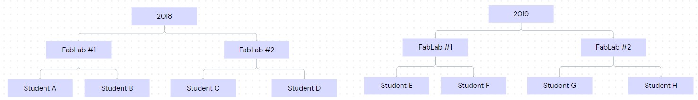

So it worked down the tree, starting with each year's subgroup and traversing down the tree breadth-first. Helper functions are included in the full `main_collection.py` below.

```py
for year in range(2018, 2024):
    print("Loading student names...")
    all_student_names = get_all_people(year)
    print(all_student_names)
    print("Collecting student repo IDs...")
    all_student_repo_ids = get_all_student_repo_ids(year, ALL_LAB_SUBGROUP_IDS[year], all_student_names)
    print(all_student_repo_ids)

    all_reference_dicts = [] # [(lab_id: id (int), {"Student Name": {"student-referenced": num_references (int), ...}}), ...]

    for lab_number, id in all_student_repo_ids:
        reference_dict_list = []
        
        compiled_reference_dict = get_all_reference_dicts(year, id)

        print("Adding reference dictionary to database...")
        all_reference_dicts.append((lab_number, {format_name(get_repo_name(id), year): compiled_reference_dict}))
        print(f"All reference dictionaries so far... {all_reference_dicts}")
    reference_dicts_across_years.append(all_reference_dicts)

matrix = format_data_to_matrix(reference_dicts_across_years)
```

Since all links to another's website in documentation should be found in either an `HTML`, `TXT`, or `Markdown` file, I only scanned for references in these file types. I also provided the Subgroup IDs of the overal Fab Academy GitLab Projects for the years 2018-2023.

```py
VALID_EXTENSOINS = ["html", "txt", "md"]
ALL_LAB_SUBGROUP_IDS = {
    2023: 8145,
    2022: 3632,
    2021: 2917,
    2020: 2140,
    2019: 1619,
    2018: 852
}
```

In order to decrease run-time when running the script multiple times, certain information, such as the list of every student's names from the fabacademy.org website, are pickled and stored locally.

Here is the entire `main_collection.py` file with helper functions. 

```py
import requests, base64, urllib.parse, gitlab, re, pickle, os, time, json
from bs4 import BeautifulSoup
import pandas as pd
from urllib.parse import urljoin

GL = gitlab.Gitlab('https://gitlab.fabcloud.org', api_version=4)
VALID_EXTENSOINS = ["html", "txt", "md"]
ALL_LAB_SUBGROUP_IDS = {
    2023: 8145,
    2022: 3632,
    2021: 2917,
    2020: 2140,
    2019: 1619,
    2018: 852
}

CHARACTERS_EACH_DIRECTION_TOPIC_DETECTION = 1000
TOPICS = [
    "Prefab",
    "Computer-Aided Design",
    "Computer-Controlled Cutting",
    "Embedded Programing",
    "3D Scanning and Printing",
    "Electronics Design",
    "Computer-Controlled Machining",
    "Electronics Production",
    "Mechanical Design, Machine Design",
    "Input Devices",
    "Moulding and Casting",
    "Output Devices",
    "Embedded Networking and Communications",
    "Interface and Application Programming",
    "Wildcard Week",
    "Applications and Implications",
    "Invention, Intellectual Property and Business Models",
    "Final Project",
    "Other"
]

TOPIC_SEARCH_TERMS = [
    [],
    ["Computer-Aided Design", "freecad"], 
    ["Laser Cut", "CCC week", "Computer-Controlled Cutting"],
    ["Embedded Programming", "MicroPython", "C\+\+", "python" "cpp", "ino", "Arduino IDE", "programming week"], 
    ["3D Printing", "3D Scanning", "TPU", "PETG", "filament", "Prusa", "3d printing week", "polyCAM", "3D Scanning and Printing", "3d printers", "3d printer"], # not PLA because in too many other words
    ["EagleCAD", "Eagle", "KiCAD", "Routing", "Auto-Route", "Trace", "Footprint", "electronic design", "Electronics Design"],
    ["CNC", "Shopbot", "Computer-Controlled Machining"],
    ["Mill", "Milling", "copper", "electronic production", "Electronics Production"],
    ["Machine week", "actuation and automation", "Mechanical Design, Machine Design"],
    ["Input Devices", "Input Device", "Inputs Devices", "Electronic input", "sensor", "Input Devices"],
    ["Part A", "Part B", "pot time", "pottime", "molding", "moulding", "casting", "cast", "Moulding and Casting"],
    ["Output Device", "Outputs Devices", "Outputs Device", "Servo", "motor", "Output Devices"],
    ["SPI", "UART", "I2C", "RX", "TX", "SCL", "networking week", "networking", "network", "networking and communications", "Embedded Networking and Communications"],
    ["Interfacing Week", "interface week", "Interface and Application Programming"],
    ["Wildcard Week"],
    ["Applications and Implications", "Bill-of-Materials", "Bill of materials"],
    ["Patent", "copyright", "trademark", "Invention, Intellectual Property and Business Models"],
    ["Final Project"],
    []
] 

# return file contents from GitLab repo
def get_file_content(file_path, project_id, default_branch_name):
    print(f"Getting file content: {file_path}, {project_id}")
    safe_url = f"https://gitlab.fabcloud.org/api/v4/projects/{project_id}/repository/files/{urllib.parse.quote(file_path, safe='')}?ref={default_branch_name}"
    print(safe_url)
    response = requests.get(safe_url).json()
    if 'message' in response:
        if '404' in response['message']:
            print(f"404 ERROR from {safe_url}")
            return
    encrypted_blob = response['content']
    
    decrypted_text = base64.b64decode(encrypted_blob)
    return decrypted_text

# get name of GitLab repo
def get_repo_name(project_id):
    safe_url = f"https://gitlab.fabcloud.org/api/v4/projects/{project_id}"
    print(safe_url)
    response = requests.get(safe_url).json()
    web_url = response['web_url']
    if 'message' in response:
        if '404' in response['message']:
            print(f"404 ERROR from {safe_url}")
            return
    return response['name'], gitlab_url_to_site_url(f"{web_url}/") # / to make it consistent with the name lists with urljoin and the a's hrefs

# get a list of the subgroups of a GitLab project
def get_file_repo_list(id):
    all_file_paths = []
    project = GL.projects.get(id)
    all_directories = project.repository_tree(recursive=True, all=True)
    for item in all_directories:
        path = item['path']
        if path.split('.')[-1].lower().strip() in VALID_EXTENSOINS:
            all_file_paths.append(path)
    return all_file_paths

# get the IDs of the subgroups of a GitLab project
def get_subgroup_ids(group_id):
    safe_url = f"https://gitlab.fabcloud.org/api/v4/groups/{group_id}/subgroups"
    response = None
    while response is None:
        try:
            response = requests.get(safe_url).json()
        except Exception as e:
            print(f"Server timeout- {e}")
            time.sleep(10)
    p_ids = []
    for item in response:
        try:
            p_ids.append(item['id'])
        except:
            print("Error finding subgroups -- skipping")
    return p_ids

# get the IDs of subgprojects of a GitLab project
def get_subproject_ids(group_id):
    safe_url = f"https://gitlab.fabcloud.org/api/v4/groups/{group_id}/projects"
    response = requests.get(safe_url).json()
    p_ids = []
    for item in response:
        p_ids.append(item['id'])
    return p_ids

def name_split_char(year):
    return "." if year < 2021 else " "

# convert a URL to a GitLab repo to a URL to the hosted website
def gitlab_url_to_site_url(gitlab_url):
    return f"https://fabacademy.org/{gitlab_url.split('https://gitlab.fabcloud.org/academany/fabacademy/')[-1]}"

# format student's name to create a unique identifier for each student
def format_name(name_url_tup, year, tup=True):
    if tup:
        name, web_url = name_url_tup
        return f'{"-".join(name.lower().strip().split(name_split_char(year)))};{web_url}' 
    else:
        print("Warning: name generated without URL")
        name = name_url_tup
        return "-".join(name.lower().strip().split(name_split_char(year)))

# remove all links to websites that are not students' repos
def filter_only_student_repos(all_student_repo_ids, all_student_names, year):
    filtered_ids = []
    all_student_urls = [name.split(";")[1].strip() for name in all_student_names]
    for i, id_list in all_student_repo_ids:
        for id in id_list:
            _, web_url = get_repo_name(id)
            if web_url.strip()[:-1] in all_student_urls or web_url.strip() in all_student_urls: # [:-1] to remove ending slash
                filtered_ids.append((i, id))
    return filtered_ids

# get the repo IDs of all fab Academy students
def get_all_student_repo_ids(year, year_subgroup_id, all_student_names):
    if save_exists("student_repo_id_saves", year):
        return load_obj("student_repo_id_saves", year)
    all_student_repo_ids = []
    all_lab_ids = get_subgroup_ids(year_subgroup_id)
    
    for id in all_lab_ids:
        for sub_id in get_subgroup_ids(id):
            all_student_repo_ids.append((id, get_subproject_ids(sub_id))) # ((i, get_subproject_ids(sub_id)))
    print(all_student_repo_ids)
    to_return = filter_only_student_repos(all_student_repo_ids, all_student_names, year)
    save_obj("student_repo_id_saves", to_return, year)
    return to_return

def save_exists(folder_name, name):
    return os.path.exists(f"{folder_name}/{name}.obj")

def load_obj(folder_name, name):
    with open(f"{folder_name}/{name}.obj", "rb") as filehandler:
        return pickle.load(filehandler)

def save_obj(folder_name, obj, name):
    with open(f"{folder_name}/{name}.obj", 'wb') as filehandler: 
        pickle.dump(obj, filehandler)

# go to fabacademy.org website to find student oster and all students' names and links to their websites
def get_all_people(year):
    if save_exists("people_saves", year):
        return load_obj("people_saves", year)
    
    base_url = f"https://fabacademy.org/{year}/people.html"
    soup = BeautifulSoup(requests.get(base_url).content, 'html.parser')

    if year > 2018:
        lab_divs = soup.find_all("div", {"class": "lab"})

        names = []

        for lab_div in lab_divs:
            lis = lab_div.find_all("li")

            As = [li.find("a") for li in lis]

            names += [f"{a.text.strip().lower().replace(' ', '-')};{urljoin(base_url, a['href'])}" for a in As]        
    else:
        lis = soup.find_all("li")
        names = [f"{li.find('a').text.strip().lower().replace(' ', '-')};{urljoin(base_url, li.find('a')['href'])}" for li in lis]

    save_obj("people_saves", names, year)

    return names

# scan a repo for references to another student's documentation
def get_references(content, year, from_url):
    pattern = re.compile(f"\/{year}\/labs\/[^\/]+\/students\/(\w|-)+\/")
    people_linked = {}
    for match in pattern.finditer(str(content)):
        full_url = f"https://fabacademy.org{match.group(0)}"
        print(f"FULL URL {full_url}")
        person = format_name((match.group(0).split("/")[-2], full_url), year)

        link_label = None

        topic_search_start_ind = match.start() - CHARACTERS_EACH_DIRECTION_TOPIC_DETECTION
        if topic_search_start_ind < 0:
            topic_search_start_ind = 0
        topic_search_end_ind = match.end() + CHARACTERS_EACH_DIRECTION_TOPIC_DETECTION
        if topic_search_end_ind > len(content):
            topic_search_end_ind = len(content)
        print(f"({match.start()}, {match.end()}) -> ({topic_search_start_ind}, {topic_search_end_ind})")
        topic_text = content.decode()[topic_search_start_ind:topic_search_end_ind].lower()
        
        print("TOPIC TEXT", topic_text)
        for i in range(len(TOPICS)):
            topic = TOPICS[i]
            topic_search_terms = TOPIC_SEARCH_TERMS[i]
            for item in topic_search_terms:
                item_spaces = item.replace("-", " ").replace("/", " ").replace(",", " ").lower().strip()
                if re.search(re.compile(item_spaces.replace(" ",".")), topic_text) or re.search(re.compile(item_spaces.replace(" ","-")), topic_text) or re.search(re.compile(item_spaces), topic_text) or re.search(re.compile(item_spaces.replace(" ","")), topic_text):
                    link_label = topic
        
        if link_label is None:
            continue

        with open("NLP_data/train.jsonl", "a") as file:
            file.write('{' + '"text": ' + json.dumps(topic_text) + ', "label": "' + link_label + '", "metadata": '+ '{' + '"from": "' + from_url + '", "to": "' + full_url + '"' + '}' + '}\n')
        
        if person in people_linked:
            if link_label in people_linked[person]:
                people_linked[person][link_label] += 1
        else:
            people_linked[person] = {}
            people_linked[person][link_label] = 1

    return people_linked

# combine students' dictionaries of references to other's websites
def combine_reference_dicts(reference_dict_list):
    combined_reference_dict = {}
    for dict in reference_dict_list:
        for key in dict:
            if key in combined_reference_dict:
                for topic_key in dict[key]:
                    if topic_key in combined_reference_dict[key]:
                        combined_reference_dict[key][topic_key] += dict[key][topic_key]
                    else:
                        combined_reference_dict[key][topic_key] = dict[key][topic_key]
            else:
                combined_reference_dict[key] = dict[key] 
    return combined_reference_dict

# convert data to Pandas crosstab matrix
def format_data_to_matrix(data):
    students = []

    for year_info in data: # [(lab_id: int, {"Student Name": {"student-referenced": num_references: int, ...}}), ...]
        for student_info in year_info: # (lab_id: int, {"Student Name": {"student-referenced": num_references: int, ...}})
            lab_id = student_info[0] 
            student_name = list(student_info[1].keys())[0]
            reference_dict = student_info[1][list(student_info[1].keys())[0]]
            students.append(student_name) 

    print("STUDENTS", students)

    df = pd.crosstab(students, students)
    df.rename_axis("Referencing Students", axis=0, inplace=True)
    df.rename_axis("Referenced Students", axis=1, inplace=True)

    df = pd.DataFrame(df, index=df.index, columns=pd.MultiIndex.from_product([df.columns, TOPICS]))

    for student1 in students:
        for student2 in students:
            for topic_name in TOPICS:
                df.at[student1, (student2, topic_name)] = (pd.NA if student1 == student2 else 0)

    def assign_value(referencer_student, referenced_student, num_references, topic):
        if referencer_student == referenced_student:
            print(f"Ignoring self-referenced student {referencer_student}")
        elif referenced_student not in students:
            print("Referenced student isn't a student - URL matched naming convention so regex caught but wasn't checked against student list - skipping")
        else:
            df.loc[referencer_student, (referenced_student, topic)] = num_references

    def get_value(referencer_student, referenced_student, topic):
        return df.loc[referencer_student, (referenced_student, topic)]

    for year_info in data:
        for student_info in year_info:
            student_name = list(student_info[1].keys())[0]
            reference_dict = dict(student_info[1][student_name])
            for referenced_student in reference_dict:
                for reference_type in reference_dict[referenced_student]:
                    num_references = reference_dict[referenced_student][reference_type]
                    assign_value(student_name, referenced_student, num_references, reference_type)

    df.to_csv("final_data.csv", index_label="Referencing Students|Referenced Students")

    return df

# get all of the reference dictionaries of different students for a given year
def get_all_reference_dicts(year, id):
    filename = f"{year}-{id}"
    if save_exists("reference_dict_saves", filename):
        print(f"Save exists! {load_obj('reference_dict_saves', filename)}")
        return load_obj("reference_dict_saves", filename)
    reference_dict_list = []
    default_branch_name_response = requests.get(f"https://gitlab.fabcloud.org/api/v4/projects/{id}/repository/branches").json()
    default_branch_name = None
    for branch in default_branch_name_response:
        if branch['default']:
            default_branch_name = branch['name']
    if default_branch_name is None:
        print(f"Error: Default Branch Not Found (id: {id}) {default_branch_name_response} - leaving as None")
    try:
        for file in get_file_repo_list(id):
            print(f"Checking {file}...")
            reference_dict_list.append(get_references(get_file_content(file, id, default_branch_name), year, get_repo_name(id)[1]))
        print("Generating compiled reference dictionary...")
        compiled_reference_dict = combine_reference_dicts(reference_dict_list)
        print(compiled_reference_dict)
        save_obj("reference_dict_saves", compiled_reference_dict, filename)
        print(f"SAVING to {filename}")
        return compiled_reference_dict
    except gitlab.exceptions.GitlabGetError as e:
        return combine_reference_dicts(reference_dict_list)

if __name__ == "__main__":
    reference_dicts_across_years = [] # [[(lab_id: id (int), {"Student Name": {"student-referenced": num_references: (int), ...}}), ...], ...]

    for year in range(2018, 2024):
        print("Loading student names...")
        all_student_names = get_all_people(year)
        print(all_student_names)
        print("Collecting student repo IDs...")
        all_student_repo_ids = get_all_student_repo_ids(year, ALL_LAB_SUBGROUP_IDS[year], all_student_names)
        print(all_student_repo_ids)

        all_reference_dicts = [] # [(lab_id: id (int), {"Student Name": {"student-referenced": num_references: 9d (int), ...}}), ...]

        for lab_number, id in all_student_repo_ids:
            reference_dict_list = []
            
            compiled_reference_dict = get_all_reference_dicts(year, id)

            print("Adding reference dictionary to database...")
            all_reference_dicts.append((lab_number, {format_name(get_repo_name(id), year): compiled_reference_dict}))
            print(f"All reference dictionaries so far... {all_reference_dicts}")
        reference_dicts_across_years.append(all_reference_dicts)


    matrix = format_data_to_matrix(reference_dicts_across_years)
```

### Step 2: AI, Sorting Data, & Analysis

#### Training the Model

Before running the training, I had to format the trianing data from a `jsonl` to a `csv` file. So, I wrote `jsonl2csv.py` to convert the JSON objects into CSV format. I used a number to signify each subject-area (each will correspond to an output node in the neural network) and save the exported dataframe as `NLP_data/train.csv`.

*jsonl2csv.py*

```py
import json, string
import pandas as pd

DATA_LABELS = {
    "Prefab": 0,
    "Computer-Aided Design": 1,
    "Computer-Controlled Cutting": 2,
    "Embedded Programing": 3,
    "3D Scanning and Printing": 4,
    "Electronics Design": 5,
    "Computer-Controlled Machining": 6,
    "Electronics Production": 7,
    "Mechanical Design, Machine Design": 8,
    "Input Devices": 9,
    "Moulding and Casting": 10,
    "Output Devices": 11,
    "Embedded Networking and Communications": 12,
    "Interface and Application Programming": 13,
    "Wildcard Week": 14,
    "Applications and Implications": 15,
    "Invention, Intellectual Property and Business Models": 16,
    "Final Project": 17,
    "Other": 18
}

if __name__ == "__main__":
    txts = []
    labels = []
    tos = []
    froms = []
    with open('NLP_data/train.jsonl', 'r') as jsonl:
        for line in jsonl.readlines():
            j = json.loads(line)
            txts.append("".join([char for char in j['text'] if char in set(string.printable)])) # string.printable removes non-ASCII chars to avoid writing errors
            labels.append(DATA_LABELS[j['label']])
            tos.append(j['metadata']['to'])
            froms.append(j['metadata']['from'])

    data_dict = {
        "Text": txts,
        "Labels": labels,
        "To": tos,
        "From": froms
    }
    
    df = pd.DataFrame(data_dict)

    df.to_csv("NLP_data/train.csv")
```

To train the model in `train_nn.py`, I used the Python machine-learning libraries [`PyTorch`](https://pytorch.org/) and [`Sci-Kit Learn`](https://scikit-learn.org/stable/). I'll break the code into sections then provide the entire file below.

First, I loaded the CSV with Pandas, stored the 2,000 blocks and their lables in two series, and used `train_test_split` from `sklearn.model_selection` to put 80% of the data into a training set and 20% into a testing set.

```py
# Read the CSV file
df = pd.read_csv('NLP_data/train.csv')

# Columns are named 'Text' and 'Labels'
texts = df['Text']
labels = df['Labels']

# Split the dataset into training and test sets
X_train, X_test, y_train, y_test = train_test_split(texts, labels, test_size=0.2, random_state=42)
```

Then, using the `CountVectorizer` from `sklearn.feature_extraction.text`, I vectorized the training and test data. You can read about the [`CountVectorizer` here](https://www.google.com/search?q=sklelarn+count+vectorizer&rlz=1C1RXQR_enUS1018US1018&oq=sklelarn+count+vectorizer&gs_lcrp=EgZjaHJvbWUyBggAEEUYOTILCAEQABgKGA0YgAQyDQgCEAAYhgMYgAQYigUyDQgDEAAYhgMYgAQYigUyDQgEEAAYhgMYgAQYigUyDQgFEAAYhgMYgAQYigXSAQgyMTE4ajBqN6gCALACAA&sourceid=chrome&ie=UTF-8).

```py
# Convert the texts into vectors
vectorizer = CountVectorizer(max_features=5000)  # limit to 5000 most frequent words/tokens
X_train = vectorizer.fit_transform(X_train)
X_test = vectorizer.transform(X_test)
```

I pickled and saved the vectorizer object.

```py
# Save the vectorizer
pickle.dump(vectorizer, open("vectorizer.pickle", "wb"))
```

Next I converted the train and test data to [NumPy arrays](https://numpy.org/doc/stable/reference/generated/numpy.array.html) then [PyTorch tensors](https://pytorch.org/docs/stable/tensors.html).

```py
# Convert the vectors and labels to numpy arrays
X_train = X_train.toarray()
X_test = X_test.toarray()
y_train = y_train.to_numpy()
y_test = y_test.to_numpy()

X_train = torch.from_numpy(X_train).float()
X_test = torch.from_numpy(X_test).float()
y_train = torch.from_numpy(y_train).long()
y_test = torch.from_numpy(y_test).long()
```

Then I defined the `TextClassifer` neural network class. There are three layers: input, hidden, and output. Adjacent layers are [fully connected (FC)](https://stanford.edu/~shervine/teaching/cs-230/cheatsheet-convolutional-neural-networks#:~:text=Fully%20Connected%20(FC)%20The%20fully,objectives%20such%20as%20class%20scores.) (also called [`linear` layers](https://docs.nvidia.com/deeplearning/performance/dl-performance-fully-connected/index.html)). The network also implements [dropout](https://www.analyticsvidhya.com/blog/2022/08/dropout-regularization-in-deep-learning/#:~:text=Dropout%20is%20a%20regularization%20method,connectedness%20to%20the%20preceding%20layer.) and the [ReLU activaition function](https://pytorch.org/docs/stable/generated/torch.nn.ReLU.html) before the hidden layer.

```py
class TextClassifier(nn.Module):
    def __init__(self, input_dim, hidden_dim, output_dim, dropout_prob=0.5):
        super(TextClassifier, self).__init__()
        self.fc1 = nn.Linear(input_dim, hidden_dim)
        self.dropout = nn.Dropout(dropout_prob)
        self.fc2 = nn.Linear(hidden_dim, output_dim)
    
    def forward(self, x):
        x = torch.relu(self.fc1(x))
        x = self.dropout(x)
        x = self.fc2(x)
        return x
```

Next, to begin finding the optimal hyperparameter combinations, I defined a list of values of `learning rate` and `dropout rate` to try, as well as a function to train the network with a specified value for each of these hyperparameters. The dimensions of the network are `5000x200x18`. The training runs 100 [epochs](https://www.baeldung.com/cs/epoch-neural-networks) using the [`Adam optimizer`](https://pytorch.org/docs/stable/generated/torch.optim.Adam.html) and [`CrossEntropyLoss` function](https://pytorch.org/docs/stable/generated/torch.nn.CrossEntropyLoss.html). Then the model performance evaluated. The `train_model` function returns the model accuracy (measured on the test set data) and the model itself.

```py
# define grid of hyperparameters
learning_rates = [0.1, 0.01, 0.001]
dropout_rates = [0, 0.1, 0.2, 0.3, 0.4, 0.5, 0.6, 0.7, 0.8, 0.9]

# define a function for the training loop
def train_model(lr, dropout_rate):
    model = TextClassifier(input_dim=X_train.shape[1], hidden_dim=200, output_dim=18, dropout_prob=dropout_rate)
    criterion = nn.CrossEntropyLoss()
    optimizer = optim.Adam(model.parameters(), lr=lr)

    for epoch in range(100):  
        optimizer.zero_grad()
        outputs = model(X_train)
        loss = criterion(outputs, y_train)
        loss.backward()
        optimizer.step()

    # Evaluate the model
    with torch.no_grad():
        outputs = model(X_test)
        _, predicted = torch.max(outputs, 1)
        correct = (predicted == y_test).sum().item()
        accuracy = correct / y_test.size(0)
    
    return accuracy, model
```

Then to implement the gridsearch, I loop through the combinations of [`learning rate`](https://deepchecks.com/glossary/learning-rate-in-machine-learning/#:~:text=The%20learning%20rate%2C%20denoted%20by,network%20concerning%20the%20loss%20gradient%3E.) and [`dropout rate`](https://pytorch.org/docs/stable/generated/torch.nn.Dropout.html), training and evaluating a neural network then storing its parameters and the model itself if the accuracy is better than all previous accuracies.

```py
# Perform the grid search
best_accuracy = 0.0
best_lr = None
best_dropout_rate = None
best_model = None

for lr in learning_rates:
    for dropout_rate in dropout_rates:
        accuracy, model = train_model(lr, dropout_rate)
        print(f'Learning rate: {lr}, Dropout rate: {dropout_rate}, Accuracy: {accuracy}')
        
        if accuracy > best_accuracy:
            best_accuracy = accuracy
            best_lr = lr
            best_dropout_rate = dropout_rate
            best_model = model
```

Finally, the results of the best model are printed, the best model is saved in the `best_model.pt` file, and the best parameters are pickled and saved in `best_params.pickle`.

```py
print(f'Best learning rate: {best_lr}, Best dropout rate: {best_dropout_rate}, Best accuracy: {best_accuracy}')

# Save the best model to a file
torch.save(best_model.state_dict(), 'best_model.pt')

# Also save the parameters in a dictionary
best_params = {"learning_rate": best_lr, "dropout_rate": best_dropout_rate, "accuracy": best_accuracy}

with open('best_params.pickle', 'wb') as handle:
    pickle.dump(best_params, handle, protocol=pickle.HIGHEST_PROTOCOL)
```

All together, here is `train_nn.py`.

*train_nn.py*

```py
import pandas as pd
from sklearn.model_selection import train_test_split
from sklearn.feature_extraction.text import CountVectorizer
import torch
import torch.nn as nn
import torch.optim as optim
from sklearn.metrics import accuracy_score
import pickle

# Read the CSV file
df = pd.read_csv('NLP_data/train.csv')

# Columns are named 'Text' and 'Labels'
texts = df['Text']
labels = df['Labels']

# Split the dataset into training and test sets
X_train, X_test, y_train, y_test = train_test_split(texts, labels, test_size=0.2, random_state=42)

# Convert the texts into vectors
vectorizer = CountVectorizer(max_features=5000)  # limit to 5000 most frequent words/tokens
X_train = vectorizer.fit_transform(X_train)
X_test = vectorizer.transform(X_test)

# Save the vectorizer
pickle.dump(vectorizer, open("vectorizer.pickle", "wb"))

# Convert the vectors and labels to numpy arrays
X_train = X_train.toarray()
X_test = X_test.toarray()
y_train = y_train.to_numpy()
y_test = y_test.to_numpy()

X_train = torch.from_numpy(X_train).float()
X_test = torch.from_numpy(X_test).float()
y_train = torch.from_numpy(y_train).long()
y_test = torch.from_numpy(y_test).long()

class TextClassifier(nn.Module):
    def __init__(self, input_dim, hidden_dim, output_dim, dropout_prob=0.5):
        super(TextClassifier, self).__init__()
        self.fc1 = nn.Linear(input_dim, hidden_dim)
        self.dropout = nn.Dropout(dropout_prob)
        self.fc2 = nn.Linear(hidden_dim, output_dim)
    
    def forward(self, x):
        x = torch.relu(self.fc1(x))
        x = self.dropout(x)
        x = self.fc2(x)
        return x

# define grid of hyperparameters
learning_rates = [0.1, 0.01, 0.001]
dropout_rates = [0, 0.1, 0.2, 0.3, 0.4, 0.5, 0.6, 0.7, 0.8, 0.9]

# define a function for the training loop
def train_model(lr, dropout_rate):
    model = TextClassifier(input_dim=X_train.shape[1], hidden_dim=200, output_dim=18, dropout_prob=dropout_rate)
    criterion = nn.CrossEntropyLoss()
    optimizer = optim.Adam(model.parameters(), lr=lr)

    for epoch in range(100):  
        optimizer.zero_grad()
        outputs = model(X_train)
        loss = criterion(outputs, y_train)
        loss.backward()
        optimizer.step()

    # Evaluate the model
    with torch.no_grad():
        outputs = model(X_test)
        _, predicted = torch.max(outputs, 1)
        correct = (predicted == y_test).sum().item()
        accuracy = correct / y_test.size(0)
    
    return accuracy, model

# Perform the grid search
best_accuracy = 0.0
best_lr = None
best_dropout_rate = None
best_model = None

for lr in learning_rates:
    for dropout_rate in dropout_rates:
        accuracy, model = train_model(lr, dropout_rate)
        print(f'Learning rate: {lr}, Dropout rate: {dropout_rate}, Accuracy: {accuracy}')
        
        if accuracy > best_accuracy:
            best_accuracy = accuracy
            best_lr = lr
            best_dropout_rate = dropout_rate
            best_model = model

print(f'Best learning rate: {best_lr}, Best dropout rate: {best_dropout_rate}, Best accuracy: {best_accuracy}')

# Save the best model to a file
torch.save(best_model.state_dict(), 'best_model.pt')

# Also save the parameters in a dictionary
best_params = {"learning_rate": best_lr, "dropout_rate": best_dropout_rate, "accuracy": best_accuracy}

with open('best_params.pickle', 'wb') as handle:
    pickle.dump(best_params, handle, protocol=pickle.HIGHEST_PROTOCOL)
```

#### Classifying References


### Step 3: Data Visualization

[Download all code for Step 3 here!](../../assets/code/step3-data-visualization.zip)

#### Library and Data Structure

I employed [D3JS](https://d3js.org/), a JavaScript library, to create the data visualization. I started off by browsing the [D3 Gallery](https://observablehq.com/@d3/gallery?utm_source=d3js-org&utm_medium=hero&utm_campaign=try-observable) to select the format for my visualization. I was choosing between a [`Disjoint Force-Directed Graph`](https://observablehq.com/@d3/disjoint-force-directed-graph/2?intent=fork) and a [`Force Directed Graph with Arrows`](https://observablehq.com/@brunolaranjeira/d3-v6-force-directed-graph-with-directional-straight-arrow). Due to frequent two-way connections between nodes and a large amount of data (so very small lines for each individual connection, making arrowheads hard to discern), I decided on the `Disjoint Force-Directed Graph`.

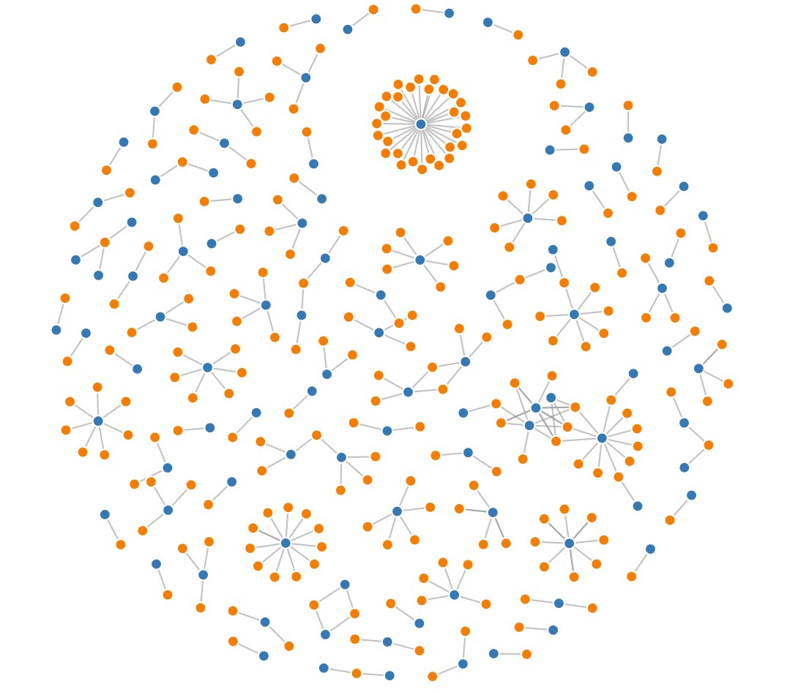{: style="width:300px;"}
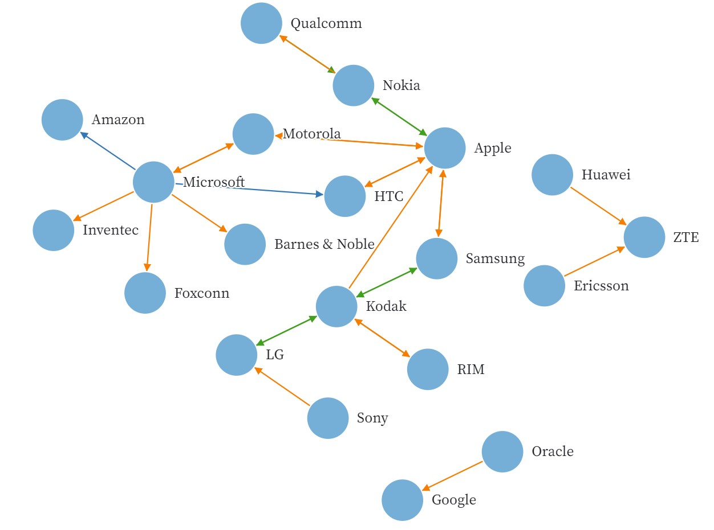{: style="width:300px;"}

So I read through the [example code](https://observablehq.com/@d3/disjoint-force-directed-graph/2?intent=fork) from D3JS carefully and found that the input data was a JSON with the following format:

```json
{
  "nodes": {
    {"id": "ID1", "radius": 1},
    {"id": "ID2", "radius": 1},
    {"id": "ID3", "radius": 1}
  },
  "links": {
    {"source": "ID1", "target": "ID3", "value": 1},
    {"source": "ID2", "target": "ID3", "value": 4},
    {"source": "ID2", "target": "ID1", "value": 3}
  }
}
```

The `nodes` object contains every node's ID as well as other data, such as the node's radius. The `links` object contains each edge, in my case connection between students, and an associated value which can be used to control strength or thickness.

#### Transforming Data

So the first step was to transform my `Pandas` dataframe into a JSON file of this format. I wrote `matrix2d3js.py`. When this script is run, it takes `final_data.csv` (the output from [Step 2](#step-2-ai-sorting-data--analysis)) and moves all of the data into a JSON file matching the structure outline above. This is then saved as `final_data.json`.

*matrix2d3js.py*

```py
import pandas as pd
import numpy as np
import json

INPUT_FILE = "final_data.csv"
OUTPUT_FILE = "final_data.json"

df = pd.read_csv(INPUT_FILE, header=[0, 1], index_col=0)

STUDENTS = list(df.iloc[:, 0].keys())
TOPICS = [
    "Prefab",
    "Computer-Aided Design",
    "Computer-Controlled Cutting",
    "Embedded Programing",
    "3D Scanning and Printing",
    "Electronics Design",
    "Computer-Controlled Machining",
    "Electronics Production",
    "Mechanical Design, Machine Design",
    "Input Devices",
    "Moulding and Casting",
    "Output Devices",
    "Embedded Networking and Communications",
    "Interface and Application Programming",
    "Wildcard Week",
    "Applications and Implications",
    "Invention, Intellectual Property and Business Models",
    "Final Project",
    "Other"
]

def get_value(df, referencer_student, referenced_student, topic):
    return df.loc[referencer_student, (referenced_student, topic)]

def generate_node_obj(name, group):
    return {
        "id": name,
        "group": group
    }

def generate_link_obj(name_from, name_to, strength, topic):
    return {
        "source": name_from,
        "target": name_to,
        "value": strength,
        "topic": topic
    }

final_data = {
    "nodes": [ ],
    "links": [ ]
}

def split_name(name):
    return name.split(";")

if __name__ == "__main__":
    # create `nodes` object in final JSON
    for student in STUDENTS:
        student_name, student_link = split_name(student)
        final_data['nodes'].append(generate_node_obj(student, 1))

    # for each link between students, add a link object in the final JSON under the `links` object
    for referencer_student in STUDENTS:
        referencer_student_name, referencer_student_link = split_name(referencer_student)
        for referenced_student in STUDENTS:
            referenced_student_name, referenced_student_link = split_name(referenced_student)
            for topic in TOPICS:
                val = get_value(df, referencer_student, referenced_student, topic)

                if val == 0 or np.isnan(val): continue

                final_data['links'].append(generate_link_obj(referencer_student, referenced_student, val, topic))

    with open("final_data.json", "w") as outfile:
        json.dump(final_data, outfile)
```

#### Name Conflicts

Upon inspecting the data, I noticed that several students with longer names had names that did not reflect their listing on the Fab Academy Student Rosters (for example, click [here](https://fabacademy.org/2023/people.html) to see the 2023 roster). To resolve this, I wrote `resolve_name_conflicts.py`. This identifies students based on the URL to their website (which acts as a unique identifier for every student) and checkes it against the webpage. This was especially challenging since some students whose names have diacritic marks or accent marks are sometimes displayed as characters and other times as unicode beginning with `\u`, so I checked for both. The webpage name overrides the name collected during [Step 2](#step-2-ai-sorting-data--analysis).

So I ran `resolve_name_conflicts.py`, which takes `final_data.json` as an input and outputs `final_data_name_fixed.json`.

Below is `resolve_name_conflicts.py`. Before that codeblock I include four functions that are imported from `main.py` (see [Step 2](#step-2-ai-sorting-data--analysis)) for reference. I did not include the libraries included in `main.py` as it is detailed above.

```py
# check if an object exists at the specified filepath
def save_exists(folder_name, name):
    return os.path.exists(f"{folder_name}/{name}.obj")

# return the pickled object saved in the specifed filepath
def load_obj(folder_name, name):
    with open(f"{folder_name}/{name}.obj", "rb") as filehandler:
        return pickle.load(filehandler)

# return the webpage of fabacademy.org that includes every student's names from the specified year (and if this has already been downloaded and saved in a pickled object, load that instead of sending an HTTP request)
def get_people_soup(year):
    filename = f"{year}-soup"
    if save_exists("people_saves", filename):
        return load_obj("people_saves", filename)

    base_url = f"https://fabacademy.org/{year}/people.html"
    soup = BeautifulSoup(requests.get(base_url).content, 'html.parser')

    save_obj("people_saves", soup, filename)

    return soup

# formats a student's ID by accessing their name as detailed on the fabacademy.org students list, as well as the URL to their website
def repo_name_to_student_name(name_and_web_url_tup):
    name, web_url = name_and_web_url_tup
    year = web_url.split("/")[3]
    href = f'/{"/".join(web_url.split("/")[3:])}'
    people_soup = get_people_soup(year)
    As = people_soup.find_all('a', href=True)
    a = [_ for _ in As if _['href'] == href or _['href'] == href[:-1]][0] # or to account for ending slash
    name_final = a.text.strip()
    return name_final, web_url
```

*resolve_name_conflicts.py*

```py
from main import repo_name_to_student_name
import pandas as pd
import re

df = pd.read_csv("final_data.csv", header=[0, 1], index_col=0)

STUDENTS = list(df.iloc[:, 0].keys())

regexes = {}

normal_chars = "abcdefghijklmnopqrstuvwxyz-"

# convert a char from a character with an accent/dialectic into unicode
def accent_to_code(char):
    return format(ord(char), "#06x").replace("0x", "\\u")

# convert a char from unicode into a character with an accent/dialectic
def code_to_accent(code):
    return chr(int(code.replace("\\u", "0x"), 16))

# takes a name, converts it to a list of chars, then converts all characters with accents/dialectics to unicode
def non_letters_into_codes(name):
    lst = [_ for _ in name]
    for i in range(len(lst)):
        char = lst[i]
        if char.lower() not in normal_chars:
            lst[i] = accent_to_code(char)
    return "".join(lst)

if __name__ == "__main__":
    # create a dictionary where keys are regexes of the student's previous names as standard text and as text where diacritics/accents are replaced with unicode, and values are the corrected names
    for student in STUDENTS:
        val = ";".join(repo_name_to_student_name(student.split(";")))
        regexes[student] = val
        regexes[non_letters_into_codes(student.split(";")[0]) + ";" + student.split(";")[1]] = val

    # run the regex on final_data.json (literally replace the text, don't load as an object)
    with open('final_data.json', 'r') as file:
        content = file.read()
        for key in regexes:
            content = re.sub(re.escape(key), regexes[key], content)
        
    # store the corrected data
    with open('final_data_name_fixed.json', 'w', encoding='utf-8') as file: # encoding='utf-8' so that special characters in names can be written without UnicodeEncodeError
        file.write(content)
```

#### Code Structure

The JavaScript is spread out among several files, but is it centered around `app.js`. `app.js` loads the JSON data and initializes the visualization, setting up callbacks in other files to be run when the user interacts with the website. These callbacks are handled by `update_data.js` which has a three-part system for updating the visualization based off of user interactions. Read about `app.js` in detail [here](#app-js), and read about `update_data.js` in detail [here](#update-data).

The project directory is structured as follows:

```txt
public
│   app.js
│   carousel.js
│   combined.js
│   constants.js
│   d3js_download.js
│   dial.js
│   final_data.json
│   force_boundary_download.js
│   helper_functions.js
│   index.html
│   jquery_download.js
│   lab_region.js
│   multiselect_dropdown.js
│   overlay_text.js
│   style.css
│   update_data.js
│   vars.js
│
└───img
    └───favicon
        └───favicon.ico
```

#### Visualization Constants and Global Variables

`constants.js` defines almost all of the constant variables, include color palletes, opacity levels, etc. I've compiled these into a separate file so that tweaking the visual appeal is consolidated to editing one file.

*constants.js*

```js
const NODE_STROKE_WIDTH_HIGHLIGHTED = "1.5px", // width of circle around node circle on hover
    HOVER_NODE_STROKE_COLOR = "black", // color of circle around node circle on hover
    NOT_HOVERING_NODE_STROKE_WIDTH = "0px", // width of circle around node circle when not hovering
    NOT_HOVERING_NODE_STROKE_COLOR = "", // color of circle around node circle when not hovering
    RGB_LINE_COLOR = "0,0,0", // color of edges
    LINE_WIDTH = "0.3px", // width of edges
    CAROUSEL_RECT_STROKE_COLOR = "", // color of rectangular outline of each rectangle in the subject-area-selection carousel
    CAROUSEL_RECT_STROKE_WIDTH = "0px", // width of rectangular outline of each rectangle in the subject-area-selection carousel
    CAROUSEL_SELECTOR_COLOR = "black", // color of the rectangular path that displays which subject area you have selected
    DIAL_OUTLINE_COLOR = "grey", // color of the outline of the minimum times referenced dial
    DIAL_TEXT_COLOR = "black", // color of the text labeling the minimum times referenced dial
    OVERLAY_TEXT_LINK_COLOR = "#7e7eed"; // color of the links

// all CSS customizable values not controlled through JS/D3JS are included as variables under :root in style.css

const SCALE_FACTOR = 1, // factor that the strength of edges in the force-simulation are multiplied by (higher number = nodes are pulled closer together)
    forceBoundaryMargin = 30; // margin along the defined edges of the force simulation 

const minOpacity = 0.15; // opacity of a node if the selected filters do not include the node

const NODE_HIGHLIGHTED_OPACITY = 1; // opacity of a node if the selected filters do include the node
const MINIMUM_STRENGTH_CONSTANT = 100; // lowest possible strength of edges (increasing this will linearly increase the strength of all edges in the graph)

// colors of years-pie and subject-area-selection carousel
const PIE_SLICE_COLOR = 'grey',
    PIE_TEXT_COLOR = 'white',
    DIAL_STICK_COLOR = 'grey',
    CAROUSEL_OPTION_COLOR = 'grey',
    CAROUSEL_TEXT_COLOR = 'white';

// color pallete of Fab Academy
const FAB_PALETTE = [
    "#f1f2f2",
    "#f1d2f2",
    "#f1b2f2",
    "#f04260",
    "#4abfbd",
    "#284fb5",
    "#f05c71"
];

// color pallete of nodes by continent - encodes geographical data
const NODE_REGION_PALETTE = [
    "#1da619",
    "#f04260",
    "#4abfbd",
    "#284fb5",
    "#f05be1",
    "#87743d"
];

// list of continent names
const continent = [
    "Africa",
    "Asia",
    "Europe",
    "North America",
    "South America",
    "Oceania"
];

// zips the continent color pallete and list of continents above into an object
const continentColor = {};
for (let i = 0; i < NODE_REGION_PALETTE.length; i++) continentColor[continent[i]] = NODE_REGION_PALETTE[i];

// node radius parameters
const NODE_SIZE_MULTIPLIER = 50;
const NODE_SIZE_MINIMUM = 5;

// list of Fab Academy subject-areas
const TOPICS = [
    "Prefab",
    "Computer-Aided Design",
    "Computer-Controlled Cutting",
    "Embedded Programing",
    "3D Scanning and Printing",
    "Electronics Design",
    "Computer-Controlled Machining",
    "Electronics Production",
    "Mechanical Design, Machine Design",
    "Input Devices",
    "Moulding and Casting",
    "Output Devices",
    "Embedded Networking and Communications",
    "Interface and Application Programming",
    "Wildcard Week",
    "Applications and Implications",
    "Invention, Intellectual Property and Business Models",
    "Final Project",
    "Other"
]

const nonDiacriticLetters = "abcdefghijklmnopqrstuvwxyz";

// simulation dimensions
const width = 2 * 928;
const height = 1.5 * 600;

// function to access zipped continent color pallete list
const colorRegion = key => {
    return continentColor[key];
};

// D3JS scaleOrdinal to access color and node shape pallets
const colorFab = d3.scaleOrdinal().range(FAB_PALETTE);
const shape = d3.scaleOrdinal().range(d3.symbols);

// define empty object that stores radiuses of each student/node based on their ID
const radius_dict = {};

// declare D3JS forceCollide
const forceCollide = d3.forceCollide();

// coordinates and radius of year-select pie
const pieX = 210,
    pieY = 720;
const pieRadius = 100;

// list of subject-area carousel options
const topicCarouselList = ["All", ...TOPICS.slice(1, -1)];
```

I initialized all of the global mutable variables that needed to be accessed by multiple code in multiple files in `vars.js`.

*vars.js*

```js
let minMaxMap = {},
    numLinksDict = {},
    links_not_filtered,
    nodes_not_filtered,
    nodes,
    node_ids,
    links,
    currentLabHighlightList,
    currentYear = "All",
    maxStrength,
    labs,
    simulation,
    svg,
    link,
    node,
    defs,
    pieG,
    minNumConnections = 20,
    g, gl,
    referenceCache,
    currentTopic = "All",
    mapMin = 1, // Start of the output range
    mapMax = 60,
    startDegree = -135, // Start of the dial in degrees
    endDegree = 135, // End of the dial in degrees
    startPos = -48,
    currentDialDeg = startPos,
    numText,
    dialGroup,
    mousePos,
    linearGradient,
    gl_,
    linearGradientDict = {},
    Tooltip,
    transformation,
    svgPoint,
    boundingRect,
    mouseIsDragging = false,
    body,
    tooltipFlippedX = false, // Track whether tooltip is flipped horizontally
    tooltipFlippedY = false,
    mouseIsOver = false,
    objectBeingDragged; // Track whether tooltip is flipped vertically; 
```

Additionally, `lab_region.js` includes the mapping of every Fab Lab globally to their continent. This was originally generating using ChatGPT 4.0 and checked manually. It was stunningly accurate outside of a typo on `fablabsiena`. I also had to go back and add a color to the color pallete for `Oceania` where `fablabwgtn` is located.

*lab_region.js*

```js
// mapping dictionary generated by ChatGPT 4.0
LABS_CONTINENT = {
    "vigyanashram":"Asia", // India
    "oulu":"Europe", // Finland
    "kamplintfort":"Europe", // Germany
    "charlotte":"North America", // USA (Assumed)
    "lccc":"North America", // USA (Assumed)
    "bahrain":"Asia", // Bahrain
    "uae":"Asia", // United Arab Emirates
    "libya":"Africa", // Libya
    "techworks":"North America", // USA (Assumed)
    "newcairo":"Africa", // Egypt
    "egypt":"Africa", // Egypt
    "lakazlab":"Africa", // Mauritius (Assumed)
    "tecsup":"South America", // Peru
    "wheaton":"North America", // USA (Assumed)
    "fablabuae":"Asia", // United Arab Emirates
    "qbic":"Asia", // Qatar (Assumed)
    "kochi":"Asia", // India
    "ied":"Europe", // Italy (Assumed)
    "fablabtrivandrum":"Asia", // India
    "fablabakgec":"Asia", // India
    "barcelona":"Europe", // Spain
    "fablabsorbonne":"Europe", // France
    "fablabcept":"Asia", // India
    "rwanda":"Africa", // Rwanda
    "leon":"Europe", // Spain (Assumed)
    "lamachinerie":"Europe", // France (Assumed)
    "fablabdigiscope":"Europe", // France (Assumed)
    "energylab":"Europe", // Denmark (Assumed)
    "akgec":"Asia", // India
    "irbid":"Asia", // Jordan
    "reykjavik":"Europe", // Iceland
    "sorbonne":"Europe", // France
    "incitefocus":"North America", // USA (Assumed)
    "puebla":"North America", // Mexico
    "tecsupaqp":"South America", // Peru
    "ucontinental":"South America", // Peru
    "fablabopendot":"Europe", // Italy
    "santachiara":"Europe", // Italy
    "fablabechofab":"North America", // Canada
    "zoi":"Asia", // China (Assumed)
    "cidi":"North America", // USA (Assumed)
    "dassault":"Europe", // France (Assumed)
    "stjude":"North America", // USA (Assumed)
    "aalto":"Europe", // Finland
    "fablabzoi":"Asia", // China (Assumed)
    "ecae":"Asia", // United Arab Emirates
    "fablabbahrain":"Asia", // Bahrain
    "khairpur":"Asia", // Pakistan
    "insper":"South America", // Brazil
    "trivandrum":"Asia", // India
    "inphb":"Africa", // Ivory Coast
    "digiscope":"Europe", // France (Assumed)
    "ulb":"Europe", // Belgium (Assumed)
    "lima":"South America", // Peru
    "fablabspinderihallerne":"Europe", // Denmark
    "fablabfct":"Europe", // Portugal (Assumed)
    "fct":"Africa", // Nigeria (Assumed)
    "opendot":"Europe", // Italy
    "fablabtecsup":"South America", // Peru
    "vancouver":"North America", // Canada
    "fablabbrighton":"Europe", // UK
    "akureyri":"Europe", // Iceland
    "yucatan":"North America", // Mexico
    "bhutan":"Asia", // Bhutan
    "fablabaachen":"Europe", // Germany
    "waag":"Europe", // Netherlands
    "echofab":"North America", // Canada
    "dilijan":"Asia", // Armenia
    "polytech":"Europe", // France (Assumed)
    "agrilab":"Asia", // Armenia
    "fablabsiena":"Europe", // Italy -- ChatGPT changed "fablabsiena" to "siena" -- corrected by hand
    "winam":"Africa", // Kenya (Assumed)
    "fablaboulu":"Europe", // Finland
    "fablabreykjavik":"Europe", // Iceland
    "kamakura":"Asia", // Japan
    "falabvestmannaeyjar":"Europe", // Iceland
    "singapore":"Asia", // Singapore
    "oshanghai":"Asia", // China
    "fablaboshanghai":"Asia", // China
    "fablabutec":"South America", // Peru
    "fablabodessa":"Europe", // Ukraine
    "esan":"South America", // Peru
    "fablabvigyanasharm":"Asia", // India
    "hkispace":"Asia", // Hong Kong
    "taipei":"Asia", // Taiwan
    "fablabmexico":"North America", // Mexico
    "ciudadmexico":"North America", // Mexico
    "aachen":"Europe", // Germany
    "fablabbottrop":"Europe", // Germany
    "fablabaalto":"Europe", // Finland
    "keolab":"Asia", // Japan (Assumed)
    "cpcc":"North America", // USA (Assumed)
    "fablabkamplintfort":"Europe", // Germany
    "ingegno":"Europe", // Italy (Assumed)
    "fablabkamakura":"Asia", // Japan
    "tinkerers":"Asia", // United Arab Emirates (Assumed)
    "cit":"Europe", // Ireland (Assumed)
    "utec":"South America", // Peru
    "fablabamsterdam":"Europe", // Netherlands
    "tianhelab":"Asia", // China (Assumed)
    "bhubaneswar":"Asia", // India
    "cept":"Asia", // India
    "fablabbeijing":"Asia", // China
    "talents":"Europe", // Germany (Assumed)
    "fablabyachay":"South America", // Ecuador
    "fablabdassault":"Europe", // France (Assumed)
    "ecostudio":"North America", // USA (Assumed)
    "fablabseoul":"Asia", // South Korea
    "kaust":"Asia", // Saudi Arabia
    "berytech":"Asia", // Lebanon
    "fablabpuebla":"North America", // Mexico
    "fablabrwanda":"Africa", // Rwanda
    "fablabesan":"South America", // Peru
    "fablabberytech":"Asia", // Lebanon
    "crunchlab":"Europe", // Portugal (Assumed)
    "ucal":"North America", // USA (Assumed)
    "vestmannaeyjar":"Europe", // Iceland
    "sedi":"Europe", // Italy (Assumed)
    "isafjordur":"Europe", // Iceland
    "fablabegypt":"Africa", // Egypt
    "szoil":"Asia", // China
    "formshop":"Asia", // China (Assumed)
    "fablabkochi":"Asia", // India
    "fablabincitefocus":"North America", // USA (Assumed)
    "kitakagaya":"Asia", // Japan
    "kannai":"Asia", // Japan
    "dhahran":"Asia", // Saudi Arabia
    "seoulinnovation":"Asia", // South Korea
    "ioannina":"Europe", // Greece
    "fablabyucatan":"North America", // Mexico
    "fablabirbid":"Asia", // Jordan
    "deusto":"Europe", // Spain
    "falabdeusto":"Europe", // Spain
    "riidl":"Asia", // India
    "bottrop":"Europe", // Germany
    "fablabisafjorour":"Europe", // Iceland
    "plusx":"Asia", // South Korea (Assumed)
    "fablaberfindergarden":"Europe", // Germany (Assumed)
    "uemadrid":"Europe", // Spain
    "fablabtembisa":"Africa", // South Africa
    "brighton":"Europe", // UK
    "fablabfacens":"South America", // Brazil
    "fablableon":"Europe", // Spain (Assumed)
    "fablabszoil":"Asia", // China
    "fablabgearbox":"Africa", // Kenya (Assumed)
    "farmlabalgarve":"Europe", // Portugal
    "algarve":"Europe", // Portugal
    "twarda":"Europe", // Poland (Assumed)
    "bangalore":"Asia", // India
    "fablabsantiago":"South America", // Chile
    "fablablccc":"North America", // USA (Assumed)
    "fablabcharlottelatin":"North America", // USA
    "fablabat3flo":"Europe", // Hungary (Assumed)
    "fablabecostudio":"North America", // USA (Assumed)
    "fablabsocom":"Asia", // China (Assumed)
    "boldseoul":"Asia", // South Korea
    "napoli":"Europe", // Italy
    "fablabkromlaboro":"Europe", // Slovenia (Assumed)
    "seoul":"Asia", // South Korea
    "fablabtechworks":"North America", // USA (Assumed)
    "fablabkhairpur":"Asia", // Pakistan
    "chaihuo":"Asia", // China (Assumed)
    "fablabulb":"Europe", // Belgium (Assumed)
    "esne":"Europe", // Spain (Assumed)
    "ulima":"South America", // Peru
    "fablabseoulinnovation":"Asia", // South Korea
    "benfica":"Europe", // Portugal (Assumed)
    "fablabmadridceu":"Europe", // Spain
    "chandigarh":"Asia", // India
    "jubail":"Asia", // Saudi Arabia
    "ningbo":"Asia", // China
    "fablabwgtn":"Oceania", // New Zealand
};
```

#### App JS

`app.js` has three purposes: 

- initialize hover tooltip
- load JSON network data
- initialize simulation and filters

The code is broken up into blocks with explanations:

*app.js - tooltip*

A tooltip appears when a node is hovered over by the mouse to display information about a student.

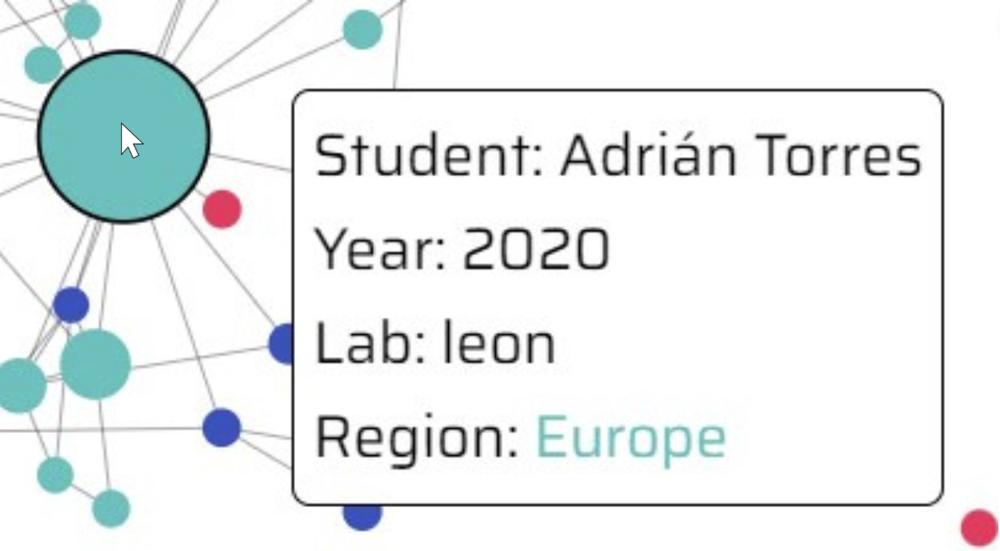

When the window loads, select the `div` with an id of `tooltip`. Whenever the mouse moves, store the new position in the `mousePos` object. It then calculates the dimensions and coordinates of a tooltip.

```js
// run when page loads
window.onload = () => {
    Tooltip = d3.select("#tooltip");
    body = document.getElementsByTagName('body')[0];

    window.addEventListener('pointermove', (event) => {
        mousePos = {
            x: event.clientX,
            y: event.clientY
        };

        let tooltipWidth = Tooltip.node().offsetWidth; // Width of the tooltip
        let tooltipHeight = Tooltip.node().offsetHeight; // Height of the tooltip
        let windowWidth = document.documentElement.clientWidth; // Width of the window
        let windowHeight = document.documentElement.clientHeight; // Height of the window

        let x = event.clientX + body.scrollLeft + 50;
        let y = event.clientY + body.scrollTop - 10;

        // Consider a buffer to ensure that 
        // the tooltip doesn't touch the edge of the viewport.
        let buffer = {
            "x": 50,
            "y": 10
        };

        // If the tooltip would go off the right side of the screen
        if (x + tooltipWidth + buffer.x - body.scrollLeft > windowWidth) {
            x = x - tooltipWidth - (50 * 2);
        }

        // If the tooltip would go off the bottom of the screen
        if (y + tooltipHeight + buffer.y - body.scrollTop > windowHeight) {
            y = y - tooltipHeight + (10 * 2);
        }

        Tooltip.style("left", x + "px");
        Tooltip.style("top", y + "px");
    });
```

*app.js - load data*

This section of the code loads data from `final_data.json`, precalculates data-intensive metrics that are used later in the visualization (largest and fewest number of times referenced for each subject area, dictionaries of edges with keys of students, all lab names, and strongest edge), and initializes the data arrays for the default settings (all labs, all subject areas, minimum of 20 times referenced).

See all of the function definitions in [`helper_functions.js`](#helper-functions) below, except for `updateData` which is defined in [`update_data.js`](#update-data), `initializeLabMultiselect` which is defined in [`multiselect_dropdown.js`](#lab-filter), `initializeDial` which is defined in [`dial.js`](#minimum-times-referenced-dial), and `initializeCarousel` which is defined in [`carousel.js`](#subject-area-carousel).

```js
    // load the json data and filter out all references by students to themselves
    create_not_filteredFromJSON().then(() => {

        // store the most and least amount of references for a student in each subject area
        calculateMinMaxMapFromFiltered(); 

        // go through all of the data and create an dictionary where you can look up a student and their subject area and recieve the number of times they were referenced in that subject area
        createReferenceCache();

        // create a dictionary of each time a student referenced another student for a certain topic
        createNumLinksDictFrom_not_filtered(nodes_not_filtered, links_not_filtered);

        // stores each student's lab (using their website URL) and removes all repeats
        setLabs(nodes_not_filtered.map(n => n.id));

        // stores all of the nodes and edges who meet the default filter criteria into the main `nodes`, `node_ids`, and `links` arrays
        transferNot_filteredToArrays();

        // stores the strongest edge between nodes
        calculateMaxStrength();
```

*app.js - initialize simulation and filters*

This section initializes the filters (subject area, labs, years, and minimum number of times referenced) and the visualization (SVG elements and linear gradients for edges when only one node is highlighted).

```js
        // make the lab filter display the default option
        setCurrentLabHighlightList();

        // initialize the force graph simulation
        createSimulation();

        // initialize the HTML elements that the SVGs of the visualization
        createAndFormatSVG();

        // initialize linear gradients
        initializeDefs();

        // create the container SVG element for the graph
        gl_ = svg.append("g").attr("transform", "translate(150, -10)");

        // pair the linear gradient SVGs to all of the references, not only the selected ones, so that elements aren't created in real-time as filters are changed. (Doesn't take into account that some edges will never have a linear gradient)
        registerLinearGradients(links_not_filtered);

        // create SVG container for all of the nodes
        nodesToNodeAndFormat();

        // initialize year-select pie
        createPie();

        // create overlay text and links, such as link to documentation, mattermost channel, etc
        createOverlayText();

        // update the graph to display network on the SVG
        updateData({
            minNumConnections: 20,
            simulation,
            svg,
            g,
            "gl": gl_
        })

        // initialize subject-area-selection carousel
        initializeCarousel(d => { // anonymous function defines behavior on carousel update
            currentTopic = d;
            if (currentTopic != "All") {
                mapMin = minMaxMap[currentTopic].min;
                mapMax = minMaxMap[currentTopic].max;
            } else {
                [mapMin, mapMax] = [1, 60];
            }
            updateDialText(currentDialDeg, dialCallback); 
        }, topicCarouselList, 350, 600, 30, 10, svg, FAB_PALETTE);

        // defines callback function for lab filter being altered 
        const labCallback = lab_list => {
            currentLabHighlightList = lab_list;
            updateData({ // updates visualization with new filters
                minNumConnections,
                simulation,
                svg,
                g,
                "gl": gl_
            });
        };

        // defines callback function for minimum number of times referenced filter being altered
        const dialCallback = (roundedVal, first = false) => {
            minNumConnections = roundedVal;
            updateData({ // updates visualization wth new filters
                "minNumConnections": roundedVal,
                simulation,
                svg,
                g,
                "gl": gl_,
                "isFirst": first
            });
        };

        // initializes minimum number of times referenced dial
        initializeDial(svg, dialCallback);

        // initialize lab multiselect dropdown functionalityW
        initializeLabMultiselect(labs, labCallback);

    });
};
```

#### Helper Functions

`helper_functions.js` defines many functions used in other JavaScript files, including simulation initialization and data loading and processing. All of the functions are explained in the documentation or comments where they are called.

```js
const clamp = (num, min, max) => Math.min(Math.max(num, min), max);

const toTitleCase = str => {
    return str.replace(
        /\w\S*/g,
        function(txt) {
            return txt.charAt(0).toUpperCase() + txt.substr(1).toLowerCase();
        }
    );
};

function normalize(value, min, max) {
    return (value - min) / (max - min);
}

const calculateMinMax = (ns, ls, topic) => {
    let minV = Infinity;
    let maxV = -Infinity;
    ns.forEach(n => {
        let v = 0;
        ls.forEach(l => {
            if (l.target == n.id && (topic == l.topic || topic == "All")) {
                v += l.value;
            }
        });
        if (v < minV) minV = v;
        if (v > maxV) maxV = v;
    });
    return {
        min: minV,
        max: maxV
    };
};

const sumObj = obj => Object.values(obj).reduce((a, b) => a + b, 0);

const getAllLabs = node_ids => {
    let labs = [];
    for (let i = 0; i < node_ids.length; i++) {
        const node_id = node_ids[i];
        const lab = node_id.split(";")[1].split("/")[5];
        if (!labs.includes(lab)) labs.push(lab);
    }

    return labs;
};

const filterStudents = (nodes_not_filtered, links_not_filtered, filterFunc) => {
    let nodes = nodes_not_filtered.filter(n => filterFunc(n));

    let node_ids = nodes.map(n => n.id);

    let links = JSON.parse(JSON.stringify(links_not_filtered)).filter(l => { // deepcopy solves heisenbug
        return ((node_ids.includes(l.target.id) || node_ids.includes(l.target)) && (node_ids.includes(l.source.id) | node_ids.includes(l.source)));
    });
    return [nodes, node_ids, links];
};

const uniqueId = l => {
    let sT;
    let tT;
    if (typeof l.source == 'string') {
        sT = l.source;
        tT = l.target;
    } else {
        sT = l.source.id;
        tT = l.target.id;
    }

    return `${sT}${tT}${l.topic}${l.value}`;
};

const createNumLinksDictFrom_not_filtered = () => {
    for (let i = 0; i < nodes_not_filtered.length; i++) {
        let toAdd = {
            "source": {},
            "target": {}
        };
        for (let j = 0; j < TOPICS.length; j++) {
            toAdd.source[TOPICS[j]] = 0;
            toAdd.target[TOPICS[j]] = 0;
        }
        numLinksDict[nodes_not_filtered[i].id] = toAdd;
    }
    for (let i = 0; i < links_not_filtered.length; i++) {
        const l = links_not_filtered[i];
        numLinksDict[l.target].target[l.topic] += l.value;
        numLinksDict[l.source].source[l.topic] += l.value;
    }
};


const create_not_filteredFromJSON = async () => {
    return d3.json('final_data.json').then(data => {
        links_not_filtered = data.links.map(d => Object.assign({}, d)).filter(l => l.target != l.source);
        nodes_not_filtered = data.nodes.map(d => Object.assign({}, d));
    });
};

const assignFilter = filterResult => [nodes, node_ids, links] = filterResult;

const transferNot_filteredToArrays = () => {
    assignFilter(filterStudents(nodes_not_filtered, links_not_filtered, n => {
        if (currentTopic == "All") {
            return sumObj(numLinksDict[n.id].target) >= minNumConnections;
        } else {
            return numLinksDict[n.id].target[currentTopic] >= minNumConnections;
        }
    }));
};

const initializeDefs = () => {
    linearGradient = d3.select("defs").selectAll("linearGradient");
};

const getGradientID = l => {
    let sForm, tForm;
    try {
        sForm = l.source.id.replace(/\W/g, '_');
    } catch {
        sForm = l.source.replace(/\W/g, '_');
    }

    try {
        tForm = l.target.id.replace(/\W/g, '_');
    } catch {
        tForm = l.target.replace(/\W/g, '_');
    }

    return `gradient_${sForm}|${tForm}`
};

const registerLinearGradients = links => {
    const elem = linearGradient.data(links, l => getGradientID(l));
    elem.exit()
        .each(function(e, i) {
            const d = d3.select(this);
            document.remove(linearGradient[getGradientID(d)]);
            delete linearGradient[getGradientID(d)];
        })
        .remove();

    const enter = elem.enter().append("linearGradient")
        .attr("gradientUnits", "userSpaceOnUse")
        .attr("id", d => getGradientID(d))
        .attr("x1", 0)
        .attr("x2", 1)
        .attr("y1", 0)
        .attr("y2", 0);

    enter.append("stop").attr("offset", "0%").attr("stop-color", "rgba(" + RGB_LINE_COLOR + ",1)");
    enter.append("stop").attr("offset", "100%").attr("stop-color", "rgba(" + RGB_LINE_COLOR + ",0)");

    d3.select("defs").selectAll("linearGradient").each(function(e, i) {
        const d = d3.select(this)
        linearGradientDict[getGradientID(e)] = d;
    });
};

const condenseLinksforSimulation = ls => {
    let toReturn = [];
    for (let l of ls) {
        condensed = false;
        for (let i = 0; i < toReturn.length; i++) {
            r = toReturn[i];
            let lTargStr;
            let rTargStr;
            let lSourStr;
            let rSourStr;
            if (typeof l.target == 'string') lTargStr = l.target;
            else lTargStr = l.target.id;
            if (typeof r.target == 'string') rTargStr = r.target;
            else rTargStr = r.target.id;
            if (typeof l.source == 'string') lSourStr = l.source;
            else lSourStr = l.source.id;
            if (typeof r.source == 'string') rSourStr = r.source;
            else rSourStr = r.source.id;
            if ((lTargStr == rTargStr && lSourStr == rSourStr) || (lTargStr == rSourStr && lSourStr == rTargStr)) {
                toReturn[i].value += l.value;
                condensed = true;
                break;
            }
        }
        if (!condensed) {
            delete l.topic;
            toReturn.push(l);
        }
    }

    return toReturn;
};

const calculateMaxStrength = () => {
    maxStrength = 0;
    links.forEach(l => {
        if (l.value > maxStrength) {
            maxStrength = l.value;
        }
    });
}

const setLabs = node_ids => labs = getAllLabs(node_ids).sort();

const setCurrentLabHighlightList = () => currentLabHighlightList = labs;

const calculateSimulationStrength = (d, maxstrength) => (d => MINIMUM_STRENGTH_CONSTANT + Math.sqrt((normalize(d.value, 0, maxStrength) * 10 + 1) / SCALE_FACTOR)); // so that it returns the callback function

const createSimulation = () => {
    simulation = d3.forceSimulation(nodes)
        .force("boundary", forceBoundary(forceBoundaryMargin, forceBoundaryMargin, width - forceBoundaryMargin, height - forceBoundaryMargin))
        .force("link", d3.forceLink(links).id(d => d.id).strength(d => calculateSimulationStrength(d, maxStrength)))
        .force("charge", d3.forceManyBody().strength(-60) /*(d3.forceManyBody().strength(-50 / SCALE_FACTOR)*/ )
        .force("center", d3.forceCenter(width / 2, height / 2));
};

const createAndFormatSVG = () => {
    svg = d3.select("svg")
        .attr("width", width)
        .attr("height", height)
        .attr("viewBox", [0, 0, width, height])
        .style("max-width", "100%")
        .style("height", "auto")
        .style("background-color", "white");

    transformation = svg.node().getCTM();
    svgPoint = svg.node().createSVGPoint();
    boundingRect = svg.node().getBoundingClientRect();
};

const linksToLink = isFirst => {
    if (isFirst) gl = svg.append("g").attr("transform", "translate(150, -10)");

    const sel = gl.selectAll("path").data(condenseLinksforSimulation(links), l => uniqueId(l));

    sel.exit()
        .remove();

    sel.enter().append("path").merge(sel)
        .attr("fill", "none")
        .attr("stroke-width", LINE_WIDTH)
        .style("stroke-linecap", "round");
    return sel;
};

const calculateMinMaxMapFromFiltered = () => {
    [...TOPICS, "All"].forEach(topic => {
        minMaxMap[topic] = calculateMinMax(nodes_not_filtered, links_not_filtered, topic);
    });
};

const nodesToNodeAndFormat = () => {
    node = svg.append("g").attr("transform", "translate(150, -10)");
    g = node;
};

const configureNode = (node, nodes) => {
    const sel = g.selectAll("circle").data(nodes, n => n.id);

    sel.exit()
        .remove();

    const ent = sel.enter().append("circle").merge(sel);

    ent.attr("r", data => referenceCache[data.id]["All"]);

    ent.attr("fill", d => {
            const lab = d.id.split(";")[1].split("/")[5];
            return colorRegion(LABS_CONTINENT[lab]);
        })
        .attr("opacity", NODE_HIGHLIGHTED_OPACITY)
        .call(d3.drag()
            .on("start", dragstarted)
            .on("drag", dragged)
            .on("end", dragended));

    return g.selectAll("circle");
};

function dragstarted(event, d) {
    objectBeingDragged = d3.select(this);
    if (!event.active) simulation.alphaTarget(0.3).restart();
    d.fx = d.x;
    d.fy = d.y;
    mouseIsDragging = true;
}

function dragged(event, d) {
    d.fx = event.x;
    d.fy = event.y;
}

function dragended(event, d) {
    if (!event.active) simulation.alphaTarget(0);
    d.fx = null;
    d.fy = null;
    mouseIsDragging = false;
    const pointerOut = pointerOutOfSVG();
    if (pointerOut) {
        tooltipMouseleave(null, null, objectBeingDragged);
    }
    objectBeingDragged = null;
}

const getSimulationForceLinkDistance = d => referenceCache[d.target.id][currentTopic] + referenceCache[d.source.id][currentTopic]; // this is good but it doesn't completely fix the circle overlapping problem because of circles that are touching but aren't linked  //Math.max(referenceCache[d.target.id][currentTopic], referenceCache[d.source.id][currentTopic]);

const calibrateSimulation = () => {
    simulation.force("collision", forceCollide.radius(d => d.r / 1.2));

    simulation.force("link", d3.forceLink(links).id(d => d.id).distance(d => {
        return getSimulationForceLinkDistance(d);
    }));
};

const activationCheck = (currentYear, currentLabHighlightList, year, lab) => (year == currentYear || currentYear == "All") && (currentLabHighlightList.includes(lab));

const linkTick = () => {
    link.attr("d", d => {
        const gradientID = getGradientID(d);
        const lg = document.getElementById(gradientID);
        const {
            source,
            sourceYear,
            sourceLab,
            target,
            targetYear,
            targetLab
        } = getLinkSummary(d);
        const sourceIsActivated = activationCheck(sourceYear, sourceLab);
        const targetIsActivated = activationCheck(targetYear, targetLab);
        if (!((sourceIsActivated && targetIsActivated) || (!(sourceIsActivated || targetIsActivated)))) { // if only one is activated
            if (sourceIsActivated) {
                lg.setAttribute("x1", d.source.x);
                lg.setAttribute("y1", d.source.y);
                lg.setAttribute("x2", d.target.x);
                lg.setAttribute("y2", d.target.y);
            } else {
                lg.setAttribute("x2", d.source.x);
                lg.setAttribute("y2", d.source.y);
                lg.setAttribute("x1", d.target.x);
                lg.setAttribute("y1", d.target.y);
            }
        }

        const path = d3.path();
        path.moveTo(d.source.x, d.source.y);
        path.lineTo(d.target.x, d.target.y);
        return path.toString();
    });
};

const setSimulationTick = (node, link) => {

    linkTick(); // so that the directions and everything are correct before the user first drags on the simulation
    simulation.on("tick", () => {
        linkTick();
        node
            .attr("cx", d => d.x)
            .attr("cy", d => d.y)
    });
};

const selectByTopic = topic => {
    currentTopic = topic;
    let maxStrength = 0;
    links.forEach(l => {
        if (l.value > maxStrength && (l.topic == topic || topic == "All")) {
            maxStrength = l.value;
        }
    });

    link
        .attr('opacity', data => {
            if (data.topic == topic || topic == "All") {
                return (normalize(data.value, 0, maxStrength) / 2 + 0.5) / SCALE_FACTOR;
            } else {
                return 0;
            }
        });

    simulation
        .force("link", d3.forceLink(links).id(d => d.id)
            .strength(d => calculateSimulationStrength(d, maxStrength))
            .distance(d => getSimulationForceLinkDistance(d)));

    let topicLinks = [];
    links.forEach(l => {
        if (l.topic == topic || topic == "All") {
            topicLinks.push(l);
        }
    });

    node.attr("r", data => referenceCache[data.id][topic]);
    simulation.force("link", d3.forceLink(topicLinks).id(d => d.id).distance(d => getSimulationForceLinkDistance(d)));
    forceCollide.initialize(nodes);
    simulation.alpha(1).restart();
};

const configureGlowDefinitions = () => {
    defs = svg.append("defs");

    defs.append("filter")
        .attr("id", "sofGlow")
        .attr("width", "300%")
        .attr("height", "300%")
        .attr("x", "-100%")
        .attr("y", "-100%")
        .attr("stdDeviation", "1")
        .attr("result", "coloredBlur")
        .append("feGaussianBlur")
        .attr("in", "thicken")
        .attr("stdDeviation", "1")
        .attr("result", "blurred");
};

const getLinkSummary = data => {
    const source = data.source.id;
    const sourceYear = source.split(";")[1].split("/")[3];
    const sourceLab = source.split(";")[1].split("/")[5];
    const target = data.target.id;
    const targetYear = target.split(";")[1].split("/")[3];
    const targetLab = target.split(";")[1].split("/")[5];
    return {
        source,
        sourceYear,
        sourceLab,
        target,
        targetYear,
        targetLab
    };
};

const setLinkOpacity = () => {
    link.attr("opacity", data => {
        const {
            source,
            sourceYear,
            sourceLab,
            target,
            targetYear,
            targetLab
        } = getLinkSummary(data);
        let sourceIsOn = false;
        let targetIsOn = false;

        if (activationCheck(sourceYear, sourceLab)) {
            sourceIsOn = true;
        }
        if (activationCheck(targetYear, targetLab)) {
            targetIsOn = true;
        }

        if ((sourceIsOn || targetIsOn) && !(sourceIsOn && targetIsOn)) {
            return null;
        }
        return 1;
    });
    link.attr("stroke", data => {
        const source = data.source.id;
        const sourceYear = source.split(";")[1].split("/")[3];
        const sourceLab = source.split(";")[1].split("/")[5];
        const target = data.target.id;
        const targetYear = target.split(";")[1].split("/")[3];
        const targetLab = target.split(";")[1].split("/")[5];
        let sourceIsOn = false;
        let targetIsOn = false;

        if ((sourceYear == currentYear || currentYear == "All") && (currentLabHighlightList.includes(sourceLab))) {
            sourceIsOn = true;
        }
        if ((targetYear == currentYear || currentYear == "All") && (currentLabHighlightList.includes(targetLab))) {
            targetIsOn = true;
        }

        if (sourceIsOn && targetIsOn) {
            return "rgba(255,255,255" + ((normalize(data.value, 0, maxStrength) / 2 + 0.5) / SCALE_FACTOR).toString() + ")";
        } else if (sourceIsOn || targetIsOn) {
            return `url(#${getGradientID(data)})`;
        } else {
            return "rgba(255,255,255,0.05)";
        }
    });
};

const setYear = year => {
    currentYear = year;
    updateData({
        minNumConnections,
        simulation,
        svg,
        g,
        "gl": gl_
    })
};

const createPie = () => {
    const pieG = svg.append("g")
        .attr("transform", "translate(" + pieX + "," + pieY + ") rotate(" + 360 / 14 + ")");

    var pieData = {
        "All": 1
    };

    for (let i = 2018; i <= 2023; i++) {
        pieData[i] = 1;
    }

    var pie = d3.pie()
        .value(function(d) {
            return d.value;
        })
    var data_ready = pie(Object.entries(pieData).map(([key, value]) => ({
        key,
        value
    })));

    var arcGenerator = d3.arc()
        .innerRadius(50)
        .outerRadius(pieRadius)

    const rotatePie = d => {
        var rotate = -((d.startAngle + d.endAngle) / 2);
        pieG.transition()
            .duration(1000)
            .attr("transform", "translate(" + pieX + "," + pieY + ") rotate(" + (rotate / Math.PI * 180) + ")");
    };

    pieG
        .selectAll('mySlices')
        .data(data_ready)
        .enter()
        .append('path')
        .attr('d', arcGenerator)
        .attr('fill', PIE_SLICE_COLOR)
        .attr("stroke", "white")
        .style("stroke-width", "2px")
        .style("opacity", 1)
        .on('click', function(event, d) {
            setYear(d.data.key);
            rotatePie(d);
        });

    pieG
        .selectAll('mySlices')
        .data(data_ready)
        .enter()
        .append('text')
        .text(function(d) {
            return d.data.key
        })
        .attr("dy", "0.3em")
        .attr("transform", function(d) {
            return "translate(" + arcGenerator.centroid(d) + ") rotate(" + (d.startAngle + d.endAngle) / 2 * (180 / Math.PI) + ")";
        })
        .style('text-anchor', 'middle')
        .style('fill', PIE_TEXT_COLOR)
        .attr("font-weight", 700)
        .attr("font-family", "Saira")
        .style("font-size", 18)
        .on('click', function(event, d) {
            setYear(d.data.key);
            rotatePie(d);
        });
};

const createReferenceCache = () => {
    referenceCache = {};
    ["All", ...TOPICS.slice(1, -1)].forEach(topic => {
        nodes_not_filtered.forEach(data => {
            let r = 0;
            links_not_filtered.forEach(l => {
                if (l.target == data.id && (topic == "All" || l.topic == topic)) {
                    r += l.value;
                }
            });
            r = normalize(r, minMaxMap[topic].min, minMaxMap[topic].max) * NODE_SIZE_MULTIPLIER * ((1 - (1 / minMaxMap[topic].max)) / 2) + NODE_SIZE_MINIMUM;
            r /= SCALE_FACTOR;
            data.r = r;
            if (!(data.id in referenceCache)) referenceCache[data.id] = {};
            referenceCache[data.id][topic] = r;
        });
    });
};

const centerText = (txt, xPos) => {
    let textWidth = txt.node().getBBox().width;
    txt.attr("x", (xPos - (textWidth / 2)));
};

const pointerOutOfSVG = () => {
    const el = document.elementFromPoint(mousePos.x, mousePos.y);
    return !(svg.node() === el || svg.node().contains(el));
};

const tooltipMouseover = function(event, d) {
    if (mouseIsOver) return;
    mouseIsOver = true;
    Tooltip
        .style("display", "initial")
        .style("visibility", "visible");

    d3.select(this)
        .style("stroke", HOVER_NODE_STROKE_COLOR)
        .style("stroke-width", NODE_STROKE_WIDTH_HIGHLIGHTED);
}

var tooltipMousemove = function(event, d) {
    Tooltip
        .html("<span>Student: " + d.id.split(";")[0] + "<br>Year: " + d.id.split(";")[1].split("/")[3] + "<br>Lab: " + d.id.split(";")[1].split("/")[5] + "<br>Region: <span style=\"color:" + colorRegion(LABS_CONTINENT[d.id.split(";")[1].split("/")[5]]) + ";\">" + LABS_CONTINENT[d.id.split(";")[1].split("/")[5]] + "</span></span>");
};

var tooltipMouseleave = function(event, d, obj = null) {
    if (mouseIsDragging) return;
    mouseIsOver = false;
    Tooltip
        .style("display", "none")
        .style("visbility", "hidden");

    (obj == null ? d3.select(this) : obj)
    .style("stroke", NOT_HOVERING_NODE_STROKE_COLOR)
        .style("stroke-width", NOT_HOVERING_NODE_STROKE_WIDTH);
};
```

#### Update Data

To create a scalable architecture for adding new features to the data visualization, the update sequence relies on multiples arrays of functions that each handle an aspect of the visualization. `updata_data.js` is the epicenter of interactivity in the visualization. See the following flowchart for an overview of the process.

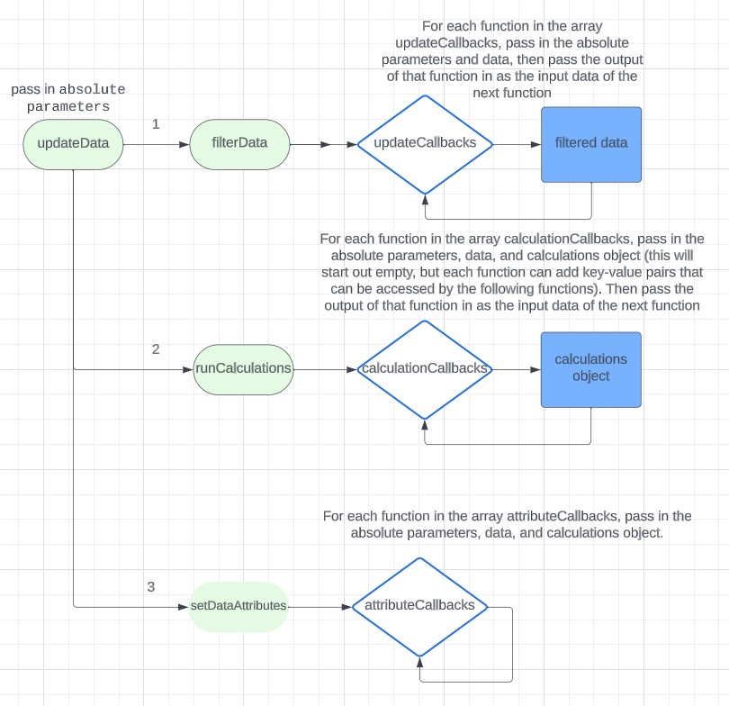

The `updateData` function is called whenever a filter is changed that requires an update in the visualization. It takes as a parameter `absolutes`, an object that stores the newly changed filters and object references (for example, the HTML element encasing the SVGs of the visualization). It is called `absolutes` since they do not change from the time the filters are updates to when the data has been recalculated and the visualization has been updates. 

```js
const updateData = absolutes => {
  absolutes = {
      ...absolutes,
      "topic": ("topic" in absolutes ? absolutes.topic : currentTopic),
      "year": currentYear,
      currentLabHighlightList
  };
  const data = filterData(updateCallbacks, absolutes);
  const calculationDict = runCalculations(calculationCallbacks, data, absolutes);
  setDataAttributes(attributeCallbacks, data, calculationDict, absolutes);
}
```

`updateData` first calls `filterData`, passing in `updateCallbacks` (an array of functions that filter which students and edges should appear given filters in `absolutes`) and `absolutes`. 

```js
// filter nodes and edges based on `absolutes`
const filterData = (funcs, absolutes) => {
  let d = {
      "nodes": nodes_not_filtered,
      "links": links_not_filtered
  };
  for (let f of funcs) {
      d = f(d, absolutes);
  }
  return d;
};

// run calculations for visualization
const runCalculations = (funcs, data, absolutes) => {
  let calcs = {};
  for (let f of funcs) {
      calcs = {
          ...calcs,
          ...f(data, absolutes, calcs)
      };
  }
  return calcs;
}

// update the visualization
const setDataAttributes = (funcs, data, calcs, absolutes) => {
  for (let f of funcs) {
      f(data, calcs, absolutes);
  }
}
```

`updateCallbacks` filters the data by beginning with the arrays of all nodes and edges and removing students that do not meet the certain minimum number of times referenced for the selected subject area. However, students are not removed for filters such as lab and year - these nodes will have a lower opacity instead, set in the `attributeCallbacks` array.

```js
const updateCallbacks = [
  (data, absl) => {
      const f = (nodes_not_filtered, links_not_filtered, filterFunc) => {
          let nodes = nodes_not_filtered.filter(n => filterFunc(n));

          let node_ids = nodes.map(n => n.id);
          let links = JSON.parse(JSON.stringify(links_not_filtered)).filter(l => { // deepcopy solves heisenbug
              return (l.topic == absl.topic || absl.topic == "All") && (node_ids.includes(l.target)) && (node_ids.includes(l.source));
          });

          return [nodes, links];
      };
      const [nodes, links] = f(data.nodes, data.links, n => {
          if (absl.topic == "All") {
              return sumObj(numLinksDict[n.id].target) >= absl.minNumConnections;
          } else {
              return numLinksDict[n.id].target[absl.topic] >= absl.minNumConnections;
          }
      });
      return {
          nodes,
          links
      };
  }
];
```

`calculationCallbacks` runs all of the real-time calculations and fetches pre-calculated metrics that are required for the visualization. The functions are as follows:

- The strongest edge between two nodes (i.e. most times referenced each other out of any two pairs of students - number of times are pre-calculated, but which student has the highest for each subject-area is not) is found.
- Overlapping edges are condensed (i.e. Student A referenced Student B 5 times and Student B referenced Student A 4 times for the subject area "Electronics Design" becomes one edge with a value of 9).
- D3JS enter-update-exit protocol is used to update the `link` variable (different from `links`, `link` is a D3JS [selection](https://d3js.org/d3-selection/selecting) of the edge elements)
- D3JS enter-update-exit protocol is used to update the `node` variable (different from `nodes`, `node` is a D3JS [selection](https://d3js.org/d3-selection/selecting) of the node elements)

```js
const calculationCallbacks = [
  (data, absl) => {
      let maxStrength = 0;
      data.links.forEach(l => {
          if (l.value > maxStrength) {
              maxStrength = l.value;
          }
      });
      return {
          maxStrength
      };
  },
  (data, absl) => {
      return {
          "condensedLinks": condenseLinksforSimulation(data.links)
      }
  },
  (data, absl, calcs) => {
      const sel = absl.gl.selectAll("path").data(calcs.condensedLinks, l => uniqueId(l));

      sel.exit()
          .remove();

      const ent = sel.enter().append("path").merge(sel);

      return {
          "link": ent
      };
  },
  (data, absl) => {
      const sel = absl.g.selectAll("circle").data(data.nodes, n => n.id);
      sel.exit()
          .remove();

      const ent = sel.enter().append("circle").merge(sel);

      return {
          "node": ent
      };
  }
];
```

`attributeCallbacks` actually updates the visualization using the calculations and compiled arrays from the first two processes, `updateCallbacks` and `calculationCallbacks`. The functions are as follows:

- set node radii
- set force simulation edges, their lengths, and their strengths; set the collision circles for the nodes
- color nodes by continent, change node opacity, set node drag mouse events
- set edge stroke width and linecap
- activate linear gradient SVGs for edges where one node is highlighted and one isn't (due to filters from `absolutes` that weren't utilized in `updateCallbacks` to eliminate nodes)
- reduce opacity of unselected nodes
- set opacity of edges where either both nodes are highlighted or not highlighted
- when a student's node is clicked, open their documentation website
- reheat simulation

```js
const attributeCallbacks = [
  (data, calcs, absl) => { // node radii
      calcs.node.attr("r", d => {
          return referenceCache[d.id][absl.topic];
      });
      absl.simulation.nodes(data.nodes);
      forceCollide.initialize(data.nodes);
  }, // simulation edges + node collision circles
  (data, calcs, absl) => {
      absl.simulation.force("link", d3.forceLink(calcs.condensedLinks).id(d => d.id).distance(d => getSimulationForceLinkDistance(d)));
      absl.simulation.force("collision", forceCollide.radius(d => d.r));
  },
  (data, calcs, absl) => { // coloring nodes by continent, setting node opacity, defining dragging behavior
      calcs.node.attr("fill", d => {
              const lab = d.id.split(";")[1].split("/")[5];
              return colorRegion(LABS_CONTINENT[lab]);
          })
          .attr("opacity", NODE_HIGHLIGHTED_OPACITY)
          .call(d3.drag()
              .on("start", dragstarted)
              .on("drag", dragged)
              .on("end", dragended));
  },
  (data, calcs, absl) => { // setting edge stroke width and linecap
      calcs.link.attr("fill", "none")
          .attr("stroke-width", LINE_WIDTH)
          .style("stroke-linecap", "round");
  },
  (data, calcs, absl) => { // manipulate linear gradient SVGs for edges where one node is highlighted and one isn't
      const linkTick = () => {
          calcs.link.attr("d", d => {
              const gradientID = getGradientID(d);
              const lg = document.getElementById(gradientID);
              const {
                  source,
                  sourceYear,
                  sourceLab,
                  target,
                  targetYear,
                  targetLab
              } = getLinkSummary(d);
              const sourceIsActivated = activationCheck(absl.year, absl.currentLabHighlightList, sourceYear, sourceLab);
              const targetIsActivated = activationCheck(absl.year, absl.currentLabHighlightList, targetYear, targetLab);
              if (!((sourceIsActivated && targetIsActivated) || (!(sourceIsActivated || targetIsActivated)))) { // if only one is activated

                  if (sourceIsActivated) {
                      lg.setAttribute("x1", d.source.x);
                      lg.setAttribute("y1", d.source.y);
                      lg.setAttribute("x2", d.target.x);
                      lg.setAttribute("y2", d.target.y);
                  } else {
                      lg.setAttribute("x2", d.source.x);
                      lg.setAttribute("y2", d.source.y);
                      lg.setAttribute("x1", d.target.x);
                      lg.setAttribute("y1", d.target.y);
                  }
              }
              const path = d3.path();
              path.moveTo(d.source.x, d.source.y);
              path.lineTo(d.target.x, d.target.y);
              return path.toString();
          });
      }
      linkTick();
      absl.simulation.on("tick", () => {
          linkTick();
          calcs.node
              .attr("cx", d => d.x)
              .attr("cy", d => d.y)
      });
  },
  (d, calcs, absl) => { // reduce opacity of unselected nodes
      calcs.node.attr("opacity", data => {
          const y = data.id.split(";")[1].split("/")[3];
          const lab = data.id.split(";")[1].split("/")[5];
          if ((y == absl.year || absl.year == "All") && absl.currentLabHighlightList.includes(lab)) {
              return NODE_HIGHLIGHTED_OPACITY;
          } else {
              return minOpacity;
          }
      });
  },
  (d, calcs, absl) => { // set opacity of edges where either both nodes are highlighted or not highlighted
      calcs.link.attr("opacity", data => {
          const {
              source,
              sourceYear,
              sourceLab,
              target,
              targetYear,
              targetLab
          } = getLinkSummary(data);
          let sourceIsOn = false;
          let targetIsOn = false;

          if (activationCheck(absl.year, absl.currentLabHighlightList, sourceYear, sourceLab)) {
              sourceIsOn = true;
          }
          if (activationCheck(targetYear, targetLab)) {
              targetIsOn = true;
          }

          if ((sourceIsOn || targetIsOn) && !(sourceIsOn && targetIsOn)) {
              return null;
          }
          return 1;
      });
      calcs.link.attr("stroke", data => {
          const source = data.source.id;
          const sourceYear = source.split(";")[1].split("/")[3];
          const sourceLab = source.split(";")[1].split("/")[5];
          const target = data.target.id;
          const targetYear = target.split(";")[1].split("/")[3];
          const targetLab = target.split(";")[1].split("/")[5];
          let sourceIsOn = false;
          let targetIsOn = false;

          if (activationCheck(absl.year, absl.currentLabHighlightList, sourceYear, sourceLab)) {
              sourceIsOn = true;
          }
          if (activationCheck(absl.year, absl.currentLabHighlightList, targetYear, targetLab)) {
              targetIsOn = true;
          }

          if (sourceIsOn && targetIsOn) {
              return "rgba(" + RGB_LINE_COLOR + ",1)";
          } else if (sourceIsOn || targetIsOn) {
              return `url(#${getGradientID(data)})`;
          } else {
              return "rgba(" + RGB_LINE_COLOR + ",0.05)";
          }
      });
  },
  (data, calcs, absl) => { // when a student's node is clicked, open their documentation website

      calcs.node.each(function(e, i) {
          const currentNode = d3.select(this);
          if (!currentNode.on("mouseover")) {
              currentNode.on("mouseover", tooltipMouseover)
                  .on("mousemove", tooltipMousemove)
                  .on("mouseleave", tooltipMouseleave);
              currentNode.on('click', (d, i) => {
                  window.open(i.id.split(";")[1], "_blank")
              })
          }
      });
  },
  (data, calcs, absl) => absl.simulation.alpha(1).restart() // reheat simulation
];
```

So all together, here's `update_data.js`.

*update_data.js*

```js
const updateCallbacks = [
  (data, absl) => {
      const f = (nodes_not_filtered, links_not_filtered, filterFunc) => {
          let nodes = nodes_not_filtered.filter(n => filterFunc(n));

          let node_ids = nodes.map(n => n.id);
          let links = JSON.parse(JSON.stringify(links_not_filtered)).filter(l => { // deepcopy solves heisenbug
              return (l.topic == absl.topic || absl.topic == "All") && (node_ids.includes(l.target)) && (node_ids.includes(l.source));
          });

          return [nodes, links];
      };
      const [nodes, links] = f(data.nodes, data.links, n => {
          if (absl.topic == "All") {
              return sumObj(numLinksDict[n.id].target) >= absl.minNumConnections;
          } else {
              return numLinksDict[n.id].target[absl.topic] >= absl.minNumConnections;
          }
      });
      return {
          nodes,
          links
      };
  }
];

const calculationCallbacks = [
  (data, absl) => {
      let maxStrength = 0;
      data.links.forEach(l => {
          if (l.value > maxStrength) {
              maxStrength = l.value;
          }
      });
      return {
          maxStrength
      };
  },
  (data, absl) => {
      return {
          "condensedLinks": condenseLinksforSimulation(data.links)
      }
  },
  (data, absl, calcs) => {
      const sel = absl.gl.selectAll("path").data(calcs.condensedLinks, l => uniqueId(l));

      sel.exit()
          .remove();

      const ent = sel.enter().append("path").merge(sel);

      return {
          "link": ent
      };
  },
  (data, absl) => {
      const sel = absl.g.selectAll("circle").data(data.nodes, n => n.id);
      sel.exit()
          .remove();

      const ent = sel.enter().append("circle").merge(sel);

      return {
          "node": ent
      };
  }
];

const attributeCallbacks = [
    (data, calcs, absl) => { // node radii
        calcs.node.attr("r", d => {
            return referenceCache[d.id][absl.topic];
        });
        absl.simulation.nodes(data.nodes);
        forceCollide.initialize(data.nodes);
    }, // simulation edges + node collision circles
    (data, calcs, absl) => {
        absl.simulation.force("link", d3.forceLink(calcs.condensedLinks).id(d => d.id).distance(d => getSimulationForceLinkDistance(d)));
        absl.simulation.force("collision", forceCollide.radius(d => d.r));
    },
    (data, calcs, absl) => { // coloring nodes by continent, setting node opacity, defining dragging behavior
        calcs.node.attr("fill", d => {
                const lab = d.id.split(";")[1].split("/")[5];
                return colorRegion(LABS_CONTINENT[lab]);
            })
            .attr("opacity", NODE_HIGHLIGHTED_OPACITY)
            .call(d3.drag()
                .on("start", dragstarted)
                .on("drag", dragged)
                .on("end", dragended));
    },
    (data, calcs, absl) => { // setting edge stroke width and linecap
        calcs.link.attr("fill", "none")
            .attr("stroke-width", LINE_WIDTH)
            .style("stroke-linecap", "round");
    },
    (data, calcs, absl) => { // manipulate linear gradient SVGs for edges where one node is highlighted and one isn't
        const linkTick = () => {
            calcs.link.attr("d", d => {
                const gradientID = getGradientID(d);
                const lg = document.getElementById(gradientID);
                const {
                    source,
                    sourceYear,
                    sourceLab,
                    target,
                    targetYear,
                    targetLab
                } = getLinkSummary(d);
                const sourceIsActivated = activationCheck(absl.year, absl.currentLabHighlightList, sourceYear, sourceLab);
                const targetIsActivated = activationCheck(absl.year, absl.currentLabHighlightList, targetYear, targetLab);
                if (!((sourceIsActivated && targetIsActivated) || (!(sourceIsActivated || targetIsActivated)))) { // if only one is activated
  
                    if (sourceIsActivated) {
                        lg.setAttribute("x1", d.source.x);
                        lg.setAttribute("y1", d.source.y);
                        lg.setAttribute("x2", d.target.x);
                        lg.setAttribute("y2", d.target.y);
                    } else {
                        lg.setAttribute("x2", d.source.x);
                        lg.setAttribute("y2", d.source.y);
                        lg.setAttribute("x1", d.target.x);
                        lg.setAttribute("y1", d.target.y);
                    }
                }
                const path = d3.path();
                path.moveTo(d.source.x, d.source.y);
                path.lineTo(d.target.x, d.target.y);
                return path.toString();
            });
        }
        linkTick();
        absl.simulation.on("tick", () => {
            linkTick();
            calcs.node
                .attr("cx", d => d.x)
                .attr("cy", d => d.y)
        });
    },
    (d, calcs, absl) => { // reduce opacity of unselected nodes
        calcs.node.attr("opacity", data => {
            const y = data.id.split(";")[1].split("/")[3];
            const lab = data.id.split(";")[1].split("/")[5];
            if ((y == absl.year || absl.year == "All") && absl.currentLabHighlightList.includes(lab)) {
                return NODE_HIGHLIGHTED_OPACITY;
            } else {
                return minOpacity;
            }
        });
    },
    (d, calcs, absl) => { // set opacity of edges where either both nodes are highlighted or not highlighted
        calcs.link.attr("opacity", data => {
            const {
                source,
                sourceYear,
                sourceLab,
                target,
                targetYear,
                targetLab
            } = getLinkSummary(data);
            let sourceIsOn = false;
            let targetIsOn = false;
  
            if (activationCheck(absl.year, absl.currentLabHighlightList, sourceYear, sourceLab)) {
                sourceIsOn = true;
            }
            if (activationCheck(targetYear, targetLab)) {
                targetIsOn = true;
            }
  
            if ((sourceIsOn || targetIsOn) && !(sourceIsOn && targetIsOn)) {
                return null;
            }
            return 1;
        });
        calcs.link.attr("stroke", data => {
            const source = data.source.id;
            const sourceYear = source.split(";")[1].split("/")[3];
            const sourceLab = source.split(";")[1].split("/")[5];
            const target = data.target.id;
            const targetYear = target.split(";")[1].split("/")[3];
            const targetLab = target.split(";")[1].split("/")[5];
            let sourceIsOn = false;
            let targetIsOn = false;
  
            if (activationCheck(absl.year, absl.currentLabHighlightList, sourceYear, sourceLab)) {
                sourceIsOn = true;
            }
            if (activationCheck(absl.year, absl.currentLabHighlightList, targetYear, targetLab)) {
                targetIsOn = true;
            }
  
            if (sourceIsOn && targetIsOn) {
                return "rgba(" + RGB_LINE_COLOR + ",1)";
            } else if (sourceIsOn || targetIsOn) {
                return `url(#${getGradientID(data)})`;
            } else {
                return "rgba(" + RGB_LINE_COLOR + ",0.05)";
            }
        });
    },
    (data, calcs, absl) => { // when a student's node is clicked, open their documentation website
  
        calcs.node.each(function(e, i) {
            const currentNode = d3.select(this);
            if (!currentNode.on("mouseover")) {
                currentNode.on("mouseover", tooltipMouseover)
                    .on("mousemove", tooltipMousemove)
                    .on("mouseleave", tooltipMouseleave);
                currentNode.on('click', (d, i) => {
                    window.open(i.id.split(";")[1], "_blank")
                })
            }
        });
    },
    (data, calcs, absl) => absl.simulation.alpha(1).restart() // reheat simulation
  ];


// filter nodes and edges based on `absolutes`
const filterData = (funcs, absolutes) => {
    let d = {
        "nodes": nodes_not_filtered,
        "links": links_not_filtered
    };
    for (let f of funcs) {
        d = f(d, absolutes);
    }
    return d;
  };
  
  // run calculations for visualization
  const runCalculations = (funcs, data, absolutes) => {
    let calcs = {};
    for (let f of funcs) {
        calcs = {
            ...calcs,
            ...f(data, absolutes, calcs)
        };
    }
    return calcs;
  }
  
  // update the visualization
  const setDataAttributes = (funcs, data, calcs, absolutes) => {
    for (let f of funcs) {
        f(data, calcs, absolutes);
    }
  }

const updateData = absolutes => {
  absolutes = {
      ...absolutes,
      "topic": ("topic" in absolutes ? absolutes.topic : currentTopic),
      "year": currentYear,
      currentLabHighlightList
  };
  const data = filterData(updateCallbacks, absolutes);
  const calculationDict = runCalculations(calculationCallbacks, data, absolutes);
  setDataAttributes(attributeCallbacks, data, calculationDict, absolutes);
}
```

#### Lab Filter

`multiselect-dropdown.js` contains the JavaScript functionality for the lab selection filter. The only part of the code that directly invovles the data visualization is the `initializeLabMultiselect` function. It takes in a list of labs and a callback function as parameters, initializes a new Multiselect object (defined earlier in the file), and binds the GUI to the callback. The callback is called whenever there is a change in the selection.

```js
const initializeLabMultiselect = (labs, callback) => {
    $(document).ready(function() {
        var multi = new Multiselect("#countries", callback);
    });

    const select = d3.select("#my_dataviz").select("div div.container");

    select.selectAll("option")
        .data(["All"].concat(labs)) // Add "All" option to the start of the list
        .join("option")
        .attr("value", d => d)
        .html(d => d);
};
```

Here's the entire file. The code uses [jQuery](https://jquery.com/).

*multiselect-dropdown.js*

```js
Array.prototype.search = function(elem) {
    for (var i = 0; i < this.length; i++) {
        if (this[i] == elem) return i;
    }

    return -1;
};

var Multiselect = function(selector, callback) {
    if (!$(selector)) {
        console.error("ERROR: Element %s does not exist.", selector);
        return;
    }

    this.selector = selector;
    this.selections = [];
    this.callback = callback;

    (function(that) {
        that.events(callback);
    })(this);
};

Multiselect.prototype = {
    open: function(that) {
        var target = $(that).parent().attr("data-target");

        // If we are not keeping track of this one's entries, then start doing so.
        if (!this.selections) {
            this.selections = [];
        }

        $(this.selector + ".multiselect").toggleClass("active");
    },

    close: function() {
        $(this.selector + ".multiselect").removeClass("active");
    },

    events: function(callback) { // Pass the callback function as an argument
        var that = this;

        $(document).on("click", that.selector + ".multiselect > .title", function(e) {
            if (e.target.className.indexOf("close-icon") < 0) {
                that.open();
            }
        });

        $(document).on("click", that.selector + ".multiselect > .title > .close-icon", function(e) {
            that.clearSelections();
        });


        $(document).on("click", that.selector + ".multiselect option", function(e) {
            var selection = $(this).attr("value");
            var optionsCount = $(that.selector + ".multiselect option").length;
            if (selection == "All") {
                if (that.selections.search("All") < 0) {
                    // Select All
                    that.selections = $(that.selector + ".multiselect option").map(function() {
                        return $(this).val();
                    }).get();
                } else {
                    // Deselect All
                    that.selections = [];
                }
            } else {
                var io = that.selections.search(selection);
                if (io < 0) that.selections.push(selection);
                else that.selections.splice(io, 1);
                // If not all options are selected, deselect "All"
                if (that.selections.length !== optionsCount && that.selections.search("All") >= 0) {
                    const res = that.selections.search("All");
                    if (res != -1) that.selections.splice(res, 1);
                }
                // If all options are selected, also select 'All'
                else if (that.selections.length === optionsCount - 1 && that.selections.search("All") < 0) {
                    that.selections.push('All');
                }
            }

            that.selectionStatus();
            that.setSelectionsString();
            if (typeof callback === "function") {
                callback(that.selections);
            }
        });
    },

    selectionStatus: function() {
        var obj = $(this.selector + ".multiselect");

        if (this.selections.length) obj.addClass("selection");
        else obj.removeClass("selection");
    },

    clearSelections: function() {
        this.selections = [];
        this.selectionStatus();
        this.setSelectionsString();
        this.callback([]);
    },

    getSelections: function() {
        return this.selections;
    },

    setSelectionsString: function() {
        var selects = this.getSelectionsString().split(", ");
        $(this.selector + ".multiselect > .title").attr("title", selects);

        var opts = $(this.selector + ".multiselect option");

        if (selects.toString().length > 16) {
            $(this.selector + ".multiselect > .title > .text")
                .text(selects.toString().slice(0, 16) + "...");
        } else {
            $(this.selector + ".multiselect > .title > .text")
                .text(selects);
        }

        for (var i = 0; i < opts.length; i++) {
            $(opts[i]).removeClass("selected");
        }
        for (var j = 0; j < selects.length; j++) {
            var select = selects[j];
            for (var i = 0; i < opts.length; i++) {
                if ($(opts[i]).attr("value") == select || select == "All") {
                    $(opts[i]).addClass("selected");
                    if (select != "All") break;
                }
            }
        }
    },

    getSelectionsString: function() {
        // If "All" is selected, return "All"
        if (this.selections.search("All") >= 0)
            return "All";
        else if (this.selections.length > 0)
            return this.selections.join(", ");
        else return "Filter Labs";
    },

    setSelections: function(arr) {
        if (!arr[0]) {
            error("ERROR: This does not look like an array.");
            return;
        }

        this.selections = arr;
        this.selectionStatus();
        this.setSelectionsString();
    },
};

const initializeLabMultiselect = (labs, callback) => {
    $(document).ready(function() {
        var multi = new Multiselect("#countries", callback);
    });

    const select = d3.select("#my_dataviz").select("div div.container");

    select.selectAll("option")
        .data(["All"].concat(labs)) // Add "All" option to the start of the list
        .join("option")
        .attr("value", d => d)
        .html(d => d);
};
```

#### Minimum Times Referenced Dial

`dial.js` handles the minimum number of times referenced filter. 

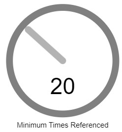

This filter originally was draggable left-to-right, but this movement was really unintuitive, and feedback from testers reveals that a circular dragging motion would significantly improve the user experience, so I implemented this change.

The code handles:

- scaling rotation in degrees to a number in between the minimum and maximum number of times a student was referenced for that topic, with a cap set to 60 (`maxMap`).
- update number on dial when turned - only when the number rounds up to the next integer is the callback function called.
- carry out trigonometry to relate mouse dragging to rotation about a point. 
- create dial SVG objects and set attributes (font, position, etc).

*dial.js*

```js
let prevSentToCallback;
const strokeWidth = 12; // stroke width of the line of the dial
const dialY = pieY; // y-coordinate of dial
const dialX = width - pieX; // x-coordinate of dial

// scale rotation in degrees of dial to number of times referenced filter value
const generateDialMapScale = () => {
    return d3.scaleLinear().domain([startDegree, endDegree]).range([clamp(mapMin, 1, Infinity), mapMax])
};

// update number on dial when turned and callback if now integer
const updateDialText = (currentDialDeg, callback) => {
    if (!dialGroup) return;
    dialGroup.attr("transform", `translate(${dialX}, ${dialY}) rotate(${currentDialDeg})`);

    var mapScale = generateDialMapScale();
    var mappedValue = mapScale(currentDialDeg);

    const rounded = Math.round(mappedValue);

    numText
        .text(rounded);
    numTextWidth = numText.node().getBBox().width;
    numText.attr("x", (dialX - (numTextWidth / 2)));

    callback(rounded);
};

// helper function to convert between coordinates for placement
function convertSVGtoScreenCoordinates(svgElement, dialX, dialY) {
    var pt = svgElement.createSVGPoint();
    pt.x = dialX;
    pt.y = dialY;

    // getScreenCTM returns the matrix that transforms current user units to screen coordinates
    var svgP = pt.matrixTransform(svgElement.getScreenCTM());

    return {
        x: svgP.x,
        y: svgP.y
    };
}

// helper function for dragging trigonometry 
function calculateAngle(center, point) {
    let dy = point.y - center.y;
    let dx = point.x - center.x;
    let theta = Math.atan2(dy, dx);
    return theta;
}

// create dial SVG objects and set attributes (font, position, etc)
const initializeDial = (svg, callback) => {
    var width = +svg.attr("width"),
        height = +svg.attr("height"),
        radius = pieRadius - (strokeWidth / 2); // to be same as the year-select pie

    // Get the input element for displaying the mapped value
    var inputElement = document.getElementById("value-input");

    const clamp = (num, min, max) => Math.min(Math.max(num, min), max);
    const sensitivity = 1;

    const textElem = svg.append("text");
    textElem
        .attr("x", dialX)
        .attr("y", dialY + (radius + (strokeWidth * 2)))
        .text("Minimum Times Referenced")
        .attr("font-family", "sans-serif")
        .attr("font-size", "13px")
        .attr("fill", DIAL_TEXT_COLOR);
    centerText(textElem, dialX);

    numText = svg.append("text");
    numText
        .attr("x", dialX)
        .attr("y", dialY + ((radius / 2) + strokeWidth))
        .text("20")
        .attr("font-family", "sans-serif")
        .attr("font-size", "40px")
        .attr("fill", DIAL_TEXT_COLOR);
    let numTextWidth = numText.node().getBBox().width;
    numText.attr("x", (dialX - (numTextWidth / 2)));

    window.addEventListener('mousemove', (event) => {
        mousePos = {
            x: event.clientX,
            y: event.clientY
        };
    });

    var drag = d3.drag()
        .on("start", (event, d) => {
            d.x = event.sourceEvent.clientX;
            d.y = event.sourceEvent.clientY;
            if (!d.currentDeg) d.currentDeg = startPos;
        })
        .on("drag", (event, d) => {
            let vals = convertSVGtoScreenCoordinates(document.getElementsByTagName('svg')[0], dialX, dialY);
            let newXY = {
                "x": event.sourceEvent.clientX,
                "y": event.sourceEvent.clientY
            };
            let theta = calculateAngle(vals, /*mousePos*/ newXY);
            let thetaDegrees = theta * (180 / Math.PI);
            let oldXY = {
                "x": d.x,
                "y": d.y
            };
            let oldAngle = calculateAngle(vals, oldXY);
            let oldAngleDegrees = oldAngle * (180 / Math.PI)
            let angleDelta = ((thetaDegrees - oldAngleDegrees + 180 + 360) % 360) - 180;
            d.x = newXY.x;
            d.y = newXY.y;

            d.degNew = angleDelta + d.currentDeg;
            d.currentDeg = d.degNew;
            currentDialDeg = clamp(angleDelta + currentDialDeg, startDegree, endDegree);

            updateDialText(currentDialDeg, callback);
        })
        .on("end", (event, d) => {
            d.currentDeg = d.degNew;
        });


    dialGroup = svg.append("g")
        .data([{
            x: 0,
            scale: d3.scaleLinear().domain([0, width]).range([startDegree, endDegree])
        }]) // initial data for dialGroup
        .attr("transform", `translate(${dialX}, ${dialY}) rotate(${startPos})`)
        .call(drag);

    // Add a transparent circle for better dragging
    dialGroup.append("circle")
        .attr("r", radius)
        .style("fill", "transparent");

    dialGroup.append("circle")
        .attr("r", radius)
        .style("fill", "none")
        .style("stroke", DIAL_OUTLINE_COLOR)
        .style("stroke-width", `${strokeWidth}px`);

    dialGroup.append("line")
        .attr("x1", 0)
        .attr("y1", 0)
        .attr("x2", 0)
        .attr("y2", -(radius - strokeWidth))
        .style("stroke", DIAL_STICK_COLOR)
        .style("stroke-width", `${strokeWidth}px`)
        .style("stroke-linecap", "round");

    // Display the initial mapped value
    var initialScale = d3.scaleLinear().domain([startDegree, endDegree]).range([mapMin, mapMax]);
    var initialMappedValue = initialScale(startPos);
}
```

#### Subject-Area Carousel

`carousel.js` only handles the initialization of the subject-area-selection carousel. By carousel, I am referring to the selection of a rectangle of the subject-area where a black rectangular outline moves down to highlight the selection. I originally planned to use a more traditional [carousel design](https://ui-patterns.com/patterns/Carousel) but altered the axis and mobility of the options for aesthetic reasons.

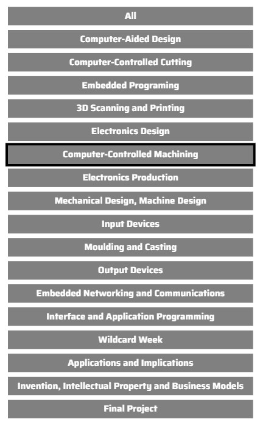{: style="height:300px;"}

*carousel.js*

```js
const initializeCarousel = (callback, carousel_data, width, height, x, y, svg, colorPalette) => {
    // create SVG group (<g>) HTML element
    const g = svg.append("g"); 

    // create D3JS scale band for the y-axis of the filter
    const yScale = d3.scaleBand()
        .range([ 0, height ])
        .domain(carousel_data)
        .padding(0.2);

    // create D3JS color scale
    const color = d3.scaleOrdinal().range(colorPalette);

    // make D3JS selection for option rectangles and set aesthetic attributes based on constants
    const rect = g.selectAll("rect")
        .data(carousel_data)
        .enter()
        .append("rect")
        .attr('x', 10 + x)
        .attr('y', d => yScale(d) + y)
        .attr('width', width)
        .attr('height', yScale.bandwidth())
        .attr('stroke', CAROUSEL_RECT_STROKE_COLOR)
        .attr('stroke-width', CAROUSEL_RECT_STROKE_WIDTH)
        .attr('fill', CAROUSEL_OPTION_COLOR/*d => color(d)*/)
        .on('click', (event, d) => {
            movePointerTo(d);
        });

    // calculat width of outline selection rectangle
    var outerWidth = ((height / carousel_data.length) - yScale.bandwidth()) + width, outerHeight = height / carousel_data.length;
    var innerWidth = width, innerHeight = yScale.bandwidth();
    
    var outerRectangle = { top: yScale(carousel_data[0]) + ((yScale.bandwidth() - (height / carousel_data.length)))/2, left: 10 - ((height / carousel_data.length) - yScale.bandwidth())/2, width: outerWidth, height: outerHeight };
    var innerRectangle = { 
        top: outerRectangle.top + (outerHeight - innerHeight) / 2, 
        left: outerRectangle.left + (outerWidth - innerWidth) / 2,
        width: innerWidth,
        height: innerHeight
    };
    
    // SVG path for outer selection rectangle
    var pathData = [
        "M", outerRectangle.left, outerRectangle.top, // Move to the top-left corner of the outer rectangle
        "h", outerWidth, // Draw the top side
        "v", outerHeight, // Draw the right side
        "h", -outerWidth, // Draw the bottom side
        "v", -outerHeight, // Draw the left side
        "M", innerRectangle.left, innerRectangle.top, // Move to the top-left corner of the inner rectangle
        "h", innerWidth, // Draw the top side
        "v", innerHeight, // Draw the right side
        "h", -innerWidth, // Draw the bottom side
        "v", -innerHeight, // Draw the left side
        "Z" // Close the path
    ].join(" ");

    // create definitions section of <g>
    var defs = g.append("defs");

    // create mask (for selection rectangle outline)
    var mask = defs.append("mask")
        .attr("id", "myMask");
    
    // Add a white rectangle to the mask
    mask.append("rect")
        .attr("x", x)
        .attr("y", y)
        .attr("width", "100%")
        .attr("height", "100%")
        .attr("fill", "white");
    
    // Add a smaller black rectangle to the mask to cut out
    mask.append("rect")
        .attr("x", innerRectangle.left + x)
        .attr("y", innerRectangle.top + y)
        .attr("width", innerRectangle.width)
        .attr("height", innerRectangle.height)
        .attr("fill", "black");
    
    // Draw a rectangle with the mask
    const selectionRect = g.append("rect")
        .attr("x", outerRectangle.left + x)
        .attr("y", outerRectangle.top + y)
        .attr("width", outerRectangle.width)
        .attr("height", outerRectangle.height)
        .attr("fill", CAROUSEL_SELECTOR_COLOR)
        .attr("mask", "url(#myMask)");

    // when an option is clicked, move the selection rectangle to that option
    const movePointerTo = d => {
        selectionRect.transition()
            .duration(1000)
            .attr('transform', "translate(0, " + (yScale(d) - yScale(carousel_data[0])) + ")");
            callback(d);
    };

    // set text attributes and click callback for option rectangles
    const text = g.selectAll("text")
        .data(carousel_data)
        .enter()
        .append("text")
        .attr('x', 10 + width/2 + x)
        .attr('y', d => yScale(d) + yScale.bandwidth()/2 + y)
        .attr('dy', '0.3em')
        .text(d => d)
        .on('click', (event, d) => {
            movePointerTo(d);
        });

    // set text style attributes
    text
        .style('text-anchor', 'middle')
        .style('fill', CAROUSEL_TEXT_COLOR)
        .attr("font-weight", 700)
        .attr("font-family", "Saira")
        .attr("font-size", 13)
};
```

#### Year Selection

The year selection pie was not substantial enough to be moved into its own file, so its code is found in `helper_functions.js`. I'll provide a snippet and explanation below.

The code does the following:

- create a new SVG group for the filter
- add a slice for each year
- handle rotation on click
- style the text inside each slice

```js
const createPie = () => {
    const pieG = svg.append("g")
        .attr("transform", "translate(" + pieX + "," + pieY + ") rotate(" + 360 / 14 + ")");

    var pieData = {
        "All": 1
    };

    for (let i = 2018; i <= 2023; i++) {
        pieData[i] = 1;
    }

    var pie = d3.pie()
        .value(function(d) {
            return d.value;
        })
    var data_ready = pie(Object.entries(pieData).map(([key, value]) => ({
        key,
        value
    })));

    var arcGenerator = d3.arc()
        .innerRadius(50)
        .outerRadius(pieRadius)

    const rotatePie = d => {
        var rotate = -((d.startAngle + d.endAngle) / 2);
        pieG.transition()
            .duration(1000)
            .attr("transform", "translate(" + pieX + "," + pieY + ") rotate(" + (rotate / Math.PI * 180) + ")");
    };

    pieG
        .selectAll('mySlices')
        .data(data_ready)
        .enter()
        .append('path')
        .attr('d', arcGenerator)
        .attr('fill', PIE_SLICE_COLOR)
        .attr("stroke", "white")
        .style("stroke-width", "2px")
        .style("opacity", 1)
        .on('click', function(event, d) {
            setYear(d.data.key);
            rotatePie(d);
        });

    pieG
        .selectAll('mySlices')
        .data(data_ready)
        .enter()
        .append('text')
        .text(function(d) {
            return d.data.key
        })
        .attr("dy", "0.3em")
        .attr("transform", function(d) {
            return "translate(" + arcGenerator.centroid(d) + ") rotate(" + (d.startAngle + d.endAngle) / 2 * (180 / Math.PI) + ")";
        })
        .style('text-anchor', 'middle')
        .style('fill', PIE_TEXT_COLOR)
        .attr("font-weight", 700)
        .attr("font-family", "Saira")
        .style("font-size", 18)
        .on('click', function(event, d) {
            setYear(d.data.key);
            rotatePie(d);
        });
};
```

#### Overlay Text

`overlay_text.js` handles the creation of text and links in the SVG through D3JS. The code defines the `createTxt` function then calls that with different text and URLs.

*overlay_text.js*

```js
const createOverlayText = () => {
    createdBy();
};

const createdBy = () => {
    const xPos = 10; // 10px from the left edge
    
    const createTxt = (ySub, txt, lnk_txt, lnk) => {
        const yPos = height - ySub; // 10px from the bottom edge
        svg.append("text")
            .attr("font-size", "14px")
            .attr("x", xPos)
            .attr("y", yPos)
            .attr("class", "overlay-text")
            .text(txt + " ")
            .append("a")
            .attr("xlink:href", lnk)
            .attr("target", "_blank") 
            .style("fill", OVERLAY_TEXT_LINK_COLOR)
            .attr("font-size", "14px")
            .text(lnk_txt);
    };

    createTxt(50, "Created by", "Adam Stone", "https://fabacademy.org/2023/labs/charlotte/students/adam-stone/")
    //createTxt(50, "To join the Mattermost channel", "click here", "https://chat.academany.org/fabacademy-2023/channels/fab-academy-data-viz");
    createTxt(35, "For documentation", "click here", "https://gitlab.fabcloud.org/pub/project/expert-network-map/-/blob/main/documentation.md")
    createTxt(20, "Took inspiration from", "Nadieh Bremer", "https://royalconstellations.visualcinnamon.com/")
    createTxt(5, "Recieved guidance and support from", "Francisco Sanchez", "https://www.fablabs.io/users/francisco")

    svg.append("text")
        .attr("font-size", "30px")
        .attr("x", width / 2)
        .attr("y", height - 10)
        .attr("text-anchor", "middle")
        .attr("class", "overlay-text")
        .style("fill", "red")
        .text("Join the Mattermost Channel ")
        .append("a")
        .attr("xlink:href", "https://chat.academany.org/fabacademy-2023/channels/fab-academy-data-viz")
        .attr("target", "_blank") 
        .style("fill", OVERLAY_TEXT_LINK_COLOR)
        .attr("font-size", "30px")
        .text("Here");
};
```

#### Other Files, Minification, and Google Analytics

I downloaded [D3JS minified](https://d3js.org/d3.v7.min.js), [D3JS force boundary library minified](https://unpkg.com/d3-force-boundary@0.0.1/dist/d3-force-boundary.min.js), and [jQuery minified](http://ajax.googleapis.com/ajax/libs/jquery/3.5.1/jquery.min.js) in the `d3js_download.js`, `force_boundary_downoad.js`, and `jquery_download.js` files respectively to increase performance where three extra HTTP requests to not have to be sent before the content loads.

I also combined the code for all of the different JavaScript files into one file, `combined.js`, and minified it using [Toptal JavaScript Minifier](https://www.toptal.com/developers/javascript-minifier). This maximizes performance by reducing initial loading time. I pasted files into the minifier in the order they are linked in an older version of the HTML below.

```html
<script src="vars.js"></script>
<script src="lab_region.js"></script>
<script src="update_data.js"></script>
<script src="helper_functions.js"></script>
<script src="constants.js"></script>
<script src="carousel.js"></script>
<script src="dial.js"></script>
<script src="multiselect_dropdown.js"></script>
<script src="overlay_text.js"></script>
<script src="app.js"></script>
```

Finally, I use [Google Analytics](https://analytics.google.com/analytics/web/) to measure traffic on the site and measure usage.

#### HTML

Since the website is a static webpage, I only use one HTML file, `index.html`. 

*index.html*

```html
<!DOCTYPE html>
<html lang="en">

<head>
    <link rel="icon" type="image/x-icon" href="./img/favicon/favicon.ico">
    <meta charset="UTF-8">
    <meta name="viewport" content="width=device-width, initial-scale=1.0">
    <title>Expert Network Map</title>
    <link href="style.css" rel="stylesheet">
    <link href="https://fonts.googleapis.com/css?family=Saira:100,200,300,400,500,600,700,800,900" rel="stylesheet">
    <script type="text/javascript" src="jquery_download.js"></script>
    <script src="d3js_download.js"></script>
    <script src="force_boundary_download.js"></script>
    <script src="combined.js"></script>
    <!-- Google tag (gtag.js) -->
    <script async src="https://www.googletagmanager.com/gtag/js?id=G-GJZ579DNTW"></script>
    <script>
        window.dataLayer = window.dataLayer || [];
        function gtag(){dataLayer.push(arguments);}
        gtag('js', new Date());

        gtag('config', 'G-GJZ579DNTW');
    </script>
</head>

<body id="my_dataviz">
    <div id="tooltip"></div>
    <div id="top-intro">
        <div id="top-title">Expert Network Map</div>
        <div id="intro-title">
            <div id="top-subtitle">Six generations of Fab Academy students intertwined</div>
            <div id="top-blurb">
                <h3>Seek Out <i>Topic Experts</i></h3>
                <p>The <i>Expert Network Map</i> allows users to visually identify <i>Topic Experts</i> in the Fab community. <i>Topic Experts</i> are Fab Academy students who are frequently referenced by peers. Fab Academy students often link each other's websites in their documentation, and mapping these connections creates a network intertwined across labs, years, and countries. The more times a student is referenced correlates with expertise level in specific subject areas. For current Fab Academy students, it can be extremely helpful to quickly identify <i>Topic Experts</i> to access their documentation for reference. Interacting with the Map can determine <i>Topic Experts</i> by year and specific labs. Once <i>Topic Experts</i> are found, clicking on their circle redirects the user to their Fab Academy Documentation Website.</p>
            </div>
        </div>
        <div id="intro-text">
            <div id="top-explanation">
                <p>The <i>Expert Network Map</i> allows users to navigate the massive web of interconnected students and highlights <i>Topics Experts</i> dating back to 2018. Each Fab Academy student is represented by a circle. Drag around different students to play with the data and gain insight into the interconnectedness of the Fab community.</p>
                <p>The larger a student's circle, the more times they have been referenced. Hover over a circle to see the student's name, year, lab, and region, and click on it to open their documentation website. Click the tabs on the left to filter by topic area; click different years on the bottom left circle to highlight students from that year; use the dropdown on the top right to highlight students from certain Fab Labs; and use the dial on the bottom right to set a minimum number of references that a student must have, changing the <i>Expertise Threshold</i>.</p>
            </div>
        </div>
    </div>
    <div style="width:100%;position:relative;">
        <div style="background: white; position: absolute; right: 10px; top: 10px; display: inline-block;" class="multiselect" id="countries" multiple="multiple" data-target="multi-0">
            <div class="title noselect">
                <span class="text">Filter Labs</span>
                <span class="close-icon">&times;</span>
                <span class="expand-icon">&plus;</span>
            </div>
            <div class="container">
            </div>
        </div>
    </div>
    <svg xmlns="http://www.w3.org/2000/svg">
        <defs></defs>
    </svg>
</body>

</html>
```

#### CSS

All styles not created through D3JS are located in `style.css`. This includes background color, orienting description text, etc.

*styles.css*

```css
:root {
    --tooltip-background-color: white;
    --node-stroke: #000;
    --top-title-color: #393836;
    --top-subtitle-color: grey;
    --top-blurb-h3-color: #595754;
    --body-background-color: white;
    --overlay-text-color: black;
}

#tooltip {
    background-color: var(--tooltip-background-color);
    border: black solid 1px;
    border-radius: 5px;
    padding: 5px;
    position: absolute;
    visibility: hidden;
    display: none;
    pointer-events: none;
}

#tooltip span {
    color: black;
    font-family: 'Saira';
}

html {
    Overflow-y: auto;
}

body {
    Overflow-y: scroll;
}

body {
    margin: 0;
    position: fixed;
    top: 0;
    right: 0;
    bottom: 0;
    left: 0;
}

circle {
    stroke: var(--node-stroke);
    stroke-width: 0px;
}

line {
    stroke: #999;
    stroke-opacity: 0.6;
}

body {
    font-family: sans-serif;
    background-color: var(--body-background-color);
}

#top-intro {
    margin: 0 auto;
    padding-left: 70px;
    padding-right: 70px;
}

#top-title {
    font-size: 57px;
    color: var(--top-title-color);
    font-family: 'IM Fell DW Pica', serif;
    margin-bottom: -12px;
    margin-top: 20px;
    margin-right: 20px;
}

#intro-title {
    width: 46%;
    display: inline-block;
}

#top-subtitle {
    font-size: 17px;
    font-weight: 300;
    margin-top: 11px;
    line-height: 150%;
    padding-bottom: 0px;
    color: var(--top-subtitle-color);
}

#top-blurb {
    margin-top: 20px;
}

#top-blurb p {
    font-size: 11px;
    text-align: justify;
    line-height: 155%;
    color: #777777;
}

#top-blurb h3 {
    font-size: 16px;
    color: var(--top-blurb-h3-color);
    font-family: 'IM Fell DW Pica', serif;
    margin-bottom: -8px;
}

#intro-text {
    width: 45%;
    display: inline-block;
    padding-left: 50px;
    padding-right: 0px;
    vertical-align: top;
    padding-bottom: 10px;
}

#top-explanation {
    font-size: 12px;
    text-align: justify;
}

#top-explanation p {
    line-height: 160%;
    color: #777777;
}

.noselect {
    -webkit-touch-callout: none;
    -webkit-user-select: none;
    -khtml-user-select: none;
    -moz-user-select: none;
    -ms-user-select: none;
    user-select: none;
}

.multiselect {
    width: 170px;
    font-size: 15px;
    padding-bottom: 4px;
    border-radius: 3px;
    border: 1px solid rgba(0, 0, 0, 0.1);
    transition: 0.2s;
    outline: none;
}

.multiselect:hover {
    border: 1px solid rgba(0, 0, 0, 0.3);
}

.multiselect.active {
    border-bottom-left-radius: 0px;
    border-bottom-right-radius: 0px;
    border-bottom: 1px solid transparent;
}

.multiselect>.title {
    cursor: pointer;
    height: 16px;
    padding: 6px;
}

.multiselect>.title>.text {
    max-width: 130px;
    max-height: 25px;
    display: block;
    float: left;
    overflow: hidden;
    line-height: 1.3em;
}

.multiselect>.title>.expand-icon,
.multiselect>.title>.close-icon {
    float: right;
    border-radius: 50%;
    padding: 0 4px;
    border: 1px solid rgba(0, 0, 0, 0.1);
    font-weight: 700;
    transition: 0.2s;
    display: none;
}

.multiselect.selection>.title>.expand-icon {
    display: none;
}

.multiselect.selection>.title>.expand-icon:hover {
    border: 1px solid rgba(0, 0, 0, 0.3);
    background: rgb(203, 32, 32);
    color: #fff;
}

.multiselect>.title>.expand-icon,
.multiselect.selection>.title>.close-icon {
    display: block;
}

.multiselect>.title>.close-icon:hover {
    border: 1px solid rgba(0, 0, 0, 0.3);
    background: rgb(203, 32, 32);
    color: #fff;
}

.multiselect>.container {
    max-height: 200px;
    overflow: auto;
    margin-top: 4px;
    margin-left: -1px;
    width: 170px;
    transition: 0.2s;
    position: absolute;
    z-index: 99;
    background: #fff;
    border: 1px solid transparent;
    border-top: 1px solid rgba(0, 0, 0, 0.1);
}

.multiselect.active>.container {
    border: 1px solid rgba(0, 0, 0, 0.1);
    border-bottom-left-radius: 3px;
    border-bottom-right-radius: 3px;
    border-top: 0;
}

.multiselect:hover>.container {
    border-top-color: rgba(0, 0, 0, 0.3);
}

.multiselect.active:hover>.container {
    border-color: rgba(0, 0, 0, 0.3);
}

.multiselect>.container>option {
    display: none;
    padding: 5px;
    cursor: pointer;
    transition: 0.2s;
    border-top: 1px solid transparent;
    border-bottom: 1px solid transparent;
}

.multiselect>.container>option.selected {
    background: rgb(122, 175, 233);
    border-top: 1px solid rgba(0, 0, 0, 0.1);
    border-bottom: 1px solid rgba(0, 0, 0, 0.1);
    color: #fff;
}

.multiselect>.container>option:hover {
    background: rgba(0, 0, 0, 0.1);
    color: #000;
}

.multiselect>.container>option.selected:hover {
    background: rgba(53, 112, 130, 0.4);
    color: #000;
}

.multiselect.active>.container>option {
    display: block;
}

option[value=All] {
    font-weight: bold;
}

#value-input {
    position: absolute;
    /*right: 120px;*/
    /*top: 48%;*/
    text-align: center;
    width: 60px;
    border: none;
    background: none;
    outline: none;
    font-size: 18px;
    color: white;
}

.overlay-text {
    fill: var(--overlay-text-color);
    font-family: Arial, sans-serif;
}
```