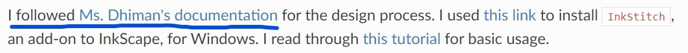

# Expert Network Map

## Overview

[Here is a link to the `Expert Network Map`!](https://pub.fabcloud.io/project/expert-network-map/) *(be sure to use Chrome on a computer)*

The `Expert Network Map` is a network analysis research project to locate hidden expertise in the Fab Academy community and democratize access to helpful documentation.

I was invited by [MIT Professor Neil Gershenfeld](https://ng.cba.mit.edu/) to present this project at the [FAB23 Bhutan: Designing Resilient Futures](https://fab23.fabevent.org/) conference in Bhutan. This conference, focused on using technology to realize a collective vision for the shared future, is the 19th edition of the International Fab Lab Conference and Symposium, the largest digital fabrication event in the world.

<iframe width="560" height="315" src="https://www.youtube.com/embed/F12IUwdAcgs?si=glPwne61UZXOQMvC&hd=1" title="YouTube video player" frameborder="0" allow="accelerometer; autoplay; clipboard-write; encrypted-media; gyroscope; picture-in-picture; web-share" allowfullscreen></iframe>

## Project Description

### Background

My most significant research project was creating the `Expert Network Map`, an analysis of 1000+ members of the Fab Academy open-source community to locate hidden expertise in 18 subject areas and an interactive visualization of the network. Fab Academy is a digital fabrication course focused on rapid-prototyping led by MIT Professor Neil Gershenfeld. All Fab Academy students keep a documentation website detailing the process of completing projects, and students are encouraged to seek out others’ documentation to navigate technical roadblocks. For an example of a documentation website, see mine [here](https://fabacademy.org/2023/labs/charlotte/students/adam-stone/). To give credit to content referenced, students add links in their own websites to the documentation websites they found helpful. For example, in my documentation website, I linked [Nidhie Dhiman](https://fabacademy.org/2022/labs/charlotte/students/nidhie-dhiman/)'s documentation for help with embroidery. 



### Problem, Hypothesis, and Prototype

While I knew who had helpful documentation in my Charlotte Fab community, with over 1000 documentation websites globally, there was a lot of untapped expertise I couldn’t locate. I recognized that if expert documentation could quickly be identified, all students would be able to work more efficiently. 

I hypothesized that the more times students’ documentation websites were referenced by their peers in a subject area, the more expertise they possessed. As a test, I ran a network analysis of the 13 students in the Charlotte Fab community, quantifying the number of times each student’s documentation website was referenced by their peers. The analysis yielded promising results: some students had significantly more references than the rest of the peer group, and student were frequently linking each other's websites. Read more about my initial prototypes [here](https://fabacademy.org/2023/labs/charlotte/students/adam-stone/lessons/side-projects/lab-link-graph/#iteration-1) and [here](https://fabacademy.org/2023/labs/charlotte/students/adam-stone/lessons/side-projects/lab-link-graph/#iteration-2).


### Pitch

I showed the results to my local lab leader, [Mr. Dubick](https://www.linkedin.com/in/tomdubick), who suggested that I talk to Professor Gershenfeld and propose analyzing the global Fab community network to identify experts by topic. Professor Gershenfeld believed the network analysis would be incredibly valuable and connected me with a mentor in Spain, [Francisco Sanchez Arroyo](https://www.fablabs.io/users/francisco), who advised me on the best tools and structure to use.

## Project Execution

### GitLab Repo

I executed the project in three distinct phases: I wrote a script to collect the data, designed a text-classification AI model to sort links by subject area, and utilized D3JS to present the data in an interactive visualization.

You can download all the code from the project in [this GitLab repo](https://gitlab.fabcloud.org/pub/project/expert-network-map). In the repo, you will also find [`documentation.md`](https://gitlab.fabcloud.org/pub/project/expert-network-map/-/blob/main/documentation.md?ref_type=heads), a file that lists the technical changes made in each iteration of the project.

### Step 1: Scrape the Data

For the first step, I wrote a `Python` script to scrape all Fab Academy students’ documentation website GitLab repos over the past six years using the [`Python-GitLab API`](https://python-gitlab.readthedocs.io/en/stable/api-usage.html) and scan for URL references to other student websites using [`RegEx`](https://docs.python.org/3/library/re.html). I also stored 1,000 characters before and after to use for classification and used Pandas to create a reference matrix that structured the data for analysis. My program yielded a database of ~29,000 references.

### Step 2: Categorize the Data

After the data were collected, I knew I had a significant challenge. For the network analysis to be useful, I needed to calculate the number of times a student’s documentation was referenced for a specific subject area. I had collected tens of thousands of pages of documentation text that used vastly different naming conventions for each subject area (for example, "3D Scanning & Printing" vs "3d.printing.and.scanning"), and much of the text understandably had spelling errors given that many Fab Academy students do not speak English as a first language. To overcome the challenge of categorizing references by subject area with no consistent naming convention, I created a text-classification neural network. Using a list of keywords that were often associated with a Fab Academy subject-area, for example "PLA filament" for "3D Printing," I was able to classify ~13,000 of the ~29,000 references based on the surrounding text. Find a `JSON` file of the keywords I used for each subject area below.

```json
{
  "Prefab": [],
  "Computer-Aided Design": [
    "Computer-Aided Design",
    "freecad"
  ],
  "Computer-Controlled Cutting": [
    "Laser Cut",
    "CCC week",
    "Computer-Controlled Cutting"
  ],
  "Embedded Programing": [
    "Embedded Programming",
    "MicroPython",
    "C++",
    "pythoncpp",
    "ino",
    "Arduino IDE",
    "programming week"
  ],
  "3D Scanning and Printing": [
    "3D Printing",
    "3D Scanning",
    "TPU",
    "PETG",
    "filament",
    "Prusa",
    "3d printing week",
    "polyCAM",
    "3D Scanning and Printing",
    "3d printers",
    "3d printer"
  ],
  "Electronics Design": [
    "EagleCAD",
    "Eagle",
    "KiCAD",
    "Routing",
    "Auto-Route",
    "Trace",
    "Footprint",
    "electronic design",
    "Electronics Design"
  ],
  "Computer-Controlled Machining": [
    "CNC",
    "Shopbot",
    "Computer-Controlled Machining"
  ],
  "Electronics Production": [
    "Mill",
    "Milling",
    "copper",
    "electronic production",
    "Electronics Production"
  ],
  "Mechanical Design, Machine Design": [
    "Machine week",
    "actuation and automation",
    "Mechanical Design, Machine Design"
  ],
  "Input Devices": [
    "Input Devices",
    "Input Device",
    "Inputs Devices",
    "Electronic input",
    "sensor",
    "Input Devices"
  ],
  "Moulding and Casting": [
    "Part A",
    "Part B",
    "pot time",
    "pottime",
    "molding",
    "moulding",
    "casting",
    "cast",
    "Moulding and Casting"
  ],
  "Output Devices": [
    "Output Device",
    "Outputs Devices",
    "Outputs Device",
    "Servo",
    "motor",
    "Output Devices"
  ],
  "Embedded Networking and Communications": [
    "SPI",
    "UART",
    "I2C",
    "RX",
    "TX",
    "SCL",
    "networking week",
    "networking",
    "network",
    "networking and communications",
    "Embedded Networking and Communications"
  ],
  "Interface and Application Programming": [
    "Interfacing Week",
    "interface week",
    "Interface and Application Programming"
  ],
  "Wildcard Week": [
    "Wildcard Week"
  ],
  "Applications and Implications": [
    "Applications and Implications",
    "Bill-of-Materials",
    "Bill of materials"
  ],
  "Invention, Intellectual Property and Business Models": [
    "Patent",
    "copyright",
    "trademark",
    "Invention, Intellectual Property and Business Models"
  ],
  "Final Project": [
    "Final Project"
  ],
  "Other": []
}
```

To classify the remaining ~16,000 references, I trained my own text-classification neural network off of the 1,000 characters before and after each of the ~13,000 already classified references using `Python` and [`PyTorch`](https://pytorch.org/). I designed the neural network with 5,000 input nodes, a hidden layer of 200 nodes, and 18 output nodes (one for each Fab Academy subject area). To format the data for the neural network, I used the [`Sci-Kit Learn CountVectorizer`](https://scikit-learn.org/stable/modules/generated/sklearn.feature_extraction.text.CountVectorizer.html) to tokenize the text surrounding each URL, and the resulting matrix was converted to a [`NumPy`](https://numpy.org/) array and then to a [`PyTorch tensor`](https://pytorch.org/docs/stable/tensors.html). To train the neural network, I implemented [`Cross-Entropy Loss`](https://pytorch.org/docs/stable/generated/torch.nn.CrossEntropyLoss.html) as the loss function to measure the model's performance in predicting the correct subject-area, and I employed the [`Adam optimizer`](https://pytorch.org/docs/stable/generated/torch.optim.Adam.html) to adjust the model's weights. After [hyperparameter tuning](https://aws.amazon.com/what-is/hyperparameter-tuning/#:~:text=Hyperparameter%20tuning%20allows%20data%20scientists,the%20model%20as%20a%20hyperparameter.) using a grid-search algorithm, the model achieved its best accuracy of **86.3%** using a *learning rate of 0.01* and *dropout rate of 0.1*. You can see the gridsearch algorithm below.

```py
# Define grid of hyperparameters
learning_rates = [0.1, 0.01, 0.001]
dropout_rates = [0, 0.1, 0.2, 0.3, 0.4, 0.5, 0.6, 0.7, 0.8, 0.9]

# Perform the grid search
best_accuracy = 0.0
best_lr = None
best_dropout_rate = None
best_model = None

for lr in learning_rates:
    for dropout_rate in dropout_rates:
        # train_model is defined earlier
        accuracy, model = train_model(lr, dropout_rate)
        print(f'Learning rate: {lr}, Dropout rate: {dropout_rate}, Accuracy: {accuracy}')
        
        if accuracy > best_accuracy:
            best_accuracy = accuracy
            best_lr = lr
            best_dropout_rate = dropout_rate
            best_model = model
```

The model successfully classified the remaining  ~16,000 references, completing the second step of my project. 

### Step 3: Visualize the Data

Lastly, I wanted to provide the global Fab community with an easy-to-use navigation tool to locate expert documentation by subject area, as identified in my network analysis. I consulted with Mr. Arroyo and decided to create an interactive force simulation graph using [`D3.js`](https://d3js.org/). In the graph, each node represents a student and each edge represents references between students. 


The more times a student’s documentation website has been referenced, the larger the student’s node, corresponding to more expertise. Other data, such as a student’s Fab Lab location and graduation year, were encoded via other visual mediums. I added interactive features, such as filters for subject area, geography, and graduation year, to help students quickly identify experts based on their needs.


Because the first version of the `Expert Network Map` had tens of thousands of data points reloading in real-time, the tool was too slow to be usable. I made two modifications to optimize performance. First, I used D3JS’ enter-update-exit protocol to change the force simulation graph without reloading all of the data. Next, I collapsed multiple references between the same students into a single edge with greater force. The `Expert Network Map` is live and will be used by Fab Academy 2024 students.

## Documentation

### Step 1: Data Collection

### Step 2: AI, Sorting Data, & Analysis

### Step 3: Data Visualization

#### Library and Data Structure

I employed [D3JS](https://d3js.org/), a JavaScript library, to create the data visualization. I started off by browsing the [D3 Gallery](https://observablehq.com/@d3/gallery?utm_source=d3js-org&utm_medium=hero&utm_campaign=try-observable) to select the format for my visualization. I was choosing between a [`Disjoint Force-Directed Graph`](https://observablehq.com/@d3/disjoint-force-directed-graph/2?intent=fork) and a [`Force Directed Graph with Arrows`](https://observablehq.com/@brunolaranjeira/d3-v6-force-directed-graph-with-directional-straight-arrow). Due to frequent two-way connections between nodes and a large amount of data (so very small lines for each individual connection, making arrowheads hard to discern), I decided on the `Disjoint Force-Directed Graph`.

{: style="width:300px;"}
{: style="width:300px;"}

So I read through the [example code](https://observablehq.com/@d3/disjoint-force-directed-graph/2?intent=fork) from D3JS carefully and found that the input data was a JSON with the following format:

```json
{
  "nodes": {
    {"id": "ID1", "radius": 1},
    {"id": "ID2", "radius": 1},
    {"id": "ID3", "radius": 1}
  },
  "links": {
    {"source": "ID1", "target": "ID3", "value": 1},
    {"source": "ID2", "target": "ID3", "value": 4},
    {"source": "ID2", "target": "ID1", "value": 3}
  }
}
```

The `nodes` object contains every node's ID as well as other data, such as the node's radius. The `links` object contains each edge, in my case connection between students, and an associated value which can be used to control strength or thickness.

#### Transforming Data

So the first step was to transform my `Pandas` dataframe into a JSON file of this format. I wrote `matrix2d3js.py`. When this script is run, it takes `final_data.csv` (the output from [Step 2](#step-2-ai-sorting-data--analysis)) and moves all of the data into a JSON file matching the structure outline above. This is then saved as `final_data.json`.

*matrix2d3js.py*

```py
import pandas as pd
import numpy as np
import json

INPUT_FILE = "final_data.csv"
OUTPUT_FILE = "final_data.json"

df = pd.read_csv(INPUT_FILE, header=[0, 1], index_col=0)

STUDENTS = list(df.iloc[:, 0].keys())
TOPICS = [
    "Prefab",
    "Computer-Aided Design",
    "Computer-Controlled Cutting",
    "Embedded Programing",
    "3D Scanning and Printing",
    "Electronics Design",
    "Computer-Controlled Machining",
    "Electronics Production",
    "Mechanical Design, Machine Design",
    "Input Devices",
    "Moulding and Casting",
    "Output Devices",
    "Embedded Networking and Communications",
    "Interface and Application Programming",
    "Wildcard Week",
    "Applications and Implications",
    "Invention, Intellectual Property and Business Models",
    "Final Project",
    "Other"
]

def get_value(df, referencer_student, referenced_student, topic):
    return df.loc[referencer_student, (referenced_student, topic)]

def generate_node_obj(name, group):
    return {
        "id": name,
        "group": group
    }

def generate_link_obj(name_from, name_to, strength, topic):
    return {
        "source": name_from,
        "target": name_to,
        "value": strength,
        "topic": topic
    }

final_data = {
    "nodes": [ ],
    "links": [ ]
}

def split_name(name):
    return name.split(";")

if __name__ == "__main__":
    # create `nodes` object in final JSON
    for student in STUDENTS:
        student_name, student_link = split_name(student)
        final_data['nodes'].append(generate_node_obj(student, 1))

    # for each link between students, add a link object in the final JSON under the `links` object
    for referencer_student in STUDENTS:
        referencer_student_name, referencer_student_link = split_name(referencer_student)
        for referenced_student in STUDENTS:
            referenced_student_name, referenced_student_link = split_name(referenced_student)
            for topic in TOPICS:
                val = get_value(df, referencer_student, referenced_student, topic)

                if val == 0 or np.isnan(val): continue

                final_data['links'].append(generate_link_obj(referencer_student, referenced_student, val, topic))

    with open("final_data.json", "w") as outfile:
        json.dump(final_data, outfile)
```

#### Name Conflicts

Upon inspecting the data, I noticed that several students with longer names had names that did not reflect their listing on the Fab Academy Student Rosters (for example, click [here](https://fabacademy.org/2023/people.html) to see the 2023 roster). To resolve this, I wrote `resolve_name_conflicts.py`. This identifies students based on the URL to their website (which acts as a unique identifier for every student) and checkes it against the webpage. This was especially challenging since some students whose names have diacritic marks or accent marks are sometimes displayed as characters and other times as unicode beginning with `\u`, so I checked for both. The webpage name overrides the name collected during [Step 2](#step-2-ai-sorting-data--analysis).

So I ran `resolve_name_conflicts.py`, which takes `final_data.json` as an input and outputs `final_data_name_fixed.json`.

Below is `resolve_name_conflicts.py`. Before that codeblock I include four functions that are imported from `main.py` (see [Step 2](#step-2-ai-sorting-data--analysis)) for reference. I did not include the libraries included in `main.py` as it is detailed above.

```py
# check if an object exists at the specified filepath
def save_exists(folder_name, name):
    return os.path.exists(f"{folder_name}/{name}.obj")

# return the pickled object saved in the specifed filepath
def load_obj(folder_name, name):
    with open(f"{folder_name}/{name}.obj", "rb") as filehandler:
        return pickle.load(filehandler)

# return the webpage of fabacademy.org that includes every student's names from the specified year (and if this has already been downloaded and saved in a pickled object, load that instead of sending an HTTP request)
def get_people_soup(year):
    filename = f"{year}-soup"
    if save_exists("people_saves", filename):
        return load_obj("people_saves", filename)

    base_url = f"https://fabacademy.org/{year}/people.html"
    soup = BeautifulSoup(requests.get(base_url).content, 'html.parser')

    save_obj("people_saves", soup, filename)

    return soup

# formats a student's ID by accessing their name as detailed on the fabacademy.org students list, as well as the URL to their website
def repo_name_to_student_name(name_and_web_url_tup):
    name, web_url = name_and_web_url_tup
    year = web_url.split("/")[3]
    href = f'/{"/".join(web_url.split("/")[3:])}'
    people_soup = get_people_soup(year)
    As = people_soup.find_all('a', href=True)
    a = [_ for _ in As if _['href'] == href or _['href'] == href[:-1]][0] # or to account for ending slash
    name_final = a.text.strip()
    return name_final, web_url
```

*resolve_name_conflicts.py*

```py
from main import repo_name_to_student_name
import pandas as pd
import re

df = pd.read_csv("final_data.csv", header=[0, 1], index_col=0)

STUDENTS = list(df.iloc[:, 0].keys())

regexes = {}

normal_chars = "abcdefghijklmnopqrstuvwxyz-"

# convert a char from a character with an accent/dialectic into unicode
def accent_to_code(char):
    return format(ord(char), "#06x").replace("0x", "\\u")

# convert a char from unicode into a character with an accent/dialectic
def code_to_accent(code):
    return chr(int(code.replace("\\u", "0x"), 16))

# takes a name, converts it to a list of chars, then converts all characters with accents/dialectics to unicode
def non_letters_into_codes(name):
    lst = [_ for _ in name]
    for i in range(len(lst)):
        char = lst[i]
        if char.lower() not in normal_chars:
            lst[i] = accent_to_code(char)
    return "".join(lst)

if __name__ == "__main__":
    # create a dictionary where keys are regexes of the student's previous names as standard text and as text where diacritics/accents are replaced with unicode, and values are the corrected names
    for student in STUDENTS:
        val = ";".join(repo_name_to_student_name(student.split(";")))
        regexes[student] = val
        regexes[non_letters_into_codes(student.split(";")[0]) + ";" + student.split(";")[1]] = val

    # run the regex on final_data.json (literally replace the text, don't load as an object)
    with open('final_data.json', 'r') as file:
        content = file.read()
        for key in regexes:
            content = re.sub(re.escape(key), regexes[key], content)
        
    # store the corrected data
    with open('final_data_name_fixed.json', 'w', encoding='utf-8') as file: # encoding='utf-8' so that special characters in names can be written without UnicodeEncodeError
        file.write(content)
```

#### Visualization Constants

`constants.js` defines almost all of the constant variables, include color palletes, opacity levels, etc. I've compiled these into a separate file so that tweaking the visual appeal is consolidated to editing one file.

*constants.js*

```js
const NODE_STROKE_WIDTH_HIGHLIGHTED = "1.5px", // width of circle around node circle on hover
    HOVER_NODE_STROKE_COLOR = "black", // color of circle around node circle on hover
    NOT_HOVERING_NODE_STROKE_WIDTH = "0px", // width of circle around node circle when not hovering
    NOT_HOVERING_NODE_STROKE_COLOR = "", // color of circle around node circle when not hovering
    RGB_LINE_COLOR = "0,0,0", // color of edges
    LINE_WIDTH = "0.3px", // width of edges
    CAROUSEL_RECT_STROKE_COLOR = "", // color of rectangular outline of each rectangle in the subject-area-selection carousel
    CAROUSEL_RECT_STROKE_WIDTH = "0px", // width of rectangular outline of each rectangle in the subject-area-selection carousel
    CAROUSEL_SELECTOR_COLOR = "black", // color of the rectangular path that displays which subject area you have selected
    DIAL_OUTLINE_COLOR = "grey", // color of the outline of the minimum times referenced dial
    DIAL_TEXT_COLOR = "black", // color of the text labeling the minimum times referenced dial
    OVERLAY_TEXT_LINK_COLOR = "#7e7eed"; // color of the links

// all CSS customizable values not controlled through JS/D3JS are included as variables under :root in style.css

const SCALE_FACTOR = 1, // factor that the strength of edges in the force-simulation are multiplied by (higher number = nodes are pulled closer together)
    forceBoundaryMargin = 30; // margin along the defined edges of the force simulation 

const minOpacity = 0.15; // opacity of a node if the selected filters do not include the node

const NODE_HIGHLIGHTED_OPACITY = 1; // opacity of a node if the selected filters do include the node
const MINIMUM_STRENGTH_CONSTANT = 100; // lowest possible strength of edges (increasing this will linearly increase the strength of all edges in the graph)

// colors of years-pie and subject-area-selection carousel
const PIE_SLICE_COLOR = 'grey',
    PIE_TEXT_COLOR = 'white',
    DIAL_STICK_COLOR = 'grey',
    CAROUSEL_OPTION_COLOR = 'grey',
    CAROUSEL_TEXT_COLOR = 'white';

// color pallete of Fab Academy
const FAB_PALETTE = [
    "#f1f2f2",
    "#f1d2f2",
    "#f1b2f2",
    "#f04260",
    "#4abfbd",
    "#284fb5",
    "#f05c71"
];

// color pallete of nodes by continent - encodes geographical data
const NODE_REGION_PALETTE = [
    "#1da619",
    "#f04260",
    "#4abfbd",
    "#284fb5",
    "#f05be1",
    "#87743d"
];

// list of continent names
const continent = [
    "Africa",
    "Asia",
    "Europe",
    "North America",
    "South America",
    "Oceania"
];

// zips the continent color pallete and list of continents above into an object
const continentColor = {};
for (let i = 0; i < NODE_REGION_PALETTE.length; i++) continentColor[continent[i]] = NODE_REGION_PALETTE[i];

// node radius parameters
const NODE_SIZE_MULTIPLIER = 50;
const NODE_SIZE_MINIMUM = 5;

// list of Fab Academy subject-areas
const TOPICS = [
    "Prefab",
    "Computer-Aided Design",
    "Computer-Controlled Cutting",
    "Embedded Programing",
    "3D Scanning and Printing",
    "Electronics Design",
    "Computer-Controlled Machining",
    "Electronics Production",
    "Mechanical Design, Machine Design",
    "Input Devices",
    "Moulding and Casting",
    "Output Devices",
    "Embedded Networking and Communications",
    "Interface and Application Programming",
    "Wildcard Week",
    "Applications and Implications",
    "Invention, Intellectual Property and Business Models",
    "Final Project",
    "Other"
]

const nonDiacriticLetters = "abcdefghijklmnopqrstuvwxyz";

// simulation dimensions
const width = 2 * 928;
const height = 1.5 * 600;

// function to access zipped continent color pallete list
const colorRegion = key => {
    return continentColor[key];
};

// D3JS scaleOrdinal to access color and node shape pallets
const colorFab = d3.scaleOrdinal().range(FAB_PALETTE);
const shape = d3.scaleOrdinal().range(d3.symbols);

// define empty object that stores radiuses of each student/node based on their ID
const radius_dict = {};

// declare D3JS forceCollide
const forceCollide = d3.forceCollide();

// coordinates and radius of year-select pie
const pieX = 210,
    pieY = 720;
const pieRadius = 100;

// list of subject-area carousel options
const topicCarouselList = ["All", ...TOPICS.slice(1, -1)];
```

#### app.js

`app.js` has three purposes: 

- initialize hover tooltip
- load JSON network data
- initialize simulation and filters

The code is broken up into blocks with explanations:

*app.js - tooltip*

A tooltip appears when a node is hovered over by the mouse to display information about a student.


When the window loads, select the `div` with an id of `tooltip`. Whenever the mouse moves, store the new position in the `mousePos` object. It then calculates the dimensions and coordinates of a tooltip.

```js
// run when page loads
window.onload = () => {
    Tooltip = d3.select("#tooltip");
    body = document.getElementsByTagName('body')[0];

    window.addEventListener('pointermove', (event) => {
        mousePos = {
            x: event.clientX,
            y: event.clientY
        };

        let tooltipWidth = Tooltip.node().offsetWidth; // Width of the tooltip
        let tooltipHeight = Tooltip.node().offsetHeight; // Height of the tooltip
        let windowWidth = document.documentElement.clientWidth; // Width of the window
        let windowHeight = document.documentElement.clientHeight; // Height of the window

        let x = event.clientX + body.scrollLeft + 50;
        let y = event.clientY + body.scrollTop - 10;

        // Consider a buffer to ensure that 
        // the tooltip doesn't touch the edge of the viewport.
        let buffer = {
            "x": 50,
            "y": 10
        };

        // If the tooltip would go off the right side of the screen
        if (x + tooltipWidth + buffer.x - body.scrollLeft > windowWidth) {
            x = x - tooltipWidth - (50 * 2);
        }

        // If the tooltip would go off the bottom of the screen
        if (y + tooltipHeight + buffer.y - body.scrollTop > windowHeight) {
            y = y - tooltipHeight + (10 * 2);
        }

        Tooltip.style("left", x + "px");
        Tooltip.style("top", y + "px");
    });
```

*app.js - load data*

This section of the code loads data from `final_data.json`, precalculates data-intensive metrics that are used later in the visualization (largest and fewest number of times referenced for each subject area, dictionaries of edges with keys of students, all lab names, and strongest edge), and initializes the data arrays for the default settings (all labs, all subject areas, minimum of 20 times referenced).

See all of the function definitions in [`helper_functions.js`](#helper-functions) below, except for `updateData` which is defined in [`update_data.js`](#update-data), `initializeLabMultiselect` which is defined in [`multiselect_dropdown.js`](#lab-filter), `initializeDial` which is defined in [`dial.js`](#minimum-times-referenced-dial), and `initializeCarousel` which is defined in [`carousel.js`](#subject-area-carousel).

```js
    // load the json data and filter out all references by students to themselves
    create_not_filteredFromJSON().then(() => {

        // store the most and least amount of references for a student in each subject area
        calculateMinMaxMapFromFiltered(); 

        // go through all of the data and create an dictionary where you can look up a student and their subject area and recieve the number of times they were referenced in that subject area
        createReferenceCache();

        // create a dictionary of each time a student referenced another student for a certain topic
        createNumLinksDictFrom_not_filtered(nodes_not_filtered, links_not_filtered);

        // stores each student's lab (using their website URL) and removes all repeats
        setLabs(nodes_not_filtered.map(n => n.id));

        // stores all of the nodes and edges who meet the default filter criteria into the main `nodes`, `node_ids`, and `links` arrays
        transferNot_filteredToArrays();

        // stores the strongest edge between nodes
        calculateMaxStrength();
```

*app.js - initialize simulation and filters*

This section initializes the filters (subject area, labs, years, and minimum number of times referenced) and the visualization (SVG elements and linear gradients for edges when only one node is highlighted).

```js
        // make the lab filter display the default option
        setCurrentLabHighlightList();

        // initialize the force graph simulation
        createSimulation();

        // initialize the HTML elements that the SVGs of the visualization
        createAndFormatSVG();

        // initialize linear gradients
        initializeDefs();

        // create the container SVG element for the graph
        gl_ = svg.append("g").attr("transform", "translate(150, -10)");

        // pair the linear gradient SVGs to all of the references, not only the selected ones, so that elements aren't created in real-time as filters are changed. (Doesn't take into account that some edges will never have a linear gradient)
        registerLinearGradients(links_not_filtered);

        // create SVG container for all of the nodes
        nodesToNodeAndFormat();

        // initialize year-select pie
        createPie();

        // create overlay text and links, such as link to documentation, mattermost channel, etc
        createOverlayText();

        // update the graph to display network on the SVG
        updateData({
            minNumConnections: 20,
            simulation,
            svg,
            g,
            "gl": gl_
        })

        // initialize subject-area-selection carousel
        initializeCarousel(d => { // anonymous function defines behavior on carousel update
            currentTopic = d;
            if (currentTopic != "All") {
                mapMin = minMaxMap[currentTopic].min;
                mapMax = minMaxMap[currentTopic].max;
            } else {
                [mapMin, mapMax] = [1, 60];
            }
            updateDialText(currentDialDeg, dialCallback); 
        }, topicCarouselList, 350, 600, 30, 10, svg, FAB_PALETTE);

        // defines callback function for lab filter being altered 
        const labCallback = lab_list => {
            currentLabHighlightList = lab_list;
            updateData({ // updates visualization with new filters
                minNumConnections,
                simulation,
                svg,
                g,
                "gl": gl_
            });
        };

        // defines callback function for minimum number of times referenced filter being altered
        const dialCallback = (roundedVal, first = false) => {
            minNumConnections = roundedVal;
            updateData({ // updates visualization wth new filters
                "minNumConnections": roundedVal,
                simulation,
                svg,
                g,
                "gl": gl_,
                "isFirst": first
            });
        };

        // initializes minimum number of times referenced dial
        initializeDial(svg, dialCallback);

        // initialize lab multiselect dropdown functionalityW
        initializeLabMultiselect(labs, labCallback);

    });
};
```

#### Helper Functions

`helper_functions.js` defines many functions used in other JavaScript files, including simulation initialization and data loading and processing. All of the functions are explained in the documentation or comments where they are called.

```js
const clamp = (num, min, max) => Math.min(Math.max(num, min), max);

const toTitleCase = str => {
    return str.replace(
        /\w\S*/g,
        function(txt) {
            return txt.charAt(0).toUpperCase() + txt.substr(1).toLowerCase();
        }
    );
};

function normalize(value, min, max) {
    return (value - min) / (max - min);
}

const calculateMinMax = (ns, ls, topic) => {
    let minV = Infinity;
    let maxV = -Infinity;
    ns.forEach(n => {
        let v = 0;
        ls.forEach(l => {
            if (l.target == n.id && (topic == l.topic || topic == "All")) {
                v += l.value;
            }
        });
        if (v < minV) minV = v;
        if (v > maxV) maxV = v;
    });
    return {
        min: minV,
        max: maxV
    };
};

const sumObj = obj => Object.values(obj).reduce((a, b) => a + b, 0);

const getAllLabs = node_ids => {
    let labs = [];
    for (let i = 0; i < node_ids.length; i++) {
        const node_id = node_ids[i];
        const lab = node_id.split(";")[1].split("/")[5];
        if (!labs.includes(lab)) labs.push(lab);
    }

    return labs;
};

const filterStudents = (nodes_not_filtered, links_not_filtered, filterFunc) => {
    let nodes = nodes_not_filtered.filter(n => filterFunc(n));

    let node_ids = nodes.map(n => n.id);

    let links = JSON.parse(JSON.stringify(links_not_filtered)).filter(l => { // deepcopy solves heisenbug
        return ((node_ids.includes(l.target.id) || node_ids.includes(l.target)) && (node_ids.includes(l.source.id) | node_ids.includes(l.source)));
    });
    return [nodes, node_ids, links];
};

const uniqueId = l => {
    let sT;
    let tT;
    if (typeof l.source == 'string') {
        sT = l.source;
        tT = l.target;
    } else {
        sT = l.source.id;
        tT = l.target.id;
    }

    return `${sT}${tT}${l.topic}${l.value}`;
};

const createNumLinksDictFrom_not_filtered = () => {
    for (let i = 0; i < nodes_not_filtered.length; i++) {
        let toAdd = {
            "source": {},
            "target": {}
        };
        for (let j = 0; j < TOPICS.length; j++) {
            toAdd.source[TOPICS[j]] = 0;
            toAdd.target[TOPICS[j]] = 0;
        }
        numLinksDict[nodes_not_filtered[i].id] = toAdd;
    }
    for (let i = 0; i < links_not_filtered.length; i++) {
        const l = links_not_filtered[i];
        numLinksDict[l.target].target[l.topic] += l.value;
        numLinksDict[l.source].source[l.topic] += l.value;
    }
};


const create_not_filteredFromJSON = async () => {
    return d3.json('final_data.json').then(data => {
        links_not_filtered = data.links.map(d => Object.assign({}, d)).filter(l => l.target != l.source);
        nodes_not_filtered = data.nodes.map(d => Object.assign({}, d));
    });
};

const assignFilter = filterResult => [nodes, node_ids, links] = filterResult;

const transferNot_filteredToArrays = () => {
    assignFilter(filterStudents(nodes_not_filtered, links_not_filtered, n => {
        if (currentTopic == "All") {
            return sumObj(numLinksDict[n.id].target) >= minNumConnections;
        } else {
            return numLinksDict[n.id].target[currentTopic] >= minNumConnections;
        }
    }));
};

const initializeDefs = () => {
    linearGradient = d3.select("defs").selectAll("linearGradient");
};

const getGradientID = l => {
    let sForm, tForm;
    try {
        sForm = l.source.id.replace(/\W/g, '_');
    } catch {
        sForm = l.source.replace(/\W/g, '_');
    }

    try {
        tForm = l.target.id.replace(/\W/g, '_');
    } catch {
        tForm = l.target.replace(/\W/g, '_');
    }

    return `gradient_${sForm}|${tForm}`
};

const registerLinearGradients = links => {
    const elem = linearGradient.data(links, l => getGradientID(l));
    elem.exit()
        .each(function(e, i) {
            const d = d3.select(this);
            document.remove(linearGradient[getGradientID(d)]);
            delete linearGradient[getGradientID(d)];
        })
        .remove();

    const enter = elem.enter().append("linearGradient")
        .attr("gradientUnits", "userSpaceOnUse")
        .attr("id", d => getGradientID(d))
        .attr("x1", 0)
        .attr("x2", 1)
        .attr("y1", 0)
        .attr("y2", 0);

    enter.append("stop").attr("offset", "0%").attr("stop-color", "rgba(" + RGB_LINE_COLOR + ",1)");
    enter.append("stop").attr("offset", "100%").attr("stop-color", "rgba(" + RGB_LINE_COLOR + ",0)");

    d3.select("defs").selectAll("linearGradient").each(function(e, i) {
        const d = d3.select(this)
        linearGradientDict[getGradientID(e)] = d;
    });
};

const condenseLinksforSimulation = ls => {
    let toReturn = [];
    for (let l of ls) {
        condensed = false;
        for (let i = 0; i < toReturn.length; i++) {
            r = toReturn[i];
            let lTargStr;
            let rTargStr;
            let lSourStr;
            let rSourStr;
            if (typeof l.target == 'string') lTargStr = l.target;
            else lTargStr = l.target.id;
            if (typeof r.target == 'string') rTargStr = r.target;
            else rTargStr = r.target.id;
            if (typeof l.source == 'string') lSourStr = l.source;
            else lSourStr = l.source.id;
            if (typeof r.source == 'string') rSourStr = r.source;
            else rSourStr = r.source.id;
            if ((lTargStr == rTargStr && lSourStr == rSourStr) || (lTargStr == rSourStr && lSourStr == rTargStr)) {
                toReturn[i].value += l.value;
                condensed = true;
                break;
            }
        }
        if (!condensed) {
            delete l.topic;
            toReturn.push(l);
        }
    }

    return toReturn;
};

const calculateMaxStrength = () => {
    maxStrength = 0;
    links.forEach(l => {
        if (l.value > maxStrength) {
            maxStrength = l.value;
        }
    });
}

const setLabs = node_ids => labs = getAllLabs(node_ids).sort();

const setCurrentLabHighlightList = () => currentLabHighlightList = labs;

const calculateSimulationStrength = (d, maxstrength) => (d => MINIMUM_STRENGTH_CONSTANT + Math.sqrt((normalize(d.value, 0, maxStrength) * 10 + 1) / SCALE_FACTOR)); // so that it returns the callback function

const createSimulation = () => {
    simulation = d3.forceSimulation(nodes)
        .force("boundary", forceBoundary(forceBoundaryMargin, forceBoundaryMargin, width - forceBoundaryMargin, height - forceBoundaryMargin))
        .force("link", d3.forceLink(links).id(d => d.id).strength(d => calculateSimulationStrength(d, maxStrength)))
        .force("charge", d3.forceManyBody().strength(-60) /*(d3.forceManyBody().strength(-50 / SCALE_FACTOR)*/ )
        .force("center", d3.forceCenter(width / 2, height / 2));
};

const createAndFormatSVG = () => {
    svg = d3.select("svg")
        .attr("width", width)
        .attr("height", height)
        .attr("viewBox", [0, 0, width, height])
        .style("max-width", "100%")
        .style("height", "auto")
        .style("background-color", "white");

    transformation = svg.node().getCTM();
    svgPoint = svg.node().createSVGPoint();
    boundingRect = svg.node().getBoundingClientRect();
};

const linksToLink = isFirst => {
    if (isFirst) gl = svg.append("g").attr("transform", "translate(150, -10)");

    const sel = gl.selectAll("path").data(condenseLinksforSimulation(links), l => uniqueId(l));

    sel.exit()
        .remove();

    sel.enter().append("path").merge(sel)
        .attr("fill", "none")
        .attr("stroke-width", LINE_WIDTH)
        .style("stroke-linecap", "round");
    return sel;
};

const calculateMinMaxMapFromFiltered = () => {
    [...TOPICS, "All"].forEach(topic => {
        minMaxMap[topic] = calculateMinMax(nodes_not_filtered, links_not_filtered, topic);
    });
};

const nodesToNodeAndFormat = () => {
    node = svg.append("g").attr("transform", "translate(150, -10)");
    g = node;
};

const configureNode = (node, nodes) => {
    const sel = g.selectAll("circle").data(nodes, n => n.id);

    sel.exit()
        .remove();

    const ent = sel.enter().append("circle").merge(sel);

    ent.attr("r", data => referenceCache[data.id]["All"]);

    ent.attr("fill", d => {
            const lab = d.id.split(";")[1].split("/")[5];
            return colorRegion(LABS_CONTINENT[lab]);
        })
        .attr("opacity", NODE_HIGHLIGHTED_OPACITY)
        .call(d3.drag()
            .on("start", dragstarted)
            .on("drag", dragged)
            .on("end", dragended));

    return g.selectAll("circle");
};

function dragstarted(event, d) {
    objectBeingDragged = d3.select(this);
    if (!event.active) simulation.alphaTarget(0.3).restart();
    d.fx = d.x;
    d.fy = d.y;
    mouseIsDragging = true;
}

function dragged(event, d) {
    d.fx = event.x;
    d.fy = event.y;
}

function dragended(event, d) {
    if (!event.active) simulation.alphaTarget(0);
    d.fx = null;
    d.fy = null;
    mouseIsDragging = false;
    const pointerOut = pointerOutOfSVG();
    if (pointerOut) {
        tooltipMouseleave(null, null, objectBeingDragged);
    }
    objectBeingDragged = null;
}

const getSimulationForceLinkDistance = d => referenceCache[d.target.id][currentTopic] + referenceCache[d.source.id][currentTopic]; // this is good but it doesn't completely fix the circle overlapping problem because of circles that are touching but aren't linked  //Math.max(referenceCache[d.target.id][currentTopic], referenceCache[d.source.id][currentTopic]);

const calibrateSimulation = () => {
    simulation.force("collision", forceCollide.radius(d => d.r / 1.2));

    simulation.force("link", d3.forceLink(links).id(d => d.id).distance(d => {
        return getSimulationForceLinkDistance(d);
    }));
};

const activationCheck = (currentYear, currentLabHighlightList, year, lab) => (year == currentYear || currentYear == "All") && (currentLabHighlightList.includes(lab));

const linkTick = () => {
    link.attr("d", d => {
        const gradientID = getGradientID(d);
        const lg = document.getElementById(gradientID);
        const {
            source,
            sourceYear,
            sourceLab,
            target,
            targetYear,
            targetLab
        } = getLinkSummary(d);
        const sourceIsActivated = activationCheck(sourceYear, sourceLab);
        const targetIsActivated = activationCheck(targetYear, targetLab);
        if (!((sourceIsActivated && targetIsActivated) || (!(sourceIsActivated || targetIsActivated)))) { // if only one is activated
            if (sourceIsActivated) {
                lg.setAttribute("x1", d.source.x);
                lg.setAttribute("y1", d.source.y);
                lg.setAttribute("x2", d.target.x);
                lg.setAttribute("y2", d.target.y);
            } else {
                lg.setAttribute("x2", d.source.x);
                lg.setAttribute("y2", d.source.y);
                lg.setAttribute("x1", d.target.x);
                lg.setAttribute("y1", d.target.y);
            }
        }

        const path = d3.path();
        path.moveTo(d.source.x, d.source.y);
        path.lineTo(d.target.x, d.target.y);
        return path.toString();
    });
};

const setSimulationTick = (node, link) => {

    linkTick(); // so that the directions and everything are correct before the user first drags on the simulation
    simulation.on("tick", () => {
        linkTick();
        node
            .attr("cx", d => d.x)
            .attr("cy", d => d.y)
    });
};

const selectByTopic = topic => {
    currentTopic = topic;
    let maxStrength = 0;
    links.forEach(l => {
        if (l.value > maxStrength && (l.topic == topic || topic == "All")) {
            maxStrength = l.value;
        }
    });

    link
        .attr('opacity', data => {
            if (data.topic == topic || topic == "All") {
                return (normalize(data.value, 0, maxStrength) / 2 + 0.5) / SCALE_FACTOR;
            } else {
                return 0;
            }
        });

    simulation
        .force("link", d3.forceLink(links).id(d => d.id)
            .strength(d => calculateSimulationStrength(d, maxStrength))
            .distance(d => getSimulationForceLinkDistance(d)));

    let topicLinks = [];
    links.forEach(l => {
        if (l.topic == topic || topic == "All") {
            topicLinks.push(l);
        }
    });

    node.attr("r", data => referenceCache[data.id][topic]);
    simulation.force("link", d3.forceLink(topicLinks).id(d => d.id).distance(d => getSimulationForceLinkDistance(d)));
    forceCollide.initialize(nodes);
    simulation.alpha(1).restart();
};

const configureGlowDefinitions = () => {
    defs = svg.append("defs");

    defs.append("filter")
        .attr("id", "sofGlow")
        .attr("width", "300%")
        .attr("height", "300%")
        .attr("x", "-100%")
        .attr("y", "-100%")
        .attr("stdDeviation", "1")
        .attr("result", "coloredBlur")
        .append("feGaussianBlur")
        .attr("in", "thicken")
        .attr("stdDeviation", "1")
        .attr("result", "blurred");
};

const getLinkSummary = data => {
    const source = data.source.id;
    const sourceYear = source.split(";")[1].split("/")[3];
    const sourceLab = source.split(";")[1].split("/")[5];
    const target = data.target.id;
    const targetYear = target.split(";")[1].split("/")[3];
    const targetLab = target.split(";")[1].split("/")[5];
    return {
        source,
        sourceYear,
        sourceLab,
        target,
        targetYear,
        targetLab
    };
};

const setLinkOpacity = () => {
    link.attr("opacity", data => {
        const {
            source,
            sourceYear,
            sourceLab,
            target,
            targetYear,
            targetLab
        } = getLinkSummary(data);
        let sourceIsOn = false;
        let targetIsOn = false;

        if (activationCheck(sourceYear, sourceLab)) {
            sourceIsOn = true;
        }
        if (activationCheck(targetYear, targetLab)) {
            targetIsOn = true;
        }

        if ((sourceIsOn || targetIsOn) && !(sourceIsOn && targetIsOn)) {
            return null;
        }
        return 1;
    });
    link.attr("stroke", data => {
        const source = data.source.id;
        const sourceYear = source.split(";")[1].split("/")[3];
        const sourceLab = source.split(";")[1].split("/")[5];
        const target = data.target.id;
        const targetYear = target.split(";")[1].split("/")[3];
        const targetLab = target.split(";")[1].split("/")[5];
        let sourceIsOn = false;
        let targetIsOn = false;

        if ((sourceYear == currentYear || currentYear == "All") && (currentLabHighlightList.includes(sourceLab))) {
            sourceIsOn = true;
        }
        if ((targetYear == currentYear || currentYear == "All") && (currentLabHighlightList.includes(targetLab))) {
            targetIsOn = true;
        }

        if (sourceIsOn && targetIsOn) {
            return "rgba(255,255,255" + ((normalize(data.value, 0, maxStrength) / 2 + 0.5) / SCALE_FACTOR).toString() + ")";
        } else if (sourceIsOn || targetIsOn) {
            return `url(#${getGradientID(data)})`;
        } else {
            return "rgba(255,255,255,0.05)";
        }
    });
};

const setYear = year => {
    currentYear = year;
    updateData({
        minNumConnections,
        simulation,
        svg,
        g,
        "gl": gl_
    })
};

const createPie = () => {
    const pieG = svg.append("g")
        .attr("transform", "translate(" + pieX + "," + pieY + ") rotate(" + 360 / 14 + ")");

    var pieData = {
        "All": 1
    };

    for (let i = 2018; i <= 2023; i++) {
        pieData[i] = 1;
    }

    var pie = d3.pie()
        .value(function(d) {
            return d.value;
        })
    var data_ready = pie(Object.entries(pieData).map(([key, value]) => ({
        key,
        value
    })));

    var arcGenerator = d3.arc()
        .innerRadius(50)
        .outerRadius(pieRadius)

    const rotatePie = d => {
        var rotate = -((d.startAngle + d.endAngle) / 2);
        pieG.transition()
            .duration(1000)
            .attr("transform", "translate(" + pieX + "," + pieY + ") rotate(" + (rotate / Math.PI * 180) + ")");
    };

    pieG
        .selectAll('mySlices')
        .data(data_ready)
        .enter()
        .append('path')
        .attr('d', arcGenerator)
        .attr('fill', PIE_SLICE_COLOR)
        .attr("stroke", "white")
        .style("stroke-width", "2px")
        .style("opacity", 1)
        .on('click', function(event, d) {
            setYear(d.data.key);
            rotatePie(d);
        });

    pieG
        .selectAll('mySlices')
        .data(data_ready)
        .enter()
        .append('text')
        .text(function(d) {
            return d.data.key
        })
        .attr("dy", "0.3em")
        .attr("transform", function(d) {
            return "translate(" + arcGenerator.centroid(d) + ") rotate(" + (d.startAngle + d.endAngle) / 2 * (180 / Math.PI) + ")";
        })
        .style('text-anchor', 'middle')
        .style('fill', PIE_TEXT_COLOR)
        .attr("font-weight", 700)
        .attr("font-family", "Saira")
        .style("font-size", 18)
        .on('click', function(event, d) {
            setYear(d.data.key);
            rotatePie(d);
        });
};

const createReferenceCache = () => {
    referenceCache = {};
    ["All", ...TOPICS.slice(1, -1)].forEach(topic => {
        nodes_not_filtered.forEach(data => {
            let r = 0;
            links_not_filtered.forEach(l => {
                if (l.target == data.id && (topic == "All" || l.topic == topic)) {
                    r += l.value;
                }
            });
            r = normalize(r, minMaxMap[topic].min, minMaxMap[topic].max) * NODE_SIZE_MULTIPLIER * ((1 - (1 / minMaxMap[topic].max)) / 2) + NODE_SIZE_MINIMUM;
            r /= SCALE_FACTOR;
            data.r = r;
            if (!(data.id in referenceCache)) referenceCache[data.id] = {};
            referenceCache[data.id][topic] = r;
        });
    });
};

const centerText = (txt, xPos) => {
    let textWidth = txt.node().getBBox().width;
    txt.attr("x", (xPos - (textWidth / 2)));
};

const pointerOutOfSVG = () => {
    const el = document.elementFromPoint(mousePos.x, mousePos.y);
    return !(svg.node() === el || svg.node().contains(el));
};

const tooltipMouseover = function(event, d) {
    if (mouseIsOver) return;
    mouseIsOver = true;
    Tooltip
        .style("display", "initial")
        .style("visibility", "visible");

    d3.select(this)
        .style("stroke", HOVER_NODE_STROKE_COLOR)
        .style("stroke-width", NODE_STROKE_WIDTH_HIGHLIGHTED);
}

var tooltipMousemove = function(event, d) {
    Tooltip
        .html("<span>Student: " + d.id.split(";")[0] + "<br>Year: " + d.id.split(";")[1].split("/")[3] + "<br>Lab: " + d.id.split(";")[1].split("/")[5] + "<br>Region: <span style=\"color:" + colorRegion(LABS_CONTINENT[d.id.split(";")[1].split("/")[5]]) + ";\">" + LABS_CONTINENT[d.id.split(";")[1].split("/")[5]] + "</span></span>");
};

var tooltipMouseleave = function(event, d, obj = null) {
    if (mouseIsDragging) return;
    mouseIsOver = false;
    Tooltip
        .style("display", "none")
        .style("visbility", "hidden");

    (obj == null ? d3.select(this) : obj)
    .style("stroke", NOT_HOVERING_NODE_STROKE_COLOR)
        .style("stroke-width", NOT_HOVERING_NODE_STROKE_WIDTH);
};
```

#### Update Data

To create a scalable architecture for adding new features to the data visualization, the update sequence relies on multiples arrays of functions that each handle an aspect of the visualization. `updata_data.js` is the epicenter of interactivity in the visualization. See the following flowchart for an overview of the process.


The `updateData` function is called whenever a filter is changed that requires an update in the visualization. It takes as a parameter `absolutes`, an object that stores the newly changed filters and object references (for example, the HTML element encasing the SVGs of the visualization). It is called `absolutes` since they do not change from the time the filters are updates to when the data has been recalculated and the visualization has been updates. 

```js
const updateData = absolutes => {
  absolutes = {
      ...absolutes,
      "topic": ("topic" in absolutes ? absolutes.topic : currentTopic),
      "year": currentYear,
      currentLabHighlightList
  };
  const data = filterData(updateCallbacks, absolutes);
  const calculationDict = runCalculations(calculationCallbacks, data, absolutes);
  setDataAttributes(attributeCallbacks, data, calculationDict, absolutes);
}
```

`updateData` first calls `filterData`, passing in `updateCallbacks` (an array of functions that filter which students and edges should appear given filters in `absolutes`) and `absolutes`. 

```js
// filter nodes and edges based on `absolutes`
const filterData = (funcs, absolutes) => {
  let d = {
      "nodes": nodes_not_filtered,
      "links": links_not_filtered
  };
  for (let f of funcs) {
      d = f(d, absolutes);
  }
  return d;
};

// run calculations for visualization
const runCalculations = (funcs, data, absolutes) => {
  let calcs = {};
  for (let f of funcs) {
      calcs = {
          ...calcs,
          ...f(data, absolutes, calcs)
      };
  }
  return calcs;
}

// update the visualization
const setDataAttributes = (funcs, data, calcs, absolutes) => {
  for (let f of funcs) {
      f(data, calcs, absolutes);
  }
}
```

`updateCallbacks` filters the data by beginning with the arrays of all nodes and edges and removing students that do not meet the certain minimum number of times referenced for the selected subject area. However, students are not removed for filters such as lab and year - these nodes will have a lower opacity instead, set in the `attributeCallbacks` array.

```js
const updateCallbacks = [
  (data, absl) => {
      const f = (nodes_not_filtered, links_not_filtered, filterFunc) => {
          let nodes = nodes_not_filtered.filter(n => filterFunc(n));

          let node_ids = nodes.map(n => n.id);
          let links = JSON.parse(JSON.stringify(links_not_filtered)).filter(l => { // deepcopy solves heisenbug
              return (l.topic == absl.topic || absl.topic == "All") && (node_ids.includes(l.target)) && (node_ids.includes(l.source));
          });

          return [nodes, links];
      };
      const [nodes, links] = f(data.nodes, data.links, n => {
          if (absl.topic == "All") {
              return sumObj(numLinksDict[n.id].target) >= absl.minNumConnections;
          } else {
              return numLinksDict[n.id].target[absl.topic] >= absl.minNumConnections;
          }
      });
      return {
          nodes,
          links
      };
  }
];
```

`calculationCallbacks` runs all of the real-time calculations and fetches pre-calculated metrics that are required for the visualization. The functions are as follows:

- The strongest edge between two nodes (i.e. most times referenced each other out of any two pairs of students - number of times are pre-calculated, but which student has the highest for each subject-area is not) is found.
- Overlapping edges are condensed (i.e. Student A referenced Student B 5 times and Student B referenced Student A 4 times for the subject area "Electronics Design" becomes one edge with a value of 9).
- D3JS enter-update-exit protocol is used to update the `link` variable (different from `links`, `link` is a D3JS [selection](https://d3js.org/d3-selection/selecting) of the edge elements)
- D3JS enter-update-exit protocol is used to update the `node` variable (different from `nodes`, `node` is a D3JS [selection](https://d3js.org/d3-selection/selecting) of the node elements)

```js
const calculationCallbacks = [
  (data, absl) => {
      let maxStrength = 0;
      data.links.forEach(l => {
          if (l.value > maxStrength) {
              maxStrength = l.value;
          }
      });
      return {
          maxStrength
      };
  },
  (data, absl) => {
      return {
          "condensedLinks": condenseLinksforSimulation(data.links)
      }
  },
  (data, absl, calcs) => {
      const sel = absl.gl.selectAll("path").data(calcs.condensedLinks, l => uniqueId(l));

      sel.exit()
          .remove();

      const ent = sel.enter().append("path").merge(sel);

      return {
          "link": ent
      };
  },
  (data, absl) => {
      const sel = absl.g.selectAll("circle").data(data.nodes, n => n.id);
      sel.exit()
          .remove();

      const ent = sel.enter().append("circle").merge(sel);

      return {
          "node": ent
      };
  }
];
```

`attributeCallbacks` actually updates the visualization using the calculations and compiled arrays from the first two processes, `updateCallbacks` and `calculationCallbacks`. The functions are as follows:

- set node radii
- set force simulation edges, their lengths, and their strengths; set the collision circles for the nodes
- color nodes by continent, change node opacity, set node drag mouse events
- set edge stroke width and linecap
- activate linear gradient SVGs for edges where one node is highlighted and one isn't (due to filters from `absolutes` that weren't utilized in `updateCallbacks` to eliminate nodes)
- reduce opacity of unselected nodes
- set opacity of edges where either both nodes are highlighted or not highlighted
- when a student's node is clicked, open their documentation website
- reheat simulation

```js
const attributeCallbacks = [
  (data, calcs, absl) => { // node radii
      calcs.node.attr("r", d => {
          return referenceCache[d.id][absl.topic];
      });
      absl.simulation.nodes(data.nodes);
      forceCollide.initialize(data.nodes);
  }, // simulation edges + node collision circles
  (data, calcs, absl) => {
      absl.simulation.force("link", d3.forceLink(calcs.condensedLinks).id(d => d.id).distance(d => getSimulationForceLinkDistance(d)));
      absl.simulation.force("collision", forceCollide.radius(d => d.r));
  },
  (data, calcs, absl) => { // coloring nodes by continent, setting node opacity, defining dragging behavior
      calcs.node.attr("fill", d => {
              const lab = d.id.split(";")[1].split("/")[5];
              return colorRegion(LABS_CONTINENT[lab]);
          })
          .attr("opacity", NODE_HIGHLIGHTED_OPACITY)
          .call(d3.drag()
              .on("start", dragstarted)
              .on("drag", dragged)
              .on("end", dragended));
  },
  (data, calcs, absl) => { // setting edge stroke width and linecap
      calcs.link.attr("fill", "none")
          .attr("stroke-width", LINE_WIDTH)
          .style("stroke-linecap", "round");
  },
  (data, calcs, absl) => { // manipulate linear gradient SVGs for edges where one node is highlighted and one isn't
      const linkTick = () => {
          calcs.link.attr("d", d => {
              const gradientID = getGradientID(d);
              const lg = document.getElementById(gradientID);
              const {
                  source,
                  sourceYear,
                  sourceLab,
                  target,
                  targetYear,
                  targetLab
              } = getLinkSummary(d);
              const sourceIsActivated = activationCheck(absl.year, absl.currentLabHighlightList, sourceYear, sourceLab);
              const targetIsActivated = activationCheck(absl.year, absl.currentLabHighlightList, targetYear, targetLab);
              if (!((sourceIsActivated && targetIsActivated) || (!(sourceIsActivated || targetIsActivated)))) { // if only one is activated

                  if (sourceIsActivated) {
                      lg.setAttribute("x1", d.source.x);
                      lg.setAttribute("y1", d.source.y);
                      lg.setAttribute("x2", d.target.x);
                      lg.setAttribute("y2", d.target.y);
                  } else {
                      lg.setAttribute("x2", d.source.x);
                      lg.setAttribute("y2", d.source.y);
                      lg.setAttribute("x1", d.target.x);
                      lg.setAttribute("y1", d.target.y);
                  }
              }
              const path = d3.path();
              path.moveTo(d.source.x, d.source.y);
              path.lineTo(d.target.x, d.target.y);
              return path.toString();
          });
      }
      linkTick();
      absl.simulation.on("tick", () => {
          linkTick();
          calcs.node
              .attr("cx", d => d.x)
              .attr("cy", d => d.y)
      });
  },
  (d, calcs, absl) => { // reduce opacity of unselected nodes
      calcs.node.attr("opacity", data => {
          const y = data.id.split(";")[1].split("/")[3];
          const lab = data.id.split(";")[1].split("/")[5];
          if ((y == absl.year || absl.year == "All") && absl.currentLabHighlightList.includes(lab)) {
              return NODE_HIGHLIGHTED_OPACITY;
          } else {
              return minOpacity;
          }
      });
  },
  (d, calcs, absl) => { // set opacity of edges where either both nodes are highlighted or not highlighted
      calcs.link.attr("opacity", data => {
          const {
              source,
              sourceYear,
              sourceLab,
              target,
              targetYear,
              targetLab
          } = getLinkSummary(data);
          let sourceIsOn = false;
          let targetIsOn = false;

          if (activationCheck(absl.year, absl.currentLabHighlightList, sourceYear, sourceLab)) {
              sourceIsOn = true;
          }
          if (activationCheck(targetYear, targetLab)) {
              targetIsOn = true;
          }

          if ((sourceIsOn || targetIsOn) && !(sourceIsOn && targetIsOn)) {
              return null;
          }
          return 1;
      });
      calcs.link.attr("stroke", data => {
          const source = data.source.id;
          const sourceYear = source.split(";")[1].split("/")[3];
          const sourceLab = source.split(";")[1].split("/")[5];
          const target = data.target.id;
          const targetYear = target.split(";")[1].split("/")[3];
          const targetLab = target.split(";")[1].split("/")[5];
          let sourceIsOn = false;
          let targetIsOn = false;

          if (activationCheck(absl.year, absl.currentLabHighlightList, sourceYear, sourceLab)) {
              sourceIsOn = true;
          }
          if (activationCheck(absl.year, absl.currentLabHighlightList, targetYear, targetLab)) {
              targetIsOn = true;
          }

          if (sourceIsOn && targetIsOn) {
              return "rgba(" + RGB_LINE_COLOR + ",1)";
          } else if (sourceIsOn || targetIsOn) {
              return `url(#${getGradientID(data)})`;
          } else {
              return "rgba(" + RGB_LINE_COLOR + ",0.05)";
          }
      });
  },
  (data, calcs, absl) => { // when a student's node is clicked, open their documentation website

      calcs.node.each(function(e, i) {
          const currentNode = d3.select(this);
          if (!currentNode.on("mouseover")) {
              currentNode.on("mouseover", tooltipMouseover)
                  .on("mousemove", tooltipMousemove)
                  .on("mouseleave", tooltipMouseleave);
              currentNode.on('click', (d, i) => {
                  window.open(i.id.split(";")[1], "_blank")
              })
          }
      });
  },
  (data, calcs, absl) => absl.simulation.alpha(1).restart() // reheat simulation
];
```

So all together, here's `update_data.js`.

*update_data.js*

```js
const updateCallbacks = [
  (data, absl) => {
      const f = (nodes_not_filtered, links_not_filtered, filterFunc) => {
          let nodes = nodes_not_filtered.filter(n => filterFunc(n));

          let node_ids = nodes.map(n => n.id);
          let links = JSON.parse(JSON.stringify(links_not_filtered)).filter(l => { // deepcopy solves heisenbug
              return (l.topic == absl.topic || absl.topic == "All") && (node_ids.includes(l.target)) && (node_ids.includes(l.source));
          });

          return [nodes, links];
      };
      const [nodes, links] = f(data.nodes, data.links, n => {
          if (absl.topic == "All") {
              return sumObj(numLinksDict[n.id].target) >= absl.minNumConnections;
          } else {
              return numLinksDict[n.id].target[absl.topic] >= absl.minNumConnections;
          }
      });
      return {
          nodes,
          links
      };
  }
];

const calculationCallbacks = [
  (data, absl) => {
      let maxStrength = 0;
      data.links.forEach(l => {
          if (l.value > maxStrength) {
              maxStrength = l.value;
          }
      });
      return {
          maxStrength
      };
  },
  (data, absl) => {
      return {
          "condensedLinks": condenseLinksforSimulation(data.links)
      }
  },
  (data, absl, calcs) => {
      const sel = absl.gl.selectAll("path").data(calcs.condensedLinks, l => uniqueId(l));

      sel.exit()
          .remove();

      const ent = sel.enter().append("path").merge(sel);

      return {
          "link": ent
      };
  },
  (data, absl) => {
      const sel = absl.g.selectAll("circle").data(data.nodes, n => n.id);
      sel.exit()
          .remove();

      const ent = sel.enter().append("circle").merge(sel);

      return {
          "node": ent
      };
  }
];

const attributeCallbacks = [
    (data, calcs, absl) => { // node radii
        calcs.node.attr("r", d => {
            return referenceCache[d.id][absl.topic];
        });
        absl.simulation.nodes(data.nodes);
        forceCollide.initialize(data.nodes);
    }, // simulation edges + node collision circles
    (data, calcs, absl) => {
        absl.simulation.force("link", d3.forceLink(calcs.condensedLinks).id(d => d.id).distance(d => getSimulationForceLinkDistance(d)));
        absl.simulation.force("collision", forceCollide.radius(d => d.r));
    },
    (data, calcs, absl) => { // coloring nodes by continent, setting node opacity, defining dragging behavior
        calcs.node.attr("fill", d => {
                const lab = d.id.split(";")[1].split("/")[5];
                return colorRegion(LABS_CONTINENT[lab]);
            })
            .attr("opacity", NODE_HIGHLIGHTED_OPACITY)
            .call(d3.drag()
                .on("start", dragstarted)
                .on("drag", dragged)
                .on("end", dragended));
    },
    (data, calcs, absl) => { // setting edge stroke width and linecap
        calcs.link.attr("fill", "none")
            .attr("stroke-width", LINE_WIDTH)
            .style("stroke-linecap", "round");
    },
    (data, calcs, absl) => { // manipulate linear gradient SVGs for edges where one node is highlighted and one isn't
        const linkTick = () => {
            calcs.link.attr("d", d => {
                const gradientID = getGradientID(d);
                const lg = document.getElementById(gradientID);
                const {
                    source,
                    sourceYear,
                    sourceLab,
                    target,
                    targetYear,
                    targetLab
                } = getLinkSummary(d);
                const sourceIsActivated = activationCheck(absl.year, absl.currentLabHighlightList, sourceYear, sourceLab);
                const targetIsActivated = activationCheck(absl.year, absl.currentLabHighlightList, targetYear, targetLab);
                if (!((sourceIsActivated && targetIsActivated) || (!(sourceIsActivated || targetIsActivated)))) { // if only one is activated
  
                    if (sourceIsActivated) {
                        lg.setAttribute("x1", d.source.x);
                        lg.setAttribute("y1", d.source.y);
                        lg.setAttribute("x2", d.target.x);
                        lg.setAttribute("y2", d.target.y);
                    } else {
                        lg.setAttribute("x2", d.source.x);
                        lg.setAttribute("y2", d.source.y);
                        lg.setAttribute("x1", d.target.x);
                        lg.setAttribute("y1", d.target.y);
                    }
                }
                const path = d3.path();
                path.moveTo(d.source.x, d.source.y);
                path.lineTo(d.target.x, d.target.y);
                return path.toString();
            });
        }
        linkTick();
        absl.simulation.on("tick", () => {
            linkTick();
            calcs.node
                .attr("cx", d => d.x)
                .attr("cy", d => d.y)
        });
    },
    (d, calcs, absl) => { // reduce opacity of unselected nodes
        calcs.node.attr("opacity", data => {
            const y = data.id.split(";")[1].split("/")[3];
            const lab = data.id.split(";")[1].split("/")[5];
            if ((y == absl.year || absl.year == "All") && absl.currentLabHighlightList.includes(lab)) {
                return NODE_HIGHLIGHTED_OPACITY;
            } else {
                return minOpacity;
            }
        });
    },
    (d, calcs, absl) => { // set opacity of edges where either both nodes are highlighted or not highlighted
        calcs.link.attr("opacity", data => {
            const {
                source,
                sourceYear,
                sourceLab,
                target,
                targetYear,
                targetLab
            } = getLinkSummary(data);
            let sourceIsOn = false;
            let targetIsOn = false;
  
            if (activationCheck(absl.year, absl.currentLabHighlightList, sourceYear, sourceLab)) {
                sourceIsOn = true;
            }
            if (activationCheck(targetYear, targetLab)) {
                targetIsOn = true;
            }
  
            if ((sourceIsOn || targetIsOn) && !(sourceIsOn && targetIsOn)) {
                return null;
            }
            return 1;
        });
        calcs.link.attr("stroke", data => {
            const source = data.source.id;
            const sourceYear = source.split(";")[1].split("/")[3];
            const sourceLab = source.split(";")[1].split("/")[5];
            const target = data.target.id;
            const targetYear = target.split(";")[1].split("/")[3];
            const targetLab = target.split(";")[1].split("/")[5];
            let sourceIsOn = false;
            let targetIsOn = false;
  
            if (activationCheck(absl.year, absl.currentLabHighlightList, sourceYear, sourceLab)) {
                sourceIsOn = true;
            }
            if (activationCheck(absl.year, absl.currentLabHighlightList, targetYear, targetLab)) {
                targetIsOn = true;
            }
  
            if (sourceIsOn && targetIsOn) {
                return "rgba(" + RGB_LINE_COLOR + ",1)";
            } else if (sourceIsOn || targetIsOn) {
                return `url(#${getGradientID(data)})`;
            } else {
                return "rgba(" + RGB_LINE_COLOR + ",0.05)";
            }
        });
    },
    (data, calcs, absl) => { // when a student's node is clicked, open their documentation website
  
        calcs.node.each(function(e, i) {
            const currentNode = d3.select(this);
            if (!currentNode.on("mouseover")) {
                currentNode.on("mouseover", tooltipMouseover)
                    .on("mousemove", tooltipMousemove)
                    .on("mouseleave", tooltipMouseleave);
                currentNode.on('click', (d, i) => {
                    window.open(i.id.split(";")[1], "_blank")
                })
            }
        });
    },
    (data, calcs, absl) => absl.simulation.alpha(1).restart() // reheat simulation
  ];


// filter nodes and edges based on `absolutes`
const filterData = (funcs, absolutes) => {
    let d = {
        "nodes": nodes_not_filtered,
        "links": links_not_filtered
    };
    for (let f of funcs) {
        d = f(d, absolutes);
    }
    return d;
  };
  
  // run calculations for visualization
  const runCalculations = (funcs, data, absolutes) => {
    let calcs = {};
    for (let f of funcs) {
        calcs = {
            ...calcs,
            ...f(data, absolutes, calcs)
        };
    }
    return calcs;
  }
  
  // update the visualization
  const setDataAttributes = (funcs, data, calcs, absolutes) => {
    for (let f of funcs) {
        f(data, calcs, absolutes);
    }
  }

const updateData = absolutes => {
  absolutes = {
      ...absolutes,
      "topic": ("topic" in absolutes ? absolutes.topic : currentTopic),
      "year": currentYear,
      currentLabHighlightList
  };
  const data = filterData(updateCallbacks, absolutes);
  const calculationDict = runCalculations(calculationCallbacks, data, absolutes);
  setDataAttributes(attributeCallbacks, data, calculationDict, absolutes);
}
```

#### Lab Filter

#### Minimum Times Referenced Dial

#### Subject-Area Carousel