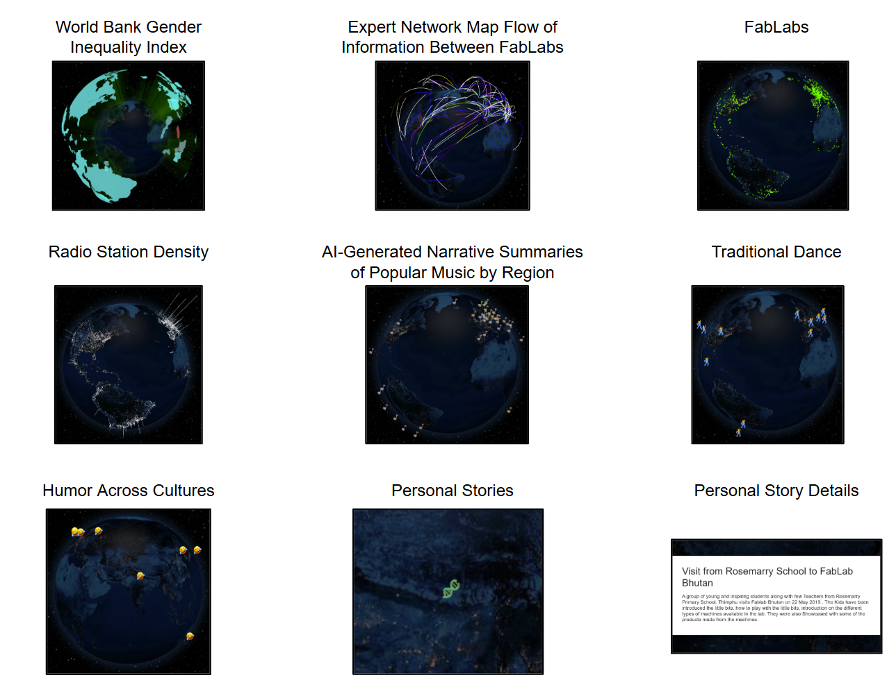
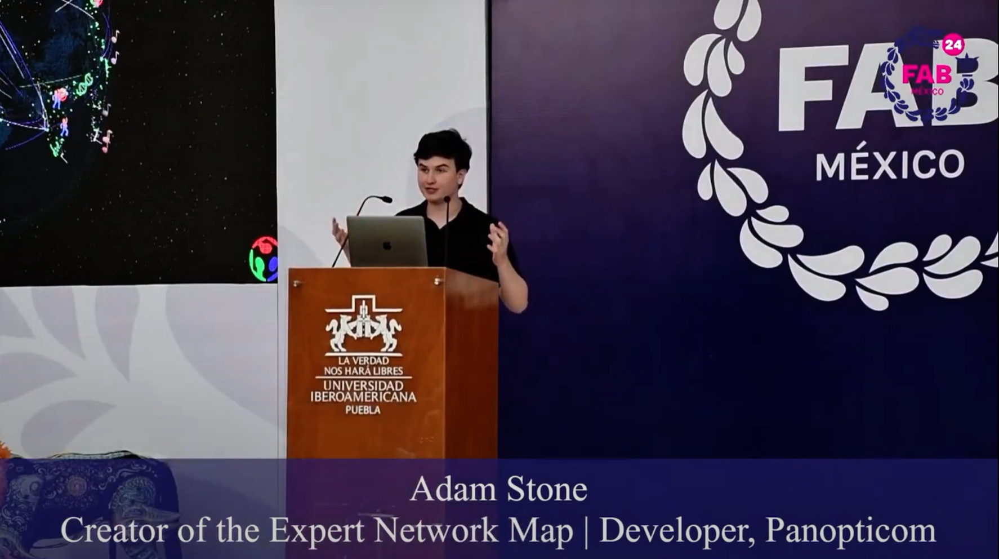
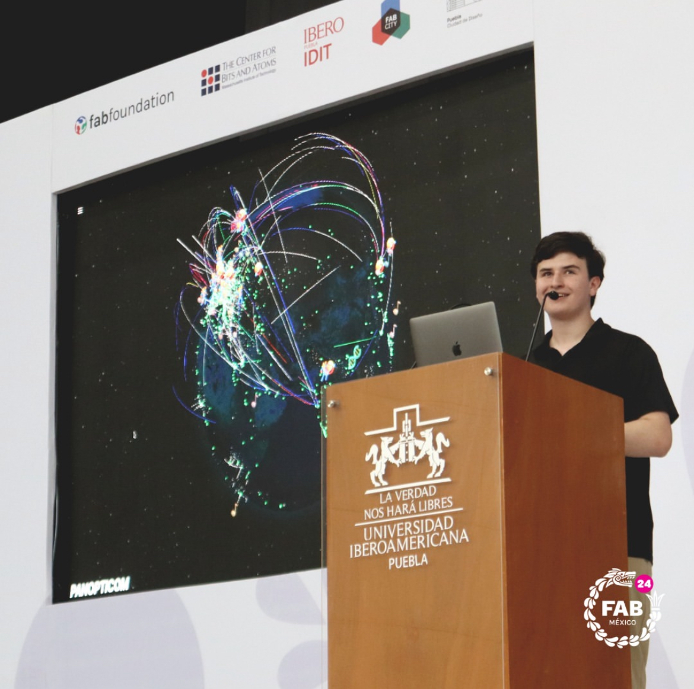

# Panopticom

When singer [`Peter Gabriel`](https://petergabriel.com/) (from [Genesis](https://genesis-music.com/)) wanted to create a digital platform based on his song [“Panopticom,”](https://en.wikipedia.org/wiki/Panopticom) his friend [`Professor Gershenfeld`](https://ng.cba.mit.edu/) recommended me as the lead developer based on the success of the [Expert Network Map](../expert-network-map/index.md).

I completed the demo website featuring an interactive globe where users explore multiple data layers by location, including [Expert Network Map](../expert-network-map/index.md) data, sustainability metrics, and radio live streams.

I wrote all of the code for the Panopticom demo website. I scraped and formatted the datasets, designed and implemented the JSONL Schema, and created the visualization website. 

[`Jean-Michel Molenaar`](https://www.fablabs.io/users/jeanmichelmolenaar) from the [Fab Foundation](https://fabfoundation.org/) was the Panopticom project manager. He set up the GitLab Repo and wrote the “about” page. Professor Gershenfeld provided strategic direction and Peter Gabriel was the creative visionary for the Panopticom website.

## Demo Website

[Click here to see the live site! (panopticom.fabcloud.io)](https://panopticom.fabcloud.io)

[Click here to see the project's GitLab repo!](https://gitlab.fabcloud.org/panopticom/panopticom.fabcloud.io)

[Click here to see the human-readable JSONL Schema!](https://gitlab.fabcloud.org/panopticom/panopticom.fabcloud.io/-/blob/master/standardized_json.md)

## Project Launch at Fab24

[Click here to watch a recording of the Panopticom presentation at the 2024 International Fab Lab Conference and Symposium Presentation in Puebla, Mexico!](https://youtu.be/nbQp-KVpF2M)

